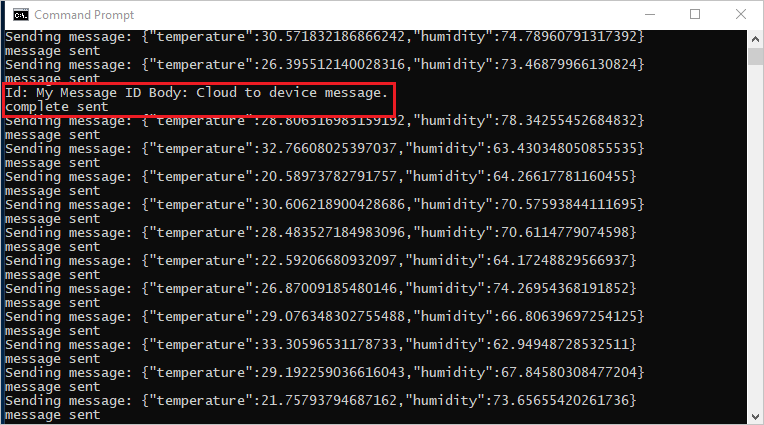
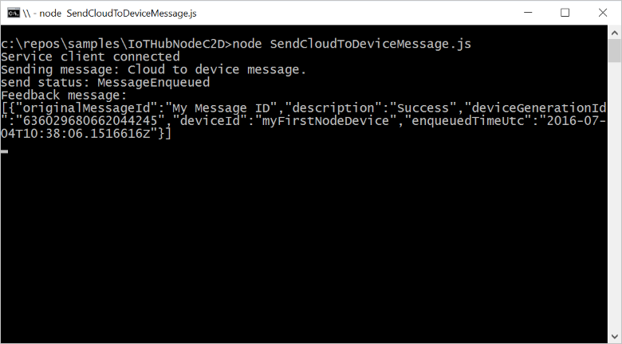

# Send cloud-to-device messages with IoT Hub (Node.js)

[!INCLUDE [iot-hub-selector-c2d](../../includes/iot-hub-selector-c2d.md)]

Azure IoT Hub is a fully managed service that helps enable reliable and secure bi-directional communications between millions of devices and a solution back end. 

This article shows you how to:

* Send cloud-to-device messages, from your solution backend, to a single device through IoT Hub

* Receive cloud-to-device messages on a device

* Request delivery acknowledgment (*feedback*), from your solution backend, for messages sent to a device from IoT Hub

[!INCLUDE [iot-hub-basic](../../includes/iot-hub-basic-whole.md)]

At the end of this article, you run two Node.js console apps:

* **SimulatedDevice**: a modified version of the app created in [Send telemetry from a device to an IoT hub](../iot-develop/quickstart-send-telemetry-iot-hub.md?pivots=programming-language-csharp), which connects to your IoT hub and receives cloud-to-device messages.

* **SendCloudToDevice**: sends a cloud-to-device message to the device app through IoT Hub and then receives its delivery acknowledgment.

> [!NOTE]
> IoT Hub has SDK support for many device platforms and languages (C, Java, Python, and JavaScript) through the [Azure IoT device SDKs](iot-hub-devguide-sdks.md).

To learn more about cloud-to-device messages, see [Send cloud-to-device messages from an IoT hub](iot-hub-devguide-messages-c2d.md).

## Prerequisites

* A complete working version of the [Send telemetry from a device to an IoT hub](../iot-develop/quickstart-send-telemetry-iot-hub.md?pivots=programming-language-java) quickstart or the [Configure message routing with IoT Hub](tutorial-routing.md) article. This article builds on the quickstart.

* Node.js version 10.0.x or later. [Prepare your development environment](https://github.com/Azure/azure-iot-sdk-node/tree/main/doc/node-devbox-setup.md) describes how to install Node.js for this article on either Windows or Linux.

* Make sure that port 8883 is open in your firewall. The device sample in this article uses MQTT protocol, which communicates over port 8883. This port may be blocked in some corporate and educational network environments. For more information and ways to work around this issue, see [Connecting to IoT Hub (MQTT)](iot-hub-mqtt-support.md#connecting-to-iot-hub).

## Receive messages in the simulated device app

In this section, modify your device app to receive cloud-to-device messages from the IoT hub.

1. Using a text editor, open the **SimulatedDevice.js** file. This file is located in the **iot-hub\Quickstarts\simulated-device** folder off of the root folder of the Node.js sample code you downloaded in the [Send telemetry from a device to an IoT hub](../iot-develop/quickstart-send-telemetry-iot-hub.md?pivots=programming-language-nodejs) quickstart.

2. Register a handler with the device client to receive messages sent from IoT Hub. Add the call to `client.on` just after the line that creates the device client as in the following snippet:

    ```javascript
    var client = DeviceClient.fromConnectionString(connectionString, Mqtt);

    client.on('message', function (msg) {
      console.log('Id: ' + msg.messageId + ' Body: ' + msg.data);
      client.complete(msg, function (err) {
        if (err) {
          console.error('complete error: ' + err.toString());
        } else {
          console.log('complete sent');
        }
      });
    });
    ```

In this example, the device invokes the **complete** function to notify IoT Hub that it has processed the message and that it can safely be removed from the device queue. The call to **complete** isn't required if you're using MQTT transport and can be omitted. It's required for AMQP and HTTPS.

With AMQP and HTTPS, but not MQTT, the device can also:

* Abandon a message, which results in IoT Hub retaining the message in the device queue for future consumption.
* Reject a message, which permanently removes the message from the device queue.

If something happens that prevents the device from completing, abandoning, or rejecting the message, IoT Hub will, after a fixed timeout period, queue the message for delivery again. For this reason, the message processing logic in the device app must be *idempotent*, so that receiving the same message multiple times produces the same result.

For more information about the cloud-to-device message lifecycle and how IoT Hub processes cloud-to-device messages, see [Send cloud-to-device messages from an IoT hub](iot-hub-devguide-messages-c2d.md).
  
> [!NOTE]
> If you use HTTPS instead of MQTT or AMQP as the transport, the **DeviceClient** instance checks for messages from IoT Hub infrequently (a minimum of every 25 minutes). For more information about the differences between MQTT, AMQP, and HTTPS support, see [Cloud-to-device communications guidance](iot-hub-devguide-c2d-guidance.md) and [Choose a communication protocol](iot-hub-devguide-protocols.md).

## Get the IoT hub connection string

In this article, you create a backend service to send cloud-to-device messages through your IoT Hub. To send cloud-to-device messages, your service needs the **service connect** permission. By default, every IoT Hub is created with a shared access policy named **service** that grants this permission.

[!INCLUDE [iot-hub-include-find-service-connection-string](../../includes/iot-hub-include-find-service-connection-string.md)]

## Send a cloud-to-device message

In this section, you create a Node.js console app that sends cloud-to-device messages to the simulated device app. You need the device ID from your device and your IoT hub connection string.

1. Create an empty folder called **sendcloudtodevicemessage**. In the **sendcloudtodevicemessage** folder, create a package.json file using the following command at your command prompt. Accept all the defaults:

    ```shell
    npm init
    ```

2. At your command prompt in the **sendcloudtodevicemessage** folder, run the following command to install the **azure-iothub** package:

    ```shell
    npm install azure-iothub --save
    ```

3. Using a text editor, create a **SendCloudToDeviceMessage.js** file in the **sendcloudtodevicemessage** folder.

4. Add the following `require` statements at the start of the **SendCloudToDeviceMessage.js** file:

    ```javascript
    'use strict';

    var Client = require('azure-iothub').Client;
    var Message = require('azure-iot-common').Message;
    ```

5. Add the following code to **SendCloudToDeviceMessage.js** file. Replace the "{iot hub connection string}" and "{device ID}" placeholder values with the IoT hub connection string and device ID you noted previously:

    ```javascript
    var connectionString = '{iot hub connection string}';
    var targetDevice = '{device id}';

    var serviceClient = Client.fromConnectionString(connectionString);
    ```

6. Add the following function to print operation results to the console:

    ```javascript
    function printResultFor(op) {
      return function printResult(err, res) {
        if (err) console.log(op + ' error: ' + err.toString());
        if (res) console.log(op + ' status: ' + res.constructor.name);
      };
    }
    ```

7. Add the following function to print delivery feedback messages to the console:

    ```javascript
    function receiveFeedback(err, receiver){
      receiver.on('message', function (msg) {
        console.log('Feedback message:')
        console.log(msg.getData().toString('utf-8'));
      });
    }
    ```

8. Add the following code to send a message to your device and handle the feedback message when the device acknowledges the cloud-to-device message:

    ```javascript
    serviceClient.open(function (err) {
      if (err) {
        console.error('Could not connect: ' + err.message);
      } else {
        console.log('Service client connected');
        serviceClient.getFeedbackReceiver(receiveFeedback);
        var message = new Message('Cloud to device message.');
        message.ack = 'full';
        message.messageId = "My Message ID";
        console.log('Sending message: ' + message.getData());
        serviceClient.send(targetDevice, message, printResultFor('send'));
      }
    });
    ```

9. Save and close **SendCloudToDeviceMessage.js** file.

## Run the applications

You're now ready to run the applications.

1. At the command prompt in the **simulated-device** folder, run the following command to send telemetry to IoT Hub and to listen for cloud-to-device messages:

    ```shell
    node SimulatedDevice.js
    ```

    

2. At a command prompt in the **sendcloudtodevicemessage** folder, run the following command to send a cloud-to-device message and wait for the acknowledgment feedback:

    ```shell
    node SendCloudToDeviceMessage.js
    ```

    

   > [!NOTE]
   > For simplicity, this article does not implement any retry policy. In production code, you should implement retry policies (such as exponential backoff), as suggested in the article, [Transient Fault Handling](/azure/architecture/best-practices/transient-faults).
   >

## Next steps

In this article, you learned how to send and receive cloud-to-device messages.

* To learn more about cloud-to-device messages, see [Send cloud-to-device messages from an IoT hub](iot-hub-devguide-messages-c2d.md).

* To learn more about IoT Hub message formats, see [Create and read IoT Hub messages](iot-hub-devguide-messages-construct.md).
