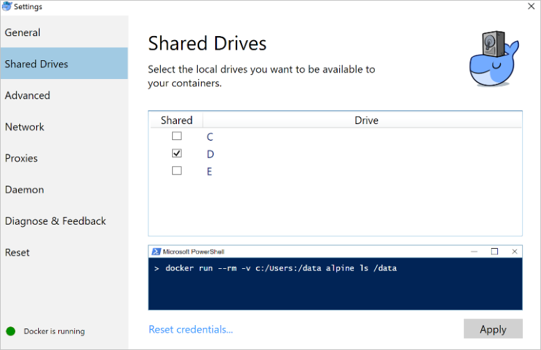
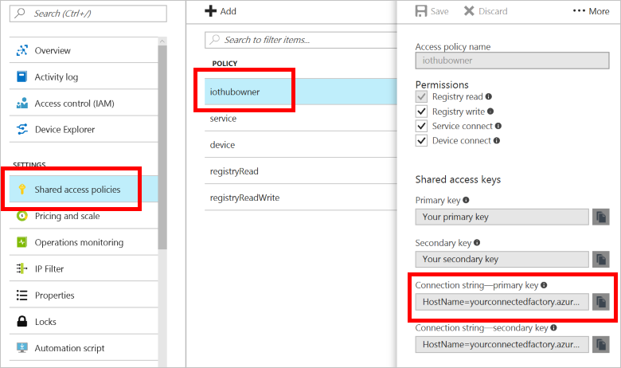
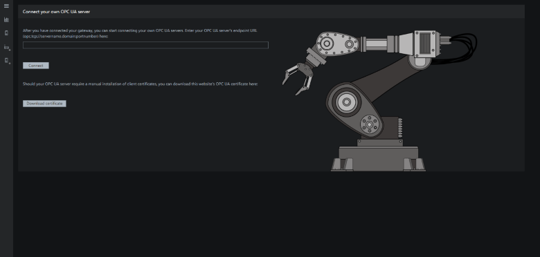

---
title: Deploy your Connected factory gateway - Azure | Microsoft Docs
description: How to deploy a gateway on either Windows or Linux to enable connectivity to the Connected factory preconfigured solution.
services: ''
suite: iot-suite
documentationcenter: na
author: dominicbetts
manager: timlt
editor: ''

ms.service: iot-suite
ms.devlang: na
ms.topic: article
ms.tgt_pltfrm: na
ms.workload: na
ms.date: 12/11/2017
ms.author: dobett

---

# Deploy an edge gateway for the Connected factory preconfigured solution on Windows or Linux

You need two software components to deploy an edge gateway for the *Connected factory* preconfigured solution:

- The *OPC Proxy* establishes a connection to Connected factory. The OPC Proxy then waits for command and control messages from the integrated OPC Browser that runs in the Connected factory solution portal.

- The *OPC Publisher* connects to existing on-premises OPC UA servers and forwards telemetry messages from them to Connected factory. You can connect an OPC classic device using the [OPC classic adapter for OPC UA](https://github.com/OPCFoundation/UA-.NETStandard/blob/master/ComIOP/README.md).

Both components are open-source and are available as source on GitHub and as Docker containers on DockerHub:

| GitHub | DockerHub |
| ------ | --------- |
| [OPC Publisher](https://github.com/Azure/iot-edge-opc-publisher) | [OPC Publisher](https://hub.docker.com/r/microsoft/iot-edge-opc-publisher/)   |
| [OPC Proxy](https://github.com/Azure/iot-edge-opc-proxy)         | [OPC Proxy](https://hub.docker.com/r/microsoft/iot-edge-opc-proxy/) |

You do not need a public-facing IP address or open inbound ports in the gateway firewall for either component. The OPC Proxy and OPC Publisher components only use outbound port 443.

The steps in this article show you how to deploy an edge gateway using Docker on either Windows or Linux. The gateway enables connectivity to the Connected factory preconfigured solution. You can also use the components without Connected factory.

> [!NOTE]
> Both components can be used as modules in [Azure IoT Edge](https://github.com/Azure/iot-edge).

## Choose a gateway device

If you don't yet have a gateway device, Microsoft recommends you buy a commercial gateway from one of their partners. For a list of gateway devices compatible with the Connected factory solution, visit the [Azure IoT device catalog](https://catalog.azureiotsuite.com/?q=opc). Follow the instructions that come with the device to set up the gateway.

Alternatively, use the following instructions to manually configure an existing gateway device.

## Install and configure Docker

Install [Docker for Windows](https://www.docker.com/docker-windows) on your Windows-based gateway device or use a package manager to install docker on your Linux-based gateway device.

During Docker for Windows setup, select a drive on your host machine to share with Docker. The following screenshot shows sharing the **D** drive on your Windows system to allow access to the host drive from inside a docker container:



> [!NOTE]
> You can also perform this step after installing docker from the **Settings** dialog. Right-click on the **Docker** icon in the Windows system tray and choose **Settings**.

If you are using Linux, no additional configuration is required to enable access to the file system.

On Windows, create a folder on the drive you shared with Docker, on Linux create a folder under the root filesystem. This walkthrough refers to this folder as `<SharedFolder>`.

When you refer to the `<SharedFolder>` in a Docker command, be sure to use the correct syntax for your operating system. Here are two examples, one for Windows and one for Linux:

- If your are using the folder `D:\shared` on Windows as your `<SharedFolder>`, the Docker command syntax is `//d/shared`.

- If your are using the folder `/shared` on Linux as your `<SharedFolder>`, the Docker command syntax is `/shared`.

For more information see the [Use volumes](https://docs.docker.com/engine/admin/volumes/volumes/) docker engine reference.

## Configure the OPC components

Before you install the OPC components, complete the following steps to prepare your environment:

1. To complete the gateway deployment, you need the **iothubowner** connection string of the IoT Hub in your Connected factory deployment. In the [Azure portal](http://portal.azure.com/), navigate to your IoT Hub in the resource group created when you deployed the Connected factory solution. Click **Shared access policies** to access the **iothubowner** connection string:

    

    Copy the **Connection string-primary key** value.

1. To allow communication between docker containers, you need a user-defined bridge network. To create a bridge network for your containers, run the following commands at a command prompt:

    ```cmd/sh
    docker network create -d bridge iot_edge
    ```

    To verify the **iot_edge** bridge network was created, run the following command:

    ```cmd/sh
    docker network ls
    ```

    Your **iot_edge** bridge network is included in the list of networks.

To run the OPC Publisher, run the following command at a command prompt:

```cmd/sh
docker run --rm -it -v <SharedFolder>:/docker -v x509certstores:/root/.dotnet/corefx/cryptography/x509stores --network iot_edge --name publisher -h publisher -p 62222:62222 --add-host <OpcServerHostname>:<IpAddressOfOpcServerHostname> microsoft/iot-edge-opc-publisher:2.1.3 publisher "<IoTHubOwnerConnectionString>" --lf /docker/publisher.log.txt --as true --si 1 --ms 0 --tm true --vc true --di 30
```

- The [OPC Publisher GitHub](https://github.com/Azure/iot-edge-opc-publisher) and the [docker run reference](https://docs.docker.com/engine/reference/run/) provide more information about:

  - The docker command line options specified before the container name (`microsoft/iot-edge-opc-publisher:2.1.3`).
  - The meaning of the OPC Publisher command line parameters specified after the container name (`microsoft/iot-edge-opc-publisher:2.1.3`).

- The `<IoTHubOwnerConnectionString>` is the **iothubowner** shared access policy connection string from the Azure portal. You copied this connection string in a previous step. You only need this connection string for the first run of OPC Publisher. On subsequent runs you should omit it because it poses a security risk.

- The `<SharedFolder>` you use and its syntax is described in the section [Install and configure Docker](#install-and-configure-docker). OPC Publisher uses the `<SharedFolder>` to read the OPC Publisher configuration file, write the log file, and make both these files available outside of the container.

- OPC Publisher reads its configuration from the **publishednodes.json** file, which you should place in the `<SharedFolder>/docker` folder. This configuration file defines which OPC UA node data on a given OPC UA server the OPC Publisher should subscribe to.

- Whenever the OPC UA server notifies OPC Publisher of a data change, the new value is sent to IoT Hub. Depending on the batching settings, the OPC Publisher may first accumulate the data before it sends the data to IoT Hub in a batch.

- The full syntax of the **publishednodes.json** file is described on the [OPC Publisher](https://github.com/Azure/iot-edge-opc-publisher) page on GitHub.

    The following snippet shows a simple example of a **publishednodes.json** file. This example shows how to publish the **CurrentTime** value from an OPC UA server with hostname **win10pc**:

    ```json
    [
      {
        "EndpointUrl": "opc.tcp://win10pc:48010",
        "OpcNodes": [
          {
            "ExpandedNodeId": "nsu=http://opcfoundation.org/UA/;i=2258"
          }
        ]
      }
    ]
    ```

    In the **publishednodes.json** file, the OPC UA server is specified by the endpoint URL. If you specify the hostname using a hostname label (such as **win10pc**) as in the previous example instead of an IP address, the network address resolution in the container must be able to resolve this hostname label to an IP address.

- Docker does not support NetBIOS name resolution, only DNS name resolution. If you don't have a DNS server on the network, you can use the workaround shown in the previous command line example. The previous command line example uses the `--add-host` parameter to add an entry into the containers hosts file. This entry enables hostname lookup for the given `<OpcServerHostname>`, resolving to the given IP address `<IpAddressOfOpcServerHostname>`.

- OPC UA uses X.509 certificates for authentication and encryption. You need to place the OPC Publisher certificate on the OPC UA server you are connecting to, to ensure it trusts OPC Publisher. The OPC Publisher certificate store is located in the `<SharedFolder>/CertificateStores` folder. You can find the OPC Publisher certificate in the `trusted/certs` folder in the `CertificateStores` folder.

  The steps to configure the OPC UA server depend on the device you are using. these steps are typically documented in the OPC UA server's user manual.

To install the OPC Proxy, run the following command at a command prompt:

```cmd/sh
docker run -it --rm -v <SharedFolder>:/mapped --network iot_edge --name proxy --add-host <OpcServerHostname>:<IpAddressOfOpcServerHostname> microsoft/iot-edge-opc-proxy:1.0.2 -i -c "<IoTHubOwnerConnectionString>" -D /mapped/cs.db
```

You only need to run the installation once on a system.

Use the following command to run the OPC Proxy:

```cmd/sh
docker run -it --rm -v <SharedFolder>:/mapped --network iot_edge --name proxy --add-host <OpcServerHostname>:<IpAddressOfOpcServerHostname> microsoft/iot-edge-opc-proxy:1.0.2 -D /mapped/cs.db
```

OPC Proxy saves the connection string during the installation. On subsequent runs you should omit the connection string because it poses a security risk.

## Enable your gateway

Complete the following steps to enable your gateway in the Connected factory preconfigured solution:

1. When both components are running, browse to the **Connect your own OPC UA Server** page in the Connected factory solution portal. This page is only available to Administrators in the solution. Enter the publisher endpoint URL (opc.tcp://publisher:62222) and click **Connect**.

1. Establish a trust relationship between the Connected factory portal and OPC Publisher. When you see a certificate warning, click **Proceed**. Next, you see an error that the OPC Publisher doesn’t trust the UA Web client. To resolve this error, copy the **UA Web Client** certificate from the `<SharedFolder>/CertificateStores/rejected/certs` folder to the `<SharedFolder>/CertificateStores/trusted/certs` folder on the gateway. You do not need to restart the gateway.

You can now connect to the gateway from the cloud, and you are ready to add OPC UA servers to the solution.

## Add your own OPC UA servers

To add your own OPC UA servers to the Connected factory preconfigured solution:

1. Browse to the **Connect your own OPC UA server** page in the Connected factory solution portal. Follow the same steps as in the previous section to establish a trust relationship between the Connected factory portal and the OPC UA server.

    

1. Browse the OPC UA nodes tree of your OPC UA server, right-click the OPC nodes you want to send to Connected factory, and select **publish**.

1. Telemetry now flows from the gateway device. You can view the telemetry in the **Factory Locations** view of the Connected factory portal under **New Factory**.

## Next steps

To learn more about the architecture of the Connected factory preconfigured solution, see [Connected factory preconfigured solution walkthrough](https://docs.microsoft.com/en-us/azure/iot-suite/iot-suite-connected-factory-sample-walkthrough).

Learn about the [OPC Publisher reference implementation](https://docs.microsoft.com/en-us/azure/iot-suite/iot-suite-connected-factory-publisher).