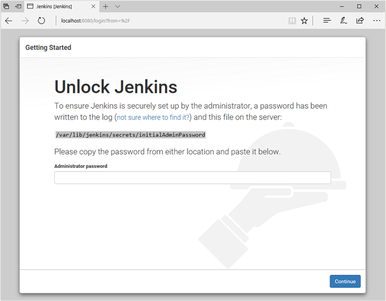

# Create your first Jenkins Master on a Linux (Ubuntu) VM on Azure

This quickstart shows how to install the latest stable Jenkins version on a Linux (Ubuntu 14.04 LTS) VM along with the tools and plugins configured to work with Azure. The tools include:
<ul>
<li>Git for source control</li>
<li>Azure credential plugin for connecting securely</li>
<li>Azure VM Agents plugin for elastic build, test, and continuous integration</li>
<li>Azure Storage plugin for storing artifacts</li>
<li>Azure CLI to deploy apps using scripts</li>
</ul>

In this tutorial you learn how to:

> [!div class="checklist"]
> * Create a free Azure account.
> * Create a Jenkins Master on an Azure VM with a solution template. 
> * Perform the initial configuration for Jenkins.
> * Install suggested plugins.

If you don't have an Azure subscription, create a [free account](https://azure.microsoft.com/free/?WT.mc_id=A261C142F) before you begin.

## Create the VM in Azure by deploying the solution template for Jenkins

Azure quickstart templates allow you to quickly and reliably deploy complex technology on Azure.  Azure Resource Manager allows you to provision your applications using a [declarative template.](https://azure.microsoft.com/en-us/resources/templates/?term=jenkins) In a single template, you can deploy multiple services along with their dependencies. You use the same template to repeatedly deploy your application during every stage of the application lifecycle.

View [plans and pricing](https://azuremarketplace.microsoft.com/en-us/marketplace/apps/azure-oss.jenkins?tab=Overview) information for this template to understand cost options.

Go to [The marketplace image for Jenkins](https://azuremarketplace.microsoft.com/en-us/marketplace/apps/azure-oss.jenkins?tab=Overview), click **GET IT NOW**  

In the Azure portal, click **Create**.  This template requires the use of Resource Manager so the template model dropdown is disabled.
   


In the **Configure basic settings** tab:


* Provide a name to your Jenkins instance.
* Select a VM disk type.  For production workloads, choose a larger VM and SSD for better performance.  You can read more about Azure disk types [here.](https://docs.microsoft.com/en-us/azure/storage/storage-premium-storage)
* User name: must meet length requirements, and must not include reserved words or unsupported characters. Names like "admin" are not allowed.  For more information, see [here](https://docs.microsoft.com/en-us/azure/virtual-machines/windows/faq) for user name and password requirements.
* Authentication type: create an instance that is secured by a password or [SSH public key](https://docs.microsoft.com/en-us/azure/virtual-machines/linux/ssh-from-windows). If you use a password, it must satisfy 3 of the following requirements: one lower case character, one upper case character, one number, and one special character.
* Keep Jenkins release type as **LTS**
* Select a subscription.
* Create a resource group or use an existing one that is emplty. 
* Select a location.

In the **Configure additional options** tab:


* Provide a domain name label to uniquely identify the Jenkins master.

Click **OK** to go to the next step. 

Once validation passes, click **OK** to download the template and parameters. 

Next, select **Purchase** to provision all the resources.

## Setup SSH port forwarding

By default the Jenkins instance is using the http protocol and listens on port 8080. Users shouldn't authenticate over unsecured protocols.
	
Set up port forwarding to view the Jenkins UI on your local machine.

### If you are using Windows:

Install PuTTY and run this command if you use password to secure Jenkins:
```
putty.exe -ssh -L 8080:localhost:8080 <username>@<Domain name label>.<location>.cloudapp.azure.com
```
* To log in, enter the password.


If you use SSH, run this command:
```
putty -i <private key file including path> -L 8080:localhost:8080 <username>@<Domain name label>.<location>.cloudapp.azure.com
```

### If you are using Linux or Mac:

If you use a password to secure your Jenkins master, run this command:
```
ssh -L 8080:localhost:8080 <username>@<Domain name label>.<location>.cloudapp.azure.com
```
* To log in, enter the password.

If you use SSH, run this command:
```
ssh -i <private key file including path> -L 8080:localhost:8080 <username>@<Domain name label>.<location>.cloudapp.azure.com
```

## Connect to Jenkins
After you have started your tunnel, navigate to http://localhost:8080/ on your local machine.

Unlock the Jenkins dashboard for the first time with the initial admin password.



To get a token, SSH into the VM and run `sudo cat /var/lib/jenkins/secrets/initialAdminPassword`.


You are asked to install the suggested plugins.

Next, create an admin user for your Jenkins master.

Your Jenkins instance is now ready to use! You can access a read-only view by going to http://\<Public DNS name of instance you just created\>.


## Next Steps

In this tutorial, you:

> [!div class="checklist"]
> * Created a Jenkins Master with the solution template.
> * Performed initial configuration of Jenkins.
> * Installed plugins.

Follow this link to see how to use Azure VM Agents for continuous integration with Jenkins.

> [!div class="nextstepaction"]
> [Azure VMs as Jenkins agents](jenkins-azure-vm-agents.md)
