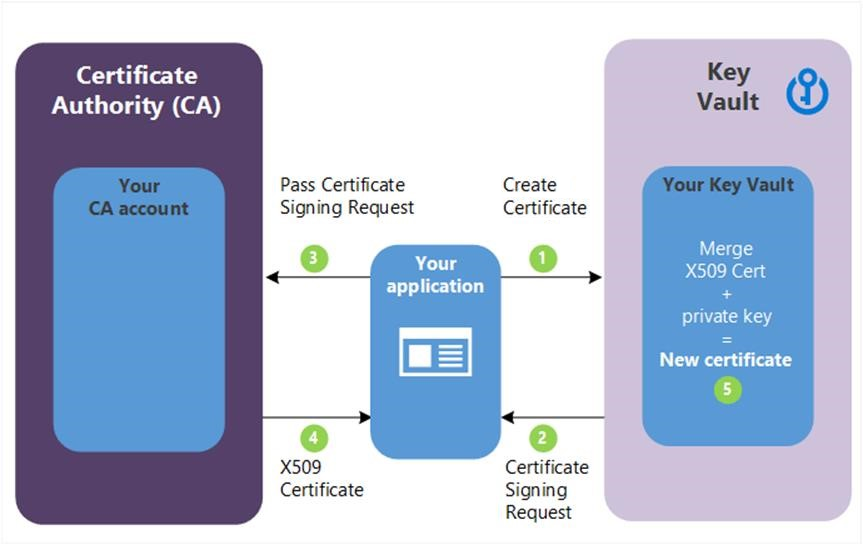
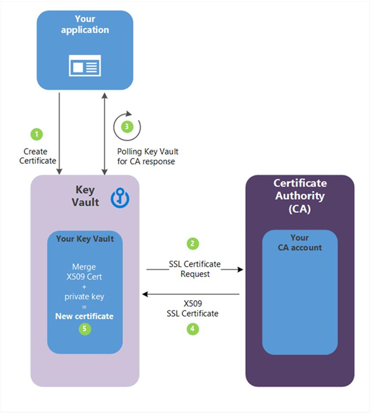

---
title: Certificate creation methods  
description: Ways to create a certificate in Key Vault.
services: key-vault
documentationcenter:
author: bryanla
manager: barbkess
tags: azure-resource-manager

ms.assetid: e17b4c9b-4ff3-472f-8c9d-d130eb443968
ms.service: key-vault
ms.workload: identity
ms.tgt_pltfrm: na
ms.topic: conceptual
ms.date: 01/07/2019
ms.author: bryanla

---

# Certificate creation methods

 A Key Vault (KV) certificate can be either created or imported into a key vault. When a KV certificate is created the private key is created inside the key vault and never exposed to certificate owner. The following are ways to create a certificate in Key Vault:  

-   **Create a self-signed certificate:** This will create a public-private key pair and associate it with a certificate. The certificate will be signed by its own key.  

-    **Create a new certificate manually:** This will create a public-private key pair and generate an X.509 certificate signing request. The signing request can be signed by your registration authority or certification authority. The signed x509 certificate can be merged with the pending key pair to complete the KV certificate in Key Vault. Although this method requires more steps, it does provide you with greater security because the private key is created in and restricted to Key Vault. This is explained in the diagram below.  

  

The following descriptions correspond to the green lettered steps in the preceding diagram.

1. In the diagram above, your application is creating a certificate which internally begins by creating a key in your key vault.
2. Key Vault returns to your application a Certificate Signing Request (CSR)
3. Your application passes the CSR to your chosen CA.
4. Your chosen CA responds with a an X509 Certificate.
5. Your application completes the new certificate creation with a merger of the X509 Certificate from your CA.

-   **Create a certificate with a known issuer provider:** This method requires you to do a one-time task of creating an issuer object. Once an issuer object is created in you key vault, its name can be referenced in the policy of the KV certificate. A request to create such a KV certificate will create a key pair in the vault and communicate with the issuer provider service using the information in the referenced issuer object to get an x509 certificate. The x509 certificate is retrieved from the issuer service and is merged with the key pair to complete the KV certificate creation.  

  

The following descriptions correspond to the green lettered steps in the preceding diagram.

1. In the diagram above, your application is creating a certificate which internally begins by creating a key in your key vault.
2. Key Vault sends and SSL Certificate Request to the CA.
3. Your application polls, in a loop and wait process, for your Key Vault for certificate completion. The certificate creation is complete when Key Vault receives the CA’s response with x509 certificate.
4. The CA responds to Key Vault's SSL Certificate Request with an X509 SSL Certificate.
5. Your new certificate creation completes with the merger of the X509 Certificate for the CA.

## Asynchronous process
KV certificate creation is an asynchronous process. This operation will create a KV certificate request and return an http status code of 202 (Accepted). The status of the request can be tracked by polling the pending object created by this operation. The full URI of the pending object is returned in the LOCATION header.  

When a request to create a KV certificate completes, the status of the pending object will change to “completed” from “inprogress”, and a new version of the KV certificate will be created. This will become the current version.  

## First creation
 When a KV certificate is created for the first time, an addressable key and secret is also created with the same name as that of the certificate. If the name is already in use, then the operation will fail with an http status code of 409 (conflict).
 The addressable key and secret get their attributes from the KV certificate attributes. The addressable key and secret created this way are marked as managed keys and secrets, whose lifetime is managed by Key Vault. Managed keys and secrets are read-only. Note: If a KV certificate expires or is disabled, the corresponding key and secret will become inoperable.  

 If this is the first operation to create a KV certificate then a policy is required.  A policy can also be supplied with successive create operations to replace the policy resource. If a policy is not supplied, then the policy resource on the service is used to create a next version of KV certificate. Note that while a request to create a next version is in progress, the current KV certificate, and corresponding addressable key and secret, remain unchanged.  

## Self-issued certificate
 To create a self-issued certificate, set the issuer name as "Self" in the certificate policy as shown in following snippet from certificate policy.  

```  
"issuer": {  
       "name": "Self"  
    }  

```  

 If the issuer name is not specified, then the issuer name is set to "Unknown". When issuer is "Unknown", the certificate owner will have to manually get a x509 certificate from the issuer of his/her choice, then merge the public x509 certificate with the key vault certificate pending object to complete the certificate creation.

```  
"issuer": {  
       "name": "Unknown"  
    }  

```  

## Partnered CA Providers
Certificate creation can be completed manually or using a “Self” issuer. Key Vault also partners with certain issuer providers to simplify the creation of certificates. The following types of certificates can be ordered for key vault with these partner issuer providers.  

|Provider|Certificate type|  
|--------------|----------------------|  
|DigiCert|Key Vault offers OV or EV SSL certificates with DigiCert|
|GlobalCert|Key Vault offers OV or EV SSL certificates with GlobalSign|

 A certificate issuer is an entity represented in Azure Key Vault (KV) as a CertificateIssuer resource. It is used to provide information about the source of a KV certificate; issuer name, provider, credentials, and other administrative details.

Note that when an order is placed with the issuer provider, it may honor or override the x509 certificate extensions and certificate validity period based on the type of certificate.  

 Authorization: Requires the certificates/create permission.

## See Also
 - [About keys, secrets and certificates](about-keys-secrets-and-certificates.md)
 - [Monitor and manage certificate creation](create-certificate-scenarios.md)
