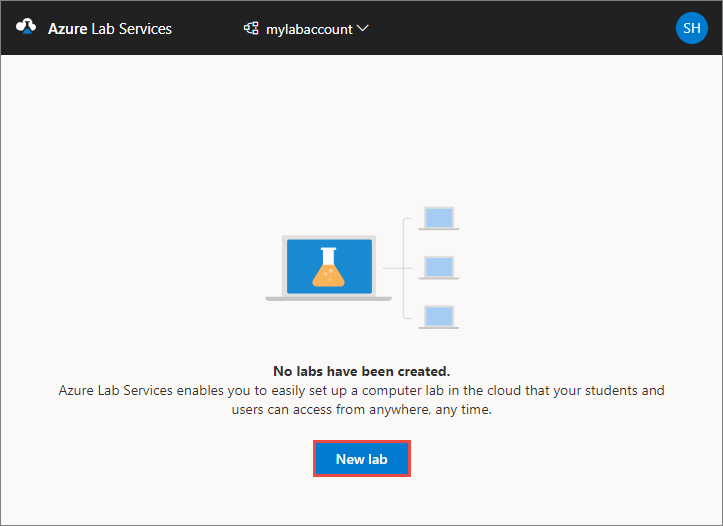
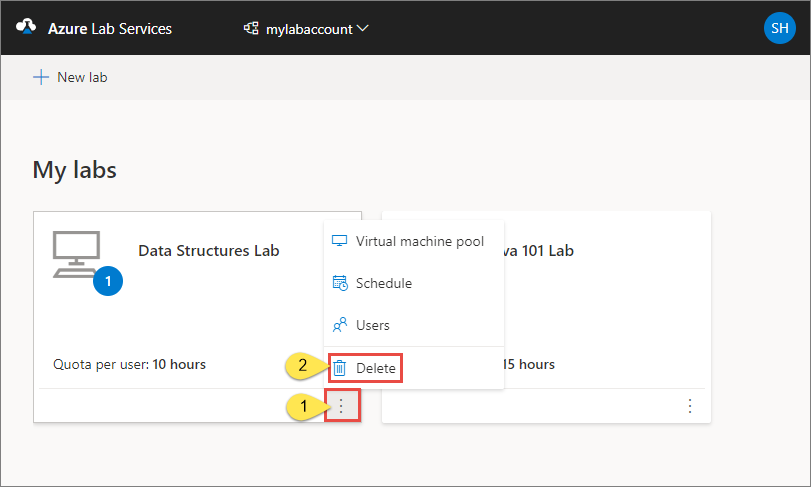
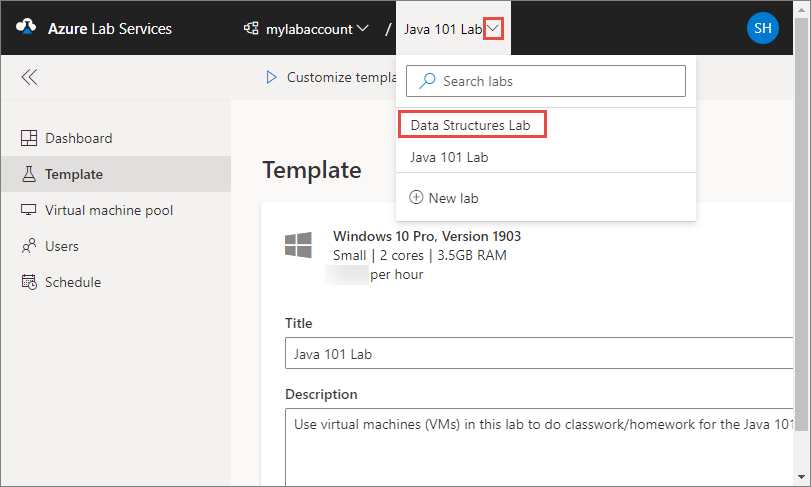

# Manage classroom labs in Azure Lab Services 
This article describes how to create and delete a classroom lab. It also shows you how to view all the classroom labs in a lab account. 

## Prerequisites
To set up a classroom lab in a lab account, you must be a member of the **Lab Creator** role in the lab account. The account you used to create a lab account is automatically added to this role. A lab owner can add other users to the Lab Creator role by using steps in the following article: [Add a user to the Lab Creator role](tutorial-setup-lab-account.md#add-a-user-to-the-lab-creator-role).

## Create a classroom lab

1. Navigate to [Azure Lab Services website](https://labs.azure.com). Internet Explorer 11 is not supported yet. 
2. Select **Sign in** and enter your credentials. Select or enter a **user ID** that is a member of the **Lab Creator** role in the lab account, and enter password. Azure Lab Services supports organizational accounts and Microsoft accounts. 
3. Select **New lab**. 
    
    
3. In the **New Lab** window, do the following actions: 
    1. Specify a **name** for your lab. 
    2. Select the **size of the virtual machines** you need for the class. For the list of sizes available, see the [VM Sizes](#vm-sizes) section. 
    3. Select the **virtual machine image** that you want to use for the classroom lab. If you select a Linux image, you see an option to enable remote desktop connection for it. For details, see [Enable remote desktop connection for Linux](how-to-enable-remote-desktop-linux.md).

        If you signed in using lab account owner credentials, you will see an option to enable more images for the lab. For more information, see [Enable images at the time of lab creation](specify-marketplace-images.md#enable-images-at-the-time-of-lab-creation).
    4. Review the **total price per hour** displayed on the page. 
    6. Select **Save**.

        

        > [!NOTE]
        > You see an option to select a location for your lab if the lab account was configured to [allow lab creator to pick lab location](allow-lab-creator-pick-lab-location.md) option. 
4. On the **Virtual machine credentials** page, specify default credentials for all VMs in the lab.
    1. Specify the **name of the user** for all VMs in the lab.
    2. Specify the **password** for the user. 

        > [!IMPORTANT]
        > Make a note of user name and password. They won't be shown again.
    3. Disable **Use same password for all virtual machines** option if you want students to set their own passwords. This step is **optional**. 

        A teacher can choose to use the same password for all the VMs in the lab, or allow students to set passwords for their VMs. By default, this setting is enabled for all Windows and Linux images except for Ubuntu. When you select **Ubuntu** VM, this setting is disabled, so the students will be prompted to set a password when they sign in for the first time.  

        
    4. Then, select **Next** on the **Virtual machine credentials** page. 
5. On the **Lab policies** page, do the following steps:
    1. Enter the number of hours allotted for each user (**quota for each user**) outside the scheduled time for the lab. 
    2. For the **Auto-shutdown of virtual machines** option, specify whether you want the VM to be automatically shutdown when user disconnects. You can also specify how long the VM should wait for the user to reconnect before automatically shutting down.. For more information, see [Enable automatic shutdown of VMs on disconnect](how-to-enable-shutdown-disconnect.md).
    3. Then, select **Finish**. 

        
    
5. You should see the following screen that shows the status of the template VM creation. The creation of the template in the lab takes up to 20 minutes. 

    
8. On the **Template** page, do the following steps: These steps are **optional** for the tutorial.

    2. Connect to the template VM by selecting **Connect**. If it's a Linux template VM, you choose whether you want to connect using SSH or RDP (if RDP is enabled).
    1. Select **Reset password** to reset the password for the VM. 
    1. Install and configure software on your template VM. 
    1. **Stop** the VM.  
    1. Enter a **description** for the template
10. On **Template** page, select **Publish** on the toolbar. 

    

    > [!WARNING]
    > Once you publish, you can't unpublish. 
8. On the **Publish template** page, enter the number of virtual machines you want to create in the lab, and then select **Publish**. 

    
11. You see the **status of publishing** the template on page. This process can take up to an hour. 

    
4. Switch to the **Virtual machines pool** page by selecting Virtual machines on the left menu or by selecting Virtual machines tile. Confirm that you see virtual machines that are in **Unassigned** state. These VMs are not assigned to students yet. They should be in **Stopped** state. You can start a student VM, connect to the VM, stop the VM, and delete the VM on this page. You can start them in this page or let your students start the VMs. 

    

    You do the following tasks on this page (don't do these steps for the tutorial. These steps are for your information only.): 
    
    1. To change the lab capacity (number of VMs in the lab), select **Lab capacity** on the toolbar.
    2. To start all the VMs at once, select **Start all** on the toolbar. 
    3. To start a specific VM, select the down arrow in the **Status**, and then select **Start**. You can also start a VM by selecting a VM in the first column, and then by selecting **Start** on the toolbar.                

### VM sizes  

| Size | Cores | RAM | Description | 
| ---- | ----- | --- | ----------- | 
| Small | 2 | 3.5 GB | This size is best suited for command line, opening web browser, low traffic web servers, small to medium databases. |
| Medium | 4 | 7 GB | This size is best suited for relational databases, in-memory caching, and analytics | 
| Medium (Nested virtualization) | 4 | 16 GB | This size is best suited for relational databases, in-memory caching, and analytics. This size also supports nested virtualization. 
This size can be used in scenarios where each student needs multiple VMs. Teachers can use nested virtualization to set up a few small-size nested virtual machines inside the virtual machine. 
 |
| Small GPU (Compute) | 6 | 56 GB | This size is best suited for compute-intensive and network-intensive applications like artificial intelligence and deep learning applications. | 
| Small GPU (Visualization) | 6 | 56 GB | This size is best suited for remote visualization, streaming, gaming, encoding using frameworks such as OpenGL and DirectX. | 
| Large | 8 | 16 GB | This size is best suited for applications that need faster CPUs, better local disk performance, large databases, large memory caches. |
| Large (Nested virtualization) | 8 | 32 GB | This size is best suited for applications that need faster CPUs, better local disk performance, large databases, large memory caches. This size also supports nested virtualization. |  
| Medium GPU (Visualization) | 12 | 112 GB | This size is best suited for remote visualization, streaming, gaming, encoding using frameworks such as OpenGL and DirectX. | 

> [!NOTE]
> Azure Lab Services automatically installs and configures the necessary GPU drivers for you when you create a lab with GPU images.  

## View all classroom labs
1. Navigate to [Azure Lab Services portal](https://labs.azure.com).
2. Select **Sign in**. Select or enter a **user ID** that is a member of the **Lab Creator** role in the lab account, and enter password. Azure Lab Services supports organizational accounts and Microsoft accounts. 
3. Confirm that you see all the labs in the selected lab account. On the lab's tile, you see the number of virtual machines in the lab and the quota for each user (outside the scheduled time).

    
3. Use the drop-down list at the top to select a different lab account. You see labs in the selected lab account. 

## Delete a classroom lab
1. On the tile for the lab, select three dots (...) in the corner, and then select **Delete**. 

    
3. On the **Delete lab** dialog box, select **Delete** to continue with the deletion. 

## Switch to another classroom lab
To switch to another classroom lab from the current, select the drop-down list of labs in the lab account at the top.

You can also create a new lab using the **New lab** in this drop-down list. 

> [!NOTE]
> You can also use the Az.LabServices PowerShell module (preview) to manage labs. For more information, see the [Az.LabServices home page on GitHub](https://github.com/Azure/azure-devtestlab/tree/master/samples/ClassroomLabs/Modules/Library).

To switch to a different lab account, select the drop-down next to the lab account and select the other lab account. 

## Next steps
See the following articles:

- [As a lab owner, set up and publish templates](how-to-create-manage-template.md)
- [As a lab owner, configure and control usage of a lab](how-to-configure-student-usage.md)
- [As a lab user, access classroom labs](how-to-use-classroom-lab.md)

