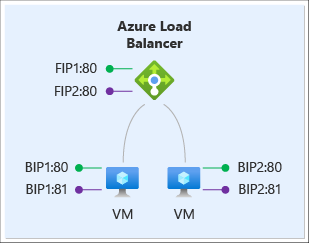
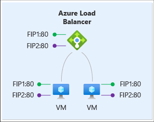

# Multiple frontends for Azure Load Balancer

Azure Load Balancer allows you to load balance services on multiple ports, multiple IP addresses, or both. You can use public and internal load balancer definitions to load balance flows across a set of VMs.

This article describes the fundamentals of this ability, important concepts, and constraints. If you only intend to expose services on one IP address, you can find simplified instructions for [public](./quickstart-load-balancer-standard-public-portal.md) or [internal](./quickstart-load-balancer-standard-internal-portal.md) load balancer configurations. Adding multiple frontends is incremental to a single frontend configuration. Using the concepts in this article, you can expand a simplified configuration at any time.

When you define an Azure Load Balancer, a frontend and a backend pool configuration are connected with rules. The health probe referenced by the rule is used to determine how new flows are sent to a node in the backend pool. The frontend (also known as VIP) is defined by a 3-tuple comprised of an IP address (public or internal), a transport protocol (UDP or TCP), and a port number from the load balancing rule. The backend pool is a collection of Virtual Machine IP configurations (part of the NIC resource) which reference the Load Balancer backend pool.

The following table contains some example frontend configurations:

| Frontend | IP address | protocol | port |
| --- | --- | --- | --- |
| 1 |65.52.0.1 |TCP |80 |
| 2 |65.52.0.1 |TCP |*8080* |
| 3 |65.52.0.1 |*UDP* |80 |
| 4 |*65.52.0.2* |TCP |80 |

The table shows four different frontends. Frontends #1, #2 and #3 are a single frontend with multiple rules. The same IP address is used but the port or protocol is different for each frontend. Frontends #1 and #4 are an example of multiple frontends, where the same frontend protocol and port are reused across multiple frontends.

Azure Load Balancer provides flexibility in defining the load balancing rules. A rule declares how an address and port on the frontend is mapped to the destination address and port on the backend. Whether or not backend ports are reused across rules depends on the type of the rule. Each type of rule has specific requirements that can affect host configuration and probe design. There are two types of rules:

1. The default rule with no backend port reuse
2. The Floating IP rule where backend ports are reused

Azure Load Balancer allows you to mix both rule types on the same load balancer configuration. The load balancer can use them simultaneously for a given VM, or any combination, as long as you abide by the constraints of the rule. Which rule type you choose depends on the requirements of your application and the complexity of supporting that configuration. You should evaluate which rule types are best for your scenario.

We explore these scenarios further by starting with the default behavior.

## Rule type #1: No backend port reuse



In this scenario, the frontends are configured as follows:

| Frontend | IP address | protocol | port |
| --- | --- | --- | --- |
|  1 |65.52.0.1 |TCP |80 |
|  2 |*65.52.0.2* |TCP |80 |

The DIP is the destination of the inbound flow. In the backend pool, each VM exposes the desired service on a unique port on a DIP. This service is associated with the frontend through a rule definition.

We define two rules:

| Rule | Map frontend | To backend pool |
| --- | --- | --- |
| 1 | Frontend1:80 | DIP1:80,  DIP2:80 |
| 2 | Frontend2:80 | DIP1:81,  DIP2:81 |

The complete mapping in Azure Load Balancer is now as follows:

| Rule | Frontend IP address | protocol | port | Destination | port |
| --- | --- | --- | --- | --- | --- |
|  1 |65.52.0.1 |TCP |80 |DIP IP Address |80 |
|  2 |65.52.0.2 |TCP |80 |DIP IP Address |81 |

Each rule must produce a flow with a unique combination of destination IP address and destination port. By varying the destination port of the flow, multiple rules can deliver flows to the same DIP on different ports.

Health probes are always directed to the DIP of a VM. You must ensure that your probe reflects the health of the VM.

## Rule type #2: backend port reuse by using Floating IP

Azure Load Balancer provides the flexibility to reuse the frontend port across multiple frontends regardless of the rule type used. Additionally, some application scenarios prefer or require the same port to be used by multiple application instances on a single VM in the backend pool. Common examples of port reuse include clustering for high availability, network virtual appliances, and exposing multiple TLS endpoints without re-encryption.

If you want to reuse the backend port across multiple rules, you must enable Floating IP in the rule definition.

"Floating IP" is Azure's terminology for a portion of what is known as Direct Server Return (DSR). DSR consists of two parts: a flow topology and an IP address mapping scheme. At a platform level, Azure Load Balancer always operates in a DSR flow topology regardless of whether Floating IP is enabled or not. This means that the outbound part of a flow is always correctly rewritten to flow directly back to the origin.

With the default rule type, Azure exposes a traditional load balancing IP address mapping scheme for ease of use. Enabling Floating IP changes the IP address mapping scheme to allow for additional flexibility as explained below.

The following diagram illustrates this configuration:



For this scenario, every VM in the backend pool has three network interfaces:

* DIP: a Virtual NIC associated with the VM (IP configuration of Azure's NIC resource)
* Frontend 1: a loopback interface within guest OS that is configured with IP address of Frontend 1
* Frontend 2: a loopback interface within guest OS that is configured with IP address of Frontend 2

For each VM in the backend pool, run the following commands at a Windows Command Prompt.

To get the list of interface names you have on your VM, type this command:

```console
netsh interface show interface 
```

For the VM NIC (Azure managed), type this command:

```console
netsh interface ipv4 set interface “interfacename” weakhostreceive=enabled
```

(replace interfacename with the name of this interface)

For each loopback interface you added, repeat these commands:

```console
netsh interface ipv4 set interface “interfacename” weakhostreceive=enabled 
```

(replace interfacename with the name of this loopback interface)

```console
netsh interface ipv4 set interface “interfacename” weakhostsend=enabled 
```

(replace interfacename with the name of this loopback interface)

> [!IMPORTANT]
> The configuration of the loopback interfaces is performed within the guest OS. This configuration is not performed or managed by Azure. Without this configuration, the rules will not function. Health probe definitions use the DIP of the VM rather than the loopback interface representing the DSR Frontend. Therefore, your service must provide probe responses on a DIP port that reflect the status of the service offered on the loopback interface representing the DSR Frontend.


Let's assume the same frontend configuration as in the previous scenario:

| Frontend | IP address | protocol | port |
| --- | --- | --- | --- |
|  1 |65.52.0.1 |TCP |80 |
|  2 |*65.52.0.2* |TCP |80 |

We define two rules:

| Rule | Frontend | Map to backend pool |
| --- | --- | --- |
| 1 | Frontend1:80 | Frontend1:80 (in VM1 and VM2) |
| 2 | Frontend2:80 | Frontend2:80 (in VM1 and VM2) |

The following table shows the complete mapping in the load balancer:

| Rule | Frontend IP address | protocol | port | Destination | port |
| --- | --- | --- | --- | --- | --- |
|  1 |65.52.0.1 |TCP |80 |same as frontend (65.52.0.1) |same as frontend (80) |
|  2 |65.52.0.2 |TCP |80 |same as frontend (65.52.0.2) |same as frontend (80) |

The destination of the inbound flow is the frontend IP address on the loopback interface in the VM. Each rule must produce a flow with a unique combination of destination IP address and destination port. By varying the destination IP address of the flow, port reuse is possible on the same VM. Your service is exposed to the load balancer by binding it to the frontend’s IP address and port of the respective loopback interface.

Notice that this example does not change the destination port. Even though this is a Floating IP scenario, Azure Load Balancer also supports defining a rule to rewrite the backend destination port and to make it different from the frontend destination port.

The Floating IP rule type is the foundation of several load balancer configuration patterns. One example that is currently available is the [SQL AlwaysOn with Multiple Listeners](/azure/azure-sql/virtual-machines/windows/availability-group-listener-powershell-configure) configuration. Over time, we will document more of these scenarios.

## Limitations

* Multiple frontend configurations are only supported with IaaS VMs and virtual machine scale sets.
* With the Floating IP rule, your application must use the primary IP configuration for outbound SNAT flows. If your application binds to the frontend IP address configured on the loopback interface in the guest OS, Azure's outbound SNAT is not available to rewrite the outbound flow and the flow fails.  Review [outbound scenarios](load-balancer-outbound-connections.md).
* Floating IP is not currently supported on secondary IP configurations.
* Public IP addresses have an effect on billing. For more information, see [IP Address pricing](https://azure.microsoft.com/pricing/details/ip-addresses/)
* Subscription limits apply. For more information, see [Service limits](../azure-resource-manager/management/azure-subscription-service-limits.md#networking-limits) for details.

## Next steps

- Review [Outbound connections](load-balancer-outbound-connections.md) to understand the impact of multiple frontends on outbound connection behavior.
