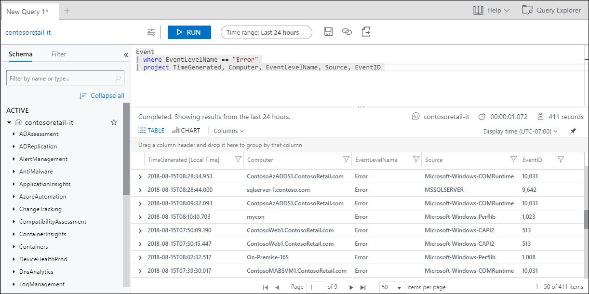

# Viewing and analyzing data in Log Analytics
There are two options available in the Azure portal for analyzing data stored in Log analytics and for creating queries for ad hoc analysis. The queries that you create using these portals can be used for other features such as alerts and dashboards.

## Log Analytics page
Open the Log Analytics page from **Logs** in the Log Analytics menu. This is a new experience for working with log data and creating queries. You can get an introduction to this portal and inspect its features at [Get started with the Log Analytics page in the Azure portal](query-language/get-started-analytics-portal.md).

The Log Analytics page provides the following improvements over the [Log search](#log-search) experience.

* Multiple tabs – create separate tabs to work with multiple queries.
* Rich visualizations – variety of charting options.
* Improved Intellisense and language auto-completion.
* Syntax highlighting – improves readability of queries. 
* Query explorer – access saved queries and functions.
* Schema view – review the structure of your data to assist in writing queries.
* Share – create links to queries, or pin queries to any shared Azure dashboard.
* Smart Analytics - identifies spikes in your charts and a quick analysis of the cause.
* Column selection – sort and group columns in the query results.

> [!NOTE]
> The Log Analytics page has the same functionality as the Advanced Analytics portal which is an external tool outside of the Azure portal. The Advanced Analytics portal is still available, but links and other references to it in the Azure portal are being replaced with this new page.

### Firewall requirements
Your browser requires access to the following addresses to access the Log Analytics page and the Advanced Analytics portal.  If your browser is accessing the Azure portal through a firewall, you must enable access to these addresses.

| Uri | IP | Ports |
|:---|:---|:---|
| portal.loganalytics.io | Dynamic | 80,443 |
| api.loganalytics.io    | Dynamic | 80,443 |
| docs.loganalytics.io   | Dynamic | 80,443 |

## Log search (Classic)
Open the Log search page from **Logs (Classic)** in the Log Analytics menu or from **Log Analytics** in the Azure Monitor menu. This is suitable for analyzing log data using basic queries. It provides multiple features for editing queries without having a full knowledge of the query language.  You can get a summary of these features in [Create log searches in Azure Log Analytics using Log Search](log-analytics-log-search-log-search-portal.md). 

## Next steps

- Walk through a [tutorial using Log Search](log-analytics-tutorial-viewdata.md) to learn how to create queries using the query language
- Walk through a [lesson using the Advanced Analytics portal](query-language/get-started-analytics-portal.md) which provides the same experience as the Log Analytics page.

