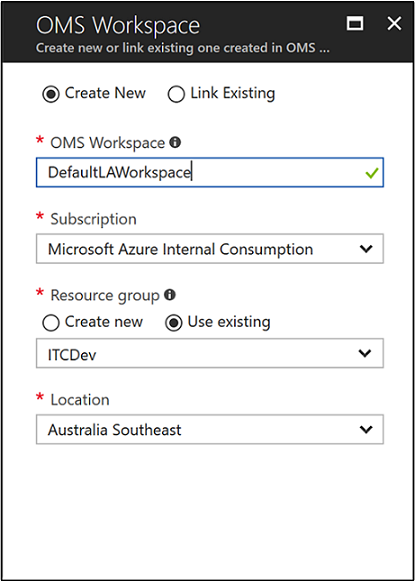
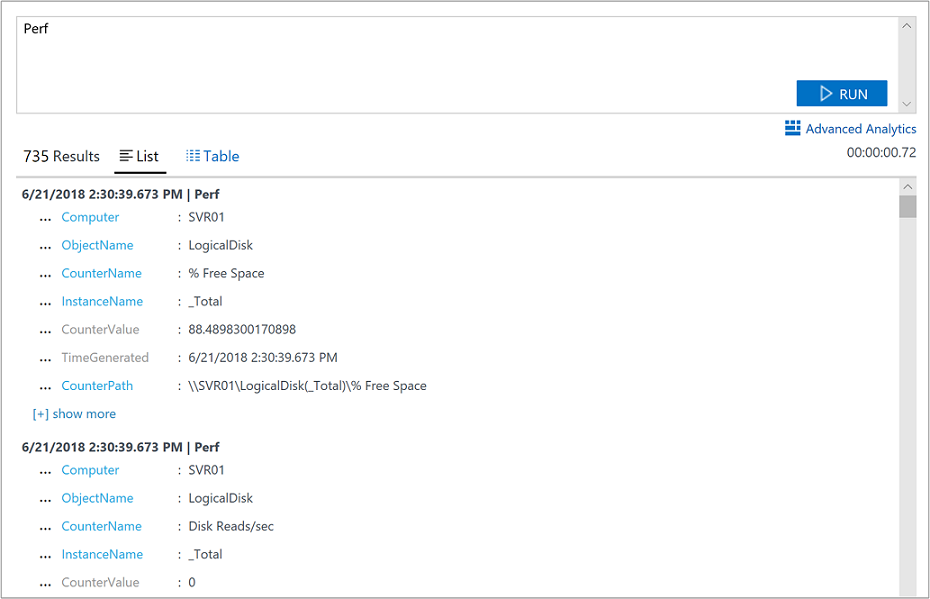

# Collect data about Azure Virtual Machines
[Azure Log Analytics](log-analytics-overview.md) can collect data directly from your Azure virtual machines and other resources in your environment into a single repository for detailed analysis and correlation.  This quickstart shows you how to configure and collect data from your Azure Linux or Windows VMs with a few easy steps.  
 
This quickstart assumes you have an existing Azure virtual machine. If not you can [create a Windows VM](../virtual-machines/windows/quick-create-portal.md) or [create a Linux VM](../virtual-machines/linux/quick-create-cli.md) following our VM quickstarts.

## Log in to Azure portal
Log in to the Azure portal at [https://portal.azure.com](https://portal.azure.com). 

## Create a workspace
1. In the Azure portal, click **All services**. In the list of resources, type **Log Analytics**. As you begin typing, the list filters based on your input. Select **Log Analytics**.

       

2. Click **Create**, and then select choices for the following items:

  * Provide a name for the new **OMS Workspace**, such as *DefaultLAWorkspace*. 
  * Select a **Subscription** to link to by selecting from the drop-down list if the default selected is not appropriate.
  * For **Resource Group**, select an existing resource group that contains one or more Azure virtual machines.  
  * Select the **Location** your VMs are deployed to.  For additional information, see which [regions Log Analytics is available in](https://azure.microsoft.com/regions/services/).
  * If you are creating a workspace in a new subscription created after April 2, 2018, it will automatically use the *Per GB* pricing plan and the option to select a pricing tier will not be available.  If you are creating a workspace for an existing subscription created before April 2, or to subscription that was tied to an existing EA enrollment, select your preferred pricing tier.  For additional information about the particular tiers, see [Log Analytics Pricing Details](https://azure.microsoft.com/pricing/details/log-analytics/).
  
         

3. After providing the required information on the **OMS Workspace** pane, click **OK**.  

While the information is verified and the workspace is created, you can track its progress under **Notifications** from the menu. 

## Enable the Log Analytics VM Extension
For Windows and Linux virtual machines already deployed in Azure, you install the Log Analytics agent with the Log Analytics VM Extension.  Using the extension simplifies the installation process and automatically configures the agent to send data to the Log Analytics workspace that you specify. The agent is also upgraded automatically, ensuring that you have the latest features and fixes.

>[!NOTE]
>The OMS agent for Linux cannot be configured to report to more than one Log Analytics workspace. 

1. In the Azure portal, click **All services** found in the upper left-hand corner. In the list of resources, type **Log Analytics**. As you begin typing, the list filters based on your input. Select **Log Analytics**.
2. In your list of Log Analytics workspaces, select *DefaultLAWorkspace* created earlier.
3. On the left-hand menu, under Workspace Data Sources, click **Virtual machines**.  
4. In the list of **Virtual machines**, select a virtual machine you want to install the agent on. Notice that the **OMS connection status** for the VM indicates that it is **Not connected**.
5. In the details for your virtual machine, select **Connect**. The agent is automatically installed and configured for your Log Analytics workspace. This process takes a few minutes, during which time the **Status** is **Connecting**.
6. After you install and connect the agent, the **OMS connection status** will be updated with **This workspace**.

## Collect event and performance data
Log Analytics can collect events from the Windows event logs or Linux Syslog and performance counters that you specify for longer term analysis and reporting, and take action when a particular condition is detected.  Follow these steps to configure collection of events from the Windows system log and Linux Syslog, and several common performance counters to start with.  

### Data collection from Windows VM
1. Select **Advanced settings**.

    

3. Select **Data**, and then select **Windows Event Logs**.  
4. You add an event log by typing in the name of the log.  Type **System** and then click the plus sign **+**.  
5. In the table, check the severities **Error** and **Warning**.   
6. Click **Save** at the top of the page to save the configuration.
7. Select **Windows Performance Data** to enable collection of performance counters on a Windows computer. 
8. When you first configure Windows Performance counters for a new Log Analytics workspace, you are given the option to quickly create several common counters. They are listed with a checkbox next to each.

    .

    Click **Add the selected performance counters**.  They are added and preset with a ten second collection sample interval.
  
9. Click **Save** at the top of the page to save the configuration.

### Data collection from Linux VM

1. Select **Syslog**.  
2. You add an event log by typing in the name of the log.  Type **Syslog** and then click the plus sign **+**.  
3. In the table, uncheck the severities **Info**, **Notice** and **Debug**. 
4. Click **Save** at the top of the page to save the configuration.
5. Select **Linux Performance Data** to enable collection of performance counters on a Linux computer. 
6. When you first configure Linux Performance counters for a new Log Analytics workspace, you are given the option to quickly create several common counters. They are listed with a checkbox next to each.

    .

    Click **Add the selected performance counters**.  They are added and preset with a ten second collection sample interval.  

7. Click **Save** at the top of the page to save the configuration.

## View data collected
Now that you have enabled data collection, lets run a simple log search example to see some data from the target VMs.  

1. In the Azure portal, navigate to Log Analytics and select the workspace created earlier.
2. Click the **Log Search** tile and on the Log Search pane, in the query field type `Perf` and then hit enter or click the search button to the right of the query field.

     

For example, the query in the following image returned 735 performance records.  Your results will be significantly less. 

## Clean up resources
When no longer needed, delete the Log Analytics workspace. To do so, select the Log Analytics workspace you created earlier and on the resource page click **Delete**.

## Next steps
Now that you are collecting operational and performance data from your Windows or Linux virtual machines, you can easily begin exploring, analyzing, and taking action on data that you collect for *free*.  

To learn how to view and analyze the data, continue to the tutorial.   

> [!div class="nextstepaction"]
> [View or analyze data in Log Analytics](log-analytics-tutorial-viewdata.md)
