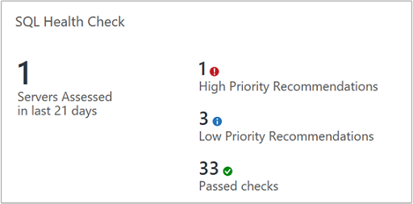
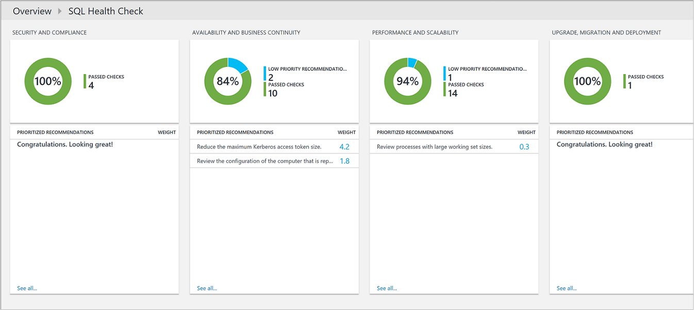
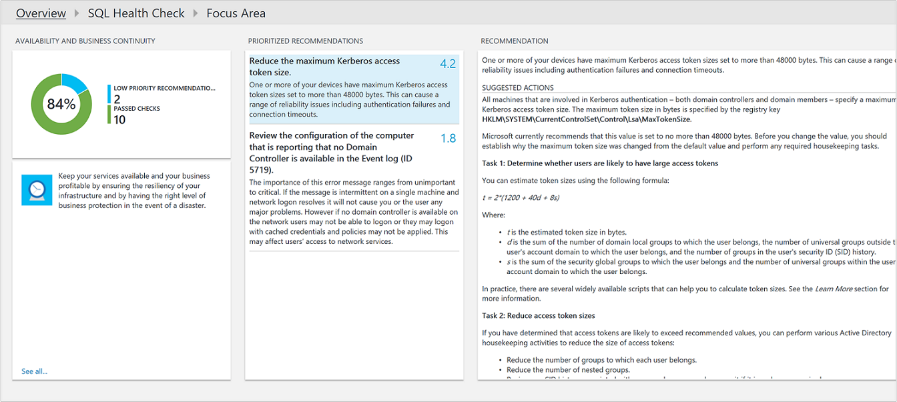

# Optimize your SQL environment with the SQL Server Health Check solution in Log Analytics


You can use the SQL Health Check solution to assess the risk and health of your server environments on a regular interval. This article will help you install the solution so that you can take corrective actions for potential problems.

This solution provides a prioritized list of recommendations specific to your deployed server infrastructure. The recommendations are categorized across six focus areas which help you quickly understand the risk and take corrective action.

The recommendations made are based on the knowledge and experience gained by Microsoft engineers from thousands of customer visits. Each recommendation provides guidance about why an issue might matter to you and how to implement the suggested changes.

You can choose focus areas that are most important to your organization and track your progress toward running a risk free and healthy environment.

After you've added the solution and an assessment is completed, summary information for focus areas is shown on the **SQL Health Check** dashboard for the infrastructure in your environment. The following sections describe how to use the information on the **SQL Health Check** dashboard, where you can view and then take recommended actions for your SQL Server infrastructure.





## Prerequisites

* The SQL Health Check solution requires a supported version of .NET Framework 4 installed on each computer that has the Microsoft Monitoring Agent (MMA) installed.  The MMA agent is used by System Center 2016 - Operations Manager and Operations Manager 2012 R2, and the Log Analytics service.  
* The solution supports SQL Server version 2012, 2014, and 2016.
* A Log Analytics workspace to add the SQL Health Check solution from the Azure marketplace in the Azure portal.  In order to install the solution, you must be an administrator or contributor in the Azure subscription.

  > [!NOTE]
  > After you've added the solution, the AdvisorAssessment.exe file is added to servers with agents. Configuration data is read and then sent to the Log Analytics service in the cloud for processing. Logic is applied to the received data and the cloud service records the data.
  >
  >

To perform the health check against your SQL Server servers, they require an agent and connectivity to Log Analytics using one of the following supported methods:

1. Install the [Microsoft Monitoring Agent (MMA)](log-analytics-windows-agent.md) if the server is not already monitored by System Center 2016 - Operations Manager or Operations Manager 2012 R2.
2. If it is monitored with System Center 2016 - Operations Manager or Operations Manager 2012 R2 and the management group is not integrated with the Log Analytics service, the server can be multi-homed with Log Analytics to collect data and forward to the service and still be monitored by Operations Manager.  
3. Otherwise, if your Operations Manager management group is integrated with the service, you need to add the domain controllers for data collection by the service following the steps under [add agent-managed computers](log-analytics-om-agents.md#connecting-operations-manager-to-oms) after you enable the solution in your workspace.  

The agent on your SQL Server which reports to an Operations Manager management group, collects data, forwards to its assigned management server, and then is sent directly from a management server to the Log Analytics service.  The data is not written to the Operations Manager databases.  

If the SQL Server is monitored by Operations Manager, you need to configure an Operations Manager Run As account. See [Operations Manager run-as accounts for Log Analytics](#operations-manager-run-as-accounts-for-log-analytics) below for more information.

## SQL Health Check data collection details
SQL Health Check collects data from the following sources using the agent that you have enabled:

* Windows Management Instrumentation (WMI)
* Registry
* Performance counters
* SQL Server dynamic management view results

Data is collected on the SQL Server and forwarded to Log Analytics every seven days.

## Operations Manager run-as accounts for Log Analytics
Log Analytics uses the Operations Manager agent and management group to collect and send data to the Log Analytics service. Log Analytics builds upon management packs for workloads to provide value-add services. Each workload requires workload-specific privileges to run management packs in a different security context, such as a domain user account. You need to provide credential information by configuring an Operations Manager Run As account.

Use the following information to set the Operations Manager Run As account for SQL Health Check.

### Set the Run As account for SQL Health Check
 If you are already using the SQL Server management pack, you should use that Run As configuration.

#### To configure the SQL Run As account in the Operations console
> [!NOTE]
> By default workflows in the management pack runs in the security context of the Local System account. If you are using the Microsoft Monitoring Agent connected directly to the service rather than reporting directly to an Operations Manager management group, skip steps 1-5 below and run either the T-SQL or PowerShell sample, specifying NT AUTHORITY\SYSTEM as the user name.
>
>

1. In Operations Manager, open the Operations console, and then click **Administration**.
2. Under **Run As Configuration**, click **Profiles**, and open **OMS SQL Assessment Run As Profile**.
3. On the **Run As Accounts** page, click **Add**.
4. Select a Windows Run As account that contains the credentials needed for SQL Server, or click **New** to create one.

   > [!NOTE]
   > The Run As account type must be Windows. The Run As account must also be part of Local Administrators group on all Windows Servers hosting SQL Server Instances.
   >
   >
5. Click **Save**.
6. Modify and then execute the following T-SQL sample on each SQL Server instance to grant minimum permissions required for the Run As Account to perform the health check. However, you don’t need to do this if a Run As Account is already part of the sysadmin server role on SQL Server instances.

```
    ---
    -- Replace <UserName> with the actual user name being used as Run As Account.
    USE master

    -- Create login for the user, comment this line if login is already created.
    CREATE LOGIN [<UserName>] FROM WINDOWS

    -- Grant permissions to user.
    GRANT VIEW SERVER STATE TO [<UserName>]
    GRANT VIEW ANY DEFINITION TO [<UserName>]
    GRANT VIEW ANY DATABASE TO [<UserName>]

    -- Add database user for all the databases on SQL Server Instance, this is required for connecting to individual databases.
    -- NOTE: This command must be run anytime new databases are added to SQL Server instances.
    EXEC sp_msforeachdb N'USE [?]; CREATE USER [<UserName>] FOR LOGIN [<UserName>];'

```

#### To configure the SQL Run As account using Windows PowerShell
Open a PowerShell window and run the following script after you’ve updated it with your information:

```
    import-module OperationsManager
    New-SCOMManagementGroupConnection "<your management group name>"

    $profile = Get-SCOMRunAsProfile -DisplayName "OMS SQL Assessment Run As Profile"
    $account = Get-SCOMrunAsAccount | Where-Object {$_.Name -eq "<your run as account name>"}
    Set-SCOMRunAsProfile -Action "Add" -Profile $Profile -Account $Account
```

## Understanding how recommendations are prioritized
Every recommendation made is given a weighting value that identifies the relative importance of the recommendation. Only the ten most important recommendations are shown.

### How weights are calculated
Weightings are aggregate values based on three key factors:

* The *probability* that an issue identified will cause problems. A higher probability equates to a larger overall score for the recommendation.
* The *impact* of the issue on your organization if it does cause a problem. A higher impact equates to a larger overall score for the recommendation.
* The *effort* required to implement the recommendation. A higher effort equates to a smaller overall score for the recommendation.

The weighting for each recommendation is expressed as a percentage of the total score available for each focus area. For example, if a recommendation in the Security and Compliance focus area has a score of 5%, implementing that recommendation will increase your overall Security and Compliance score by 5%.

### Focus areas
**Security and Compliance** - This focus area shows recommendations for potential security threats and breaches, corporate policies, and technical, legal and regulatory compliance requirements.

**Availability and Business Continuity** - This focus area shows recommendations for service availability, resiliency of your infrastructure, and business protection.

**Performance and Scalability** - This focus area shows recommendations to help your organization's IT infrastructure grow, ensure that your IT environment meets current performance requirements, and is able to respond to changing infrastructure needs.

**Upgrade, Migration and Deployment** - This focus area shows recommendations to help you upgrade, migrate, and deploy SQL Server to your existing infrastructure.

**Operations and Monitoring** - This focus area shows recommendations to help streamline your IT operations, implement preventative maintenance, and maximize performance.

**Change and Configuration Management** - This focus area shows recommendations to help protect day-to-day operations, ensure that changes don't negatively affect your infrastructure, establish change control procedures, and to track and audit system configurations.

### Should you aim to score 100% in every focus area?
Not necessarily. The recommendations are based on the knowledge and experiences gained by Microsoft engineers across thousands of customer visits. However, no two server infrastructures are the same, and specific recommendations may be more or less relevant to you. For example, some security recommendations might be less relevant if your virtual machines are not exposed to the Internet. Some availability recommendations may be less relevant for services that provide low priority ad hoc data collection and reporting. Issues that are important to a mature business may be less important to a start-up. You may want to identify which focus areas are your priorities and then look at how your scores change over time.

Every recommendation includes guidance about why it is important. You should use this guidance to evaluate whether implementing the recommendation is appropriate for you, given the nature of your IT services and the business needs of your organization.

## Use Health Check focus area recommendations
Before you can use an assessment solution in Log Analytics, you must have the solution installed.  After it is installed, you can view the summary of recommendations by using the SQL Health Check tile on the solution page in the Azure portal.

View the summarized compliance assessments for your infrastructure and then drill-into recommendations.

### To view recommendations for a focus area and take corrective action
1. Log in to the Azure portal at [https://portal.azure.com](https://portal.azure.com).
2. In the Azure portal, click **More services** found on the lower left-hand corner. In the list of resources, type **Log Analytics**. As you begin typing, the list filters based on your input. Select **Log Analytics**.
3. In the Log Analytics subscriptions pane, select a workspace and then click the **Overview** tile.  
4. On the **Overview** page, click the **SQL Health Check** tile.
5. On the **Health Check** page, review the summary information in one of the focus area blades and then click one to view recommendations for that focus area.
6. On any of the focus area pages, you can view the prioritized recommendations made for your environment. Click a recommendation under **Affected Objects** to view details about why the recommendation is made.<br><br> <br>
7. You can take corrective actions suggested in **Suggested Actions**. When the item has been addressed, later assessments will record that recommended actions were taken and your compliance score will increase. Corrected items appear as **Passed Objects**.

## Ignore recommendations
If you have recommendations that you want to ignore, you can create a text file that Log Analytics will use to prevent recommendations from appearing in your assessment results.

[!INCLUDE[log-analytics-log-search-nextgeneration](../../includes/log-analytics-log-search-nextgeneration.md)]

### To identify recommendations that you will ignore
1. In the Azure portal on the Log Analytics workspace page for your selected workspace, click the **Log Search** tile.
2. Use the following query to list recommendations that have failed for computers in your environment.

    ```
    Type=SQLAssessmentRecommendation RecommendationResult=Failed | select Computer, RecommendationId, Recommendation | sort Computer
    ```

    >[!NOTE]
    > If your workspace has been upgraded to the [new Log Analytics query language](log-analytics-log-search-upgrade.md), then the above query would change to the following.
    >
    > `SQLAssessmentRecommendation | where RecommendationResult == "Failed" | sort by Computer asc | project Computer, RecommendationId, Recommendation`

    Here's a screen shot showing the Log Search query:<br><br> <br>

3. Choose recommendations that you want to ignore. You’ll use the values for RecommendationId in the next procedure.

### To create and use an IgnoreRecommendations.txt text file
1. Create a file named IgnoreRecommendations.txt.
2. Paste or type each RecommendationId for each recommendation that you want Log Analytics to ignore on a separate line and then save and close the file.
3. Put the file in the following folder on each computer where you want Log Analytics to ignore recommendations.
   * On computers with the Microsoft Monitoring Agent (connected directly or through Operations Manager) - *SystemDrive*:\Program Files\Microsoft Monitoring Agent\Agent
   * On the Operations Manager management server - *SystemDrive*:\Program Files\Microsoft System Center 2012 R2\Operations Manager\Server
   * On the Operations Manager 2016 management server - *SystemDrive*:\Program Files\Microsoft System Center 2016\Operations Manager\Server

### To verify that recommendations are ignored
1. After the next scheduled assessment runs, by default every 7 days, the specified recommendations are marked Ignored and will not appear on the assessment dashboard.
2. You can use the following Log Search queries to list all the ignored recommendations.

    ```
    Type=SQLAssessmentRecommendation RecommendationResult=Ignored | select Computer, RecommendationId, Recommendation | sort Computer
    ```

    >[!NOTE]
    > If your workspace has been upgraded to the [new Log Analytics query language](log-analytics-log-search-upgrade.md), then the above query would change to the following.
    >
    > `SQLAssessmentRecommendation | where RecommendationResult == "Ignored" | sort by Computer asc | project Computer, RecommendationId, Recommendation`

3. If you decide later that you want to see ignored recommendations, remove any IgnoreRecommendations.txt files, or you can remove RecommendationIDs from them.

## SQL Health Check solution FAQ
*How often does a health check run?*

* The check runs every seven days.

*Is there a way to configure how often the check runs?*

* Not at this time.

*If another server is discovered after I’ve added the SQL Health Check solution, will it be checked?*

* Yes, once it is discovered it is checked from then on, every seven days.

*If a server is decommissioned, when will it be removed from the health check?*

* If a server does not submit data for 3 weeks, it is removed.

*What is the name of the process that does the data collection?*

* AdvisorAssessment.exe

*How long does it take for data to be collected?*

* The actual data collection on the server takes about 1 hour. It may take longer on servers that have a large number of SQL instances or databases.

*What type of data is collected?*

* The following types of data are collected:
  * WMI
  * Registry
  * Performance counters
  * SQL dynamic management views (DMV).

*Is there a way to configure when data is collected?*

* Not at this time.

*Why do I have to configure a Run As Account?*

* For SQL Server, a small number of SQL queries are run. In order for them to run, a Run As Account with VIEW SERVER STATE permissions to SQL must be used.  In addition, in order to query WMI, local administrator credentials are required.

*Why display only the top 10 recommendations?*

* Instead of giving you an exhaustive overwhelming list of tasks, we recommend that you focus on addressing the prioritized recommendations first. After you address them, additional recommendations will become available. If you prefer to see the detailed list, you can view all recommendations using the Log Analytics log search.

*Is there a way to ignore a recommendation?*

* Yes, see [Ignore recommendations](#ignore-recommendations) section above.

## Next steps
* [Search logs](log-analytics-log-searches.md) to learn how to analyze detailed SQL Health Check data and recommendations.
