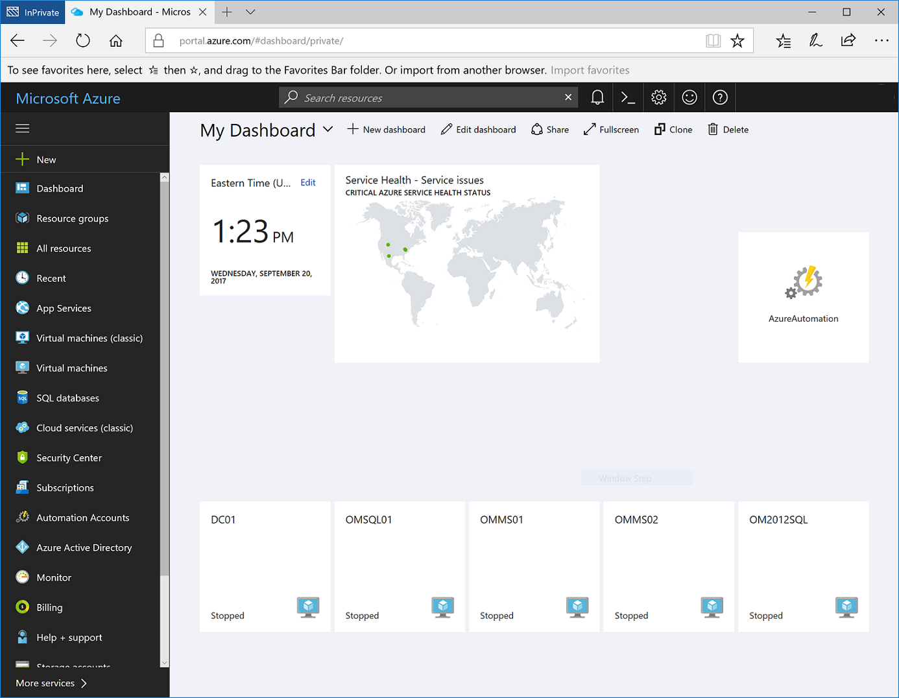
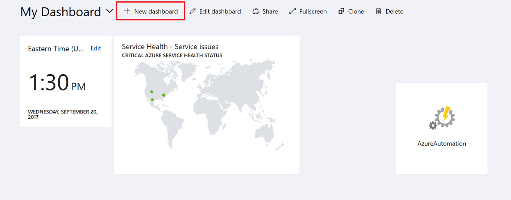
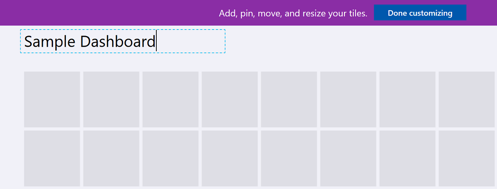
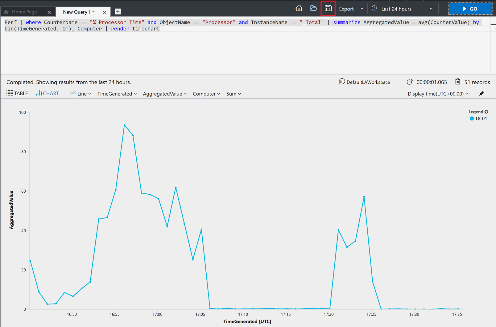
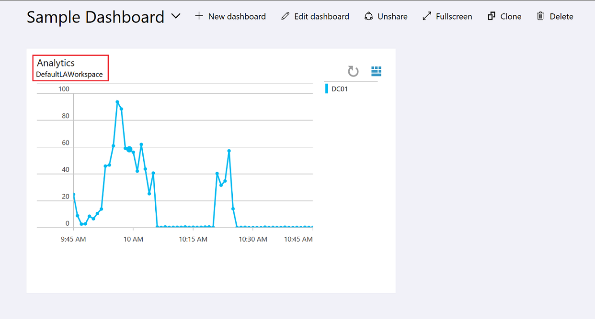
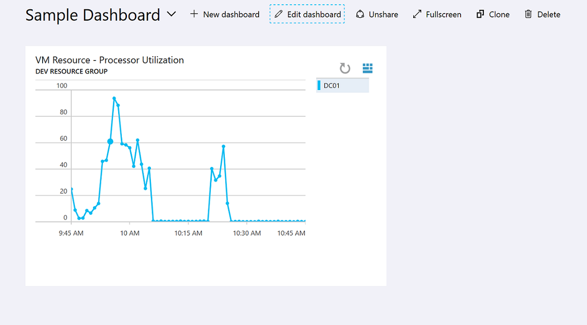

# Create and share dashboards of Log Analytics data

Log Analytics dashboards can visualize all of your saved log searches, giving you the ability to find, correlate, and share IT operational data in the organization.  This tutorial covers creating a log search that will be used to support a shared dashboard that will be accessed by your IT operations support team.  You learn how to:

> [!div class="checklist"]
> * Create a shared dashboard in the Azure portal
> * Visualize a performance log search 
> * Add a log search to a shared dashboard 
> * Customize a tile in a shared dashboard

To complete the example in this tutorial, you must have an existing virtual machine [connected to the Log Analytics workspace](log-analytics-quick-collect-azurevm.md).  
 
## Log in to Azure portal
Log in to the Azure portal at [https://portal.azure.com](https://portal.azure.com). 

## Create a shared dashboard

The first thing you see after you sign in to the Microsoft Azure portal is a [dashboard](../azure-portal/azure-portal-dashboards.md).<br> 

Here you can bring together operational data that is most important to IT across all your Azure resources, including telemetry from Azure Log Analytics.  Before we step into visualizing a log search, let's first create a dashboard and share it.  This allows us to get it out of the way before we take our example performance log search, which will render as a line chart, and add it to the dashboard.  

To create a dashboard, select the **New dashboard** button next to the current dashboard's name.<br> 

This action creates a new, empty, private dashboard and puts you into customization mode where you can name your dashboard and add or rearrange tiles. Edit the name of the dashboard and specify *Sample Dashboard* for this tutorial and then select **Done customizing**.<br><br> 

When you create a dashboard, it is private by default, which means you are the only person who can see it. To make it visible to others, use the **Share** button that appears alongside the other dashboard commands.<br>  

You are asked to choose a subscription and resource group for your dashboard to be published to. For convenience, the portal's publishing experience guides you towards a pattern where you place dashboards in a resource group called **dashboards**.  Verify the subscription selected and then click **Publish**.  Access to the information displayed in the dashboard is controlled with [Azure Resource Based Access Control](../active-directory/role-based-access-control-configure.md).   

## Visualize a log search

You can create basic queries on a single line from the Log Search portal in the Azure portal. The Log Search portal can be used without launching an external portal, and you can use it to perform a variety of functions with log searches including creating alert rules, creating computer groups, and exporting the results of the query. 

The [Advanced Analytics portal](https://docs.loganalytics.io/docs/Learn/Getting-Started/Getting-started-with-the-Analytics-portal) is a dedicated portal that provides advanced functionality not available in the Log Search portal. Features include the ability to edit a query on multiple lines, selectively execute code, context sensitive Intellisense, and Smart Analytics. In the Advanced Analytics portal, you will create a performance view in graphical form, save it for a future search, and pin it to the shared dashboard created earlier.   

You launch the Advanced Analytics portal from a link in the Log Search portal.<br> 

In the Analytics portal, enter the following query to return only processor utilization records for both Windows and Linux computers, grouped by Computer and TimeGenerated, and displayed in a visual chart:

```
Perf | where CounterName == "% Processor Time" and ObjectName == "Processor" and InstanceName == "_Total" | summarize AggregatedValue = avg(CounterValue) by bin(TimeGenerated, 1m), Computer | render timechart
```

Save the query by selecting the **Save query** button from the top-right corner.<br> <br><br> In the **Save Query** control panel, provide a name such as *Azure VMs - Processor Utilization* and then click **Save**.  This way you can create a library of common queries to search with or modify it without having to re-write it entirely.  Finally, pin this to the shared dashboard created earlier by selecting **Pin chart to your Azure dashboard** button from the middle-right corner of the page.  

Now that we have a query pinned to the dashboard, you will notice it has a generic title and comment below it.<br> <br><br>  We should rename it to something meaningful that can be easily understood by those viewing it.  Right-click the tile and select **Edit tile**.  Once you are finished customizing the title and subtitle for the tile, click **Update**.  A banner will appear asking you to publish changes or discard.  Click **Publish changes** and then close the **Edit Tile** control pane.  



## Next steps
In this tutorial, you learned how to create a dashboard in the Azure portal and add a log search to it.  Advance to the next tutorial to learn the different responses you can implement based on log search results.  

> [!div class="nextstepaction"]
> [Respond to events with Log Analytics Alerts](log-analytics-tutorial-response.md)