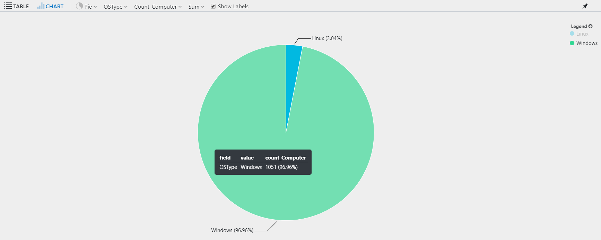
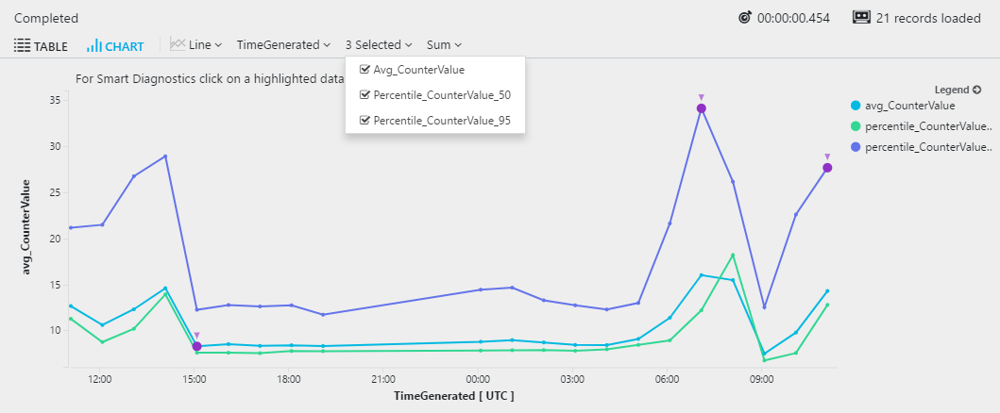
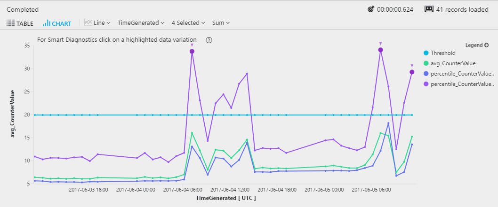
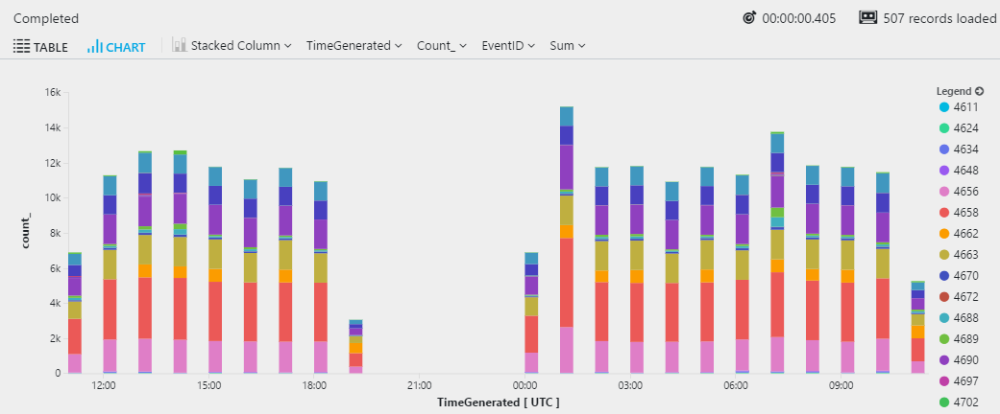

# Creating charts and diagrams from Log Analytics queries

> [!NOTE]
> You should complete [Advanced aggregations in Log Analytics queries](advanced-aggregations.md) before completing this lesson.

[!INCLUDE [log-analytics-demo-environment](../../../includes/log-analytics-demo-environment.md)]

This article describes various visualizations in Azure Log Analytics to display your data in different ways.

## Charting the results
Start by reviewing how many computers there are per operating system, during the past hour:

```KQL
Heartbeat
| where TimeGenerated > ago(1h)
| summarize count(Computer) by OSType  
```

By default, results display as a table:


To get a better view, select **Chart**, and choose the **Pie** option to visualize the results:




## Timecharts
Show the average, 50th and 95th percentiles of processor time in bins of 1 hour. The query generates multiple series and you can then select which series to show in the time chart:

```KQL
Perf
| where TimeGenerated > ago(1d) 
| where CounterName == "% Processor Time" 
| summarize avg(CounterValue), percentiles(CounterValue, 50, 95)  by bin(TimeGenerated, 1h)
```

Select the **Line** chart display option:



### Reference line

A reference line can help you easily identifying if the metric exceeded a specific threshold. To add a line to a chart, extend the dataset with a constant column:

```KQL
Perf
| where TimeGenerated > ago(1d) 
| where CounterName == "% Processor Time" 
| summarize avg(CounterValue), percentiles(CounterValue, 50, 95)  by bin(TimeGenerated, 1h)
| extend Threshold = 20
```



## Multiple dimensions
Multiple expressions in the `by` clause of `summarize` create multiple rows in the results, one for each combination of values.

```KQL
SecurityEvent
| where TimeGenerated > ago(1d)
| summarize count() by tostring(EventID), AccountType, bin(TimeGenerated, 1h)
```

When you view the results as a chart, it uses the first column from the `by` clause. The following example shows a stacked column chart using the _EventID._ Dimensions must be of `string` type, so in this example the _EventID_ is being cast to string. 



You can switch between by selecting the dropdown with the column name. 


## Next steps
See other lessons for using the Log Analytics query language:

- [String operations](string-operations.md)
- [Date and time operations](datetime-operations.md)
- [Aggregation functions](aggregations.md)
- [Advanced aggregations](advanced-aggregations.md)
- [JSON and data structures](json-data-structures.md)
- [Advanced query writing](advanced-query-writing.md)
- [Joins](joins.md)