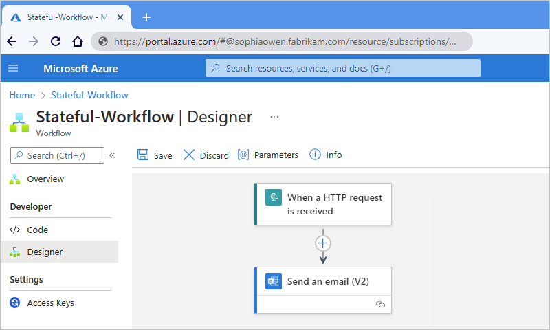
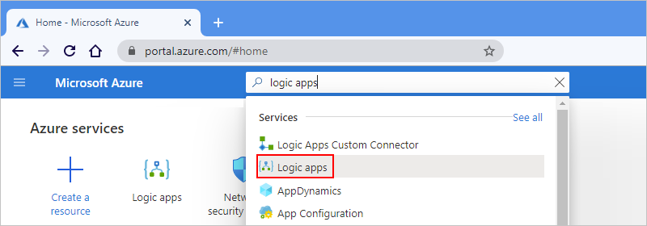
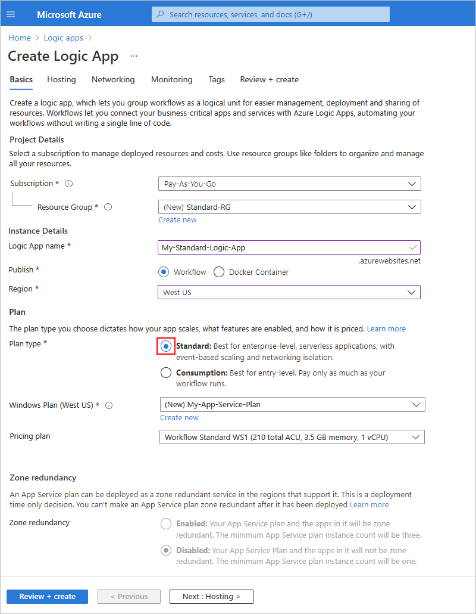
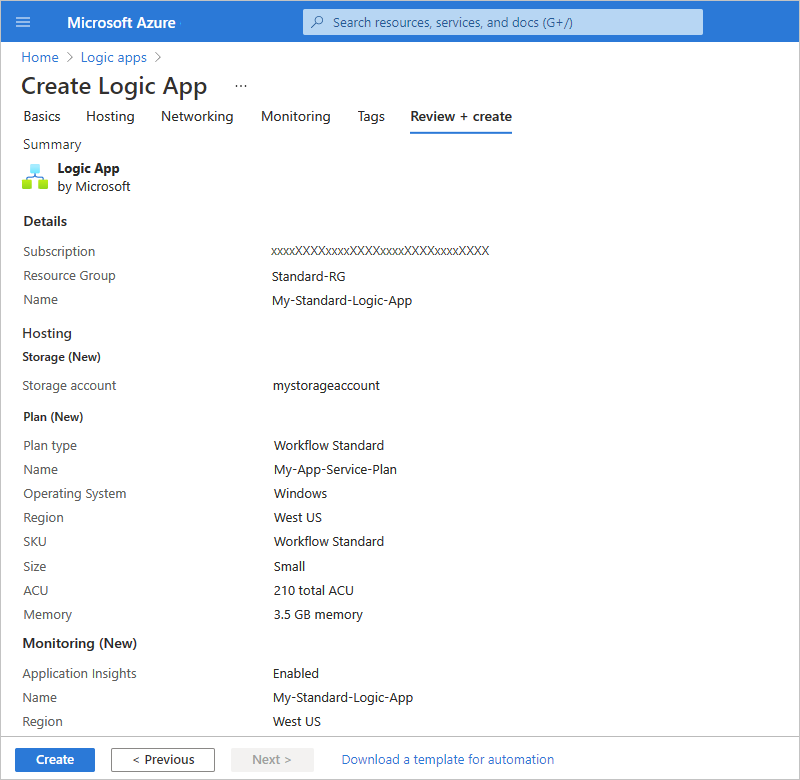
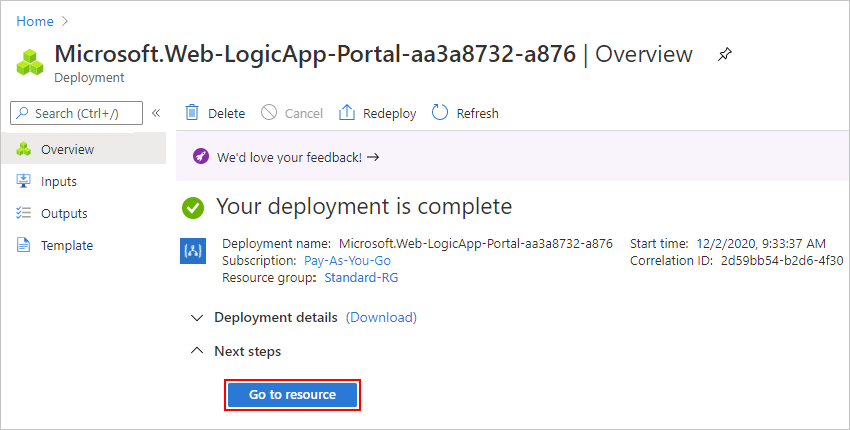
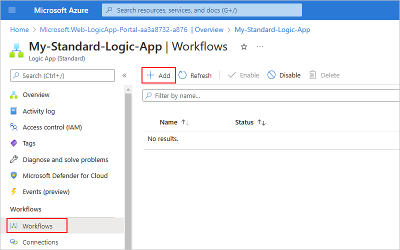
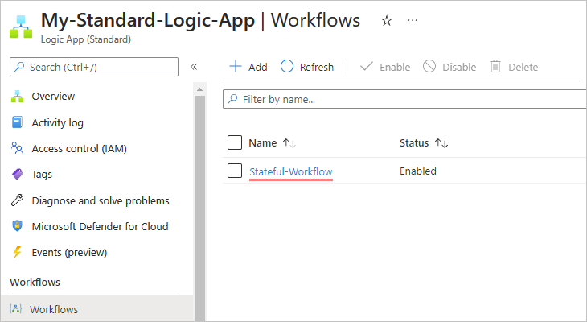
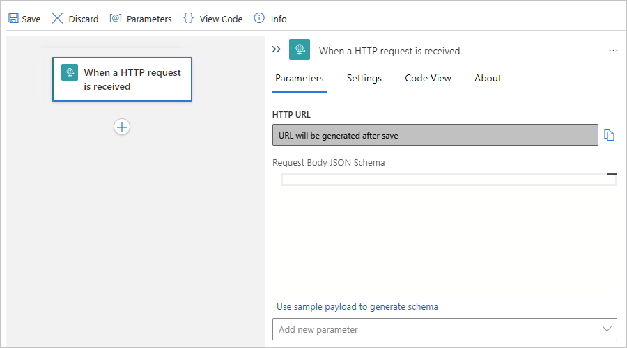

# Create an integration workflow with single-tenant Azure Logic Apps (Standard) in the Azure portal

This article shows how to create an example automated integration workflow that runs in the *single-tenant* Azure Logic Apps environment by using the **Logic App (Standard)** resource type and the Azure portal. This resource type can host multiple [stateful and stateless workflows](single-tenant-overview-compare.md#stateful-stateless). Also, workflows in the same logic app and tenant run in the same process as the redesigned Azure Logic Apps runtime, so they share the same resources and provide better performance. For more information about the single-tenant Azure Logic Apps offering, review [Single-tenant versus multi-tenant and integration service environment](single-tenant-overview-compare.md).

While this example workflow is cloud-based and has only two steps, you can create workflows from hundreds of operations that can connect a wide range of apps, data, services, and systems across cloud, on premises, and hybrid environments. The example workflow starts with the built-in Request trigger and follows with an Office 365 Outlook action. The trigger creates a callable endpoint for the workflow and waits for an inbound HTTPS request from any caller. When the trigger receives a request and fires, the next action runs by sending email to the specified email address along with selected outputs from the trigger.

> [!TIP]
> If you don't have an Office 365 account, you can use any other available action 
> that can send messages from your email account, for example, Outlook.com.
>
> To create this example workflow in Visual Studio Code instead, follow the steps in 
> [Create integration workflows using single-tenant Azure Logic Apps and Visual Studio Code](create-single-tenant-workflows-visual-studio-code.md). 
> Both options provide the capability to develop, run, and deploy logic app workflows in the same kinds of environments. 
> However, with Visual Studio Code, you can *locally* develop, test, and run workflows in your development environment.

As you progress, you'll complete these high-level tasks:

* Create the logic app resource and add a blank [*stateful*](single-tenant-overview-compare.md#stateful-stateless) workflow.
* Add a trigger and action.
* Trigger a workflow run.
* View the workflow's run and trigger history.
* Enable or open the Application Insights after deployment.
* Enable run history for stateless workflows.

## Prerequisites

* An Azure account and subscription. If you don't have a subscription, [sign up for a free Azure account](https://azure.microsoft.com/free/?WT.mc_id=A261C142F).

* An [Azure Storage account](../storage/common/storage-account-overview.md). If you don't have one, you can either create a storage account in advance or during logic app creation.

  > [!NOTE]
  > The **Logic App (Standard)** resource type is powered by Azure Functions and has [storage requirements similar to function apps](../azure-functions/storage-considerations.md). 
  > [Stateful workflows](single-tenant-overview-compare.md#stateful-stateless) perform storage transactions, such as 
  > using queues for scheduling and storing workflow states in tables and blobs. These transactions incur 
  > [storage charges](https://azure.microsoft.com/pricing/details/storage/). For more information about 
  > how stateful workflows store data in external storage, review [Stateful and stateless workflows](single-tenant-overview-compare.md#stateful-stateless).

* To create the same example workflow in this article, you need an Office 365 Outlook email account that uses a Microsoft work or school account to sign in.

  If you choose a [different email connector](/connectors/connector-reference/connector-reference-logicapps-connectors), such as Outlook.com, you can still follow the example, and the general overall steps are the same. However, your options might differ in some ways. For example, if you use the Outlook.com connector, use your personal Microsoft account instead to sign in.

* To test the example workflow in this article, you need a tool that can send calls to the endpoint created by the Request trigger. If you don't have such a tool, you can download, install, and use [Postman](https://www.postman.com/downloads/).

* If you create your logic app resources with settings that support using [Application Insights](../azure-monitor/app/app-insights-overview.md), you can optionally enable diagnostics logging and tracing for your logic app. You can do so either when you create your logic app or after deployment. You need to have an Application Insights instance, but you can create this resource either [in advance](../azure-monitor/app/create-workspace-resource.md), when you create your logic app, or after deployment.

* To deploy your **Logic App (Standard)** resource to an [App Service Environment v3 (ASEv3)](../app-service/environment/overview.md), you have to create this environment resource first. You can then select this environment as the deployment location when you create your logic app resource. For more information, review [Resources types and environments](single-tenant-overview-compare.md#resource-environment-differences) and [Create an App Service Environment](../app-service/environment/creation.md).

## Create a Standard logic app resource

1. In the [Azure portal](https://portal.azure.com), sign in with your Azure account credentials.

1. In the Azure portal search box, enter `logic apps`, and select **Logic apps**.

   

1. On the **Logic apps** page, select **Add**.

1. On the **Create Logic App** page, on the **Basics** tab, provide the following basic information about your logic app:

   | Property | Required | Value | Description |
   |----------|----------|-------|-------------|
   | **Subscription** | Yes | <*Azure-subscription-name*> | Your Azure subscription name. |
   | **Resource Group** | Yes | <*Azure-resource-group-name*> | The [Azure resource group](../azure-resource-manager/management/overview.md#terminology) where you create your logic app and related resources. This name must be unique across regions and can contain only letters, numbers, hyphens (**-**), underscores (**_**), parentheses (**()**), and periods (**.**).   This example creates a resource group named **Fabrikam-Workflows-RG**. |
   | **Logic App name** | Yes | <*logic-app-name*> | Your logic app name, which must be unique across regions and can contain only letters, numbers, hyphens (**-**), underscores (**_**), parentheses (**()**), and periods (**.**).   **Note**: Your logic app's name automatically gets the suffix, `.azurewebsites.net`, because the **Logic App (Standard)** resource is powered by the single-tenant Azure Logic Apps runtime, which uses the Azure Functions extensibility model and is hosted as an extension on the Azure Functions runtime. Azure Functions uses the same app naming convention.   This example creates a logic app named **Fabrikam-Workflows**. |
   |||||

1. Before you continue making selections, under **Plan type**, select **Standard** so that you view only the settings that apply to the Standard plan-based logic app type. The **Plan type** property specifies the logic app type and billing model to use.

   | Plan type | Description |
   |-----------|-------------|
   | **Consumption** | This logic app type runs in global, multi-tenant Azure Logic Apps and uses the [Consumption billing model](logic-apps-pricing.md#consumption-pricing). |
   | **Standard** | This logic app type is the default selection and runs in single-tenant Azure Logic Apps and uses the [Standard billing model](logic-apps-pricing.md#standard-pricing). |
   |||

1. Now continue making the following selections:

   | Property | Required | Value | Description |
   |----------|----------|-------|-------------|
   | **Publish** | Yes | **Workflow** | This option appears and applies only when **Plan type** is set to the **Standard** logic app type. By default, this option is set to **Workflow** and creates an empty logic app resource where you add your first workflow. 

**Note**: Currently, the **Docker Container** option requires a [*custom location*](../azure-arc/kubernetes/conceptual-custom-locations.md) on an Azure Arc enabled Kubernetes cluster, which you can use with [Azure Arc enabled Logic Apps (Standard)](azure-arc-enabled-logic-apps-overview.md). The resource locations for your logic app, custom location, and cluster must all be the same. |
   | **Region** | Yes | <*Azure-region*> | The Azure datacenter region to use for storing your app's information. This example deploys the sample logic app to the **West US** region in Azure.   - If you previously chose **Docker Container**, select your custom location from the **Region** list.   - If you want to deploy your app to an existing [App Service Environment v3 resource](../app-service/environment/overview.md), you can select that environment from the **Region** list. |
   |||||

   When you're done, your settings look similar to this version:

   

1. On the **Hosting** tab, provide the following information about the storage solution and hosting plan to use for your logic app.

   | Property | Required | Value | Description |
   |----------|----------|-------|-------------|
   | **Storage type** | Yes | - **SQL and Azure Storage**  - **Azure Storage** | The storage type that you want to use for workflow-related artifacts and data. 

- To deploy only to Azure, select **Azure Storage**. 

- To use SQL as primary storage and Azure Storage as secondary storage, select **SQL and Azure Storage**, and review [Set up SQL database storage for Standard logic apps in single-tenant Azure Logic Apps](set-up-sql-db-storage-single-tenant-standard-workflows.md). 

**Note**: If you're deploying to an Azure region, you still need an Azure storage account, which is used to complete the one-time hosting of the logic app's configuration on the Azure Logic Apps platform. The ongoing workflow state, run history, and other runtime artifacts are stored in your SQL database. 

For deployments to a custom location that's hosted on an Azure Arc cluster, you only need SQL as your storage provider. |
   | **Storage account** | Yes | <*Azure-storage-account-name*> | The [Azure Storage account](../storage/common/storage-account-overview.md) to use for storage transactions. 

This resource name must be unique across regions and have 3-24 characters with only numbers and lowercase letters. Either select an existing account or create a new account. 

This example creates a storage account named `fabrikamstorageacct`. |
   | **Plan type** | Yes | <*hosting-plan*> | The hosting plan to use for deploying your logic app. 

For more information, review [Hosting plans and pricing tiers](logic-apps-pricing.md#standard-pricing). |
   | **Windows Plan** | Yes | <*plan-name*> | The plan name to use. Either select an existing plan name or provide a name for a new plan. 

This example uses the name `Fabrikam-Service-Plan`. |
   | **SKU and size** | Yes | <*pricing-tier*> | The [pricing tier](../app-service/overview-hosting-plans.md) to use for your logic app. Your selection affects the pricing, compute, memory, and storage that your logic app and workflows use. 

To change the default pricing tier, select **Change size**. You can then select other pricing tiers, based on the workload that you need. 

For more information, review [Hosting plans and pricing tiers](logic-apps-pricing.md#standard-pricing). |
   |||||

1. Next, if your creation and deployment settings support using [Application Insights](../azure-monitor/app/app-insights-overview.md), you can optionally enable diagnostics logging and tracing for your logic app.

   1. On the **Monitoring** tab, under **Application Insights**, set **Enable Application Insights** to **Yes** if not already selected.

   1. For the **Application Insights** setting, either select an existing Application Insights instance, or if you want to create a new instance, select **Create new** and provide the name that you want to use.

1. After Azure validates your logic app's settings, on the **Review + create** tab, select **Create**, for example:

   

   > [!TIP]
   > If you get a validation error after this step, open and review the error details. For example, 
   > if your selected region reaches a quota for resources that you're trying to create, you might 
   > have to try a different region.

   After Azure finishes deployment, your logic app is automatically live and running but doesn't do anything yet because the resource is empty, and you haven't added any workflows yet.

1. On the deployment completion page, select **Go to resource** so that you can add a blank workflow.

   

## Add a blank workflow

After you create your empty logic app resource, you have to add your first workflow.

1. After Azure opens the resource, on your logic app's menu, select **Workflows**. On the **Workflows** toolbar, select **Add**.

   

1. After the **New workflow** pane opens, provide a name for your workflow, and choose the state type, either [**Stateful** or **Stateless**](single-tenant-overview-compare.md#stateful-stateless). When you're done, select **Create**.

   This example adds a blank stateful workflow named `Fabrikam-Stateful-Workflow`. By default, the workflow is enabled but doesn't do anything until you add a trigger and actions.

   

1. Next, open the blank workflow in the designer so that you can add a trigger and an action.

   1. From the workflow list, select the blank workflow.

   1. On the workflow menu, under **Developer**, select **Designer**.

      On the designer surface, the **Choose an operation** prompt already appears and is selected by default so that the **Add a trigger** pane also appears open.

      

## Add a trigger and an action

This example builds a workflow that has these steps:

* The built-in [Request trigger](../connectors/connectors-native-reqres.md), **When an HTTP request is received**, which receives inbound calls or requests and creates an endpoint that other services or logic apps can call.

* The [Office 365 Outlook action](../connectors/connectors-create-api-office365-outlook.md), **Send an email**.

### Add the Request trigger

Before you can add a trigger to a blank workflow, make sure that the workflow designer is open and that the **Choose an operation** prompt is selected on the designer surface.

1. Next to the designer surface, in the **Add a trigger** pane, under the **Choose an operation** search box, check that the **Built-in** tab is selected. This tab shows triggers that run natively in Azure Logic Apps.

1. In the **Choose an operation** search box, enter `when a http request`, and select the built-in Request trigger that's named **When an HTTP request is received**.

   

   When the trigger appears on the designer, the trigger's details pane opens to show the trigger's properties, settings, and other actions.

   

   > [!TIP]
   > If the details pane doesn't appear, makes sure that the trigger is selected on the designer.

1. If you need to delete an item from the designer, [follow these steps for deleting items from the designer](#delete-from-designer).

1. To save your work, on the designer toolbar, select **Save**.

   When you save a workflow for the first time, and that workflow starts with a Request trigger, Azure Logic Apps automatically generates a URL for an endpoint that's created by the Request trigger. Later, when you test your workflow, you send a request to this URL, which fires the trigger and starts the workflow run.

### Add the Office 365 Outlook action

1. On the designer, under the trigger that you added, select the plus sign (**+**) > **Add an action**.

   The **Choose an operation** prompt appears on the designer, and the **Add an action** pane reopens so that you can select the next action.

   > [!NOTE]
   > If the **Add an action** pane shows the error message, 'Cannot read property 'filter' of undefined`, 
   > save your workflow, reload the page, reopen your workflow, and try again.

1. In the **Add an action** pane, under the **Choose an operation** search box, select **Azure**. This tab shows the managed connectors that are available and hosted in Azure.

   > [!NOTE]
   > If the **Add an action** pane shows the error message, `The access token expiry UTC time '{token-expiration-date-time}' is earlier than current UTC time '{current-date-time}'`, 
   > save your workflow, reload the page, reopen your workflow, and try adding the action again.

   This example uses the Office 365 Outlook action that's named **Send an email (V2)**.

   

1. In the action's details pane, on the **Create Connection** tab, select **Sign in** so that you can create a connection to your email account.

   

1. When you're prompted for access to your email account, sign in with your account credentials.

   > [!NOTE]
   > If you get the error message, `Failed with error: 'The browser is closed.'. Please sign in again`, 
   > check whether your browser blocks third-party cookies. If these cookies are blocked, 
   > try adding `https://portal.azure.com` to the list of sites that can use cookies. 
   > If you're using incognito mode, make sure that third-party cookies aren't blocked while working in that mode.
   > 
   > If necessary, reload the page, open your workflow, add the email action again, and try creating the connection.

   After Azure creates the connection, the **Send an email** action appears on the designer and is selected by default. If the action isn't selected, select the action so that its details pane is also open.

1. In the action details pane, on the **Parameters** tab, provide the required information for the action, for example:

   

   | Property | Required | Value | Description |
   |----------|----------|-------|-------------|
   | **To** | Yes | <*your-email-address*> | The email recipient, which can be your email address for test purposes. This example uses the fictitious email, `sophiaowen@fabrikam.com`. |
   | **Subject** | Yes | `An email from your example workflow` | The email subject |
   | **Body** | Yes | `Hello from your example workflow!` | The email body content |
   ||||

   > [!NOTE]
   > When making any changes in the details pane on the **Settings**, **Static Result**, or **Run After** tabs, 
   > make sure that you select **Done** to commit those changes before you switch tabs or change focus to the designer. 
   > Otherwise, the designer won't keep your changes.

1. Save your work. On the designer toolbar, select **Save**.

1. If your environment has strict network requirements or firewalls that limit traffic, you have to set up permissions for any trigger or action connections that exist in your workflow. To find the fully qualified domain names, review [Find domain names for firewall access](#firewall-setup).

   Otherwise, to test your workflow, [manually trigger a run](#trigger-workflow).

## Find domain names for firewall access

Before you deploy your logic app and run your workflow in the Azure portal, if your environment has strict network requirements or firewalls that limit traffic, you have to set up network or firewall permissions for any trigger or action connections in the workflows that exist in your logic app.

To find the inbound and outbound IP addresses used by your logic app and workflows, follow these steps:

1. On your logic app menu, under **Settings**, select **Networking (preview)**.

1. On the networking page, find and review the **Inbound Traffic** and **Outbound Traffic** sections.

To find the fully qualified domain names (FQDNs) for connections, follow these steps:

1. On your logic app menu, under **Workflows**, select **Connections**. On the **API Connections** tab, select the connection's resource name, for example:

   

1. Expand your browser wide enough so that when **JSON View** appears in the browser's upper right corner, select **JSON View**.

   

1. Copy and save the `connectionRuntimeUrl` property value somewhere safe so that you can set up your firewall with this information.

   

1. For each connection, repeat the relevant steps.

## Trigger the workflow

In this example, the workflow runs when the Request trigger receives an inbound request, which is sent to the URL for the endpoint that's created by the trigger. When you saved the workflow for the first time, Azure Logic Apps automatically generated this URL. So, before you can send this request to trigger the workflow, you need to find this URL.

1. On the workflow designer, select the Request trigger that's named **When an HTTP request is received**.

1. After the details pane opens, on the **Parameters** tab, find the **HTTP POST URL** property. To copy the generated URL, select the **Copy Url** (copy file icon), and save the URL somewhere else for now. The URL follows this format:

   `http://<logic-app-name>.azurewebsites.net:443/api/<workflow-name>/triggers/manual/invoke?api-version=2020-05-01&sp=%2Ftriggers%2Fmanual%2Frun&sv=1.0&sig=<shared-access-signature>`

   

   For this example, the URL looks like this:

   `https://fabrikam-workflows.azurewebsites.net:443/api/Fabrikam-Stateful-Workflow/triggers/manual/invoke?api-version=2020-05-01&sp=%2Ftriggers%2Fmanual%2Frun&sv=1.0&sig=xxxxxXXXXxxxxxXXXXxxxXXXXxxxxXXXX`

   > [!TIP]
   > You can also find the endpoint URL on your logic app's **Overview** pane in the **Workflow URL** property.
   >
   > 1. On the resource menu, select **Overview**.
   > 1. On the **Overview** pane, find the **Workflow URL** property.
   > 1. To copy the endpoint URL, move your pointer over the end of the endpoint URL text, 
   >    and select **Copy to clipboard** (copy file icon).

1. To test the URL by sending a request, open [Postman](https://www.postman.com/downloads/) or your preferred tool for creating and sending requests.

   This example continues by using Postman. For more information, see [Postman Getting Started](https://learning.postman.com/docs/getting-started/introduction/).

   1. On the Postman toolbar, select **New**.

      

   1. On the **Create New** pane, under **Building Blocks**, select **Request**.

   1. In the **Save Request** window, under **Request name**, provide a name for the request, for example, `Test workflow trigger`.

   1. Under **Select a collection or folder to save to**, select **Create Collection**.

   1. Under **All Collections**, provide a name for the collection to create for organizing your requests, press Enter, and select **Save to <*collection-name*>**. This example uses `Logic Apps requests` as the collection name.

      In the Postman app, the request pane opens so that you can send a request to the endpoint URL for the Request trigger.

      

   1. On the request pane, in the address box that's next to the method list, which currently shows **GET** as the default request method, paste the URL that you previously copied, and select **Send**.

      

      When the trigger fires, the example workflow runs and sends an email that appears similar to this example:

      

## Review run history

For a stateful workflow, after each workflow run, you can view the run history, including the status for the overall run, for the trigger, and for each action along with their inputs and outputs. In the Azure portal, run history and trigger histories appear at the workflow level, not the logic app level. To review the trigger histories outside the run history context, see [Review trigger histories](#review-trigger-history).

1. In the Azure portal, on the workflow menu, select **Overview**.

1. On the **Overview** pane, select **Run History**, which shows the run history for that workflow.

   

   > [!TIP]
   > If the most recent run status doesn't appear, on the **Overview** pane toolbar, select **Refresh**. 
   > No run happens for a trigger that's skipped due to unmet criteria or finding no data.

   The following table shows the possible final statuses that each workflow run can have and show in the portal:
  
   | Run status | Description |
   |------------|-------------|
   | **Aborted** | The run stopped or didn't finish due to external problems, for example, a system outage or lapsed Azure subscription. |
   | **Cancelled** | The run was triggered and started but received a cancel request. |
   | **Failed** | At least one action in the run failed. No subsequent actions in the workflow were set up to handle the failure. |
   | **Running** | The run was triggered and is in progress, but this status can also appear for a run that is throttled due to [action limits](logic-apps-limits-and-config.md) or the [current pricing plan](https://azure.microsoft.com/pricing/details/logic-apps/). 

**Tip**: If you set up [diagnostics logging](monitor-logic-apps-log-analytics.md), you can get information about any throttle events that happen. |
   | **Succeeded** | The run succeeded. If any action failed, a subsequent action in the workflow handled that failure. |
   | **Timed out** | The run timed out because the current duration exceeded the run duration limit, which is controlled by the [**Run history retention in days** setting](logic-apps-limits-and-config.md#run-duration-retention-limits). A run's duration is calculated by using the run's start time and run duration limit at that start time. 

**Note**: If the run's duration also exceeds the current *run history retention limit*, which is also controlled by the [**Run history retention in days** setting](logic-apps-limits-and-config.md#run-duration-retention-limits), the run is cleared from the runs history by a daily cleanup job. Whether the run times out or completes, the retention period is always calculated by using the run's start time and *current* retention limit. So, if you reduce the duration limit for an in-flight run, the run times out. However, the run either stays or is cleared from the runs history based on whether the run's duration exceeded the retention limit. |
   | **Waiting** | The run hasn't started or is paused, for example, due to an earlier workflow instance that's still running. |
   |||

1. To review the status for each step in a run, select the run that you want to review.

   The run details view opens and shows the status for each step in the run.

   

   The following table shows the possible statuses that each workflow action can have and show in the portal:

   | Action status | Description |
   |---------------|-------------|
   | **Aborted** | The action stopped or didn't finish due to external problems, for example, a system outage or lapsed Azure subscription. |
   | **Cancelled** | The action was running but received a cancel request. |
   | **Failed** | The action failed. |
   | **Running** | The action is currently running. |
   | **Skipped** | The action was skipped because its `runAfter` conditions weren't met, for example, a preceding action failed. Each action has a `runAfter` object where you can set up conditions that must be met before the current action can run. |
   | **Succeeded** | The action succeeded. |
   | **Succeeded with retries** | The action succeeded but only after a single or multiple retries. To review the retry history, in the run history details view, select that action so that you can view the inputs and outputs. |
   | **Timed out** | The action stopped due to the timeout limit specified by that action's settings. |
   | **Waiting** | Applies to a webhook action that's waiting for an inbound request from a caller. |
   |||

   [aborted-icon]: ./media/create-single-tenant-workflows-azure-portal/aborted.png
   [canceled-icon]: ./media/create-single-tenant-workflows-azure-portal/cancelled.png
   [failed-icon]: ./media/create-single-tenant-workflows-azure-portal/failed.png
   [running-icon]: ./media/create-single-tenant-workflows-azure-portal/running.png
   [skipped-icon]: ./media/create-single-tenant-workflows-azure-portal/skipped.png
   [succeeded-icon]: ./media/create-single-tenant-workflows-azure-portal/succeeded.png
   [succeeded-with-retries-icon]: ./media/create-single-tenant-workflows-azure-portal/succeeded-with-retries.png
   [timed-out-icon]: ./media/create-single-tenant-workflows-azure-portal/timed-out.png
   [waiting-icon]: ./media/create-single-tenant-workflows-azure-portal/waiting.png

1. To review the inputs and outputs for a specific step, select that step.

   

1. To further review the raw inputs and outputs for that step, select **Show raw inputs** or **Show raw outputs**.

## Review trigger history

For a stateful workflow, you can review the trigger history for each run, including the trigger status along with inputs and outputs, separately from the [run history context](#review-run-history). In the Azure portal, trigger history and run history appear at the workflow level, not the logic app level. To find this historical data, follow these steps:

1. In the Azure portal, on the workflow menu, select **Overview**.

1. On the **Overview** page, select **Trigger Histories**.

   The **Trigger Histories** pane shows the trigger histories for your workflow's runs.

1. To review a specific trigger history, select the ID for that run.

## Enable or open Application Insights after deployment

During workflow run, your logic app emits telemetry along with other events. You can use this telemetry to get better visibility into how well your workflow runs and how the Logic Apps runtime works in various ways. You can monitor your workflow by using [Application Insights](../azure-monitor/app/app-insights-overview.md), which provides near real-time telemetry (live metrics). This capability can help you investigate failures and performance problems more easily when you use this data to diagnose issues, set up alerts, and build charts.

If your logic app's creation and deployment settings support using [Application Insights](../azure-monitor/app/app-insights-overview.md), you can optionally enable diagnostics logging and tracing for your logic app. You can do so either when you create your logic app in the Azure portal or after deployment. You need to have an Application Insights instance, but you can create this resource either [in advance](../azure-monitor/app/create-workspace-resource.md), when you create your logic app, or after deployment.

To enable Application Insights on a deployed logic app or open the Application Insights dashboard if already enabled, follow these steps:

1. In the Azure portal, find your deployed logic app.

1. On the logic app menu, under **Settings**, select **Application Insights**.

1. If Application Insights isn't enabled, on the **Application Insights** pane, select **Turn on Application Insights**. After the pane updates, at the bottom, select **Apply** > **Yes**.

   If Application Insights is enabled, on the **Application Insights** pane, select **View Application Insights data**.

After Application Insights opens, you can review various metrics for your logic app. For more information, review these topics:

* [Azure Logic Apps Running Anywhere - Monitor with Application Insights - part 1](https://techcommunity.microsoft.com/t5/integrations-on-azure/azure-logic-apps-running-anywhere-monitor-with-application/ba-p/1877849)
* [Azure Logic Apps Running Anywhere - Monitor with Application Insights - part 2](https://techcommunity.microsoft.com/t5/integrations-on-azure/azure-logic-apps-running-anywhere-monitor-with-application/ba-p/2003332)

## Enable run history for stateless workflows

To debug a stateless workflow more easily, you can enable the run history for that workflow, and then disable the run history when you're done. Follow these steps for the Azure portal, or if you're working in Visual Studio Code, see [Create stateful and stateless workflows in Visual Studio Code](create-single-tenant-workflows-visual-studio-code.md#enable-run-history-stateless).

1. In the [Azure portal](https://portal.azure.com), open your **Logic App (Standard)** resource.

1. On the logic app's menu, under **Settings**, select **Configuration**.

1. On the **Application settings** tab, select **New application setting**.

1. On the **Add/Edit application setting** pane, in the **Name** box, enter this operation option name: 

   `Workflows.{yourWorkflowName}.OperationOptions`

1. In the **Value** box, enter the following value: `WithStatelessRunHistory`

   For example:

   

1. To finish this task, select **OK**. On the **Configuration** pane toolbar, select **Save**.

1. To disable the run history when you're done, either set the `Workflows.{yourWorkflowName}.OperationOptions`property to `None`, or delete the property and its value.

## Delete items from the designer

To delete an item in your workflow from the designer, follow any of these steps:

* Select the item, open the item's shortcut menu (Shift+F10), and select **Delete**. To confirm, select **OK**.

* Select the item, and press the delete key. To confirm, select **OK**.

* Select the item so that details pane opens for that item. In the pane's upper right corner, open the ellipses (**...**) menu, and select **Delete**. To confirm, select **OK**.

  

  > [!TIP]
  > If the ellipses menu isn't visible, expand your browser window wide enough so that 
  > the details pane shows the ellipses (**...**) button in the upper right corner.

## Restart, stop, or start logic apps

You can stop or start a [single logic app](#restart-stop-start-single-logic-app) or [multiple logic apps at the same time](#stop-start-multiple-logic-apps). You can also restart a single logic app without first stopping. Your single-tenant based logic app can include multiple workflows, so you can either stop the entire logic app or [disable only workflows](#disable-enable-workflows).

> [!NOTE]
> The stop logic app and disable workflow operations have different effects. For more information, review 
> [Considerations for stopping logic apps](#considerations-stop-logic-apps) and [considerations for disabling workflows](#disable-enable-workflows).

### Considerations for stopping logic apps

Stopping a logic app affects workflow instances in the following ways:

* Azure Logic Apps cancels all in-progress and pending runs immediately.

* Azure Logic Apps doesn't create or run new workflow instances.

* Triggers won't fire the next time that their conditions are met. However, trigger states remember the points where the logic app was stopped. So, if you restart the logic app, the triggers fire for all unprocessed items since the last run.

  To stop each workflow from triggering on unprocessed items since the last run, clear the trigger state before you restart the logic app by following these steps:

  1. In the Azure portal, open your logic app.
  1. On the logic app menu, under **Workflows**, select **Workflows**.
  1. Open a workflow, and edit any part of that workflow's trigger.
  1. Save your changes. This step resets the trigger's current state.
  1. Repeat for each workflow.
  1. When you're done, [restart your logic app](#restart-stop-start-single-logic-app).

### Restart, stop, or start a single logic app

1. In the Azure portal, open your logic app.

1. On the logic app menu, select **Overview**.

   * To restart a logic app without stopping, on the Overview pane toolbar, select **Restart**.
   * To stop a running logic app, on the Overview pane toolbar, select **Stop**. Confirm your selection.
   * To start a stopped logic app, on the Overview pane toolbar, select **Start**.

   > [!NOTE]
   > If your logic app is already stopped, you only see the **Start** option. 
   > If your logic app is already running, you only see the **Stop** option.
   > You can restart your logic app anytime.

1. To confirm whether your operation succeeded or failed, on main Azure toolbar, open the **Notifications** list (bell icon).

### Stop or start multiple logic apps

You can stop or start multiple logic apps at the same time, but you can't restart multiple logic apps without stopping them first.

1. In the Azure portal's main search box, enter `logic apps`, and select **Logic apps**.

1. On the **Logic apps** page, review the logic app's **Status** column.

1. In the checkbox column, select the logic apps that you want to stop or start.

   * To stop the selected running logic apps, on the Overview pane toolbar, select **Disable/Stop**. Confirm your selection.
   * To start the selected stopped logic apps, on the Overview pane toolbar, select **Enable/Start**.

1. To confirm whether your operation succeeded or failed, on main Azure toolbar, open the **Notifications** list (bell icon).

## Disable or enable workflows

To stop the trigger from firing the next time when the trigger condition is met, disable your workflow. You can disable or enable a single workflow, but you can't disable or enable multiple workflows at the same time. Disabling a workflow affects workflow instances in the following ways:

* Azure Logic Apps continues all in-progress and pending runs until they finish. Based on the volume or backlog, this process might take time to complete.

* Azure Logic Apps doesn't create or run new workflow instances.

* The trigger won't fire the next time that its conditions are met. However, the trigger state remembers the point at which the workflow was disabled. So, if you re-enable the workflow, the trigger fires for all the unprocessed items since the last run.

  To stop the trigger from firing on unprocessed items since the last run, clear the trigger's state before you reactivate the workflow:

  1. In the workflow, edit any part of the workflow's trigger.
  1. Save your changes. This step resets your trigger's current state.
  1. [Reactivate your workflow](#disable-enable-workflows).

* When a workflow is disabled, you can still resubmit runs.

> [!NOTE]
> The disable workflow and stop logic app operations have different effects. For more information, review 
> [Considerations for stopping logic apps](#considerations-stop-logic-apps).

### Disable workflow

1. On the logic app menu, under **Workflows**, select **Workflows**. In the checkbox column, select the workflow to disable.

1. On the **Workflows** pane toolbar, select **Disable**.

1. To confirm whether your operation succeeded or failed, on main Azure toolbar, open the **Notifications** list (bell icon).

### Enable workflow

1. On the logic app menu, under **Workflows**, select **Workflows**. In the checkbox column, select the workflow to enable.

1. On the **Workflows** pane toolbar, select **Enable**.

1. To confirm whether your operation succeeded or failed, on main Azure toolbar, open the **Notifications** list (bell icon).

## Delete logic apps or workflows

You can [delete a single or multiple logic apps at the same time](#delete-logic-apps). Your single-tenant based logic app can include multiple workflows, so you can either delete the entire logic app or [delete only workflows](#delete-workflows).

### Delete logic apps

Deleting a logic app cancels in-progress and pending runs immediately, but doesn't run cleanup tasks on the storage used by the app.

1. In the Azure portal's main search box, enter `logic apps`, and select **Logic apps**.

1. From the **Logic apps** list, in the checkbox column, select a single or multiple logic apps to delete. On the toolbar, select **Delete**.

1. When the confirmation box appears, enter `yes`, and select **Delete**.

1. To confirm whether your operation succeeded or failed, on main Azure toolbar, open the **Notifications** list (bell icon).

### Delete workflows

Deleting a workflow affects workflow instances in the following ways:

* Azure Logic Apps cancels in-progress and pending runs immediately, but runs cleanup tasks on the storage used by the workflow.

* Azure Logic Apps doesn't create or run new workflow instances.

* If you delete a workflow and then recreate the same workflow, the recreated workflow won't have the same metadata as the deleted workflow. To refresh the metadata, you have to resave any workflow that called the deleted workflow. That way, the caller gets the correct information for the recreated workflow. Otherwise, calls to the recreated workflow fail with an `Unauthorized` error. This behavior also applies to workflows that use artifacts in integration accounts and workflows that call Azure functions.

1. In the Azure portal, open your logic app.

1. On the logic app menu, under **Workflows**, select **Workflows**. In the checkbox column, select a single or multiple workflows to delete.

1. On the toolbar, select **Delete**.

1. To confirm whether your operation succeeded or failed, on main Azure toolbar, open the **Notifications** list (bell icon).

## Recover deleted logic apps

If you use source control, you can seamlessly redeploy a deleted **Logic App (Standard)** resource to single-tenant Azure Logic Apps. However, if you're not using source control, try the following steps to recover your deleted logic app.

> [!NOTE]
> Before you try to recover your deleted logic app, review these considerations:
>
> * You can recover only deleted **Logic App (Standard)** resources that use the **Workflow Standard** hosting plan. 
> You can't recover deleted **Logic App (Consumption)** resources.
>
> * If your workflow starts with the Request trigger, the callback URL for the recovered logic app differs from the URL for the deleted logic app.
>
> * The run history from the deleted logic app is unavailable in the recovered logic app.>

1. Confirm that your logic app's storage account still exists. If the storage account was deleted, you have to [first recover the deleted storage account](../storage/common/storage-account-recover.md).

1. On the storage account menu, under **Security + networking**, select **Access keys**.

1. On the **Access keys** page, copy the account's primary connection string, and save for later use, for example:

   `DefaultEndpointsProtocol=https;AccountName=<storageaccountname>;AccountKey=<accesskey>;EndpointSuffix=core.windows.net`

1. On the storage account menu, under **Data storage**, select **File shares**, copy the name for the file share associated with your logic app, and save for later use.

1. Create a new **Logic App (Standard)** resource using the same hosting plan and pricing tier. You can either use a new name or reuse the name from the deleted logic app.

1. Before you continue, stop the logic app. From the logic app menu, select **Overview**. On the **Overview** page toolbar, select **Stop**.

1. From the logic app menu, under **Settings**, select **Configuration**.

1. On the **Configuration** page, update the following application setting values, and remember to save your changes when finished.

   | App setting | Replacement value |
   |-------------|-------------------|
   | `AzureWebJobsStorage` | Replace the existing value with the previously copied connection string from your storage account. |
   | `WEBSITE_CONTENTAZUREFILECONNECTIONSTRING` | Replace the existing value with the previously copied string from your storage account. |
   | `WEBSITE_CONTENTSHARE` | Replace the existing value with the previously copied file share name. |
   |||

1. On your logic app menu, under **Workflows**, select **Connections**.

1. Open each connection and under **Settings**, select **Access policies**.

1. Delete the access policy for the deleted logic app, and then add a new access policy for the replacement logic app.

1. Return to the logic app's **Configuration** page, and add any custom settings that existed on the deleted logic app.

1. When you're done, restart your logic app.

## Troubleshoot problems and errors

### New triggers and actions are missing from the designer picker for previously created workflows

Single-tenant Azure Logic Apps supports built-in actions for Azure Function Operations, Liquid Operations, and XML Operations, such as **XML Validation** and **Transform XML**. However, for previously created logic apps, these actions might not appear in the designer for you to select if your logic app uses an outdated version of the extension bundle, `Microsoft.Azure.Functions.ExtensionBundle.Workflows`.

To fix this problem, follow these steps to delete the outdated version so that the extension bundle can automatically update to the latest version.

> [!NOTE]
> This specific solution applies only to **Logic App (Standard)** resources that you create using 
> the Azure portal, not the logic apps that you create and deploy using Visual Studio Code and the 
> Azure Logic Apps (Standard) extension. See [Supported triggers and actions are missing from the designer in Visual Studio Code](create-single-tenant-workflows-visual-studio-code.md#missing-triggers-actions).

1. In the Azure portal, stop your logic app.

   1. On your logic app menu, select **Overview**.

   1. On the **Overview** pane's toolbar, select **Stop**.

1. On your logic app menu, under **Development Tools**, select **Advanced Tools**.

1. On the **Advanced Tools** pane, select **Go**, which opens the Kudu environment for your logic app.

1. On the Kudu toolbar, open the **Debug console** menu, and select **CMD**.

   A console window opens so that you can browse to the bundle folder using the command prompt. Or, you can browse the directory structure that appears above the console window.

1. Browse to the following folder, which contains versioned folders for the existing bundle:

   `...\home\data\Functions\ExtensionBundles\Microsoft.Azure.Functions.ExtensionBundle.Workflows`

1. Delete the version folder for the existing bundle. In the console window, you can run this command where you replace `{bundle-version}` with the existing version:

   `rm -rf {bundle-version}`

   For example: `rm -rf 1.1.3`

   > [!TIP]
   > If you get an error such as "permission denied" or "file in use", refresh the page in your browser, 
   > and try the previous steps again until the folder is deleted.

1. In the Azure portal, return to your logic app's **Overview** page, and select **Restart**.

   The portal automatically gets and uses the latest bundle.

## Next steps

We'd like to hear from you about your experiences with this scenario!

* For bugs or problems, [create your issues in GitHub](https://github.com/Azure/logicapps/issues).
* For questions, requests, comments, and other feedback, [use this feedback form](https://aka.ms/lafeedback).
