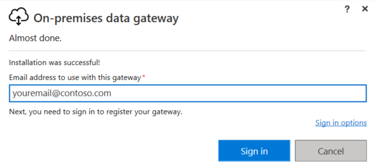
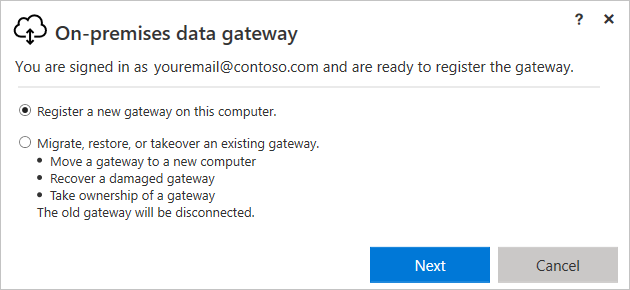
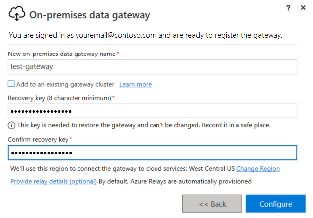
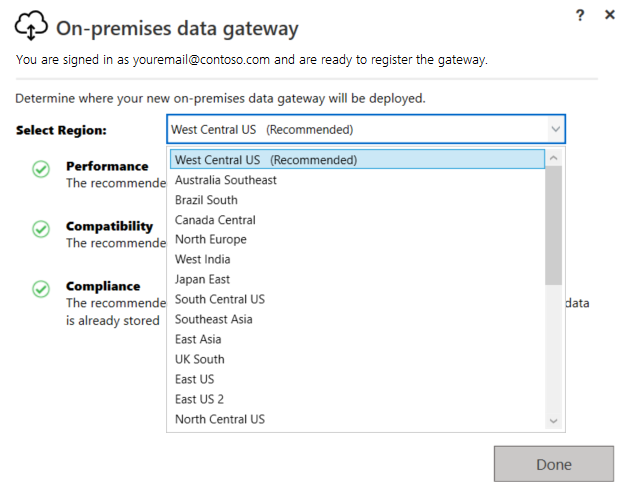
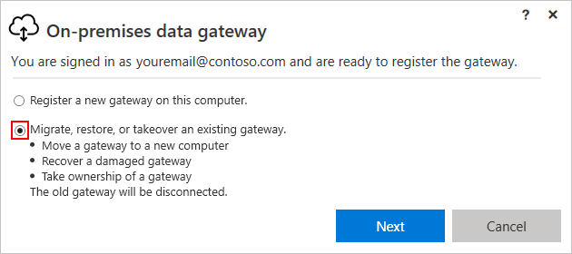
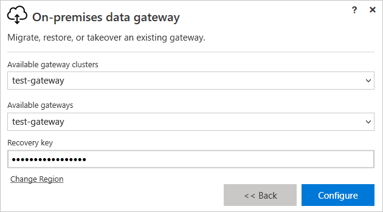

# Install on-premises data gateway for Azure Logic Apps

Before you can [connect to on-premises data sources from Azure Logic Apps](../logic-apps/logic-apps-gateway-connection.md), download and install the [on-premises data gateway](https://aka.ms/on-premises-data-gateway-installer) on a local computer. The gateway works as a bridge that provides quick data transfer and encryption between data sources on premises and your logic apps. You can use the same gateway installation with other cloud services, such as Power BI, Power Automate, Power Apps, and Azure Analysis Services. For information about how to use the gateway with these services, see these articles:

* [Microsoft Power BI on-premises data gateway](https://powerbi.microsoft.com/documentation/powerbi-gateway-onprem/)
* [Microsoft Power Apps on-premises data gateway](https://powerapps.microsoft.com/tutorials/gateway-management/)
* [Power Automate on-premises data gateway](https://flow.microsoft.com/documentation/gateway-manage/)
* [Azure Analysis Services on-premises data gateway](../analysis-services/analysis-services-gateway.md)

This article shows how to download, install, and set up your on-premises data gateway so that you can access on-premises data sources from Azure Logic Apps. You can also learn more about [how the data gateway works](#gateway-cloud-service) later in this topic. For more information about the gateway, see [What is an on-premises gateway](https://docs.microsoft.com/data-integration/gateway/service-gateway-onprem)?

## Prerequisites

* An Azure account and subscription. If you don't have an Azure account with a subscription, [sign up for a free Azure account](https://azure.microsoft.com/free/).

  * You need to use the same Azure account to install and to administer the gateway on your local computer.

    During gateway installation, you sign in with your Azure account, which links your gateway installation to your Azure account and only that account. Later, in the Azure portal, you need to use the same Azure account for creating an Azure gateway resource that registers and claims your gateway installation. In Azure Logic Apps, on-premises triggers and actions then use the gateway resource for connecting to on-premises data sources.

    > [!NOTE]
    > You can link only one gateway installation and one Azure gateway resource to each other. 
    > You can't link the same gateway installation to multiple Azure accounts or Azure gateway resources. 
    > However, an Azure account can link to multiple gateway installations and Azure gateway resources. 
    > In an on-premises trigger or action, you can select from your various Azure subscriptions, 
    > and then select an associated gateway resource.

  * You need to sign in with either a work account or school account, also known as an *organization* account, which looks like `username@contoso.com`. You can't use Azure B2B (guest) accounts or personal Microsoft accounts, such as @hotmail.com or @outlook.com.

    > [!TIP]
    > If you signed up for an Office 365 offering and didn't provide your work email address, 
    > your address might look like `username@domain.onmicrosoft.com`. Your account is stored 
    > within a tenant in an Azure Active Directory (Azure AD). In most cases, the User Principal 
    > Name (UPN) for your Azure AD account is the same as your email address.
    >
    > To use a [Visual Studio Standard subscription](https://visualstudio.microsoft.com/vs/pricing/) 
    > that's linked to a Microsoft account, first 
    > [create a tenant in Azure AD](../active-directory/develop/quickstart-create-new-tenant.md)
    > or use the default directory. Add a user with a password to the directory, and then give that 
    > user access to your Azure subscription. You can then sign in during gateway installation 
    > with this username and password.

* Here are requirements for your local computer:

  **Minimum requirements**

  * .NET Framework 4.7.2
  * 64-bit version of Windows 7 or Windows Server 2008 R2 (or later)

  **Recommended requirements**

  * 8-core CPU
  * 8 GB memory
  * 64-bit version of Windows Server 2012 R2 or later
  * Solid-state drive (SSD) storage for spooling

  > [!NOTE]
  > The gateway doesn't support Windows Server Core.

* **Related considerations**

  * You can install the on-premises data gateway only on a local computer, not a domain controller. However, you don't have to install the gateway on the same computer as your data source. You need only one gateway for all your data sources, so you don't need to install the gateway for each data source.

    > [!TIP]
    > To minimize latency, you can install the gateway as close 
    > as possible to your data source, or on the same computer, 
    > assuming that you have permissions.

  * Install the gateway on a computer that's on a wired network, connected to the internet, always turned on, and doesn't go to sleep. Otherwise, the gateway can't run, and performance might suffer over a wireless network.

  * If you plan to use Windows authentication, make sure that you install the gateway on a computer that's a member of the same Active Directory environment as your data sources.

  * The region that you select for your gateway installation is the same location that you must select when you later create the Azure gateway resource for your logic app. By default, this region is the same location as your Azure AD tenant that manages your Azure account. However, you can change the location during gateway installation.

  * The gateway has two modes: standard mode and personal mode, which applies only to Power BI. You can't have more than one gateway running in the same mode on the same computer.

  * Azure Logic Apps supports read and write operations through the gateway. However, these operations have [limits on their payload size](https://docs.microsoft.com/data-integration/gateway/service-gateway-onprem#considerations).

## Install data gateway

1. [Download and run the gateway installer on a local computer](https://aka.ms/on-premises-data-gateway-installer).

1. After the installer opens, select **Next**.

   

1. Select **On-premises data gateway (recommended)**, which is standard mode, and then select **Next**.

   

1. Review the minimum requirements, keep the default installation path, accept the terms of use, and then select **Install**.

   

1. After the gateway successfully installs, provide the email address for your Azure account, and then select **Sign in**, for example:

   

   Your gateway installation can link to only one Azure account.

1. Select **Register a new gateway on this computer** > **Next**. This step registers your gateway installation with the [gateway cloud service](#gateway-cloud-service).

   

1. Provide this information for your gateway installation:

   * A gateway name that's unique across your Azure AD tenant
   * The recovery key, which must have at least eight characters, that you want to use
   * Confirmation for your recovery key

   

   > [!IMPORTANT]
   > Save and keep your recovery key in a safe place. 
   > You need this key if you ever want to change the location, 
   > move, recover, or take over a gateway installation.

   Note the option to **Add to an existing gateway cluster**, which you select when you install additional gateways for [high-availability scenarios](#high-availability).

1. Check the region for the gateway cloud service and [Azure Service Bus](https://azure.microsoft.com/services/service-bus/) that's used by your gateway installation. By default, this region is the same location as the Azure AD tenant for your Azure account.

   

1. To accept the default region, select **Configure**. However, if the default region isn't the one that's closest to you, you can change the region.

   *Why change the region for your gateway installation?*

   For example, to reduce latency, you might change your gateway's region to the same region as your logic app. Or, you might select the region closest to your on-premises data source. Your *gateway resource in Azure* and your logic app can have different locations.

   1. Next to the current region, select **Change Region**.

      

   1. On the next page, open the **Select Region** list, select the region you want, and select **Done**.

      

1. Review the information in the final confirmation window. This example uses the same account for Logic Apps, Power BI, Power Apps, and Power Automate, so the gateway is available for all these services. When you're ready, select **Close**.

   

1. Now [create the Azure resource for your gateway installation](../logic-apps/logic-apps-gateway-connection.md).

## Check or adjust communication settings

The on-premises data gateway depends on [Azure Service Bus](../service-bus-messaging/service-bus-messaging-overview.md) for cloud connectivity and establishes the corresponding outbound connections to the gateway's associated Azure region. If your work environment requires that traffic goes through a proxy or firewall to access the internet, this restriction might prevent the on-premises data gateway from connecting to the gateway cloud service and Azure Service Bus. The gateway has several communication settings, which you can adjust. For more information, see these topics:

* [Adjust communication settings for the on-premises data gateway](https://docs.microsoft.com/data-integration/gateway/service-gateway-communication)
* [Configure proxy settings for the on-premises data gateway](https://docs.microsoft.com/data-integration/gateway/service-gateway-proxy)

## High availability support

To avoid single points of failure for on-premises data access, you can have multiple gateway installations (standard mode only) with each on a different computer, and set them up as a cluster or group. That way, if the primary gateway is unavailable, data requests are routed to the second gateway, and so on. Because you can install only one standard gateway on a computer, you must install each additional gateway that's in the cluster on a different computer. All the connectors that work with the on-premises data gateway support high availability.

* You must already have at least one gateway installation with the same Azure account as the primary gateway and the recovery key for that installation.

* Your primary gateway must be running the gateway update from November 2017 or later.

After you set up your primary gateway, when you go to install another gateway, select **Add to an existing gateway cluster**, select the primary gateway, which is the first gateway that you installed, and provide the recovery key for that gateway. For more information, see [High availability clusters for on-premises data gateway](https://docs.microsoft.com/data-integration/gateway/service-gateway-install#add-another-gateway-to-create-a-cluster).

## Change location, migrate, restore, or take over existing gateway

If you must change your gateway's location, move your gateway installation to a new computer, recover a damaged gateway, or take ownership for an existing gateway, you need the recovery key that was provided during gateway installation.

1. Run the gateway installer on the computer that has the existing gateway. If you don't have the latest gateway installer, [download the latest gateway version](https://aka.ms/on-premises-data-gateway-installer).

   > [!NOTE]
   > Before you restore the gateway on the computer that has the original gateway installation, 
   > you must first uninstall the gateway on that computer. This action disconnects the original gateway.
   > If you remove or delete a gateway cluster for any cloud service, you can't restore that cluster.

1. After the installer opens, sign in with the same Azure account that was used to install the gateway.

1. Select **Migrate, restore, or takeover an existing gateway** > **Next**, for example:

   

1. Select from the available clusters and gateways, and enter the recovery key for the selected gateway, for example:

   

1. To change the region, select **Change Region**, and select the new region.

1. When you're ready, select **Configure** so that you can finish your task.

## Tenant-level administration

To get visibility into all the on-premises data gateways in an Azure AD tenant, global administrators in that tenant can sign in to the [Power Platform Admin center](https://powerplatform.microsoft.com) as a tenant administrator and select the **Data Gateways** option. For more information, see [Tenant-level administration for the on-premises data gateway](https://docs.microsoft.com/data-integration/gateway/service-gateway-tenant-level-admin).

## Restart gateway

By default, the gateway installation on your local computer runs as a Windows service account named "On-premises data gateway service". However, the gateway installation uses the `NT SERVICE\PBIEgwService` name for its "Log On As" account credentials and has "Log on as a service" permissions.

> [!NOTE]
> Your Windows service account differs from the account used for connecting to on-premises 
> data sources and from the Azure account that you use when you sign in to cloud services.

Like any other Windows service, you can start and stop the gateway in various ways. For more information, see [Restart an on-premises data gateway](https://docs.microsoft.com/data-integration/gateway/service-gateway-restart).

## How the gateway works

Users in your organization can access on-premises data for which they already have authorized access. However, before these users can connect to your on-premises data source, you need to install and set up an on-premises data gateway. Usually, an admin is the person who installs and sets up a gateway. These actions might require Server Administrator permissions or special knowledge about your on-premises servers.

The gateway facilitates quick and secure communication behind-the-scenes-communication. This communication flows between a user in the cloud, the gateway cloud service, and your on-premises data source. The gateway cloud service encrypts and stores your data source credentials and gateway details. The service also routes queries and their results between the user, the gateway, and your on-premises data source.

The gateway works with firewalls and uses only outbound connections. All traffic originates as secure outbound traffic from the gateway agent. The gateway relays data from on-premises sources on encrypted channels through [Azure Service Bus](../service-bus-messaging/service-bus-messaging-overview.md). This service bus creates a channel between the gateway and the calling service, but doesn't store any data. All data that travels through the gateway is encrypted.

> [!NOTE]
> Depending on the cloud service, you might need to set up a data source for the gateway.

These steps describe what happens when you interact with an element that's connected to an on-premises data source:

1. The cloud service creates a query, along with the encrypted credentials for the data source. The service then sends the query and credentials to the gateway queue for processing.

1. The gateway cloud service analyzes the query and pushes the request to Azure Service Bus.

1. Azure Service Bus sends the pending requests to the gateway.

1. The gateway gets the query, decrypts the credentials, and connects to one or more data sources with those credentials.

1. The gateway sends the query to the data source for running.

1. The results are sent from the data source back to the gateway, and then to the gateway cloud service. The gateway cloud service then uses the results.

### Authentication to on-premises data sources

A stored credential is used to connect from the gateway to on-premises data sources. Regardless of the user, the gateway uses the stored credential to connect. There might be authentication exceptions for specific services, such as DirectQuery and LiveConnect for Analysis Services in Power BI.

### Azure Active Directory (Azure AD)

Microsoft cloud services use [Azure AD](../active-directory/fundamentals/active-directory-whatis.md) to authenticate users. An Azure AD tenant contains usernames and security groups. Typically, the email address that you use for sign-in is the same as the User Principal Name (UPN) for your account.

### What is my UPN?

If you're not a domain admin, you might not know your UPN. To find the UPN for your account, run the `whoami /upn` command from your workstation. Although the result looks like an email address, the result is the UPN for your local domain account.

### Synchronize an on-premises Active Directory with Azure AD

The UPN for your on-premises Active Directory accounts and Azure AD accounts must be the same. So, make sure that each on-premises Active Directory account matches your Azure AD account. The cloud services know only about accounts within Azure AD. So, you don't need to add an account to your on-premises Active Directory. If the account doesn't exist in Azure AD, you can't use that account.

Here are ways that you can match your on-premises Active Directory accounts with Azure AD.

* Add accounts manually to Azure AD.

  Create an account in the Azure portal or in the Microsoft 365 admin center. Make sure that the account name matches the UPN for the on-premises Active Directory account.

* Synchronize local accounts to your Azure AD tenant by using the Azure Active Directory Connect tool.

  The Azure AD Connect tool provides options for directory synchronization and authentication setup. These options include password hash sync, pass-through authentication, and federation. If you're not a tenant admin or a local domain admin, contact your IT admin to get Azure AD Connect set up. Azure AD Connect ensures that your Azure AD UPN matches your local Active Directory UPN. This matching helps if you're using Analysis Services live connections with Power BI or single sign-on (SSO) capabilities.

  > [!NOTE]
  > Synchronizing accounts with the Azure AD Connect tool creates new accounts in your Azure AD tenant.

## FAQ and troubleshooting

For more information, see these topics:

* [On-premises data gateway FAQ](https://docs.microsoft.com/data-integration/gateway/service-gateway-onprem-faq)
* [Troubleshoot the on-premises data gateway](https://docs.microsoft.com/data-integration/gateway/service-gateway-tshoot)
* [Monitor and optimize gateway performance](https://docs.microsoft.com/data-integration/gateway/service-gateway-performance)

## Next steps

* [Connect to on-premises data from logic apps](../logic-apps/logic-apps-gateway-connection.md)
* [Enterprise integration features](../logic-apps/logic-apps-enterprise-integration-overview.md)
* [Connectors for Azure Logic Apps](../connectors/apis-list.md)
