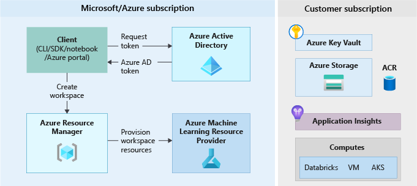
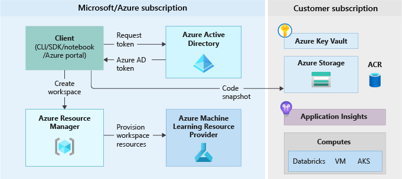
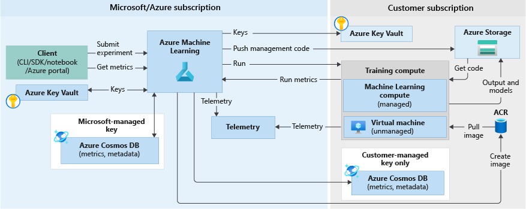
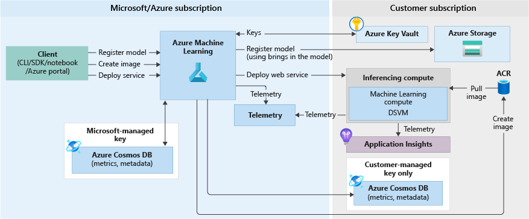

# Enterprise security for Azure Machine Learning

In this article, you'll learn about security features available for Azure Machine Learning.

When you use a cloud service, a best practice is to restrict access to only the users who need it. Start by understanding the authentication and authorization model used by the service. You might also want to restrict network access or securely join resources in your on-premises network with the cloud. Data encryption is also vital, both at rest and while data moves between services. Finally, you need to be able to monitor the service and produce an audit log of all activity.

> [!NOTE]
> The information in this article works with the Azure Machine Learning Python SDK version 1.0.83.1 or higher.

## Authentication

Multi-factor authentication is supported if Azure Active Directory (Azure AD) is configured to use it. Here's the authentication process:

1. The client signs in to Azure AD and gets an Azure Resource Manager token.  Users and service principals are fully supported.
1. The client presents the token to Azure Resource Manager and to all Azure Machine Learning.
1. The Machine Learning service provides a Machine Learning service token to the user compute target (for example, Machine Learning Compute). This token is used by the user compute target to call back into the Machine Learning service after the run is complete. Scope is limited to the workspace.

For more information, see [Set up authentication for Azure Machine Learning resources and workflows](how-to-setup-authentication.md). This article provides information and examples on authentication, including using service principals and automated workflows.

### Authentication for web service deployment

Azure Machine Learning supports two forms of authentication for web services: key and token. Each web service can enable only one form of authentication at a time.

|Authentication method|Description|Azure Container Instances|AKS|
|---|---|---|---|
|Key|Keys are static and don't need to be refreshed. Keys can be regenerated manually.|Disabled by default| Enabled by default|
|Token|Tokens expire after a specified time period and need to be refreshed.| Not available| Disabled by default |

For code examples, see the [web-service authentication section](how-to-setup-authentication.md#web-service-authentication).

## Authorization

You can create multiple workspaces, and each workspace can be shared by multiple people. When you share a workspace, you can control access to it by assigning these roles to users:

* Owner
* Contributor
* Reader

The following table lists some of the major Azure Machine Learning operations and the roles that can perform them:

| Azure Machine Learning operation | Owner | Contributor | Reader |
| ---- |:----:|:----:|:----:|
| Create workspace | ✓ | ✓ | |
| Share workspace | ✓ | |  |
| Upgrade workspace to Enterprise edition | ✓ | |
| Create compute target | ✓ | ✓ | |
| Attach compute target | ✓ | ✓ | |
| Attach data stores | ✓ | ✓ | |
| Run experiment | ✓ | ✓ | |
| View runs/metrics | ✓ | ✓ | ✓ |
| Register model | ✓ | ✓ | |
| Create image | ✓ | ✓ | |
| Deploy web service | ✓ | ✓ | |
| View models/images | ✓ | ✓ | ✓ |
| Call web service | ✓ | ✓ | ✓ |

If the built-in roles don't meet your needs, you can create custom roles. Custom roles are supported to control all operations inside a workspace, such as creating a compute, submitting a run, registering a datastore, or deploying a model. Custom roles can have read, write, or delete permissions on the various resources of a workspace, such as clusters, datastores, models and endpoints. You can make the role available at a specific workspace level, a specific resource-group level, or a specific subscription level. For more information, see [Manage users and roles in an Azure Machine Learning workspace](how-to-assign-roles.md).

> [!WARNING]
> Azure Machine Learning is supported with Azure Active Directory business-to-business collaboration, but is not currently supported with Azure Active Directory business-to-consumer collaboration.

### Securing compute targets and data

Owners and contributors can use all compute targets and data stores that are attached to the workspace.  

Each workspace also has an associated system-assigned managed identity that has the same name as the workspace. The managed identity has the following permissions on attached resources used in the workspace.

For more information on managed identities, see [Managed identities for Azure resources](https://docs.microsoft.com/azure/active-directory/managed-identities-azure-resources/overview).

| Resource | Permissions |
| ----- | ----- |
| Workspace | Contributor |
| Storage account | Storage Blob Data Contributor |
| Key vault | Access to all keys, secrets, certificates |
| Azure Container Registry | Contributor |
| Resource group that contains the workspace | Contributor |
| Resource group that contains the key vault (if different from the one that contains the workspace) | Contributor |

We don't recommend that admins revoke the access of the managed identity to the resources mentioned in the preceding table. You can restore access by using the resync keys operation.

Azure Machine Learning creates an additional application (the name starts with `aml-` or `Microsoft-AzureML-Support-App-`) with contributor-level access in your subscription for every workspace region. For example, if you have one workspace in East US and one in North Europe in the same subscription, you'll see two of these applications. These applications enable Azure Machine Learning to help you manage compute resources.

## Network security

Azure Machine Learning relies on other Azure services for compute resources. Compute resources (compute targets) are used to train and deploy models. You can create these compute targets in a virtual network. For example, you can use Azure Data Science Virtual Machine to train a model and then deploy the model to AKS.  

For more information, see [Virtual network isolation and privacy overview](how-to-network-security-overview.md).

You can also enable Azure Private Link for your workspace. Private Link allows you to restrict communications to your workspace from an Azure Virtual Network. For more information, see [How to configure Private Link](how-to-configure-private-link.md).

## Data encryption

> [!IMPORTANT]
> For production grade encryption during __training__, Microsoft recommends using Azure Machine Learning compute cluster. For production grade encryption during __inference__, Microsoft recommends using Azure Kubernetes Service.
>
> Azure Machine Learning compute instance is a dev/test environment. When using it, we recommend that you store your files, such as notebooks and scripts, in a file share. Your data should be stored in a datastore.

### Encryption at rest

> [!IMPORTANT]
> If your workspace contains sensitive data we recommend setting the [hbi_workspace flag](https://docs.microsoft.com/python/api/azureml-core/azureml.core.workspace(class)?view=azure-ml-py#&preserve-view=truecreate-name--auth-none--subscription-id-none--resource-group-none--location-none--create-resource-group-true--sku--basic---friendly-name-none--storage-account-none--key-vault-none--app-insights-none--container-registry-none--cmk-keyvault-none--resource-cmk-uri-none--hbi-workspace-false--default-cpu-compute-target-none--default-gpu-compute-target-none--exist-ok-false--show-output-true-) while creating your workspace. The `hbi_workspace` flag can only be set when a workspace is created. It cannot be changed for an existing workspace.

The `hbi_workspace` flag controls the amount of [data Microsoft collects for diagnostic purposes](#microsoft-collected-data) and enables [additional encryption in Microsoft-managed environments](../security/fundamentals/encryption-atrest.md). In addition, it enables the following actions:

* Starts encrypting the local scratch disk in your Azure Machine Learning compute cluster provided you have not created any previous clusters in that subscription. Else, you need to raise a support ticket to enable encryption of the scratch disk of your compute clusters 
* Cleans up your local scratch disk between runs
* Securely passes credentials for your storage account, container registry, and SSH account from the execution layer to your compute clusters using your key vault
* Enables IP filtering to ensure the underlying batch pools cannot be called by any external services other than AzureMachineLearningService

#### Azure Blob storage

Azure Machine Learning stores snapshots, output, and logs in the Azure Blob storage account that's tied to the Azure Machine Learning workspace and your subscription. All the data stored in Azure Blob storage is encrypted at rest with Microsoft-managed keys.

For information on how to use your own keys for data stored in Azure Blob storage, see [Azure Storage encryption with customer-managed keys in Azure Key Vault](../storage/common/storage-encryption-keys-portal.md).

Training data is typically also stored in Azure Blob storage so that it's accessible to training compute targets. This storage isn't managed by Azure Machine Learning but mounted to compute targets as a remote file system.

If you need to __rotate or revoke__ your key, you can do so at any time. When rotating a key, the storage account will start using the new key (latest version) to encrypt data at rest. When revoking (disabling) a key, the storage account takes care of failing requests. It usually takes an hour for the rotation or revocation to be effective.

For information on regenerating the access keys, see [Regenerate storage access keys](how-to-change-storage-access-key.md).

#### Azure Cosmos DB

Azure Machine Learning stores metrics and metadata in an Azure Cosmos DB instance. This instance is associated with a Microsoft subscription managed by Azure Machine Learning. All the data stored in Azure Cosmos DB is encrypted at rest with Microsoft-managed keys.

To use your own (customer-managed) keys to encrypt the Azure Cosmos DB instance, you can create a dedicated Cosmos DB instance for use with your workspace. We recommend this approach if you want to store your data, such as run history information, outside of the multi-tenant Cosmos DB instance hosted in our Microsoft subscription. 

To enable provisioning a Cosmos DB instance in your subscription with customer-managed keys, perform the following actions:

* Register the Microsoft.MachineLearning and Microsoft.DocumentDB resource providers in your subscription, if not done already.

* Use the following parameters when creating the Azure Machine Learning workspace. Both parameters are mandatory and supported in SDK, CLI, REST APIs, and Resource Manager templates.

    * `resource_cmk_uri`: This parameter is the full resource URI of the customer managed key in your key vault, including the [version information for the key](../key-vault/about-keys-secrets-and-certificates.md#objects-identifiers-and-versioning). 

    * `cmk_keyvault`: This parameter is the resource ID of the key vault in your subscription. This key vault needs to be in the same region and subscription that you will use for the Azure Machine Learning workspace. 
    
        > [!NOTE]
        > This key vault instance can be different than the key vault that is created by Azure Machine Learning when you provision the workspace. If you want to use the same key vault instance for the workspace, pass the same key vault while provisioning the workspace by using the [key_vault parameter](https://docs.microsoft.com/python/api/azureml-core/azureml.core.workspace(class)?view=azure-ml-py#&preserve-view=truecreate-name--auth-none--subscription-id-none--resource-group-none--location-none--create-resource-group-true--sku--basic---friendly-name-none--storage-account-none--key-vault-none--app-insights-none--container-registry-none--cmk-keyvault-none--resource-cmk-uri-none--hbi-workspace-false--default-cpu-compute-target-none--default-gpu-compute-target-none--exist-ok-false--show-output-true-). 

This Cosmos DB instance is created in a Microsoft-managed resource group in your subscription. The managed resource group is named in the format `<AML Workspace Resource Group Name><GUID>`.

> [!IMPORTANT]
> * If you need to delete this Cosmos DB instance, you must delete the Azure Machine Learning workspace that uses it. 
> * The default [__Request Units__](../cosmos-db/request-units.md) for this Cosmos DB account is set at __8000__. Changing this value is unsupported. 

If you need to __rotate or revoke__ your key, you can do so at any time. When rotating a key, Cosmos DB will start using the new key (latest version) to encrypt data at rest. When revoking (disabling) a key, Cosmos DB takes care of failing requests. It usually takes an hour for the rotation or revocation to be effective.

For more information on customer-managed keys with Cosmos DB, see [Configure customer-managed keys for your Azure Cosmos DB account](../cosmos-db/how-to-setup-cmk.md).

#### Azure Container Registry

All container images in your registry (Azure Container Registry) are encrypted at rest. Azure automatically encrypts an image before storing it and decrypts it when Azure Machine Learning pulls the image.

To use your own (customer-managed) keys to encrypt your Azure Container Registry, you need to create your own ACR and attach it while provisioning the workspace or encrypt the default instance that gets created at the time of workspace provisioning.

> [!IMPORTANT]
> Azure Machine Learning requires the admin account be enabled on your Azure Container Registry. By default, this setting is disabled when you create a container registry. For information on enabling the admin account, see [Admin account](/azure/container-registry/container-registry-authentication#admin-account).
>
> Once an Azure Container Registry has been created for a workspace, do not delete it. Doing so will break your Azure Machine Learning workspace.

For an example of creating a workspace using an existing Azure Container Registry, see the following articles:

* [Create a workspace for Azure Machine Learning with Azure CLI](how-to-manage-workspace-cli.md).
* [Use an Azure Resource Manager template to create a workspace for Azure Machine Learning](how-to-create-workspace-template.md)

#### Azure Container Instance

You may encrypt a deployed Azure Container Instance (ACI) resource using customer-managed keys. The customer-managed key used for ACI can be stored in the Azure Key Vault for your workspace. For information on generating a key, see [Encrypt data with a customer-managed key](../container-instances/container-instances-encrypt-data.md#generate-a-new-key).

To use the key when deploying a model to Azure Container Instance, create a new deployment configuration using `AciWebservice.deploy_configuration()`. Provide the key information using the following parameters:

* `cmk_vault_base_url`: The URL of the key vault that contains the key.
* `cmk_key_name`: The name of the key.
* `cmk_key_version`: The version of the key.

For more information on creating and using a deployment configuration, see the following articles:

* [AciWebservice.deploy_configuration()](https://docs.microsoft.com/python/api/azureml-core/azureml.core.webservice.aci.aciwebservice?view=azure-ml-py#&preserve-view=truedeploy-configuration-cpu-cores-none--memory-gb-none--tags-none--properties-none--description-none--location-none--auth-enabled-none--ssl-enabled-none--enable-app-insights-none--ssl-cert-pem-file-none--ssl-key-pem-file-none--ssl-cname-none--dns-name-label-none--primary-key-none--secondary-key-none--collect-model-data-none--cmk-vault-base-url-none--cmk-key-name-none--cmk-key-version-none-) reference
* [Where and how to deploy](how-to-deploy-and-where.md)
* [Deploy a model to Azure Container Instances](how-to-deploy-azure-container-instance.md)

For more information on using a customer-managed key with ACI, see [Encrypt data with a customer-managed key](../container-instances/container-instances-encrypt-data.md#encrypt-data-with-a-customer-managed-key).

#### Azure Kubernetes Service

You may encrypt a deployed Azure Kubernetes Service resource using customer-managed keys at any time. For more information, see [Bring your own keys with Azure Kubernetes Service](../aks/azure-disk-customer-managed-keys.md). 

This process allows you to encrypt both the Data and the OS Disk of the deployed virtual machines in the Kubernetes cluster.

> [!IMPORTANT]
> This process only works with AKS K8s version 1.17 or higher. Azure Machine Learning added support for AKS 1.17 on Jan 13, 2020.

#### Machine Learning Compute

The OS disk for each compute node stored in Azure Storage is encrypted with Microsoft-managed keys in Azure Machine Learning storage accounts. This compute target is ephemeral, and clusters are typically scaled down when no runs are queued. The underlying virtual machine is de-provisioned, and the OS disk is deleted. Azure Disk Encryption isn't supported for the OS disk.

Each virtual machine also has a local temporary disk for OS operations. If you want, you can use the disk to stage training data. The disk is encrypted by default for workspaces with the `hbi_workspace` parameter set to `TRUE`. This environment is short-lived only for the duration of your run, and encryption support is limited to system-managed keys only.

#### Azure Databricks

Azure Databricks can be used in Azure Machine Learning pipelines. By default, the Databricks File System (DBFS) used by Azure Databricks is encrypted using a Microsoft-managed key. To configure Azure Databricks to use customer-managed keys, see [Configure customer-managed keys on default (root) DBFS](/azure/databricks/security/customer-managed-keys-dbfs).

### Encryption in transit

Azure Machine Learning uses TLS to secure internal communication between various Azure Machine Learning microservices. All Azure Storage access also occurs over a secure channel.

To secure external calls made to the scoring endpoint, Azure Machine Learning uses TLS. For more information, see [Use TLS to secure a web service through Azure Machine Learning](https://docs.microsoft.com/azure/machine-learning/how-to-secure-web-service).

### Using Azure Key Vault

Azure Machine Learning uses the Azure Key Vault instance associated with the workspace to store credentials of various kinds:

* The associated storage account connection string
* Passwords to Azure Container Repository instances
* Connection strings to data stores

SSH passwords and keys to compute targets like Azure HDInsight and VMs are stored in a separate key vault that's associated with the Microsoft subscription. Azure Machine Learning doesn't store any passwords or keys provided by users. Instead, it generates, authorizes, and stores its own SSH keys to connect to VMs and HDInsight to run the experiments.

Each workspace has an associated system-assigned managed identity that has the same name as the workspace. This managed identity has access to all keys, secrets, and certificates in the key vault.

## Data collection and handling

### Microsoft collected data

Microsoft may collect non-user identifying information like resource names (for example the dataset name, or the machine learning experiment name), or job environment variables for diagnostic purposes. All such data is stored using Microsoft-managed keys in storage hosted in Microsoft owned subscriptions and follows [Microsoft's standard Privacy policy and data handling standards](https://privacy.microsoft.com/privacystatement).

Microsoft also recommends not storing sensitive information (such as account key secrets) in environment variables. Environment variables are logged, encrypted, and stored by us. Similarly when naming [run_id](https://docs.microsoft.com/python/api/azureml-core/azureml.core.run%28class%29?view=azure-ml-py&preserve-view=true), avoid including sensitive information such as user names or secret project names. This information may appear in telemetry logs accessible to Microsoft Support engineers.

You may opt out from diagnostic data being collected by setting the `hbi_workspace` parameter to `TRUE` while provisioning the workspace. This functionality is supported when using the AzureML Python SDK, CLI, REST APIs, or Azure Resource Manager templates.

### Microsoft-generated data

When using services such as Automated Machine Learning, Microsoft may generate a transient, pre-processed data for training multiple models. This data is stored in a datastore in your workspace, which allows you to enforce access controls and encryption appropriately.

You may also want to encrypt [diagnostic information logged from your deployed endpoint](how-to-enable-app-insights.md) into your Azure Application Insights instance.

## Monitoring

### Metrics

You can use Azure Monitor metrics to view and monitor metrics for your Azure Machine Learning workspace. In the [Azure portal](https://portal.azure.com), select your workspace and then select **Metrics**:

The metrics include information on runs, deployments, and registrations.

For more information, see [Metrics in Azure Monitor](/azure/azure-monitor/platform/data-platform-metrics).

### Activity log

You can view the activity log of a workspace to see various operations that are performed on the workspace. The log includes basic information like the operation name, event initiator, and timestamp.

This screenshot shows the activity log of a workspace:

Scoring request details are stored in Application Insights. Application Insights is created in your subscription when you create a workspace. Logged information includes fields such as:

* HTTPMethod
* UserAgent
* ComputeType
* RequestUrl
* StatusCode
* RequestId
* Duration

> [!IMPORTANT]
> Some actions in the Azure Machine Learning workspace don't log information to the activity log. For example, the start of a training run and the registration of a model aren't logged.
>
> Some of these actions appear in the **Activities** area of your workspace, but these notifications don't indicate who initiated the activity.

## Data flow diagrams

### Create workspace

The following diagram shows the create workspace workflow.

* You sign in to Azure AD from one of the supported Azure Machine Learning clients (Azure CLI, Python SDK, Azure portal) and request the appropriate Azure Resource Manager token.
* You call Azure Resource Manager to create the workspace. 
* Azure Resource Manager contacts the Azure Machine Learning resource provider to provision the workspace.

Additional resources are created in the user's subscription during workspace creation:

* Key Vault (to store secrets)
* An Azure storage account (including blob and file share)
* Azure Container Registry (to store Docker images for inference/scoring and experimentation)
* Application Insights (to store telemetry)

The user can also provision other compute targets that are attached to a workspace (like Azure Kubernetes Service or VMs) as needed.

### Save source code (training scripts)

The following diagram shows the code snapshot workflow.

Associated with an Azure Machine Learning workspace are directories (experiments) that contain the source code (training scripts). These scripts are stored on your local machine and in the cloud (in the Azure Blob storage for your subscription). The code snapshots are used for execution or inspection for historical auditing.

### Training

The following diagram shows the training workflow.

* Azure Machine Learning is called with the snapshot ID for the code snapshot saved in the previous section.
* Azure Machine Learning creates a run ID (optional) and a Machine Learning service token, which is later used by compute targets like Machine Learning Compute/VMs to communicate with the Machine Learning service.
* You can choose either a managed compute target (like Machine Learning Compute) or an unmanaged compute target (like VMs) to run training jobs. Here are the data flows for both scenarios:
   * VMs/HDInsight, accessed by SSH credentials in a key vault in the Microsoft subscription. Azure Machine Learning runs management code on the compute target that:

   1. Prepares the environment. (Docker is an option for VMs and local computers. See the following steps for Machine Learning Compute to understand how running experiments on Docker containers works.)
   1. Downloads the code.
   1. Sets up environment variables and configurations.
   1. Runs user scripts (the code snapshot mentioned in the previous section).

   * Machine Learning Compute, accessed through a workspace-managed identity.
Because Machine Learning Compute is a managed compute target (that is, it's managed by Microsoft) it runs under your Microsoft subscription.

   1. Remote Docker construction is kicked off, if needed.
   1. Management code is written to the user's Azure Files share.
   1. The container is started with an initial command. That is, management code as described in the previous step.

#### Querying runs and metrics

In the flow diagram below, this step occurs when the training compute target writes the run metrics back to Azure Machine Learning from storage in the Cosmos DB database. Clients can call Azure Machine Learning. Machine Learning will in turn pull metrics from the Cosmos DB database and return them back to the client.

### Creating web services

The following diagram shows the inference workflow. Inference, or model scoring, is the phase in which the deployed model is used for prediction, most commonly on production data.

Here are the details:

* The user registers a model by using a client like the Azure Machine Learning SDK.
* The user creates an image by using a model, a score file, and other model dependencies.
* The Docker image is created and stored in Azure Container Registry.
* The web service is deployed to the compute target (Container Instances/AKS) using the image created in the previous step.
* Scoring request details are stored in Application Insights, which is in the user's subscription.
* Telemetry is also pushed to the Microsoft/Azure subscription.

## Next steps

* [Secure Azure Machine Learning web services with TLS](how-to-secure-web-service.md)
* [Consume a Machine Learning model deployed as a web service](how-to-consume-web-service.md)
* [Use Azure Machine Learning with Azure Firewall](how-to-access-azureml-behind-firewall.md)
* [Use Azure Machine Learning with Azure Virtual Network](how-to-network-security-overview.md)
* [Best practices for building recommendation systems](https://github.com/Microsoft/Recommenders)
* [Build a real-time recommendation API on Azure](https://docs.microsoft.com/azure/architecture/reference-architectures/ai/real-time-recommendation)
