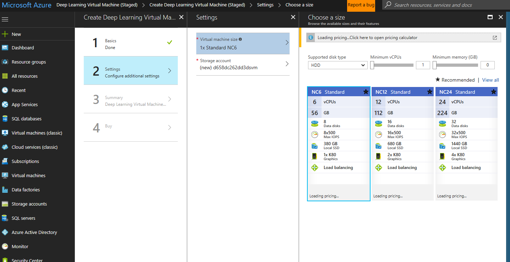

# Provision a Deep Learning Virtual Machine on Azure 

The Deep Learning Virtual Machine (DLVM) is a specially configured variant of the popular [Data Science Virtual Machine](http://aka.ms/dsvm) (DSVM) to make it easier to use GPU-based VM instances for rapidly training deep learning models. It is supported with either Windows 2016, or the Ubuntu DSVM as the base. The DLVM shares the same core VM images and hence all the rich toolset that is available on DSVM. 

The DLVM contains several tools for AI including GPU editions of popular deep learning frameworks like Microsoft Cognitive Toolkit, TensorFlow, Keras, Caffe2, Chainer; tools to acquire and pre-process image, textual data, tools for data science modeling and development activities such as Microsoft R Server Developer Edition, Anaconda Python, Jupyter notebooks for Python and R, IDEs for Python and R, SQL databases and many other data science and ML tools. 

## Create your Deep Learning Virtual Machine
Here are the steps to create an instance of the Deep Learning Virtual Machine: 

1. Navigate to the virtual machine listing on [Azure portal](https://portal.azure.com/#create/microsoft-ads.dsvm-deep-learningtoolkit
).
2. Select the **Create** button at the bottom to be taken into a wizard.
3. The wizard used to create the DLVM requires **inputs** for each of the **four steps** enumerated on the right of this figure. Here are the inputs needed to configure each of these steps:
   
   1. **Basics**
      
      1. **Name**: Name of your data science server you are creating.
      2. **Select OS type for the Deep Learning VM**: Choose Windows or Linux (for Windows 2016 and Ubuntu Linux base DSVM)
      2. **User Name**: Admin account login id.
      3. **Password**: Admin account password.
      4. **Subscription**: If you have more than one subscription, select the one on which the machine is to be created and billed.
      5. **Resource Group**: You can create a new one or use an **empty** existing Azure resource group in your subscription.
      6. **Location**: Select the data center that is most appropriate. Usually it is the data center that has most of your data or is closest to your physical location for fastest network access. 
      
> [!NOTE]
> Since DLVM is provisioned on Azure NC-Series GPU VM instances, you must choose one of the locations in Azure that has GPUs. Currently the locations that have GPU VMs are: **East US, North Central US, South Central US, West US 2, North Europe, West Europe**. For the latest list, check the [Azure Products by Region Page](https://azure.microsoft.com/en-us/regions/services/) and look for **NC-Series** under **Compute**. 

   2. **Settings**: Select one of the NC-Series GPU virtual machine size that meets your functional requirement and cost constraints. Create a storage account for your VM.  
   
   3. **Summary**: Verify that all information you entered is correct.
   5. **Buy**: Click **Buy** to start the provisioning. A link is provided to the terms of the transaction. The VM does not have any additional charges beyond the compute for the server size you chose in the **Size** step. 

> [!NOTE]
> The provisioning should take about 10-20 minutes. The status of the provisioning is displayed on the Azure portal.
> 

## How to access the Deep Learning Virtual Machine

### Windows Edition
Once the VM is created, you can remote desktop into it using the Admin account credentials that you configured in the preceding **Basics** section. 

### Linux Edition

After the VM is created, you can sign in to it by using SSH. Use the account credentials that you created in the **Basics** section of step 3 for the text shell interface. On aWindows client, you can download an SSH client tool like [Putty](http://www.putty.org). If you prefer a graphical desktop (X Windows System), you can use X11 forwarding on Putty or install the X2Go client.

> [!NOTE]
> The X2Go client performed better than X11 forwarding in our testing. We recommend using the X2Go client for a graphical desktop interface.
> 
> 

#### Installing and configuring X2Go client
The Linux DLVM is already provisioned with X2Go server and ready to accept client connections. To connect to the Linux VM graphical desktop, complete the following procedure on your client:

1. Download and install the X2Go client for your client platform from [X2Go](http://wiki.x2go.org/doku.php/doc:installation:x2goclient).    
2. Run the X2Go client, and select **New Session**. It opens a configuration window with multiple tabs. Enter the following configuration parameters:
   * **Session tab**:
     * **Host**: The host name or IP address of your Linux Data Science VM.
     * **Login**: User name on the Linux VM.
     * **SSH Port**: Leave it at 22, the default value.
     * **Session Type**: Change the value to **XFCE**. Currently the Linux DSVM only supports XFCE desktop.
   * **Media tab**: You can turn off sound support and client printing if you don't need to use them.
   * **Shared folders**: If you want directories from your client machines mounted on the Linux VM, add the client machine directories that you want to share with the VM on this tab.

After you sign in to the VM by using either the SSH client or XFCE graphical desktop through the X2Go client, you are ready to start using the tools that are installed and configured on the VM. On XFCE, you can see applications menu shortcuts and desktop icons for many of the tools.

Once your VM is created and provisioned, you are ready to start using the tools that are installed and configured on it. There are start menu tiles and desktop icons for many of the tools. 
