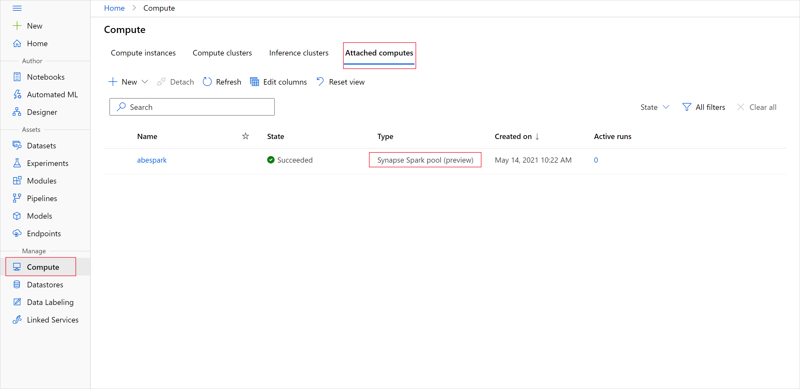
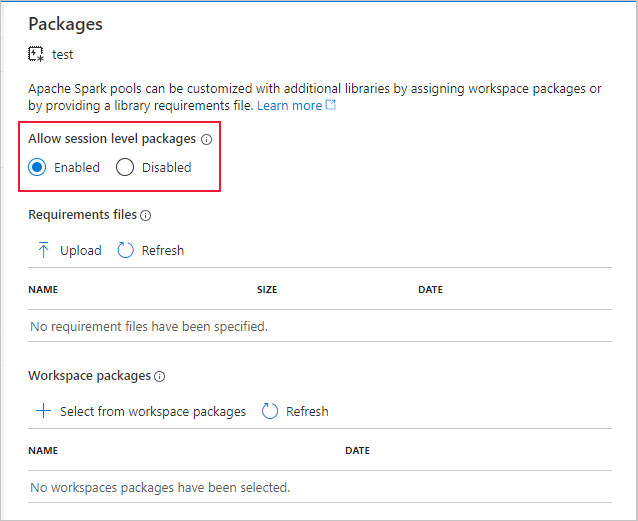

# Data wrangling with Apache Spark pools (preview) 

In this article, you learn how to perform data wrangling tasks interactively within a dedicated Synapse session, powered by [Azure Synapse Analytics](../synapse-analytics/overview-what-is.md), in a Jupyter notebook using the [Azure Machine Learning Python SDK](/python/api/overview/azure/ml/). 

If you prefer to use Azure Machine Learning pipelines, see [How to use Apache Spark (powered by Azure Synapse Analytics) in your machine learning pipeline (preview)](how-to-use-synapsesparkstep.md).

For guidance on how to use Azure Synapse Analytics with a Synapse workspace, see the [Azure Synapse Analytics get started series](../synapse-analytics/get-started.md).

>[!IMPORTANT]
> The Azure Machine Learning and Azure Synapse Analytics integration is in preview. The capabilities presented in this article employ the `azureml-synapse` package which contains [experimental](/python/api/overview/azure/ml/#stable-vs-experimental) preview features that may change at any time.

## Azure Machine Learning and Azure Synapse Analytics integration

The Azure Synapse Analytics integration with Azure Machine Learning (preview) allows you to attach an Apache Spark pool backed by Azure Synapse for interactive data exploration and preparation. With this integration, you can have a dedicated compute for data wrangling at scale, all within the same Python notebook you use for training your machine learning models.

## Prerequisites

* The [Azure Machine Learning Python SDK installed](/python/api/overview/azure/ml/install). 

* [Create an Azure Machine Learning workspace](how-to-manage-workspace.md?tabs=python).

* [Create an Azure Synapse Analytics workspace in Azure portal](../synapse-analytics/quickstart-create-workspace.md).

* [Create Apache Spark pool using Azure portal, web tools, or Synapse Studio](../synapse-analytics/quickstart-create-apache-spark-pool-portal.md).

* [Configure your development environment](how-to-configure-environment.md) to install the Azure Machine Learning SDK, or use an [Azure Machine Learning compute instance](concept-compute-instance.md#create) with the SDK already installed. 

* Install the `azureml-synapse` package (preview) with the following code:

  ```python
  pip install azureml-synapse
  ```

* Link your Azure Machine Learning workspace and Azure Synapse Analytics workspace with the [Azure Machine Learning Python SDK](how-to-link-synapse-ml-workspaces.md#link-sdk) or via the [Azure Machine Learning studio](how-to-link-synapse-ml-workspaces.md#link-studio)

* [Attach a Synapse Spark pool](how-to-link-synapse-ml-workspaces.md#attach-synapse-spark-pool-as-a-compute) as a compute target.

## Launch Synapse Spark pool for data wrangling tasks

To begin data preparation with the Apache Spark pool, specify the attached Spark Synapse compute name. This name can be found via the Azure Machine Learning studio under the **Attached computes** tab. 



> [!IMPORTANT]
> To continue use of the Apache Spark pool you must indicate which compute resource to use throughout your data wrangling tasks with `%synapse` for single lines of code and `%%synapse` for multiple lines. [Learn more about the %synapse magic command](/python/api/azureml-synapse/azureml.synapse.magics.remotesynapsemagics(class)).

```python
%synapse start -c SynapseSparkPoolAlias
```

After the session starts, you can check the session's metadata.

```python
%synapse meta
```

You can specify an [Azure Machine Learning environment](concept-environments.md) to use during your Apache Spark session. Only Conda dependencies specified in the environment will take effect. Docker image is not supported.

>[!WARNING]
>  Python dependencies specified in environment Conda dependencies are not supported in Apache Spark pools. Currently, only fixed Python versions are supported. 
> Check your Python version by including  `sys.version_info` in your script.

The following code, creates the environment, `myenv`, which installs `azureml-core` version 1.20.0 and `numpy` version 1.17.0 before the session begins. You can then include this environment in your Apache Spark session `start` statement.

```python

from azureml.core import Workspace, Environment

# creates environment with numpy and azureml-core dependencies
ws = Workspace.from_config()
env = Environment(name="myenv")
env.python.conda_dependencies.add_pip_package("azureml-core==1.20.0")
env.python.conda_dependencies.add_conda_package("numpy==1.17.0")
env.register(workspace=ws)
```

To begin data preparation with the Apache Spark pool and your custom environment, specify the Apache Spark pool name and which environment to use during the Apache Spark session. Furthermore, you can provide your subscription ID, the machine learning workspace resource group, and the name of the machine learning workspace.

>[!IMPORTANT]
> Make sure to [Allow session level packages](../synapse-analytics/spark/apache-spark-manage-python-packages.md#session-scoped-packages) is enabled in the linked Synapse workspace.
>
>

```python
%synapse start -c SynapseSparkPoolAlias -e myenv -s AzureMLworkspaceSubscriptionID -r AzureMLworkspaceResourceGroupName -w AzureMLworkspaceName
```

## Load data from storage

Once your Apache Spark session starts, read in the data that you wish to prepare. Data loading is supported for Azure Blob storage and Azure Data Lake Storage Generations 1 and 2.

There are two ways to load data from these storage services: 

* Directly load data from storage using its Hadoop Distributed Files System (HDFS) path.

* Read in data from an existing [Azure Machine Learning dataset](how-to-create-register-datasets.md).

To access these storage services, you need **Storage Blob Data Reader** permissions. If you plan to write data back to these storage services, you need **Storage Blob Data Contributor** permissions. [Learn more about storage permissions and roles](../storage/blobs/assign-azure-role-data-access.md).

### Load data with Hadoop Distributed Files System (HDFS) path

To load and read data in from storage with the corresponding HDFS path, you need to have your data access authentication credentials readily available. These credentials differ depending on your storage type.  

The following code demonstrates how to read data from an **Azure Blob storage** into a Spark dataframe with either your shared access signature (SAS) token or access key. 

```python
%%synapse

# setup access key or SAS token
sc._jsc.hadoopConfiguration().set("fs.azure.account.key.<storage account name>.blob.core.windows.net", "<access key>")
sc._jsc.hadoopConfiguration().set("fs.azure.sas.<container name>.<storage account name>.blob.core.windows.net", "<sas token>")

# read from blob 
df = spark.read.option("header", "true").csv("wasbs://demo@dprepdata.blob.core.windows.net/Titanic.csv")
```

The following code demonstrates how to read data in from **Azure Data Lake Storage Generation 1 (ADLS Gen 1)** with your service principal credentials. 

```python
%%synapse

# setup service principal which has access of the data
sc._jsc.hadoopConfiguration().set("fs.adl.account.<storage account name>.oauth2.access.token.provider.type","ClientCredential")

sc._jsc.hadoopConfiguration().set("fs.adl.account.<storage account name>.oauth2.client.id", "<client id>")

sc._jsc.hadoopConfiguration().set("fs.adl.account.<storage account name>.oauth2.credential", "<client secret>")

sc._jsc.hadoopConfiguration().set("fs.adl.account.<storage account name>.oauth2.refresh.url",
"https://login.microsoftonline.com/<tenant id>/oauth2/token")

df = spark.read.csv("adl://<storage account name>.azuredatalakestore.net/<path>")

```

The following code demonstrates how to read data in from **Azure Data Lake Storage Generation 2 (ADLS Gen 2)** with your service principal credentials. 

```python
%%synapse

# setup service principal which has access of the data
sc._jsc.hadoopConfiguration().set("fs.azure.account.auth.type.<storage account name>.dfs.core.windows.net","OAuth")
sc._jsc.hadoopConfiguration().set("fs.azure.account.oauth.provider.type.<storage account name>.dfs.core.windows.net", "org.apache.hadoop.fs.azurebfs.oauth2.ClientCredsTokenProvider")
sc._jsc.hadoopConfiguration().set("fs.azure.account.oauth2.client.id.<storage account name>.dfs.core.windows.net", "<client id>")
sc._jsc.hadoopConfiguration().set("fs.azure.account.oauth2.client.secret.<storage account name>.dfs.core.windows.net", "<client secret>")
sc._jsc.hadoopConfiguration().set("fs.azure.account.oauth2.client.endpoint.<storage account name>.dfs.core.windows.net",
"https://login.microsoftonline.com/<tenant id>/oauth2/token")

df = spark.read.csv("abfss://<container name>@<storage account>.dfs.core.windows.net/<path>")

```

### Read in data from registered datasets

You can also get an existing registered dataset in your workspace and perform data preparation on it by converting it into a spark dataframe.

The following example authenticates to the workspace, gets a registered TabularDataset, `blob_dset`, that references files in blob storage, and converts it into a spark dataframe. When you convert your datasets into a spark dataframe, you can leverage `pyspark` data exploration and preparation libraries.  

``` python
%%synapse

from azureml.core import Workspace, Dataset

subscription_id = "<enter your subscription ID>"
resource_group = "<enter your resource group>"
workspace_name = "<enter your workspace name>"

ws = Workspace(workspace_name = workspace_name,
               subscription_id = subscription_id,
               resource_group = resource_group)

dset = Dataset.get_by_name(ws, "blob_dset")
spark_df = dset.to_spark_dataframe()
```

## Perform data wrangling tasks

After you've retrieved and explored your data, you can perform data wrangling tasks.

The following code, expands upon the HDFS example in the previous section and filters the data in spark dataframe, `df`, based on the **Survivor** column and groups that list by **Age**

```python
%%synapse

from pyspark.sql.functions import col, desc

df.filter(col('Survived') == 1).groupBy('Age').count().orderBy(desc('count')).show(10)

df.show()

```

## Save data to storage and stop spark session

Once your data exploration and preparation is complete, store your prepared data for later use in your storage account on Azure.

In the following example, the prepared data is written back to Azure Blob storage and overwrites the original `Titanic.csv` file in the `training_data` directory. To write back to storage, you need **Storage Blob Data Contributor** permissions. [Learn more about storage permissions and roles](../storage/blobs/assign-azure-role-data-access.md).

```python
%% synapse

df.write.format("csv").mode("overwrite").save("wasbs://demo@dprepdata.blob.core.windows.net/training_data/Titanic.csv")
```

When you've completed data preparation and saved your prepared data to storage, stop using your Apache Spark pool with the following command.

```python
%synapse stop
```

## Create dataset to represent prepared data

When you're ready to consume your prepared data for model training, connect to your storage with an [Azure Machine Learning datastore](how-to-access-data.md), and specify which file(s) you want to use with an [Azure Machine Learning dataset](how-to-create-register-datasets.md).

The following code example,

* Assumes you already created a datastore that connects to the storage service where you saved your prepared data.  
* Gets that existing datastore, `mydatastore`, from the workspace, `ws` with the get() method.
* Creates a [FileDataset](how-to-create-register-datasets.md#filedataset), `train_ds`, that references the prepared data files located in the `training_data` directory in `mydatastore`.  
* Creates the variable `input1`, which can be used at a later time to make the data files of the `train_ds` dataset available to a compute target for your training tasks.

```python
from azureml.core import Datastore, Dataset

datastore = Datastore.get(ws, datastore_name='mydatastore')

datastore_paths = [(datastore, '/training_data/')]
train_ds = Dataset.File.from_files(path=datastore_paths, validate=True)
input1 = train_ds.as_mount()

```

## Use a `ScriptRunConfig` to submit an experiment run to a Synapse Spark pool

If you are ready to automate and productionize your data wrangling tasks, you can submit an experiment run to [an attached Synapse Spark pool](how-to-link-synapse-ml-workspaces.md#attach-a-pool-with-the-python-sdk) with the [ScriptRunConfig](/python/api/azureml-core/azureml.core.scriptrunconfig) object.  

Similarly, if you have an Azure Machine Learning pipeline, you can use the [SynapseSparkStep to specify your Synapse Spark pool as the compute target](how-to-use-synapsesparkstep.md) for the data preparation step in your pipeline.

Making your data available to the Synapse Spark pool depends on your dataset type. 

* For a FileDataset, you can use the [`as_hdfs()`](/python/api/azureml-core/azureml.data.filedataset#as-hdfs--) method. When the run is submitted, the dataset is made available to the Synapse Spark pool as a Hadoop distributed file system (HFDS). 
* For a [TabularDataset](how-to-create-register-datasets.md#tabulardataset), you can use the [`as_named_input()`](/python/api/azureml-core/azureml.data.abstract_dataset.abstractdataset#as-named-input-name-) method. 

The following code, 

* Creates the variable `input2` from the FileDataset `train_ds` that was created in the previous code example.
* Creates the variable `output` with the HDFSOutputDatasetConfiguration class. After the run is complete, this class allows us to save the output of the run as the dataset, `test` in the datastore, `mydatastore`. In the Azure Machine Learning workspace, the `test` dataset is registered under the name `registered_dataset`. 
* Configures settings the run should use in order to perform on the Synapse Spark pool. 
* Defines the ScriptRunConfig parameters to, 
  * Use the `dataprep.py`, for the run. 
  * Specify which data to use as input and how to make it available to the Synapse Spark pool.
  * Specify where to store output data, `output`.  

```Python
from azureml.core import Dataset, HDFSOutputDatasetConfig
from azureml.core.environment import CondaDependencies
from azureml.core import RunConfiguration
from azureml.core import ScriptRunConfig 
from azureml.core import Experiment

input2 = train_ds.as_hdfs()
output = HDFSOutputDatasetConfig(destination=(datastore, "test").register_on_complete(name="registered_dataset")

run_config = RunConfiguration(framework="pyspark")
run_config.target = synapse_compute_name

run_config.spark.configuration["spark.driver.memory"] = "1g" 
run_config.spark.configuration["spark.driver.cores"] = 2 
run_config.spark.configuration["spark.executor.memory"] = "1g" 
run_config.spark.configuration["spark.executor.cores"] = 1 
run_config.spark.configuration["spark.executor.instances"] = 1 

conda_dep = CondaDependencies()
conda_dep.add_pip_package("azureml-core==1.20.0")

run_config.environment.python.conda_dependencies = conda_dep

script_run_config = ScriptRunConfig(source_directory = './code',
                                    script= 'dataprep.py',
                                    arguments = ["--file_input", input2,
                                                 "--output_dir", output],
                                    run_config = run_config)
```

Once your `ScriptRunConfig` object is set up, you can submit the run.

```python
from azureml.core import Experiment 

exp = Experiment(workspace=ws, name="synapse-spark") 
run = exp.submit(config=script_run_config) 
run
```

For additional details, like the `dataprep.py` script used in this example, see the [example notebook](https://github.com/Azure/MachineLearningNotebooks/blob/master/how-to-use-azureml/azure-synapse/spark_job_on_synapse_spark_pool.ipynb).

After your data is prepared, you can then use it as input for your training jobs. In the aforementioned code example, the `registered_dataset` is what you would specify as your input data for training jobs. 

## Example notebooks

See the example notebooks for more concepts and demonstrations of the Azure Synapse Analytics and Azure Machine Learning integration capabilities.
* [Run an interactive Spark session from a notebook in your Azure Machine Learning workspace](https://github.com/Azure/MachineLearningNotebooks/blob/master/how-to-use-azureml/azure-synapse/spark_session_on_synapse_spark_pool.ipynb).
* [Submit an Azure Machine Learning experiment run with a Synapse Spark pool as your compute target](https://github.com/Azure/MachineLearningNotebooks/blob/master/how-to-use-azureml/azure-synapse/spark_job_on_synapse_spark_pool.ipynb).

## Next steps

* [Train a model](how-to-set-up-training-targets.md).
* [Train with Azure Machine Learning dataset](how-to-train-with-datasets.md).
