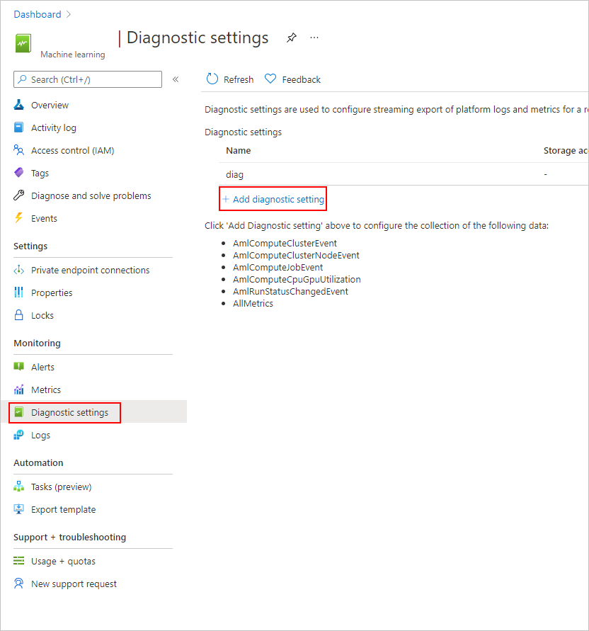
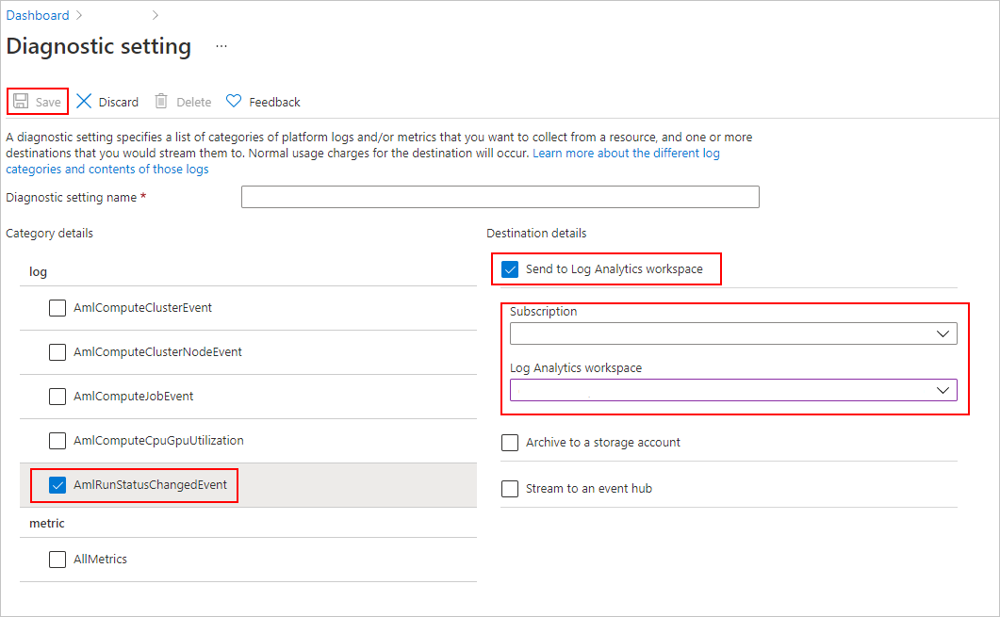
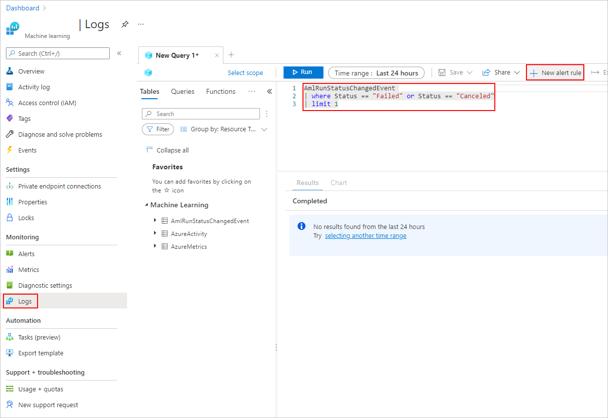

# Start, monitor, and track run history in studio

You can use [Azure Machine Learning studio](https://ml.azure.com) to monitor, organize, and track your runs for training and experimentation. Your ML run history is an important part of an explainable and repeatable ML development process.

This article shows how to do the following tasks:

* Add run display name. 
* Create a custom view. 
* Add a run description. 
* Tag and find runs.
* Run search over your run history. 
* Cancel or fail runs.
* Monitor the run status by email notification.
 

> [!TIP]
> * If you're looking for information on using the Azure Machine Learning SDK v1 or CLI v1, see [How to track, monitor, and analyze runs (v1)](./v1/how-to-track-monitor-analyze-runs.md).
> * If you're looking for information on monitoring training runs from the CLI or SDK v2, see [Track experiments with MLflow and CLI v2](how-to-use-mlflow-cli-runs.md).
> * If you're looking for information on monitoring the Azure Machine Learning service and associated Azure services, see [How to monitor Azure Machine Learning](monitor-azure-machine-learning.md).
>
> If you're looking for information on monitoring models deployed as web services, see [Collect model data](how-to-enable-data-collection.md) and [Monitor with Application Insights](how-to-enable-app-insights.md).

## Prerequisites

You'll need the following items:

* To use Azure Machine Learning, you must have an Azure subscription. If you don't have an Azure subscription, create a free account before you begin. Try the [free or paid version of Azure Machine Learning](https://azure.microsoft.com/free/).
* You must have an Azure Machine Learning workspace. A workspace is created in [Install, set up, and use the CLI (v2)](how-to-configure-cli.md).

## Run Display Name 

The run display name is an optional and customizable name that you can provide for your run. To edit the run display name:

1. Navigate to the runs list. 

2. Select the run to edit the display name in the run details page.

3. Select the **Edit** button to edit the run display name. 

:::image type="content" source="media/how-to-track-monitor-analyze-runs/display-name.gif" alt-text="Screenshot: edit the display name":::

## Custom View 
    
To view your runs in the studio: 
    
1. Navigate to the **Experiments** tab.
    
1. Select either **All experiments** to view all the runs in an experiment or select **All runs** to view all the runs submitted in the Workspace.
    
In the **All runs'** page, you can filter the runs list by tags, experiments, compute target and more to better organize and scope your work.  
    
1. Make customizations to the page by selecting runs to compare, adding charts or applying filters. These changes can be saved as a **Custom View** so you can easily return to your work. Users with workspace permissions can edit, or view the custom view. Also, share the custom view with team members for enhanced collaboration by selecting **Share view**.   

1. To view the run logs, select a specific run and in the **Outputs + logs** tab, you can find diagnostic and error logs for your run.

:::image type="content" source="media/how-to-track-monitor-analyze-runs/custom-views-2.gif" alt-text="Screenshot: create a custom view":::
    

## Run description 

A run description can be added to a run to provide more context and information to the run. You can also search on these descriptions from the runs list and add the run description as a column in the runs list. 

Navigate to the **Run Details** page for your run and select the edit or pencil icon to add, edit, or delete descriptions for your run. To persist the changes to the runs list, save the changes to your existing Custom View or a new Custom View. Markdown format is supported for run descriptions, which allows images to be embedded and deep linking as shown below.

:::image type="content" source="media/how-to-track-monitor-analyze-runs/run-description-2.gif" alt-text="Screenshot: create a run description"::: 

## Tag and find runs

In Azure Machine Learning, you can use properties and tags to help organize and query your runs for important information.

* Edit tags

    You can add, edit, or delete run tags from the studio. Navigate to the **Run Details** page for your run and select the edit, or pencil icon to add, edit, or delete tags for your runs. You can also search and filter on these tags from the runs list page.
    
    :::image type="content" source="media/how-to-track-monitor-analyze-runs/run-tags.gif" alt-text="Screenshot: Add, edit, or delete run tags":::
    

* Query properties and tags

    You can query runs within an experiment to return a list of runs that match specific properties and tags.
    
    To search for specific runs, navigate to the  **All runs** list. From there you have two options:
    
    1. Use the **Add filter** button and select filter on tags to filter your runs by tag that was assigned to the run(s).   
    OR
    
    1. Use the search bar to quickly find runs by searching on the run metadata like the run status, descriptions, experiment names, and submitter name. 

## Cancel or fail runs

If you notice a mistake or if your run is taking too long to finish, you can cancel the run.

To cancel a run in the studio, using the following steps:

1. Go to the running pipeline in either the **Experiments** or **Pipelines** section. 

1. Select the pipeline run number you want to cancel.

1. In the toolbar, select **Cancel**.

## Monitor the run status by email notification

1. In the [Azure portal](https://portal.azure.com/), in the left navigation bar, select the **Monitor** tab. 

1. Select **Diagnostic settings** and then select **+ Add diagnostic setting**.

    

1. In the Diagnostic Setting, 
    1. under the **Category details**, select the **AmlRunStatusChangedEvent**. 
    1. In the **Destination details**, select the **Send to Log Analytics workspace**  and specify the **Subscription** and **Log Analytics workspace**. 

    > [!NOTE]
    > The **Azure Log Analytics Workspace** is a different type of Azure Resource than the **Azure Machine Learning service Workspace**. If there are no options in that list, you can [create a Log Analytics Workspace](../azure-monitor/logs/quick-create-workspace.md). 
    
    

1. In the **Logs** tab, add a **New alert rule**. 

    

1. See [how to create and manage log alerts using Azure Monitor](../azure-monitor/alerts/alerts-log.md).

## Example notebooks

The following notebooks demonstrate the concepts in this article:

* To learn more about the logging APIs, see the [logging API notebook](https://github.com/Azure/MachineLearningNotebooks/blob/master/how-to-use-azureml/track-and-monitor-experiments/logging-api/logging-api.ipynb).

* For more information about managing runs with the Azure Machine Learning SDK, see the [manage runs notebook](https://github.com/Azure/MachineLearningNotebooks/blob/master/how-to-use-azureml/track-and-monitor-experiments/manage-runs/manage-runs.ipynb).

## Next steps

* To learn how to log metrics for your experiments, see [Log metrics during training runs](how-to-log-view-metrics.md).
* To learn how to monitor resources and logs from Azure Machine Learning, see [Monitoring Azure Machine Learning](monitor-azure-machine-learning.md).
