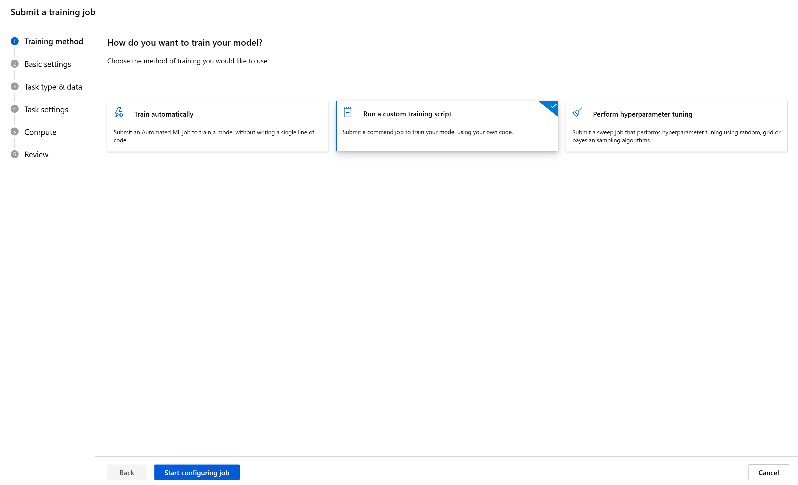
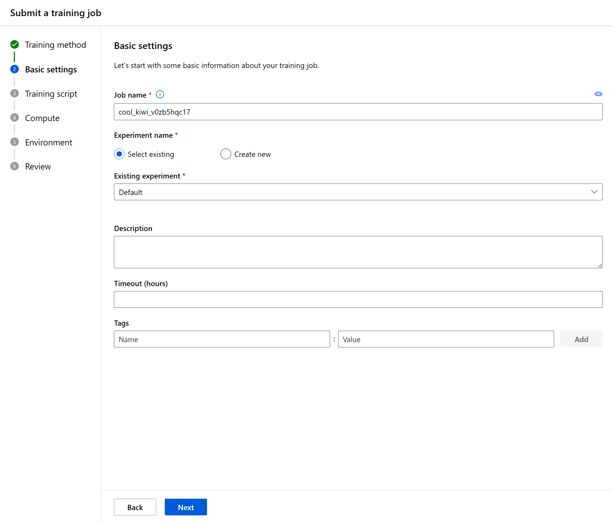
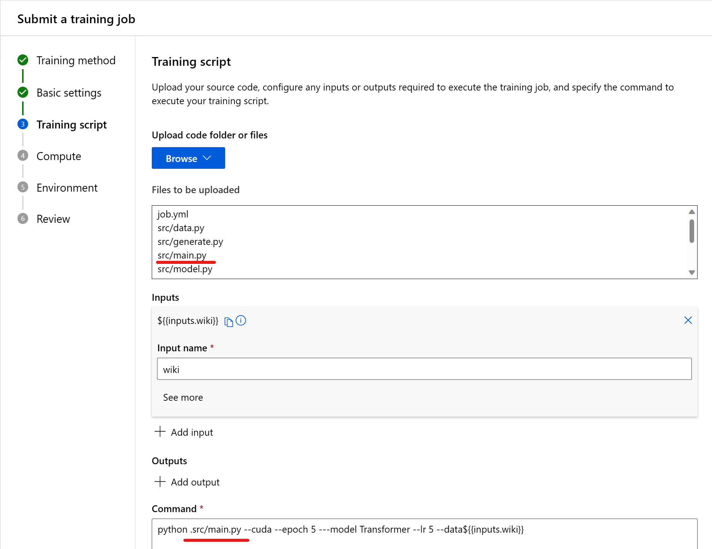
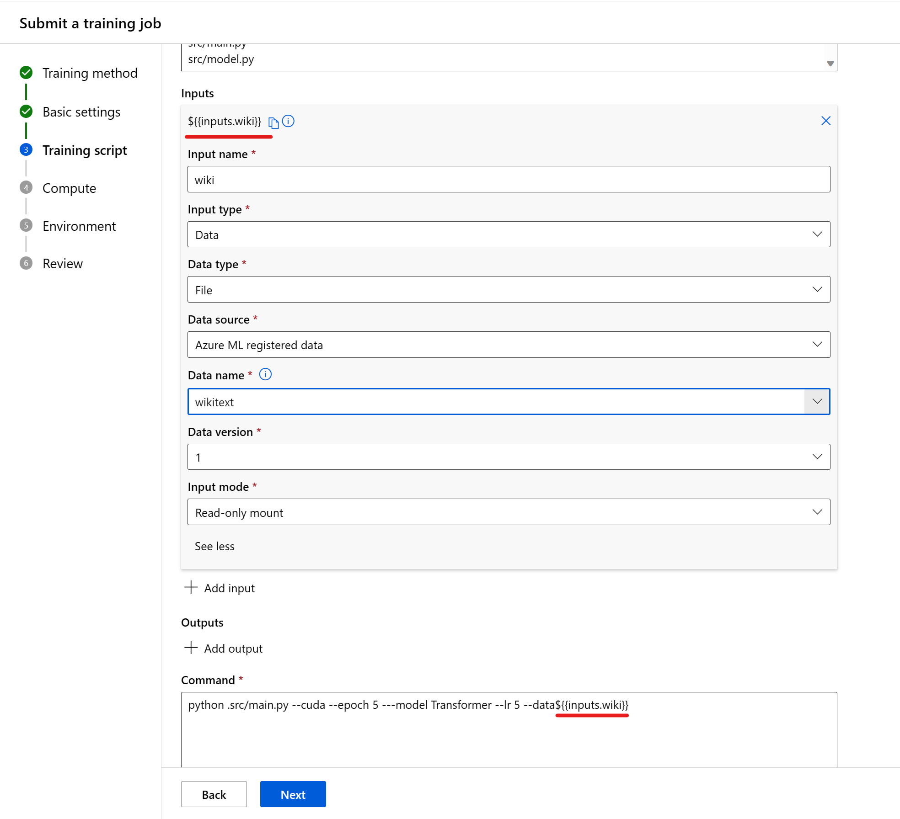
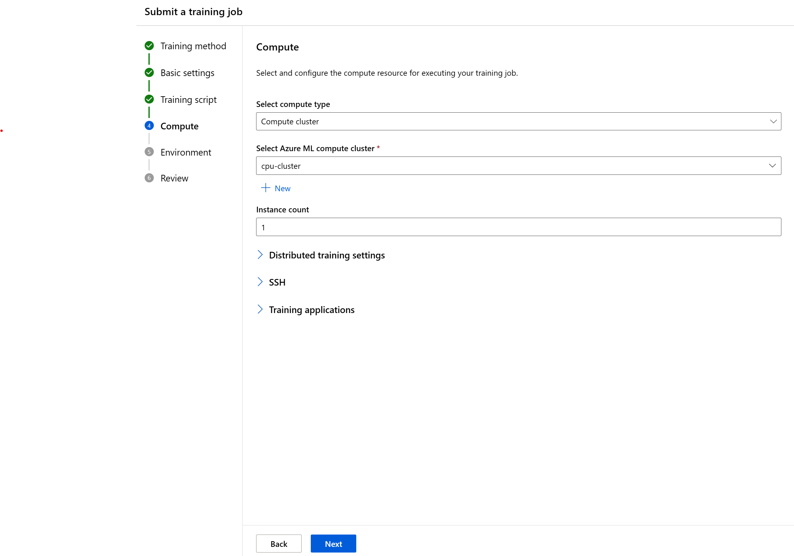
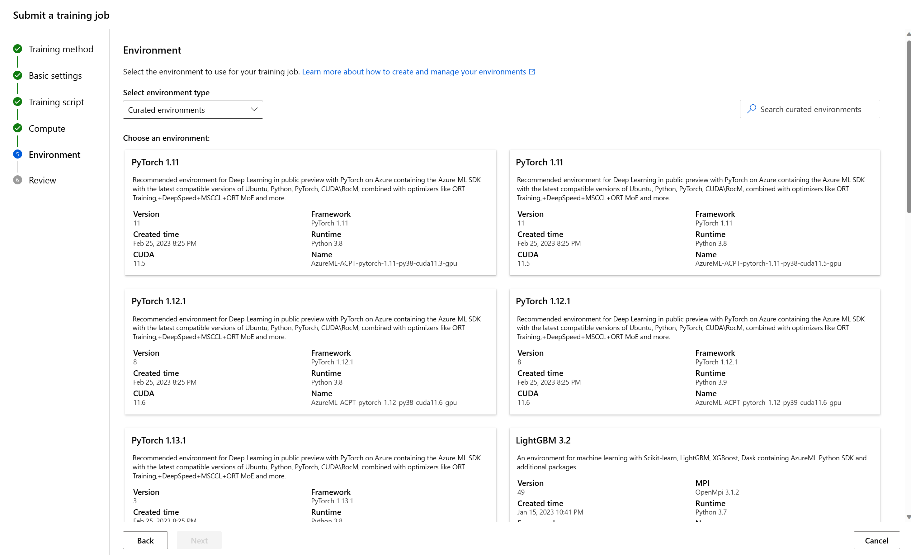
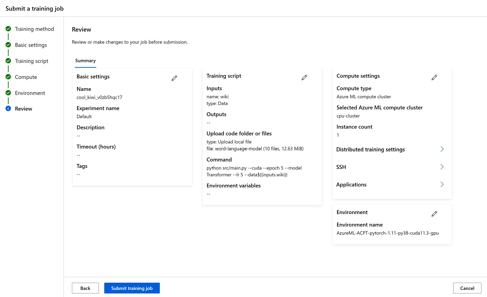

# Submit a training job in Studio (preview)

There are many ways to create a training job with Azure Machine Learning. You can use the CLI (see [Train models (create jobs)](how-to-train-model.md)), the REST API (see [Train models with REST (preview)](how-to-train-with-rest.md)), or you can use the UI to directly create a training job. In this article, you'll learn how to use your own data and code to train a machine learning model with a guided experience for submitting training jobs in Azure Machine Learning studio.

[!INCLUDE [machine-learning-preview-generic-disclaimer](../../includes/machine-learning-preview-generic-disclaimer.md)]

## Prerequisites

* An Azure subscription. If you don't have an Azure subscription, create a free account before you begin. Try the [free or paid version of Azure Machine Learning](https://azure.microsoft.com/free/machine-learning/search/) today.

* An Azure Machine Learning workspace. See [Create workspace resources](quickstart-create-resources.md). 

* Understanding of what a job is in Azure Machine Learning. See [how to train models]how-to-train-model.md).

## Get started

1. Sign in to [Azure Machine Learning studio](https://ml.azure.com). 

1. Select your subscription and workspace.

* Navigate to the Azure Machine Learning Studio and enable the feature by clicking open the preview panel.
[](media/how-to-train-with-ui/preview-panel.png)

 
* You may enter the job creation UI from the homepage. Click **Create new** and select **Job**. 
[](media/how-to-train-with-ui/home-entry.png)

In this wizard, you can select your method of training, complete the rest of the submission wizard based on your selection, and submit the training job. Below we will walk through the wizard for running a custom script (command job). 

[](media/how-to-train-with-ui/training-method.png)

## Configure basic settings

The first step is configuring basic information about your training job. You can proceed next if you're satisfied with the defaults we have chosen for you or make changes to your desired preference. 

[](media/how-to-train-with-ui/basic-settings.png)

These are the fields available:

|Field| Description|
|------| ------|
|Job name| The job name field is used to uniquely identify your job. It's also used as the display name for your job.|
|Experiment name| This helps organize the job in Azure Machine Learning studio. Each job's run record will be organized under the corresponding experiment in the studio's "Experiment" tab. By default, Azure will put the job in the **Default** experiment.|
|Description| Add some text describing your job, if desired.|
|Timeout| Specify number of hours the entire training job is allowed to run. Once this limit is reached the system will cancel the job including any child jobs.|
|Tags| Add tags to your job to help with organization.|

## Training script

Next step is to upload your source code, configure any inputs or outputs required to execute the training job, and specify the command to execute your training script.  

This can be a code file or a folder from your local machine or workspace's default blob storage. Azure will show the files to be uploaded after you make the selection. 

|Field| Description|
|------| ------|
|Code| This can be a file or a folder from your local machine or workspace's default blob storage as your training script. Studio will show the files to be uploaded after you make the selection.|
|Inputs| Specify as many inputs as needed of the following types data, integer, number, boolean, string). |
|Command| The command to execute. Command-line arguments can be explicitly written into the command or inferred from other sections, specifically **inputs** using curly braces notation, as discussed in the next section.|


### Code
The command is run from the root directory of the uploaded code folder. After you select your code file or folder, you can see the files to be uploaded. Copy the relative path to the code containing your entry point and paste it into the box labeled **Enter the command to start the job**. 

If the code is in the root directory, you can directly refer to it in the command. For instance, `python main.py`.

If the code isn't in the root directory, you should use the relative path. For example, the structure of the [word language model](https://github.com/Azure/azureml-examples/tree/main/cli/jobs/single-step/pytorch/word-language-model) is:

```tree
.
├── job.yml
├── data
└── src
    └── main.py
```
Here, the source code is in the `src` subdirectory. The command would be `python ./src/main.py` (plus other command-line arguments).

[](media/how-to-train-with-ui/training-script-code.png)

### Inputs

When you use an input in the command, you need to specify the input name. To indicate an input variable, use the form `${{inputs.input_name}}`. For instance, `${{inputs.wiki}}`. You can then refer to it in the command, for instance, `--data ${{inputs.wiki}}`.

[](media/how-to-train-with-ui/training-script-inputs.png)

## Select compute resources

Next step is to select the compute target on which you'd like your job to run. The job creation UI supports several compute types:

| Compute Type | Introduction | 
| --- | --- | 
| Compute instance | [What is an Azure Machine Learning compute instance?](concept-compute-instance.md) | 
| Compute cluster | [What is a compute cluster?](how-to-create-attach-compute-cluster.md#what-is-a-compute-cluster) | 
| Attached Compute (Kubernetes cluster) | [Configure and attach Kubernetes cluster anywhere (preview)](how-to-attach-kubernetes-anywhere.md). | 

1. Select a compute type
1. Select an existing compute resource. The dropdown shows the node information and SKU type to help your choice.
1. For a compute cluster or a Kubernetes cluster, you may also specify how many nodes you want for the job in **Instance count**. The default number of instances is 1. 
1. When you're satisfied with your choices, choose **Next**. 
 [](media/how-to-train-with-ui/compute.png)

If you're using Azure Machine Learning for the first time, you'll see an empty list and a link to create a new compute. For more information on creating the various types, see:

| Compute Type | How to | 
| --- | --- | 
| Compute instance | [Create an Azure Machine Learning compute instance](how-to-create-compute-instance.md) | 
| Compute cluster | [Create an Azure Machine Learning compute cluster](how-to-create-attach-compute-cluster.md) | 
| Attached Kubernetes cluster | [Attach an Azure Arc-enabled Kubernetes cluster](how-to-attach-kubernetes-anywhere.md) | 

## Specify the necessary environment

After selecting a compute target, you need to specify the runtime environment for your job. The job creation UI supports three types of environment:

* Curated environments
* Custom environments
* Container registry image 

### Curated environments

Curated environments are Azure-defined collections of Python packages used in common ML workloads. Curated environments are available in your workspace by default. These environments are backed by cached Docker images, which reduce the job preparation overhead. The cards displayed in the "Curated environments" page show details of each environment. To learn more, see [curated environments in Azure Machine Learning](resource-curated-environments.md).

 [](media/how-to-train-with-ui/curated-environments.png)

### Custom environments

Custom environments are environments you've specified yourself. You can specify an environment or reuse an environment that you've already created. To learn more, see [Manage software environments in Azure Machine Learning studio (preview)](how-to-manage-environments-in-studio.md#create-an-environment). 

### Container registry image

If you don't want to use the Azure Machine Learning curated environments or specify your own custom environment, you can use a docker image from a public container registry such as [Docker Hub](https://hub.docker.com/).


## Review and Create 

Once you've configured your job, choose **Next** to go to the **Review** page. To modify a setting, choose the pencil icon and make the change. 
 [](media/how-to-train-with-ui/review.png)

To launch the job, choose **Submit training job**. Once the job is created, Azure will show you the job details page, where you can monitor and manage your training job. 

  [!INCLUDE [Email Notification Include](../../includes/machine-learning-email-notifications.md)]

## Next steps

* [Deploy and score a machine learning model by using an online endpoint](how-to-deploy-online-endpoints.md).

* [Train models (create jobs) with the CLI, SDK, and REST API](how-to-train-model.md)
