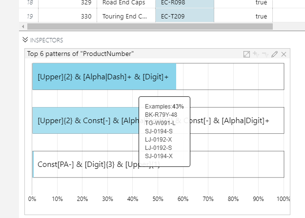
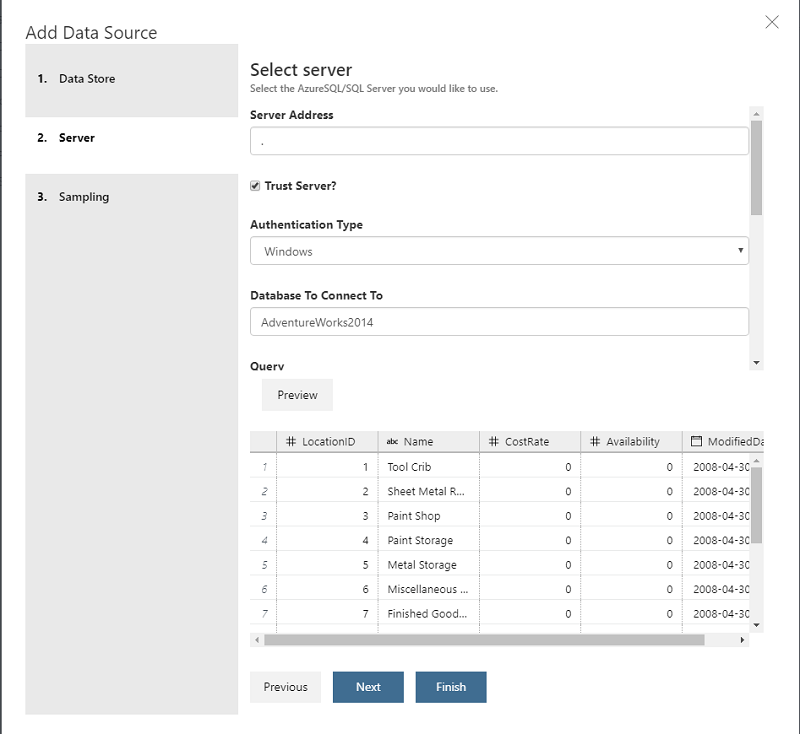
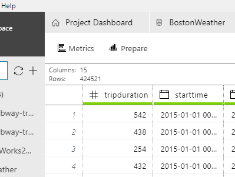
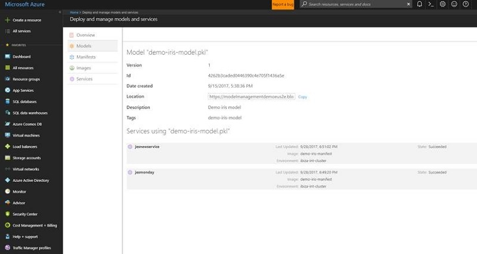
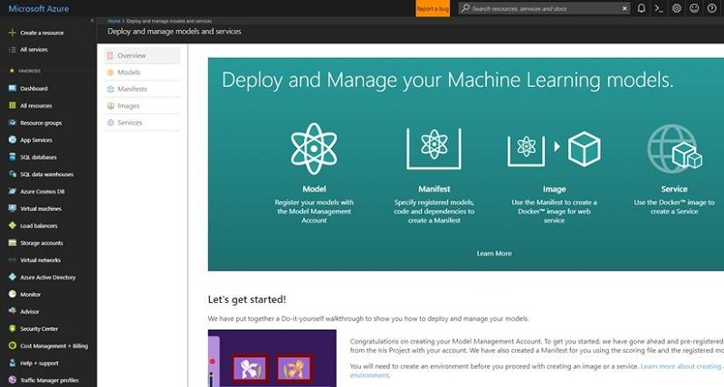

# Sprint 2 - December 2017 

#### Version number: 0.1.1711.15263

>Here is how you can [find the version number](https://docs.microsoft.com/en-us/azure/machine-learning/preview/known-issues-and-troubleshooting-guide).

Welcome to the third update of Azure Machine Learning Workbench. This update includes improvements in the workbench app, the Command-line Interface (CLI), and the back-end services. Thank you very much for sending the smiles and frowns. Many of the following updates are made as direct results of your feedback. 

## Notable New Features
- [Support for SQL Server and Azure SQL DB as a data source](https://docs.microsoft.com/en-us/azure/machine-learning/preview/data-prep-appendix2-supported-data-sources#types) 
- [Deep Learning on Spark with GPU support using MMLSpark](https://github.com/Azure/mmlspark/blob/master/docs/gpu-setup.md)
- [All AML containers are compatible with Azure IoT Edge devices when deployed (no extra steps required)](http://aka.ms/aml-iot-edge-blog)
- Registered model list and detail views available Azure portal
- Accessing compute targets using SSH key-based authentication in addition to username/password-based access. 
- New Pattern Frequency Inspector in the data prep experience. 

## Detailed Updates
Following is a list of detailed updates in each component area of Azure Machine Learning in this sprint.

### Installer
- Installer can self update so that bugs fixes and new features can be supported without user having to reinstall it

### Workbench Authentication
- Multiple fixes to authentication system. Please let us know if you are still experiencing login issues.
- UI changes that make it easier to find the Proxy Manager settings.

### Workbench
- Read-only file view now has light blue background
- Moved Edit button to the right to make it more discoverable.
- "dsource", "dprep", and "ipynb" file formats can now be rendered in raw text format
- The workbench now has a new editing experience that guides users towards using external IDE's to edit scripts, and use Workbench only to edit file types that have a rich editing experience (such as Notebooks, Data sources, Data preparation packages)
- Loading the list of workspaces and projects that the user has access to is significantly faster now

### Data preparation 
- A Pattern Frequency Inspector to view the string patterns in a column. You can also filter your data using these patterns. This shows you a view similar to the Value Counts inspector. The difference is that Pattern Frequency shows the counts of the unique patterns of the data, rather than the counts of unique data. You can also filter in or out all rows that fit a certain pattern.



- Performance improvements while recommending edge cases to review in the 'derive column by example' transformation

- [Support for SQL Server and Azure SQL DB as a data source](https://docs.microsoft.com/en-us/azure/machine-learning/preview/data-prep-appendix2-supported-data-sources#types) 



- Enabled "At a glance" view of row and column counts



- Data prep is enabled in all compute contexts
- Data sources that use a SQL Server database are enabled in all compute contexts
- Data prep grid columns can be filtered by data type
- Fixed issue with converting multiple columns to date
- Fixed issue that user could select output column as a source in Derive Column By Example if user changed output column name in the advanced mode.

### Job execution
You can now create and access a remotedocker or cluster type compute target using SSH key-based authentication following these steps:
- Attach a compute target using the following command in CLI

    ```azure-cli
    $ az ml computetarget attach remotedocker --name "remotevm" --address "remotevm_IP_address" --username "sshuser" --use-azureml-ssh-key
    ```
[!NOTE] -k (or --use-azureml-ssh-key) option in the command specifies to generate and use SSH-key.

- Azure ML Workbench will generate a public key and output that in your console. Log into the compute target using the same username and append ~/.ssh/authorized_keys file with this public key.

- You can prepare this compute target and use it for execution and Azure ML Workbench will use this key for authentication.  

For more information on creating compute targets, see [Configuring Azure Machine Learning Experimentation Service](https://docs.microsoft.com/en-us/azure/machine-learning/preview/experimentation-service-configuration)

### Visual Studio Tools for AI
- Added support for [Visual Studio Tools for AI](https://marketplace.visualstudio.com/items?itemName=ms-toolsai.vstoolsai-vs2017). 

### Command Line Interface (CLI)
- Added `az ml datasource create` command allows to creating a data source file from the command-line

### Model Management and Operationalization
- [All AML containers are compatible with Azure IoT Edge devices when operationalized (no extra steps required)](http://aka.ms/aml-iot-edge-blog) 
- Improvements of error messages in the o16n CLI
- Bug fixes in model management portal UX  
- Consistent letter casing for model management attributes in the detail page
- Realtime scoring calls timeout set to 60 seconds
- Registered model list and detail views available in the Azure portal





### MMLSpark
- Deep Learning on Spark with [GPU support](https://github.com/Azure/mmlspark/blob/master/docs/gpu-setup.md)
- Support for Resource Manager templates for easy resource deployment
- Support for the SparklyR ecosystem
- [AZTK integration](https://github.com/Azure/aztk/wiki/Spark-on-Azure-for-Python-Users#optional-set-up-mmlspark)

### Sample projects
- [Iris](https://github.com/Azure/MachineLearningSamples-Iris) and [MMLSpark](https://github.com/Azure/mmlspark) samples updated with the new Azure ML SDK version

## BREAKING CHANGES
- Promoted the `--type` switch in `az ml computetarget attach` to a sub-command. 

    - `az ml computetarget attach --type remotedocker` is now `az ml computetarget attach remotedocker`
    - `az ml computetarget attach --type cluster` is now `az ml computetarget attach cluster`
