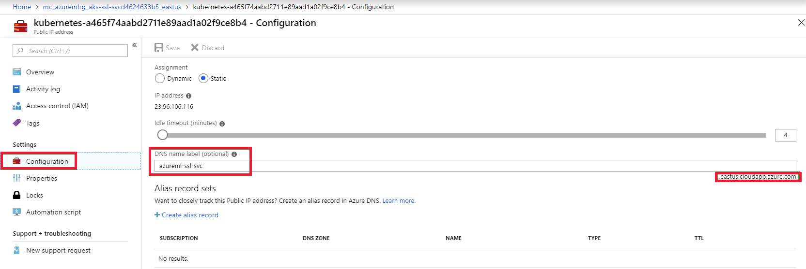

# Use SSL to secure web services with Azure Machine Learning service

In this article, you will learn how to secure a web service deployed with the Azure Machine Learning service. You can restrict access to web services and secure the data submitted by clients using [Hypertext Transfer Protocol Secure (HTTPS)](https://en.wikipedia.org/wiki/HTTPS).

HTTPS is used to secure communications between a client and your web service by encrypting communications between the two. Encryption is handled using [Transport Layer Security (TLS)](https://en.wikipedia.org/wiki/Transport_Layer_Security). Sometimes this is still referred to as Secure Sockets Layer (SSL), which was the predecessor to TLS.

> [!TIP]
> The Azure Machine Learning SDK uses the term 'SSL' for properties related to enabling secure communications. This does not mean that TLS is not used by your web service, just that SSL is the more recognizable term for many readers.

TLS and SSL both rely on __digital certificates__, which are used to perform encryption and identity verification. For more information on how digital certificates work, see the Wikipedia entry on [public key infrastructure (PKI)](https://en.wikipedia.org/wiki/Public_key_infrastructure).

> [!Warning]
> If you do not enable and use HTTPS for your web service, data sent to and from the service may be visible on to others on the internet.
>
> HTTPS also enables the client to verify the authenticity of the server that it is connecting to. This protects clients against [man-in-the-middle](https://en.wikipedia.org/wiki/Man-in-the-middle_attack) attacks.

The process of securing a new web service or an existing one is as follows:

1. Get a domain name.

2. Get a digital certificate.

3. Deploy or update the web service with the SSL setting enabled.

4. Update your DNS to point to the web service.

There are slight differences when securing web services across the [deployment targets](how-to-deploy-and-where.md).

## Get a domain name

If you do not already own a domain name, you can purchase one from a __domain name registrar__. The process differs between registrars, as does the cost. The registrar also provides you with tools for managing the domain name. These tools are used to map a fully qualified domain name (such as www.contoso.com) to the IP address hosting your web service.

## Get an SSL certificate

There are many ways to get an SSL certificate (digital certificate). The most common is to purchase one from a __Certificate Authority__ (CA). Regardless of where you obtain the certificate, you need the following files:

* A __certificate__. The certificate must contain the full certificate chain, and must be PEM-encoded.
* A __key__. The key must be PEM-encoded.

When requesting a certificate, you must provide the fully qualified domain name (FQDN) of the address you plan to use for the web service. For example, www.contoso.com. The address stamped into the certificate and the address used by the clients are compared when validating the identity of the web service. If the addresses do not match, the clients will receive an error.

> [!TIP]
> If the Certificate Authority cannot provide the certificate and key as PEM-encoded files, you can use a utility such as [OpenSSL](https://www.openssl.org/) to change the format.

> [!WARNING]
> Self-signed certificates should be used only for development. They should not be used in production. Self-signed certificates can cause problems in your client applications. For more information, see the documentation for the network libraries used in your client application.

## Enable SSL and deploy

To deploy (or re-deploy) the service with SSL enabled, set the `ssl_enabled` parameter to `True`, wherever applicable. Set the `ssl_certificate` parameter to the value of the __certificate__ file and the `ssl_key` to the value of the __key__ file.

+ **Deploy on Azure Kubernetes Service (AKS)**

  While provisioning the AKS cluster, provide values for SSL-related parameters as shown in the code snippet:

    ```python
    from azureml.core.compute import AksCompute

    provisioning_config = AksCompute.provisioning_configuration(ssl_cert_pem_file="cert.pem", ssl_key_pem_file="key.pem", ssl_cname="www.contoso.com")
    ```

+ **Deploy on Azure Container Instances (ACI)**

  While deploying to ACI, provide values for SSL-related parameters as shown in the code snippet:

    ```python
    from azureml.core.webservice import AciWebservice

    aci_config = AciWebservice.deploy_configuration(ssl_enabled=True, ssl_cert_pem_file="cert.pem", ssl_key_pem_file="key.pem", ssl_cname="www.contoso.com")
    ```

+ **Deploy on Field Programmable Gate Arrays (FPGA)**

  While deploying to FPGA, provide values for the SSL-related parameters as shown in the code snippet:

    ```python
    from azureml.contrib.brainwave import BrainwaveWebservice

    deployment_config = BrainwaveWebservice.deploy_configuration(ssl_enabled=True, ssl_cert_pem_file="cert.pem", ssl_key_pem_file="key.pem")
    ```

## Update your DNS

Next, you must update your DNS to point to the web service.

+ **For ACI**:

  Use the tools provided by your domain name registrar to update the DNS record for your domain name. The record must point to the IP address of the service.

  Depending on the registrar, and the time to live (TTL) configured for the domain name, it can take several minutes to several hours before clients can resolve the domain name.

+ **For AKS**:

  Update the DNS under the "Configuration" tab of the "Public IP Address" of the AKS cluster as shown in the image. You can find the Public IP Address as one of the resource types created under the resource group that contains the AKS agent nodes and other networking resources.

  

## Next steps
Learn how to:
+ [Consume a machine learning model deployed as a web service](how-to-consume-web-service.md)
+ [Securely run experiments and inferencing inside an Azure Virtual Network](how-to-enable-virtual-network.md)
