# Create event driven machine learning workflows (Preview)

[Azure Event Grid](https://docs.microsoft.com/azure/event-grid/) supports Azure Machine Learning service events. For example, you can use events from run completion, model registration, model deployment, and data drift detection scoped to a workspace.

For more information, see [Azure Machine Learning integration with Event Grid](concept-event-grid-integration.md) and the [Azure Machine Learning event grid schema](/azure/event-grid/event-schema-machine-learning).

Use Event Grid to enable common scenarios such as:

* Triggering pipelines for retraining
* Streaming events from Azure Machine Learning to various of endpoints 

## Prerequisites

* Contributor or owner access to the Azure Machine learning service workspace you will create events for. 
* Select an event handler endpoint such as a webhook or Event Hub. For more information, see [event handlers](https://docs.microsoft.com/azure/event-grid/event-handlers). 

## Register Event Grid

If you used Azure Event Grid before November 1 2019, you may need to re-register the provider before you can use it with Azure Machine Learning. To re-register the service, use the following steps:

1. Go to the  Azure portal and select __Subscriptions__. Select the subscription that you want to work with. 
1. Select __Resource providers__, and then search for __EventGrid__.
1. Select the __Microsoft.EventGrid__ entry, and then select __Re-register__.

    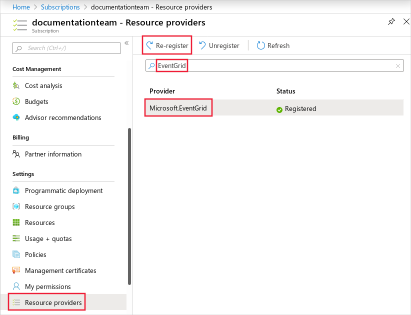

> [!TIP]
> If you do not have permissions to complete these steps, ask your subscription administrator to perform them.

## Configure machine learning events using the Azure portal

1. Open the [Azure portal](https://portal.azure.com) and go to your Azure Machine Learning workspace.

1. From the left bar, select __Events__ and then select **Event Subscriptions**. 

    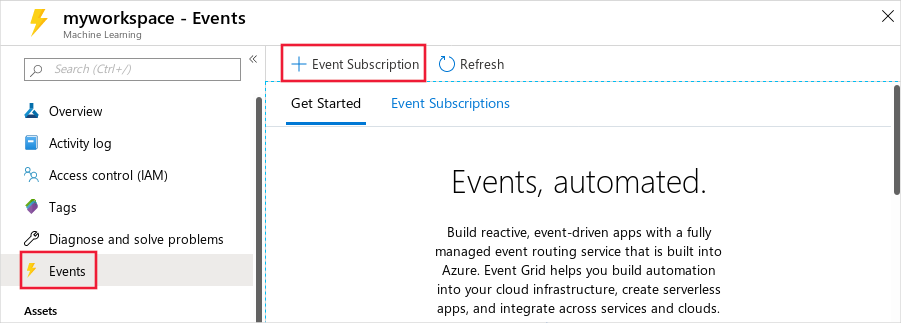

1. Select the event type to consume. For example, the following screenshot has selected __Model registered__, __Model deployed__, __Run completed__, and __Dataset drift detected__:

    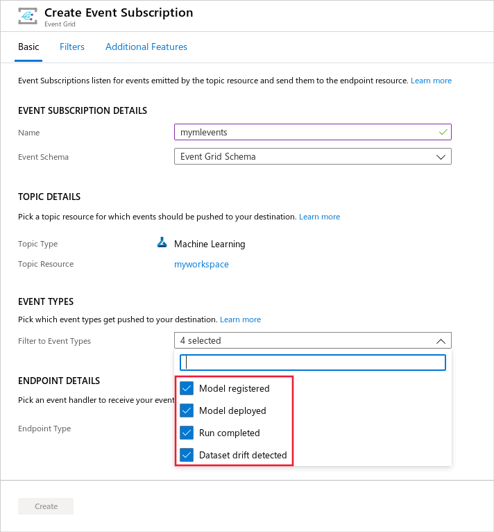

1. Select the endpoint to publish the event to. In the following screenshot, __Event hub__ is the selected endpoint:

    

Once you have confirmed your selection, click __Create__. After configuration, these events will be pushed to your endpoint.

## Set up Azure Event Grid using CLI

You can either install the latest [Azure CLI](https://docs.microsoft.com/cli/azure/install-azure-cli?view=azure-cli-latest), or use the Azure Cloud Shell that is provided as part of your Azure subscription.

To install the Event Grid extension, use the following command from the CLI:

```azurecli-interactive
az add extension --name eventgrid
```

The following example demonstrates how to select an Azure subscription, and then create a new event subscription for Azure Machine Learning:

```azurecli-interactive
# Select the Azure subscription that contains the workspace
az account set --subscription "<name or ID of the subscription>"

# Subscribe to the machine learning workspace.
az eventgrid event-subscription create \
  --name {eventGridFilterName} \
  --source-resource-id "/subscriptions/{subId}/resourceGroups/{rgName}/ \providers/Microsoft.MachineLearningServices/workspaces/{wsName}" \
  --endpoint {event handler endpoint} \
  --included-event-types Microsoft.MachineLearningServices.ModelRegistered \
  --subject-begins-with "models/mymodelname"
```

## Sample scenarios

### Use a Logic App to send email alerts

Leverage [Azure Logic Apps](https://docs.microsoft.com/azure/logic-apps/) to configure emails for all your events. Customize with conditions and specify recipients to enable collaboration and awareness across teams working together.

1. In the Azure portal, go to your Azure Machine Learning workspace and select the events tab from the left bar. From here, select __Logic apps__. 

    

1. Sign into the Logic App UI and select Machine Learning service as the topic type. 

    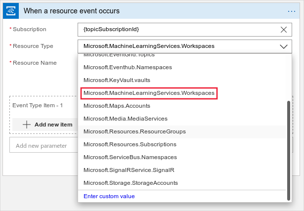

1. Select which event(s) to be notified for. For example, the following screenshot __RunCompleted__.

    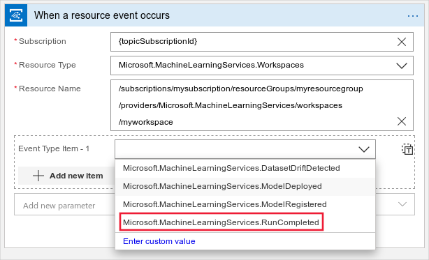

1. You can also add filters to only trigger the logic app on a subset of event types. In the following screenshot, a __prefix filter__ of __/datadriftID/runs/__ is used.

    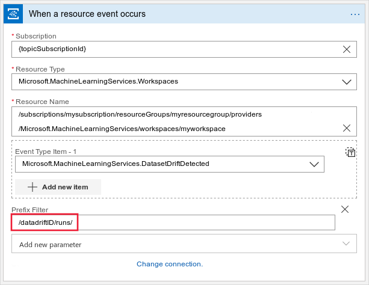

1. Next, add a step to consume this event and search for email. There are several different mail accounts you can use to receive events. You can also configure conditions on when to send an email alert.

    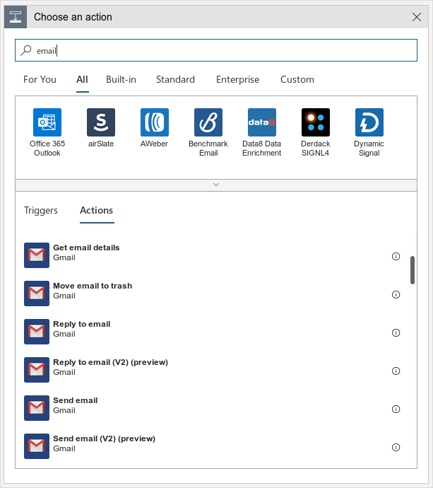

1. Select __Send an email__ and fill in the parameters. In the subject, you can include the __Event Type__ and __Topic__ to help filter events. You can also include a link to the workspace page for runs in the message body. 

    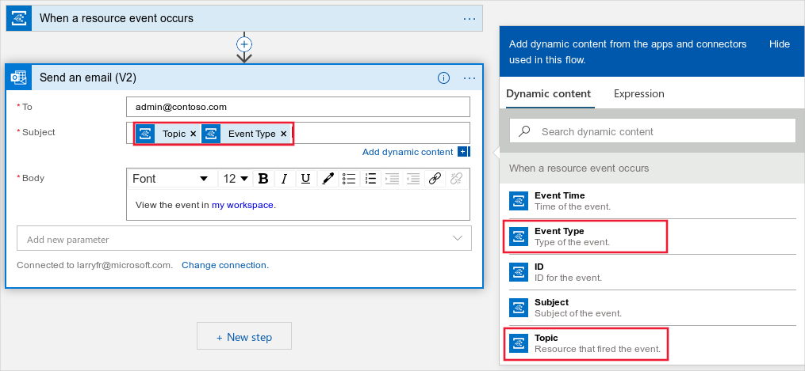

1. To save this action, select **Save As** on the left corner of the page. From the right bar  that appears, confirm creation of this action.

    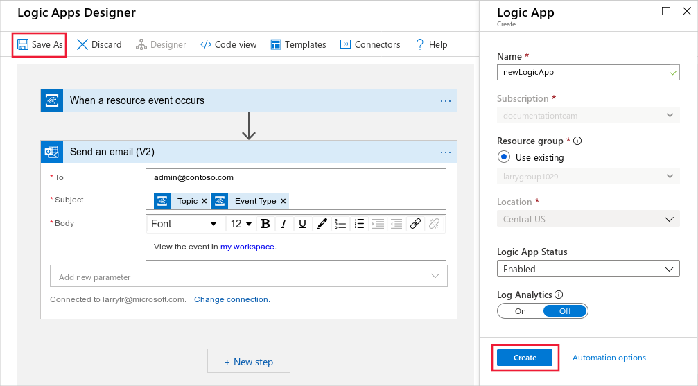


### Use a Logic App to trigger retraining workflows when data drift occurs

Models go stale over time, and not remain useful in the context it is running in. One way to tell if it's time to retrain the model is detecting data drift. 

This example shows how to use event grid with an Azure Logic App to trigger retraining. The example triggers an Azure Data Factory pipeline when data drift occurs between a model's training and serving datasets.

Before you begin, perform the following actions:

* Set up a dataset monitor to [detect data drift]( https://aka.ms/datadrift) in a workspace
* Create a published [Azure Data Factory pipeline](https://docs.microsoft.com/azure/data-factory/).

In this example, a simple Data Factory pipeline is used to copy files into a blob store and run a published Machine Learning pipeline. For more information on this scenario, see how to set up a [Machine Learning step in Azure Data Factory](https://docs.microsoft.com/azure/data-factory/transform-data-machine-learning-service)


1. Start with creating the logic app. Go to the [Azure portal](https://portal.azure.com), search for Logic Apps, and select create.

    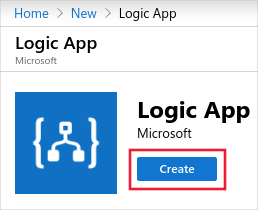

1. Fill in the requested information. To simplify the experience, use the same subscription and resource group as your Azure Data Factory Pipeline and Azure Machine Learning workspace.

    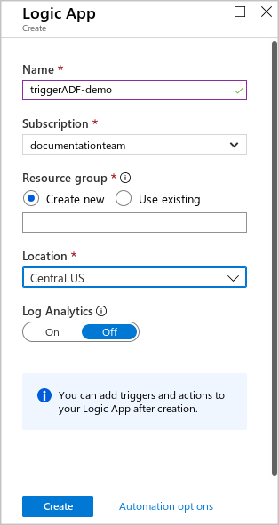

1. Once you have created the logic app, select __When an Event Grid resource event occurs__. 

    

1. Login and fill in the details for the event. Set the __Resource Name__ to the workspace name. Set the __Event Type__ to __DatasetDriftDetected__.

    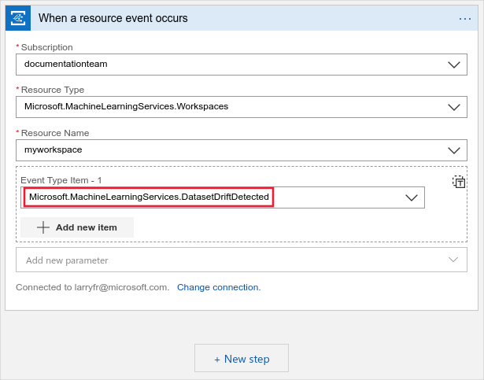

1. Add a new step, and search for __Azure Data Factory__. Select __Create a pipeline run__. 

    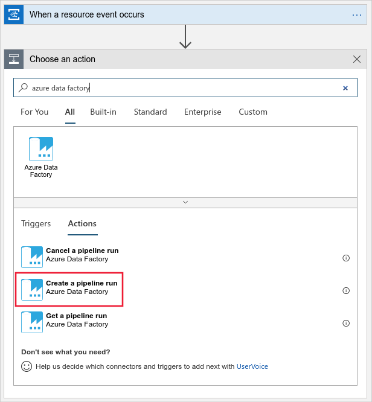

1. Login and specify the published Azure Data Factory pipeline to run.

    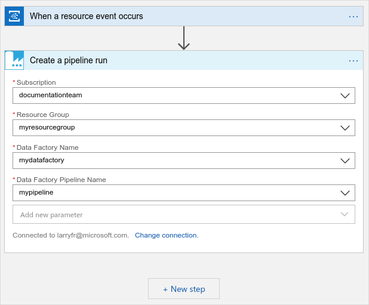

1. Save and create the logic app using the **save** button on the top left of the page. To view your app, go to your workspace in the [Azure portal](https://portal.azure.com) and click on **Events**.

    

Now the data factory pipeline is triggered when drift occurs. View details on your data drift run and machine learning pipeline on the [new workspace portal](https://ml.azure.com). 


### Use Azure Functions to deploy a model based on tags

An Azure Machine Learning model object contains parameters you can pivot deployments on such as model name, version, tag, and property. The model registration event can trigger an endpoint and you can use an Azure Function to deploy a model based on the value of those parameters.

For an example, see the [https://github.com/Azure-Samples/MachineLearningSamples-NoCodeDeploymentTriggeredByEventGrid](https://github.com/Azure-Samples/MachineLearningSamples-NoCodeDeploymentTriggeredByEventGrid) repository and follow the steps in the **readme** file.

## Next steps

* To learn more about available events, see the [Azure Machine Learning event schema](/azure/event-grid/event-schema-machine-learning)