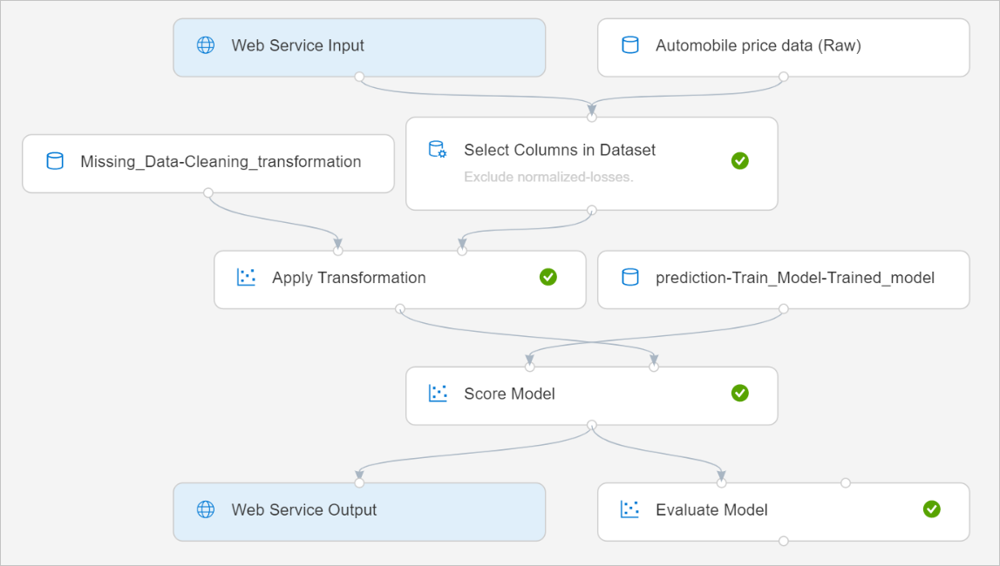

# Tutorial: Deploy a machine learning model with the visual interface

To give others a chance to use the predictive model developed in [part one of the tutorial](ui-tutorial-automobile-price-train-score.md), you can deploy it as an Azure web service. So far, you've been experimenting with training your model. Now, it's time to generate new predictions based on user input. In this part of the tutorial, you:

> [!div class="checklist"]
> * Prepare a model for deployment
> * Deploy a web service
> * Test a web service
> * Manage a web service
> * Consume the web service

## Prerequisites

Complete [part one of the tutorial](ui-tutorial-automobile-price-train-score.md) to learn how to train and score a machine learning model in the visual interface.

## Prepare for deployment

Before you deploy your experiment as a web service, you first have to convert your *training experiment* into a *predictive experiment*.

1. Select **Create Predictive Experiment*** at the bottom of the experiment canvas.

    

    When you select **Create Predictive Experiment**, several things happen:
    
    * The trained model is stored as a **Trained Model** module in the module palette. You can find it under **Trained Models**.
    * Modules that were used for training are removed; specifically:
      * Train Model
      * Split Data
      * Evaluate Model
    * The saved trained model is added back into the experiment.
    * **Web service input** and **Web service output** modules are added. These modules identify where the user data will enter the model, and where data is returned.

    The **training experiment** is still saved under the new tabs at the top of the experiment canvas.

1. **Run** the experiment.

1. Select the output of the **Score Model** module and select **View Results** to verify the model is still working. You can see the original data is displayed, along with the predicted price ("Scored Labels").

Your experiment should now look like this:  

## Deploy the web service

1. Select **Deploy Web Service** below the canvas.

1. Select the **Compute Target** that you'd like to run your web service.

    Currently, the visual interface only supports deployment to Azure Kubernetes Service (AKS) compute targets. You can choose from available AKS compute targets in your machine learning service workspace or configure a new AKS environment using the steps in the dialogue that appears.

    

1. Select **Deploy Web Service**. You'll see the following notification when deployment completes. Deployment may take a few minutes.

    

## Test the web service

You can test and manage your visual interface web services by navigating to the **Web Services** tab.

1. Go to the web service section. You'll see the web service you deployed with the name **Tutorial - Predict Automobile Price[Predictive Exp]**.

     

1. Select the web service name to view additional details.

1. Select **Test**.

    

1. Input testing data or use the autofilled sample data and select **Test**.

    The test request is submitted to the web service and the results are shown on page. Although a price value is generated for the input data, it is not used to generate the prediction value.

## Consume the web service

Users can now send API requests to your Azure web service and receive results to predict the price of their new automobiles.

**Request/Response** - The user sends one or more rows of automobile data to the service by using an HTTP protocol. The service responds with one or more sets of results.

You can find sample REST calls in the **Consume** tab of the web service details page.

   

Navigate to the **API Doc** tab, to find more API details.

## Manage models and deployments

The models and web service deployments you create in the visual interface can also be managed from the Azure Machine Learning service workspace.

1. Open your workspace in the [Azure portal](https://portal.azure.com/).  

1. In your workspace, select **Models**. Then select the experiment you created.

    

    On this page, you'll see additional details about the model.

1. Select **Deployments**, it will list any web services that use the model. Select the web service name, it will go to web service detail page. In this page, you can get more detailed information of the web service.

    

You can also find these models and deployments in the **Models** and **Endpoints** sections of your [workspace landing page (preview)](https://ml.azure.com).

## Clean up resources

[!INCLUDE [aml-ui-cleanup](../../../includes/aml-ui-cleanup.md)]

## Next steps

In this tutorial, you learned the key steps in creating, deploying, and consuming a machine learning model in the visual interface. To learn more about how you can use the visual interface to solve other types of problems, see out our other sample experiments.

> [!div class="nextstepaction"]
> [Credit risk classification sample](ui-sample-classification-predict-credit-risk-cost-sensitive.md)
