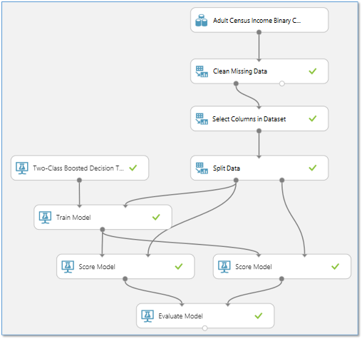
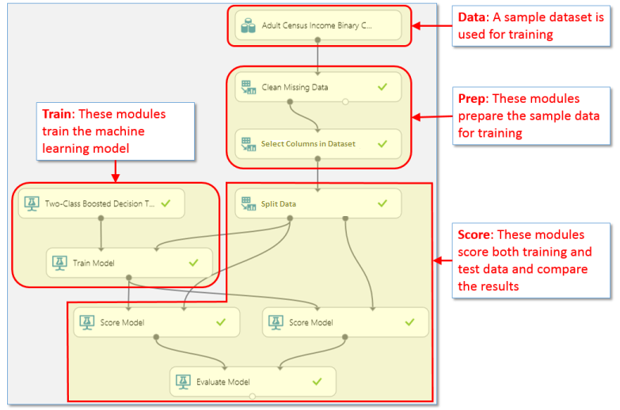
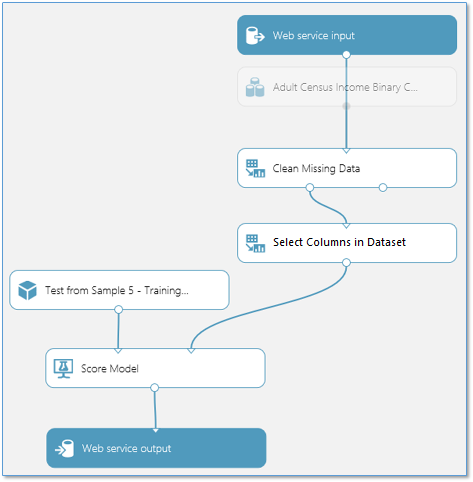

# How to prepare your model for deployment in Azure Machine Learning Studio (classic)

Azure Machine Learning Studio (classic) gives you the tools you need to develop a predictive analytics model and then operationalize it by deploying it as an Azure web service.

To do this, you use the classic version of Studio to create an experiment - called a *training experiment* - where you train, score, and edit your model. Once you're satisfied, you get your model ready to deploy by converting your training experiment to a *predictive experiment* that's configured to score user data.

You can see an example of this process in [Tutorial 1: Predict credit risk](tutorial-part1-credit-risk.md).

This article takes a deep dive into the details of how a training experiment gets converted into a predictive experiment, and how that predictive experiment is deployed. By understanding these details, you can learn how to configure your deployed model to make it more effective.

## Overview 

The process of converting a training experiment to a predictive experiment involves three steps:

1. Replace the machine learning algorithm modules with your trained model.
2. Trim the experiment to only those modules that are needed for scoring. A training experiment includes a number of modules that are necessary for training but are not needed once the model is trained.
3. Define how your model will accept data from the web service user, and what data will be returned.

> [!TIP]
> In your training experiment, you've been concerned with training and scoring your model using your own data. But once deployed, users will send new data to your model and it will return prediction results. So, as you convert your training experiment to a predictive experiment to get it ready for deployment, keep in mind how the model will be used by others.
> 
> 

## Set Up Web Service button
After you run your experiment (click **RUN** at the bottom of the experiment canvas), click the **Set Up Web Service** button (select the **Predictive Web Service** option). **Set Up Web Service** performs for you the three steps of converting your training experiment to a predictive experiment:

1. It saves your trained model in the **Trained Models** section of the module palette (to the left of the experiment canvas). It then replaces the machine learning algorithm and [Train Model][train-model] modules with the saved trained model.
2. It analyzes your experiment and removes modules that were clearly used only for training and are no longer needed.
3. It inserts _Web service input_ and _output_ modules into default locations in your experiment (these modules accept and return user data).

For example, the following experiment trains a two-class boosted decision tree model using sample census data:

The modules in this experiment perform basically four different functions:

When you convert this training experiment to a predictive experiment, some of these modules are no longer needed, or they now serve a different purpose:

* **Data** - The data in this sample dataset is not used during scoring - the user of the web service will supply the data to be scored. However, the metadata from this dataset, such as data types, is used by the trained model. So you need to keep the dataset in the predictive experiment so that it can provide this metadata.

* **Prep** - Depending on the user data that will be submitted for scoring, these modules may or may not be necessary to process the incoming data. The **Set Up Web Service** button doesn't touch these - you need to decide how you want to handle them.
  
    For instance, in this example the sample dataset may have missing values, so a [Clean Missing Data][clean-missing-data] module was included to deal with them. Also, the sample dataset includes columns that are not needed to train the model. So a [Select Columns in Dataset][select-columns] module was included to exclude those extra columns from the data flow. If you know that the data that will be submitted for scoring through the web service will not have missing values, then you can remove the [Clean Missing Data][clean-missing-data] module. However, since the [Select Columns in Dataset][select-columns] module helps define the columns of data that the trained model expects, that module needs to remain.

* **Train** - These modules are used to train the model. When you click **Set Up Web Service**, these modules are replaced with a single module that contains the model you trained. This new module is saved in the **Trained Models** section of the module palette.

* **Score** - In this example, the [Split Data][split] module is used to divide the data stream into test data and training data. In the predictive experiment, we're not training anymore, so [Split Data][split] can be removed. Similarly, the second [Score Model][score-model] module and the [Evaluate Model][evaluate-model] module are used to compare results from the test data, so these modules are not needed in the predictive experiment. The remaining [Score Model][score-model] module, however, is needed to return a score result through the web service.

Here is how our example looks after clicking **Set Up Web Service**:

The work done by **Set Up Web Service** may be sufficient to prepare your experiment to be deployed as a web service. However, you may want to do some additional work specific to your experiment.

### Adjust input and output modules
In your training experiment, you used a set of training data and then did some processing to get the data in a form that the machine learning algorithm needed. If the data you expect to receive through the web service will not need this processing, you can bypass it: connect the output of the **Web service input module** to a different module in your experiment. The user's data will now arrive in the model at this location.

For example, by default **Set Up Web Service** puts the **Web service input** module at the top of your data flow, as shown in the figure above. But we can manually position the **Web service input** past the data processing modules:

The input data provided through the web service will now pass directly into the Score Model module without any preprocessing.

Similarly, by default **Set Up Web Service** puts the Web service output module at the bottom of your data flow. In this example, the web service will return to the user the output of the [Score Model][score-model] module, which includes the complete input data vector plus the scoring results.
However, if you would prefer to return something different, then you can add additional modules before the **Web service output** module. 

For example, to return only the scoring results and not the entire vector of input data, add a [Select Columns in Dataset][select-columns] module to exclude all columns except the scoring results. Then move the **Web service output** module to the output of the [Select Columns in Dataset][select-columns] module. The experiment looks like this:

### Add or remove additional data processing modules
If there are more modules in your experiment that you know will not be needed during scoring, these can be removed. For example, because we moved the **Web service input** module to a point after the data processing modules, we can remove the [Clean Missing Data][clean-missing-data] module from the predictive experiment.

Our predictive experiment now looks like this:

### Add optional Web Service Parameters
In some cases, you may want to allow the user of your web service to change the behavior of modules when the service is accessed. *Web Service Parameters* allow you to do this.

A common example is setting up an [Import Data][import-data] module so the user of the deployed web service can specify a different data source when the web service is accessed. Or configuring an [Export Data][export-data] module so that a different destination can be specified.

You can define Web Service Parameters and associate them with one or more module parameters, and you can specify whether they are required or optional. The user of the web service provides values for these parameters when the service is accessed, and the module actions are modified accordingly.

For more information about what Web Service Parameters are and how to use them, see [Using Azure Machine Learning Web Service Parameters][webserviceparameters].

[webserviceparameters]: web-service-parameters.md

## Deploy the predictive experiment as a web service
Now that the predictive experiment has been sufficiently prepared, you can deploy it as an Azure web service. Using the web service, users can send data to your model and the model will return its predictions.

For more information on the complete deployment process, see [Deploy an Azure Machine Learning web service][deploy]

[deploy]: publish-a-machine-learning-web-service.md

<!-- Module References -->
[clean-missing-data]: https://msdn.microsoft.com/library/azure/d2c5ca2f-7323-41a3-9b7e-da917c99f0c4/
[evaluate-model]: https://msdn.microsoft.com/library/azure/927d65ac-3b50-4694-9903-20f6c1672089/
[select-columns]: https://msdn.microsoft.com/library/azure/1ec722fa-b623-4e26-a44e-a50c6d726223/
[import-data]: https://msdn.microsoft.com/library/azure/4e1b0fe6-aded-4b3f-a36f-39b8862b9004/
[score-model]: https://msdn.microsoft.com/library/azure/401b4f92-e724-4d5a-be81-d5b0ff9bdb33/
[split]: https://msdn.microsoft.com/library/azure/70530644-c97a-4ab6-85f7-88bf30a8be5f/
[train-model]: https://msdn.microsoft.com/library/azure/5cc7053e-aa30-450d-96c0-dae4be720977/
[export-data]: https://msdn.microsoft.com/library/azure/7a391181-b6a7-4ad4-b82d-e419c0d6522c/
