# Perform advanced analytics with Azure Machine Learning using data from an on-premises SQL Server database

Often enterprises that work with on-premises data would like to take advantage of the scale and agility of the cloud for their machine learning workloads. But they don't want to disrupt their current business processes and workflows by moving their on-premises data to the cloud. Azure Machine Learning now supports reading your data from an on-premises SQL Server database and then training and scoring a model with this data. You no longer have to manually copy and sync the data between the cloud and your on-premises server. Instead, the **Import Data** module in Azure Machine Learning Studio can now read directly from your on-premises SQL Server database for your training and scoring jobs.

This article provides an overview of how to ingress on-premises SQL
server data into Azure Machine Learning. It assumes that you're familiar
with Azure Machine Learning concepts like workspaces, modules, datasets,
experiments, *etc.*.

> [!NOTE]
> This feature is not available for free workspaces. For more
> information about Machine Learning pricing and tiers, see [Azure Machine
> Learning
> Pricing](https://azure.microsoft.com/pricing/details/machine-learning/).
>
>

<!-- -->

[!INCLUDE [machine-learning-free-trial](../../../includes/machine-learning-free-trial.md)]

## Install the Data Factory Self-hosted Integration Runtime
To access an on-premises SQL Server database in Azure Machine Learning, you need
to download and install the Data Factory Self-hosted Integration Runtime, formerly known as the Data Management Gateway. When you configure the connection in Machine Learning Studio, you have the opportunity to download and install the Integration Runtime (IR) using the **Download and register data
gateway** dialog described below.

You also can install the IR ahead of time by downloading and running the MSI setup package from the [Microsoft Download Center](https://www.microsoft.com/download/details.aspx?id=39717).The MSI can also be used to upgrade an existing IR to the latest version, with all settings preserved.

The Data Factory Self-Hosted Integration Runtime has the following prerequisites:

* The Data Factory Self-Hosted Integration requires a 64-bit Operating System with .NET Framework 4.6.1 or above.
* The supported Windows operating system versions are Windows 10 , Windows Server 2012, Windows Server 2012 R2, Windows Server 2016. 
* The recommended configuration for the IR machine is at least 2 GHz, 4 Core CPU, 8GB RAM, and 80GB disk.
* If the host machine hibernates, the IR won’t respond to data requests. Therefore, configure an appropriate power plan on the computer before installing the IR. If the machine is configured to hibernate, the IR installation displays a message.
* Because copy activity occurs at a specific frequency, the resource usage (CPU, memory) on the machine also follows the same pattern with peak and idle times. Resource utilization also depends heavily on the amount of data being moved. When multiple copy jobs are in progress, you'll observe resource usage go up during peak times. While the minimum configuration listed above is technically sufficient, you may want to have a configuration with more resources than the minimum configuration depending on your specific load for data movement.

Consider the following when setting up and using a Data Factory Self-hosted Integration Runtime:

* You can install only one instance of IR on a single computer.
* You can use a single IR for multiple on-premises data sources.
* You can connect multiple IRs on different computers to the same on-premises data source.
* You configure a IRs for only one workspace at a time. Currently, IRs can’t be shared across workspaces.
* You can configure multiple IRs for a single workspace. For example, you may want to use a IR that's connected to your test data sources during development and a production IR when you're ready to operationalize.
* The IR does not need to be on the same machine as the data source. But staying closer to the data source reduces the time for the gateway to connect to the data source. We recommend that you install the IR on a machine that's different from the one that hosts the on-premises data source so that the gateway and data source don't compete for resources.
* If you already have a IR installed on your computer serving Power BI or Azure Data Factory scenarios, install a separate IR for Azure Machine Learning on another computer.

  > [!NOTE]
  > You can't run Data Factory Self-hosted Integration Runtime and Power BI Gateway on the same computer.
  >
  >
* You need to use the Data Factory Self-hosted Integration Runtime for Azure Machine Learning even if you are using Azure ExpressRoute for other data. You should treat your data source as an on-premises data source (that's behind a firewall) even when you use ExpressRoute. Use the Data Factory Self-hosted Integration Runtime to establish connectivity between Machine Learning and the data source.

You can find detailed information on installation prerequisites, installation steps, and troubleshooting tips in the article [Integration Runtime in Data Factory](../../data-factory/concepts-integration-runtime.md).

## Ingress data from your on-premises SQL Server database into Azure Machine Learning
In this walkthrough, you will set up a Azure Data Factory Integration Runtime in an Azure
Machine Learning workspace, configure it, and then read data from an
on-premises SQL Server database.

> [!TIP]
> Before you start, disable your browser’s pop-up blocker for
> `studio.azureml.net`. If you're using the Google Chrome browser, download
> and install one of the several plug-ins available at Google Chrome
> WebStore [Click Once App
> Extension](https://chrome.google.com/webstore/search/clickonce?_category=extensions).
>
> [!NOTE]
> Azure Data Factory Self-hosted Integration Runtime was formerly known as Data Management Gateway. The step by step tutorial will continue to refer to it as a gateway.  

### Step 1: Create a gateway
The first step is to create and set up the gateway to access your
on-premises SQL database.

1. Log in to [Azure Machine Learning
    Studio](https://studio.azureml.net/Home/) and select the workspace
    that you want to work in.
2. Click the **SETTINGS** blade on the left, and then click the **DATA
    GATEWAYS** tab at the top.
3. Click **NEW DATA GATEWAY** at the bottom of the screen.

    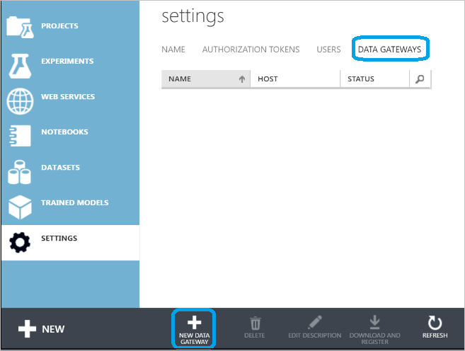
4. In the **New data gateway** dialog, enter the **Gateway Name** and
    optionally add a **Description**. Click the arrow on the bottom
    right-hand corner to go to the next step of the configuration.

    
5. In the Download and register data gateway dialog, copy the GATEWAY
    REGISTRATION KEY to the clipboard.

    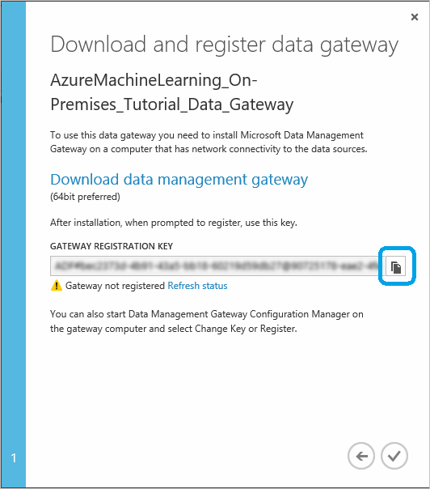
6. If you have not yet
    downloaded and installed the Microsoft Data Management Gateway, then
    click **Download data management gateway**. This takes you to the
    Microsoft Download Center where you can select the gateway version
    you need, download it, and install it. You can find detailed information on installation prerequisites, installation steps, and troubleshooting tips in the beginning sections of the article [Move data between on-premises sources and cloud with Data Management Gateway](../../data-factory/tutorial-hybrid-copy-portal.md).
7. After the gateway is installed, the Data Management Gateway
    Configuration Manager will open and the **Register gateway** dialog
    is displayed. Paste the **Gateway Registration Key** that you copied
    to the clipboard and click **Register**.
8. If you already have a gateway installed, run the Data Management
    Gateway Configuration Manager. Click **Change key**, paste the
    **Gateway Registration Key** that you copied to the clipboard in the previous step, and
    click **OK**.
9. When the installation is complete, the **Register gateway** dialog
    for Microsoft Data Management Gateway Configuration Manager
    is displayed. Paste the GATEWAY REGISTRATION KEY that you copied to
    the clipboard in a previous step and click **Register**.

    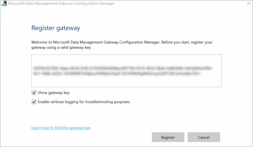
10. The gateway configuration is complete when the following values are
    set on the **Home** tab in Microsoft Data Management Gateway
    Configuration Manager:

    * **Gateway name** and **Instance name** are set to the name of
        the gateway.
    * **Registration** is set to **Registered**.
    * **Status** is set to **Started**.
    * The status bar at the bottom displays **Connected to Data
        Management Gateway Cloud Service** along with a green
        check mark.

      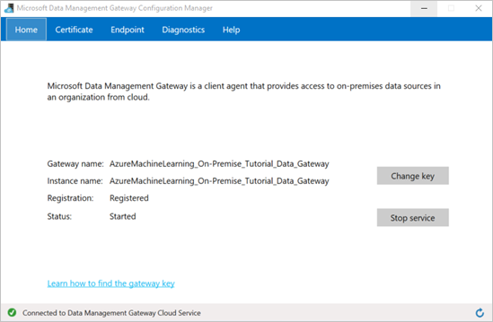

      Azure Machine Learning Studio also gets updated when the registration is successful.

    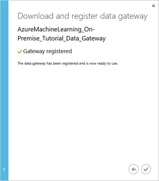
11. In the **Download and register data gateway** dialog, click the
    check mark to complete the setup. The **Settings** page displays the
    gateway status as "Online". In the right-hand pane, you'll find
    status and other useful information.

    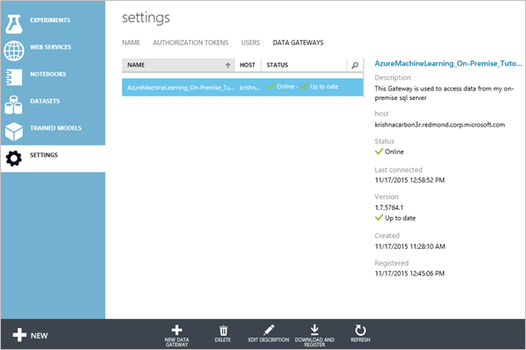
12. In the Microsoft Data Management Gateway Configuration Manager
    switch to the **Certificate** tab. The certificate specified on this
    tab is used to encrypt/decrypt credentials for the on-premises data
    store that you specify in the portal. This certificate is the default
    certificate. Microsoft recommends changing this to your
    own certificate that you back up in your certificate
    management system. Click **Change** to use your own
    certificate instead.

    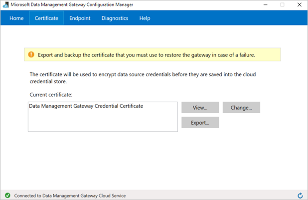
13. (optional) If you want to enable verbose logging in order to
    troubleshoot issues with the gateway, in the Microsoft Data
    Management Gateway Configuration Manager switch to the
    **Diagnostics** tab and check the **Enable verbose logging for
    troubleshooting purposes** option. The logging information can be
    found in the Windows Event Viewer under the **Applications and
    Services Logs** -&gt; **Data Management Gateway** node. You can also
    use the **Diagnostics** tab to test the connection to an on-premises
    data source using the gateway.

    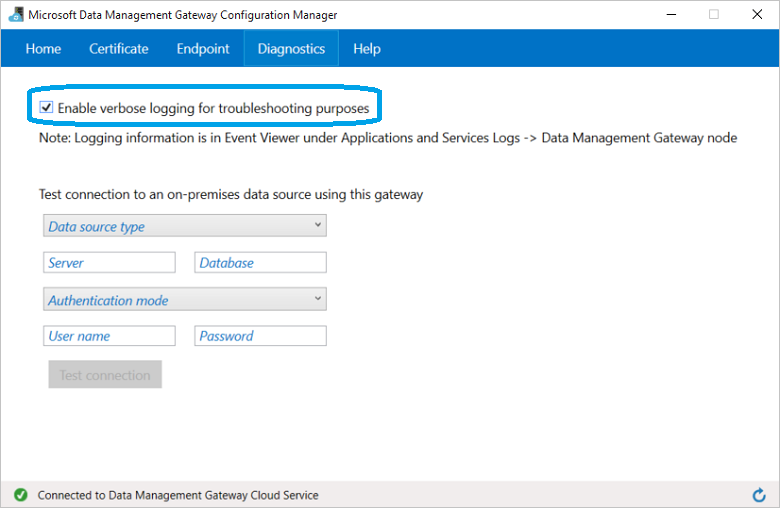

This completes the gateway setup process in Azure Machine Learning.
You're now ready to use your on-premises data.

You can create and set up multiple gateways in Studio for each
workspace. For example, you may have a gateway that you want to connect
to your test data sources during development, and a different gateway
for your production data sources. Azure Machine Learning gives you the
flexibility to set up multiple gateways depending upon your corporate
environment. Currently you can’t share a gateway between workspaces and
only one gateway can be installed on a single computer. For more information, see [Move data between on-premises sources and cloud with Data Management Gateway](../../data-factory/tutorial-hybrid-copy-portal.md).

### Step 2: Use the gateway to read data from an on-premises data source
After you set up the gateway, you can add an **Import Data** module to
an experiment that inputs the data from the on-premises SQL Server database.

1. In Machine Learning Studio, select the **EXPERIMENTS** tab, click
   **+NEW** in the lower-left corner, and select **Blank Experiment**
   (or select one of several sample experiments available).
2. Find and drag the **Import Data** module to the experiment canvas.
3. Click **Save as** below the canvas. Enter "Azure Machine Learning
   On-Premises SQL Server Tutorial" for the experiment name, select the
   workspace, and click the **OK** check mark.

   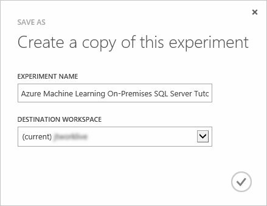
4. Click the **Import Data** module to select it, then in the
   **Properties** pane to the right of the canvas, select "On-Premises
   SQL Database" in the **Data source** dropdown list.
5. Select the **Data gateway** you installed and registered. You can
   set up another gateway by selecting "(add new Data Gateway…)".

   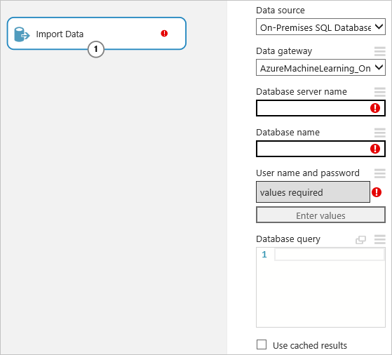
6. Enter the SQL **Database server name** and **Database name**, along
   with the SQL **Database query** you want to execute.
7. Click **Enter values** under **User name and password** and enter
   your database credentials. You can use Windows Integrated
   Authentication or SQL Server Authentication depending upon how your
   on-premises SQL Server is configured.

   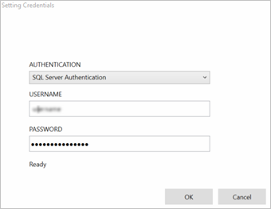

   The message "values required" changes to "values set" with a green check mark. You only need to enter the credentials once unless the database information or password changes. Azure Machine Learning uses the certificate you provided when you installed the gateway to encrypt the credentials in the cloud. Azure never stores on-premises credentials without encryption.

   
8. Click **RUN** to run the experiment.

Once the experiment finishes running, you can visualize the data you
imported from the database by clicking the output port of the **Import
Data** module and selecting **Visualize**.

Once you finish developing your experiment, you can deploy and
operationalize your model. Using the Batch Execution Service, data from
the on-premises SQL Server database configured in the **Import Data** module will
be read and used for scoring. While you can use the Request Response
Service for scoring on-premises data, Microsoft recommends using the
[Excel Add-in](excel-add-in-for-web-services.md)
instead. Currently, writing to an on-premises SQL Server database through
**Export Data** is not supported either in your experiments or published
web services.
