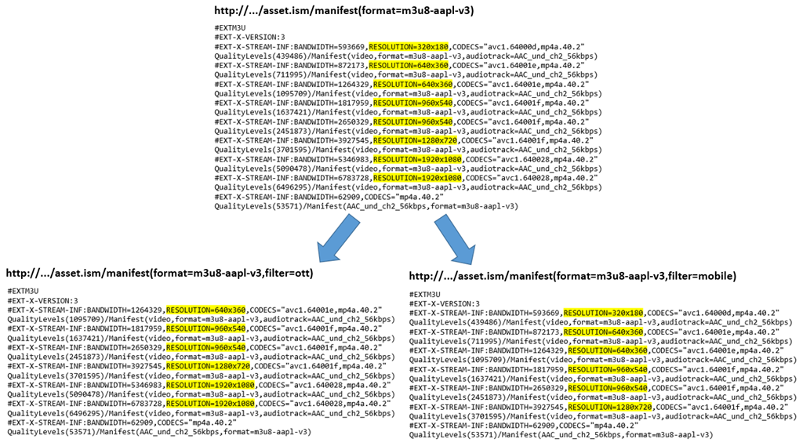

---
# Mandatory fields. See more on aka.ms/skyeye/meta.
title: Azure Media Services concepts - Azure | Microsoft Docs
description: This topic gives a brief overview of Azure Media Services concepts and provides links for details.
services: media-services
documentationcenter: ''
author: Juliako
manager: femila
editor: ''

ms.service: media-services
ms.workload: 
ms.topic: article
ms.date: 02/26/2019
ms.author: juliako
ms.custom: seodec18

---

# Media Services concepts

This topic gives a brief overview of Azure Media Services concepts and provides links to articles with in-depth explanation of Media Services v3 concepts and functionality. The fundamental concepts described in these topics should be reviewed prior to starting development.

## Cloud upload and storage

To start managing, encrypting, encoding, analyzing, and streaming media content in Azure, you need to create a Media Services account and upload your digital files into **Assets**.

- [Cloud upload and storage](storage-account-concept.md)
- [Assets concept](assets-concept.md)

## Encoding

Once you upload your high-quality digital media files into Assets, you can encode them into formats that can be played on a wide variety of browsers and devices. 

To encode with Media Services v3, you need to create **Transforms** and **Jobs**.

- [Transforms and Jobs](transforms-jobs-concept.md)
- [Encoding with Media Services](encoding-concept.md)

## Media analytics

To analyze your video and audio files, you also need to create **Transforms** and **Jobs**.

- [Analyzing video and audio files](analyzing-video-audio-files-concept.md)

## Packaging, delivery, protection

Once your content is encoded, you can take advantage of **Dynamic Packaging**. **Streaming Endpoint** is the dynamic packaging service in Media Services used to deliver media content to client players. To make videos in the output asset available to clients for playback, you have to create a **Streaming Locator** and then build streaming URLs. 

When creating the **Streaming Locator**, in addition to asset's name, you need to specify **Streaming Policy**. **Streaming Policies** enable you to define streaming protocols and encryption options (if any) for your **Streaming Locators**.

Dynamic Packaging is used whether you stream your content live or on-demand. The following diagram shows the on-demand streaming with dynamic packaging workflow.

With Media Services, you can deliver your live and on-demand content encrypted dynamically with Advanced Encryption Standard (AES-128) or/and any of the three major digital rights management (DRM) systems: Microsoft PlayReady, Google Widevine, and Apple FairPlay. Media Services also provides a service for delivering AES keys and DRM (PlayReady, Widevine, and FairPlay) licenses to authorized clients.

If specifying encryption options on your stream, create the **Content Key Policy** and associate it with your **Streaming Locator**. The **Content Key Policy** enables you to configure how the content key is delivered to end clients.

The following image illustrates the Media Services content protection workflow: 

&#42; dynamic encryption supports AES-128 "clear key", CBCS, and CENC. 

You can use Media Services **Dynamic Manifests** to stream only a specific rendition or subclips of your video. In the following example, an encoder was used to encode a mezzanine asset into seven ISO MP4s video renditions (from 180p to 1080p). The encoded asset can be dynamically packaged into any of the following streaming protocols: HLS, MPEG DASH, and Smooth.  At the top of the diagram, the HLS manifest for the asset with no filters is shown (it contains all seven renditions).  In the bottom left, the HLS manifest to which a filter named "ott" was applied is shown. The "ott" filter specifies to remove all bitrates below 1 Mbps, which resulted in the bottom two quality levels being stripped off in the response. In the bottom right, the HLS manifest to which a filter named "mobile" was applied is shown. The "mobile" filter specifies to remove renditions where the resolution is larger than 720p, which resulted in the two 1080p renditions being stripped off.

- [Dynamic packaging](dynamic-packaging-overview.md)
- [Streaming Endpoints](streaming-endpoint-concept.md)
- [Streaming Locators](streaming-locators-concept.md)
- [Streaming Policies](streaming-policy-concept.md)
- [Content Key Policies](content-key-policy-concept.md)
- [Content protection](content-protection-overview.md)
- [Dynamic manifests](filters-dynamic-manifest-overview.md)
- [Filters](filters-concept.md)

## Live streaming

Azure Media Services enables you to deliver live events to your customers on the Azure cloud. **Live Events** are responsible for ingesting and processing the live video feeds. When you create a **Live Event**, an input endpoint is created that you can use to send a live signal from a remote encoder. Once you have the stream flowing into the **Live Event**, you can begin the streaming event by creating an **Asset**, **Live Output**, and **Streaming Locator**. **Live Output** will archive the stream  into the **Asset** and make it available to viewers through the **Streaming Endpoid**. A **Live Event** can be one of two types: **pass-through** and **live encoding**.

The following image illustrates the Pass-through type workflow:

- [Live streaming overview](live-streaming-overview.md)
- [Live Events and Live Outputs](live-events-outputs-concept.md)

## Monitoring

### Event Grid

To see the progress of the job, you should use **Event Grid**. Media Services also emits the Live event types. With Event Grid, your apps can listen for and react to events from virtually all Azure services, as well as custom sources. 

- [Handling Event Grid events](reacting-to-media-services-events.md)
- [Schemas](media-services-event-schemas.md)

## Player clients

You can use Azure Media Player to play back media content streamed by Media Services on a wide variety of browsers and devices. Azure Media Player utilizes industry standards, such as HTML5, Media Source Extensions (MSE), and Encrypted Media Extensions (EME) to provide an enriched adaptive streaming experience. 

- [Azure Media Player overview](use-azure-media-player.md)

## Next steps

[Upload, encode, and stream using Media Services](stream-files-tutorial-with-api.md)
