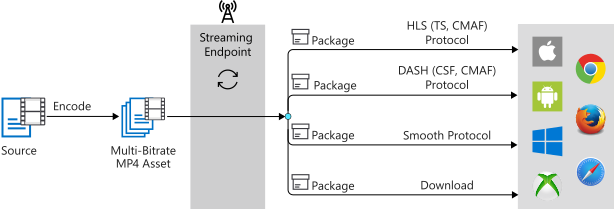

---
# Mandatory fields. See more on aka.ms/skyeye/meta.
title: Encoding in the cloud with Media Services - Azure | Microsoft Docs
description: This topic describes the encoding process when using Azure Media Services
services: media-services
documentationcenter: ''
author: Juliako
manager: femila
editor: ''

ms.service: media-services
ms.workload: 
ms.topic: article
ms.date: 04/15/2019
ms.author: juliako
ms.custom: seodec18

---

# Encoding with Media Services

Azure Media Services enables you to encode your high-quality digital media files into adaptive bitrate MP4 files so your content can be played on a wide variety of browsers and devices. A successful Media Services encoding job creates an output Asset with a set of adaptive bitrate MP4s and streaming configuration files. The configuration files include .ism, .ismc, .mpi, and other files that you should not modify. Once the encoding job is done, you can take advantage of [Dynamic Packaging](dynamic-packaging-overview.md) and start streaming.

To make videos in the output Asset available to clients for playback, you have to create a **Streaming Locator** and build streaming URLs. Then, based on the specified format in the manifest, your clients receive the stream in the protocol they have chosen.

The following diagram shows the on-demand streaming with dynamic packaging workflow.

This topic gives you guidance on how to encode your content with Media Services v3.

## Transforms and jobs

To encode with Media Services v3, you need to create a [Transform](https://docs.microsoft.com/rest/api/media/transforms) and a [Job](https://docs.microsoft.com/rest/api/media/jobs). A transform defines the recipe for your encoding settings and outputs, and the job is an instance of the recipe. For more information, see [Transforms and Jobs](transforms-jobs-concept.md)

When encoding with Media Services, you use presets to tell the encoder how the input media files should be processed. For example, you can specify the video resolution and/or the number of audio channels you want in the encoded content. 

You can get started quickly with one of the recommended built-in presets based on industry best practices or you can choose to build a custom preset to target your specific scenario or device requirements. For more information, see [Encode with a custom Transform](customize-encoder-presets-how-to.md). 

Starting with January 2019, when encoding with Media Encoder Standard to produce MP4 file(s), a new .mpi file is generated and added to the output Asset. This MPI file is intended to improve performance for [dynamic packaging](dynamic-packaging-overview.md) and streaming scenarios.

> [!NOTE]
> You should not modify or remove the MPI file, or take any dependency in your service on the existence (or not) of such a file.

## Built-in presets

Media Services currently supports the following built-in encoding presets:  

### BuiltInStandardEncoderPreset preset

[BuiltInStandardEncoderPreset](https://docs.microsoft.com/rest/api/media/transforms/createorupdate#builtinstandardencoderpreset) is used to set a built-in preset for encoding the input video with the Standard Encoder. 

The following presets are currently supported:

- **EncoderNamedPreset.AACGoodQualityAudio** - produces a single MP4 file containing only stereo audio encoded at 192 kbps.
- **EncoderNamedPreset.AdaptiveStreaming** (recommended). For more information, see [auto-generating a bitrate ladder](autogen-bitrate-ladder.md).
- **EncoderNamedPreset.ContentAwareEncodingExperimental** - exposes an experimental preset for content-aware encoding. Given any input content, the service attempts to automatically determine the optimal number of layers, appropriate bitrate and resolution settings for delivery by adaptive streaming. The underlying algorithms will continue to evolve over time. The output will contain MP4 files with video and audio interleaved. For more information, see [Experimental preset for content-aware encoding](cae-experimental.md).
- **EncoderNamedPreset.H264MultipleBitrate1080p** - produces a set of 8 GOP-aligned MP4 files, ranging from 6000 kbps to 400 kbps, and stereo AAC audio. Resolution starts at 1080p and goes down to 360p.
- **EncoderNamedPreset.H264MultipleBitrate720p** - produces a set of 6 GOP-aligned MP4 files, ranging from 3400 kbps to 400 kbps, and stereo AAC audio. Resolution starts at 720p and goes down to 360p.
- **EncoderNamedPreset.H264MultipleBitrateSD** - produces a set of 5 GOP-aligned MP4 files, ranging from 1600kbps to 400 kbps, and stereo AAC audio. Resolution starts at 480p and goes down to 360p.
- **EncoderNamedPreset.H264SingleBitrate1080p** - produces an MP4 file where the video is encoded with H.264 codec at 6750 kbps and a picture height of 1080 pixels, and the stereo audio is encoded with AAC-LC codec at 64 kbps.
- **EncoderNamedPreset.H264SingleBitrate720p** - produces an MP4 file where the video is encoded with H.264 codec at 4500 kbps and a picture height of 720 pixels, and the stereo audio is encoded with AAC-LC codec at 64 kbps.
- **EncoderNamedPreset.H264SingleBitrateSD** - produces an MP4 file where the video is encoded with H.264 codec at 2200 kbps and a picture height of 480 pixels, and the stereo audio is encoded with AAC-LC codec at 64 kbps.

To see the most up-to-date presets list, see [built-in presets to be used for encoding videos](https://docs.microsoft.com/rest/api/media/transforms/createorupdate#encodernamedpreset).

To see how the presets are used, check out [Uploading, encoding, and streaming files](stream-files-tutorial-with-api.md).

### StandardEncoderPreset preset

[StandardEncoderPreset](https://docs.microsoft.com/rest/api/media/transforms/createorupdate#standardencoderpreset) describes settings to be used when encoding the input video with the Standard Encoder. Use this preset when customizing Transform presets. 

#### Considerations

When creating custom presets, the following considerations apply:

- All values for height and width on AVC content must be a multiple of 4.
- In Azure Media Services v3, all of the encoding bitrates are in bits per second. This is different from the presets with our v2 APIs, which used kilobits/second as the unit. For example, if the bitrate in v2 was specified as 128 (kilobits/second), in v3 it would be set to 128000 (bits/second).

#### Examples

Media Services fully supports customizing all values in presets to meet your specific encoding needs and requirements. For examples that show how to customize encoder presets, see:

- [Customize presets with .NET](customize-encoder-presets-how-to.md)
- [Customize presets with CLI](custom-preset-cli-howto.md)
- [Customize presets with REST](custom-preset-rest-howto.md)

## Scaling encoding in v3

To scale media processing, see [Scale with CLI](media-reserved-units-cli-how-to.md).

## Next steps

* [Encode from an HTTPS URL using built-in presets](job-input-from-http-how-to.md)
* [Encode a local file using built-in presets](job-input-from-local-file-how-to.md)
* [Build a custom preset to target your specific scenario or device requirements](customize-encoder-presets-how-to.md)
* [Upload, encode, and stream using Media Services](stream-files-tutorial-with-api.md)
