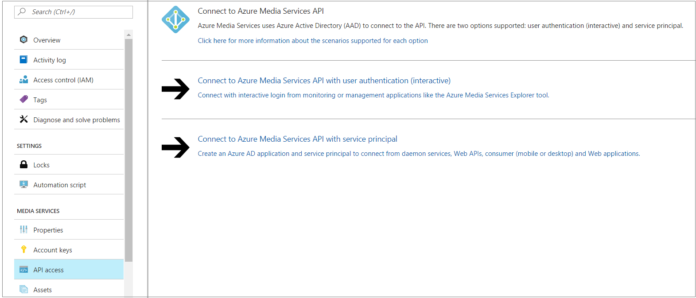
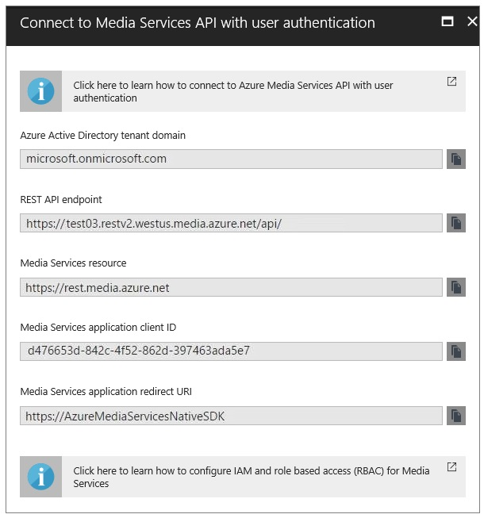
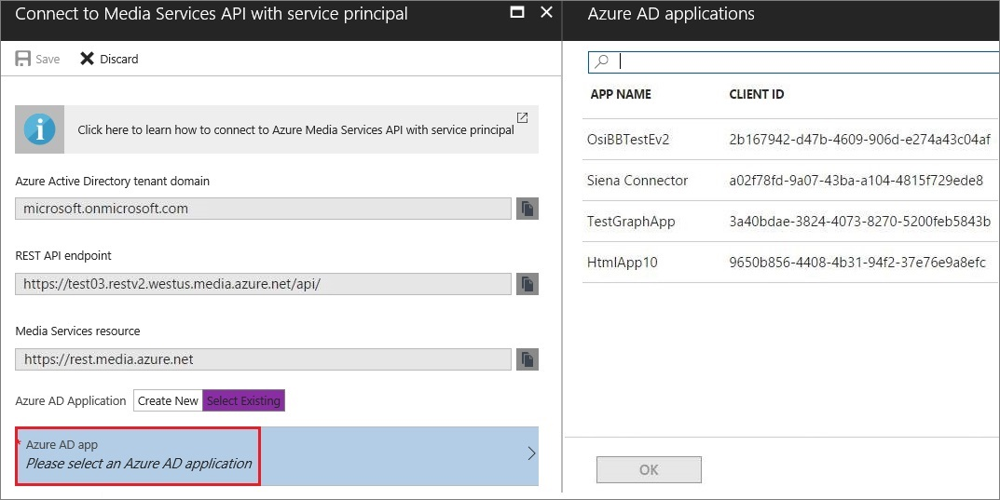
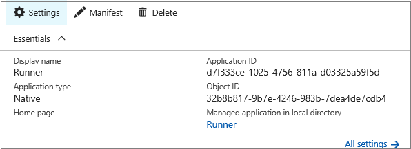

# Get started with Azure AD authentication by using the Azure portal

Learn how to use the Azure portal to access Azure Active Directory (Azure AD) authentication to access the Azure Media Services API.

## Prerequisites

- An Azure account. If you don't have an account, start with an [Azure free trial](https://azure.microsoft.com/pricing/free-trial/). 
- A Media Services account. For more information, see [Create an Azure Media Services account by using the Azure portal](media-services-portal-create-account.md).
- Make sure you review the [Accessing Azure Media Services API with Azure AD authentication overview](media-services-use-aad-auth-to-access-ams-api.md). 

When you use Azure AD authentication with Azure Media Services, you have two authentication options:

- **User authentication**. Authenticate a person who is using the app to interact with Media Services resources. The interactive application should first prompt the user for credentials. An example is a management console app used by authorized users to monitor encoding jobs or live streaming. 
- **Service principal authentication**. Authenticate a service. Applications that commonly use this authentication method are apps that run daemon services, middle-tier services, or scheduled jobs: web apps, function apps, logic apps, APIs, or a microservice.

> [!IMPORTANT]
> Currently, Media Services supports the Azure Access Control service authentication model. However, Access Control authorization will be deprecated on June 1, 2018. We recommend that you migrate to the Azure AD authentication model as soon as possible.

## Select the authentication method

1. In the [Azure portal](https://portal.azure.com/), select your Media Services account.
2. Select how to connect to the Media Services API.

	

## User authentication

To connect to the Media Services API by using the user authentication option, the client app needs to request an Azure AD token that has the following parameters:  

* Azure AD tenant endpoint
* Media Services resource URI
* Media Services (native) application client ID 
* Media Services (native) application redirect URI 
* Resource URI for REST Media Services

You can get the values for these parameters on the **Media Services API with user authentication** page. 

If you connect to the Media Services API by using the Media Services Microsoft .NET SDK, the required values are available to you as part of the SDK. For more information, see [Use Azure AD authentication to access the Azure Media Services API with .NET](media-services-dotnet-get-started-with-aad.md).

If you're not using the Media Services .NET client SDK, you must manually create an Azure AD token request by using the parameters discussed earlier. For more information, see [How to use the Azure AD Authentication Library to get the Azure AD token](../active-directory/develop/active-directory-authentication-libraries.md).

## Service principal authentication

To connect to the Media Services API by using the service principal option, your middle-tier app (web API or web application) needs to request an Azure AD token that has the following parameters:  

* Azure AD tenant endpoint
* Media Services resource URI 
* Resource URI for REST Media Services
* Azure AD application values: the **client ID** and **client secret**

You can get the values for these parameters on the **Connect to Media Services API with service principal** page. Use this page to create a new Azure AD application or to select an existing one. After you select the Azure AD app, you can get the client ID (Application ID) and generate the client secret (key) values. 

When the **Service Principal** blade opens, the first Azure AD application that meets the following criteria is selected:

- It is a registered Azure AD application.
- It has Contributor or Owner Role-Based Access Control permissions on the account.

After you create or select an Azure AD app, you can create and copy a client secret (key) and the client ID (Application ID). The client secret and client ID are required to get the access token in this scenario.

If you don't have permissions to create Azure AD apps in your domain, the Azure AD app controls of the blade are not shown, and a warning message is displayed.

If you connect to the Media Services API by using the Media Services .NET SDK, see [Use Azure AD authentication to access the Azure Media Services API with .NET](media-services-dotnet-get-started-with-aad.md).

If you are not using the Media Services .NET client SDK, you must manually create an Azure AD token request using the parameters discussed earlier. For more information, see [How to use the Azure AD Authentication Library to get the Azure AD token](../active-directory/develop/active-directory-authentication-libraries.md).

### Get the client ID and client secret

After you select an existing Azure AD app or select the option to create a new one, the following buttons appear:

To open the Azure AD application blade, click **Manage application**. On the **Manage application** blade, you can get the app's client ID (Application ID). To generate a client secret (key), select **Keys**.

 

### Manage permissions and the application

After you select the Azure AD application, you can manage the application and permissions. To set up your Azure AD application to access other applications, click **Manage permissions**. For management tasks, such as changing keys and reply URLs, or to edit the application’s manifest, click **Manage application**.

### Edit the app's settings or manifest

To edit the app's settings or manifest, click **Manage application**.

## Next steps

Get started with [uploading files to your account](media-services-portal-upload-files.md).
