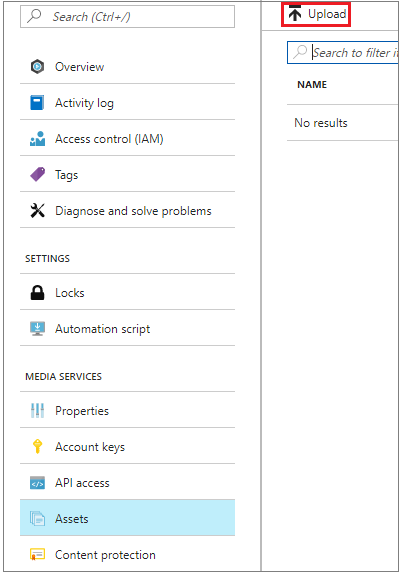

# Upload files into a Media Services account using the Azure portal
> [!div class="op_single_selector"]
> * [Portal](media-services-portal-upload-files.md)
> * [.NET](media-services-dotnet-upload-files.md)
> * [REST](media-services-rest-upload-files.md)
> 
> [!NOTE]
> To complete this tutorial, you need an Azure account. For details, see [Azure Free Trial](https://azure.microsoft.com/pricing/free-trial/). 
> 

In Media Services, you upload your digital files into an asset. The Asset  can contain video, audio, images, thumbnail collections, text tracks and closed caption files (and the metadata about these files.) Once the files are uploaded, your content is stored securely in the cloud for further processing and streaming.

## Upload files

>[!NOTE]
>There is a limit to the maximum file size supported for processing in Media Services. Please see [this](media-services-quotas-and-limitations.md) topic for details about the file size limitation.
>

1. In the [Azure portal](https://portal.azure.com/), select your Azure Media Services account.
2. On the **Settings** blade, click **Assets**.
   
    
3. Click the **Upload** button.
   
    The **Upload a video asset** window appears.
   
   > [!NOTE]
   > There is no file size limitation.
   > 
   > 
4. Browse to the desired video on your computer, select it, and hit OK.  
   
    The upload starts and you can see the progress under the file name.  

Once the upload completes, you will see the new asset listed in the **Assets** window. 

## Next steps
You can now encode your uploaded assets. For more information, see [Encode assets](media-services-portal-encode.md).

You can also use Azure Functions to trigger an encoding job based on a file arriving in the configured container. For more information, see [this sample](https://azure.microsoft.com/resources/samples/media-services-dotnet-functions-integration/ ).

## Media Services learning paths
[!INCLUDE [media-services-learning-paths-include](../../includes/media-services-learning-paths-include.md)]

## Provide feedback
[!INCLUDE [media-services-user-voice-include](../../includes/media-services-user-voice-include.md)]

