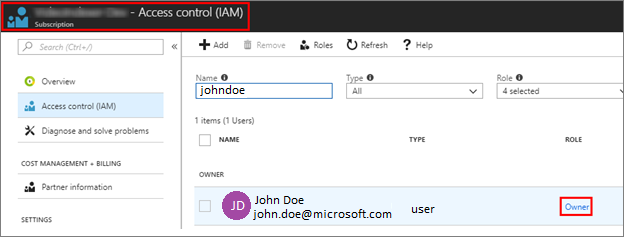
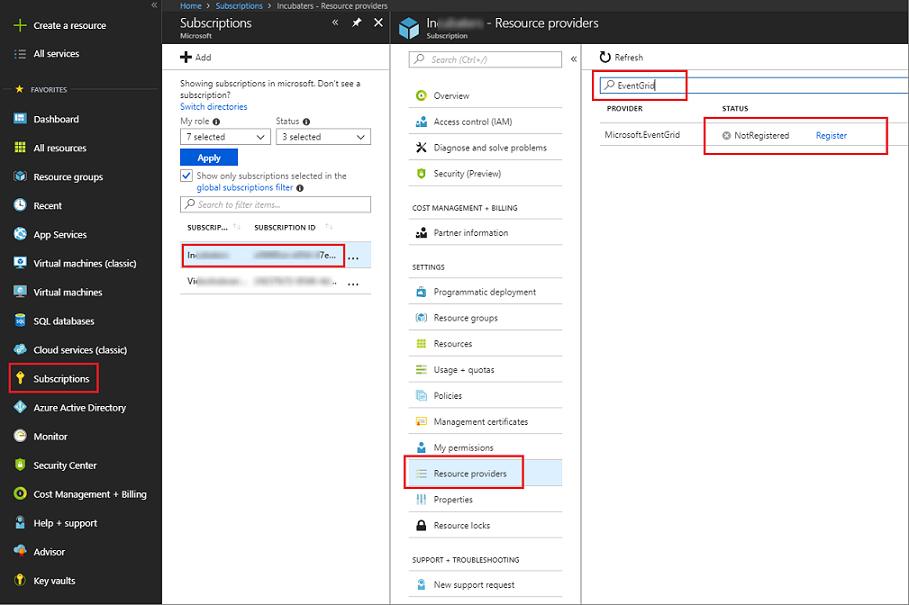
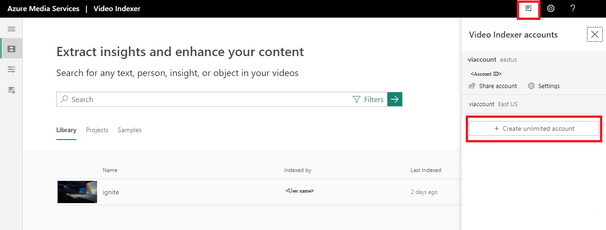
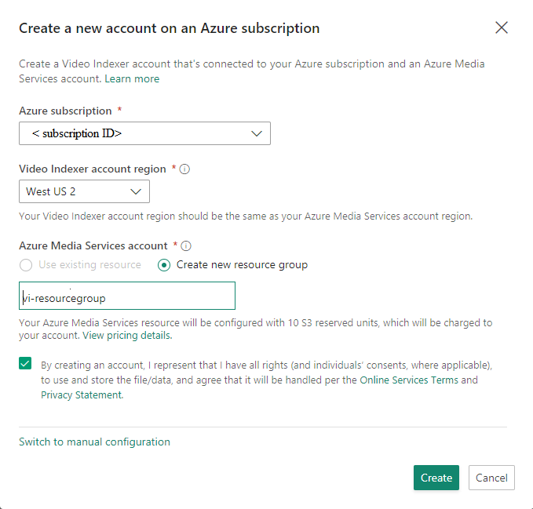
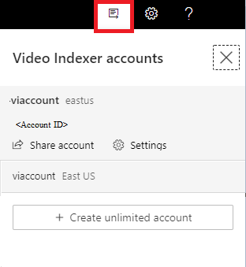
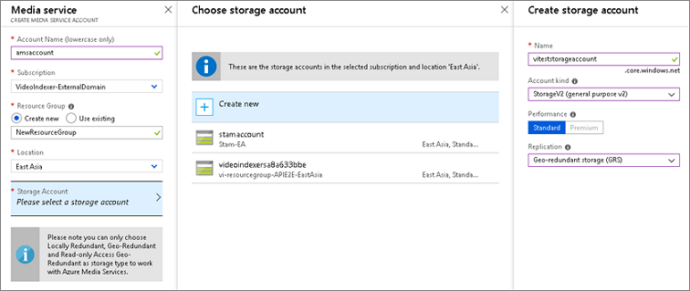
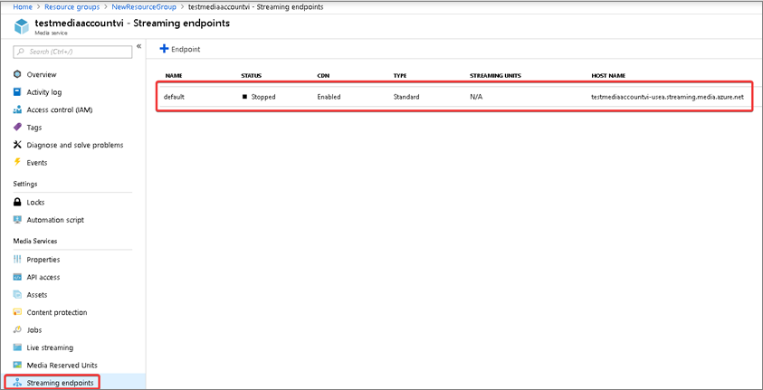
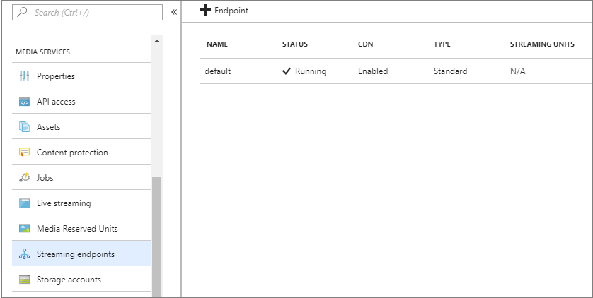
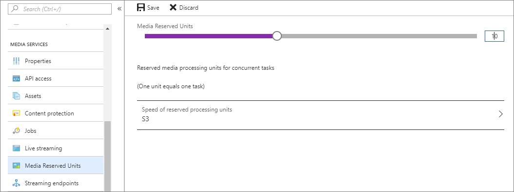

 
# Create a Video Indexer account

When creating a Video Indexer account, you can choose a free trial account (where you get a certain number of free indexing minutes) or a paid option (where you're not limited by the quota). With a free trial, Video Indexer provides up to 600 minutes of free indexing to website users and up to 2400 minutes of free indexing to API users. With the paid option, you create a Video Indexer account that's connected to your Azure subscription. You pay for minutes indexed, for more information, see [Media Services pricing](https://azure.microsoft.com/pricing/details/media-services/).

This article shows how to create a Video Indexer account that's linked to an Azure subscription and an Azure Media Services account. The topic provides steps for connecting to Azure using the automatic (default) flow. It also shows how to connect to Azure manually (advanced).

If you are moving from a *trial* to *paid* Video Indexer account, you can choose to copy all of the videos and model customization to the new account, as discussed in the [Import your content from the trial account](#import-your-content-from-the-trial-account) section.

The article also covers [Linking a Video Indexer account to Azure Government](#video-indexer-in-azure-government).

## Prerequisites for connecting to Azure

* An Azure subscription.

    If you don't have an Azure subscription yet, sign up for [Azure Free Trial](https://azure.microsoft.com/free/).
* An Azure Active Directory (Azure AD) domain.

    If you don't have an Azure AD domain, create this domain with your Azure subscription. For more information, see [Managing custom domain names in your Azure AD](../../active-directory/enterprise-users/domains-manage.md)
* A user in your Azure AD domain with an **Application administrator** role. You'll use this member when connecting your Video Indexer account to Azure.

    This user should be an Azure AD user with a work or school account. Don't use a personal account, such as outlook.com, live.com, or hotmail.com.

    

### Additional prerequisites for automatic flow

* A user and member in your Azure AD domain.

    You'll use this member when connecting your Video Indexer account to Azure.

    This user should be a member in your Azure subscription with either an **Owner** role, or both **Contributor** and **User Access Administrator** roles. A user can be added twice, with two roles. Once with Contributor and once with user Access Administrator. For more information, see [View the access a user has to Azure resources](../../role-based-access-control/check-access.md).

    

### Additional prerequisites for manual flow

* Register the EventGrid resource provider using the Azure portal.

    In the [Azure portal](https://portal.azure.com/), go to **Subscriptions**->[subscription]->**ResourceProviders**.

    Search for **Microsoft.Media** and **Microsoft.EventGrid**. If not in the "Registered" state, click **Register**. It takes a couple of minutes to register.

    

## Create a new account on Azure 

> [!NOTE]
> If your Azure subscription uses certificate-based multi-factor authentication, it's crucial that you perform the following steps on a device that has the required certificates installed.

1. Browse to the [Video Indexer](https://www.videoindexer.ai/) website and sign in.
1. Select the **Create unlimited account** button:

    
1. When the subscriptions list appears, select the subscription you want to use.

    
1. Select an Azure region from the supported locations: West US 2, North Europe, or East Asia.
1. Under **Azure Media Services account**, choose one of these options:

    * To create a new Media Services account, select **Create new resource group**. Provide a name for your resource group.

        Azure will create your new account in your subscription, including a new Azure Storage account.  
    * To use an existing Media Services account, select **Use existing resource**. From the accounts list, select your account.

        Your Media Services account must have the same region as your Video Indexer account.

        > [!NOTE]
        > To minimize indexing duration and low throughput, it's highly recommended to adjust the type and number of [Reserved Units](../previous/media-services-scale-media-processing-overview.md ) in your Media Services account to **10 S3 Reserved Units**. See [Use portal to change reserved units](../previous/media-services-portal-scale-media-processing.md). The reserved units are charged to your account, view [pricing details](https://azure.microsoft.com/pricing/details/media-services/#analytics).
    * To manually configure your connection, select the **Switch to manual configuration** link.

        For detailed information, see the [Connect to Azure manually](#connect-to-azure-manually-advanced-option) (advanced option) section that follows.
1. When you're done, choose **Create**. This operation might take up to a few minutes.

    After you're connected to Azure, your new Video Indexer account appears in the account list:

    
1. Make sure the Streaming Endpoint of the Media Services account is running before you can play your videos in the Video Indexer web app (press start if it is the stopped state).

> [!TIP]
> To give a friendly display hame to your account go to **Settings**.

## Connect to Azure manually (advanced option)

If the connection to Azure failed, you can attempt to troubleshoot the problem by connecting manually.

> [!NOTE]
> It's highly recommended to have the following three accounts in the same region: the Video Indexer account that you're connecting with the Media Services account, as well as the Azure storage account connected to the same Media Services account.

### Create and configure a Media Services account

1. Use the [Azure](https://portal.azure.com/) portal to create an Azure Media Services account, as described in [Create an account](../previous/media-services-portal-create-account.md).

     Make sure the Media Services account was created with the classic APIs. 
 
    

    When creating a storage account for your Media Services account, select **StorageV2** for account kind and **Geo-redundant** (GRS) for replication fields.

    

    > [!NOTE]
    > Make sure to write down the Media Services resource and account names. You'll need them for the steps in the next section.
1. Adjust the type and number of [reserved units](../previous/media-services-scale-media-processing-overview.md ) to **10 S3 Reserved Units** in the Media Services account you created. See [Use portal to change reserved units](../previous/media-services-portal-scale-media-processing.md).

    The reserved units are charged to your account, view [pricing details](https://azure.microsoft.com/pricing/details/media-services/#analytics).s
1. Before you can play your videos in the Video Indexer web app, you must start the default **Streaming Endpoint** of the new Media Services account.

    In the new Media Services account, select **Streaming endpoints**. Then select the streaming endpoint and press start.

    
4. For Video Indexer to authenticate with Media Services API, an AD app needs to be created. The following steps guide you through the Azure AD authentication process described in [Get started with Azure AD authentication by using the Azure portal](../previous/media-services-portal-get-started-with-aad.md):

    1. In the new Media Services account, select **API access**.
    2. Select [Service principal authentication method](../previous/media-services-portal-get-started-with-aad.md).
    3. Get the client ID and client secret

        After you select **Settings**->**Keys**, add **Description**, press **Save**, and the key value gets populated.

        If the key expires, the account owner will have to contact Video Indexer support to renew the key.

        > [!NOTE]
        > Make sure to write down the key value and the Application ID. You'll need it for the steps in the next section.

### Connect manually

In the **Create a new account on an Azure subscription** dialog of your [Video Indexer](https://www.videoindexer.ai/) page, select the **Switch to manual configuration** link.

In the dialog, provide the following information:

|Setting|Description|
|---|---|
|Video Indexer account region|The name of the Video Indexer account region. For better performance and lower costs, it's highly recommended to specify the name of the region where the Azure Media Services resource and Azure Storage account are located. |
|Azure AD tenant|The name of the Azure AD tenant, for example "contoso.onmicrosoft.com". The tenant information can be retrieved from the Azure portal. Place your cursor over the name of the signed-in user in the top-right corner. Find the name to the right of **Domain**.|
|Subscription ID|The Azure subscription under which this connection should be created. The subscription ID can be retrieved from the Azure portal. Select **All services** in the left panel, and search for "subscriptions". Select **Subscriptions** and choose the desired ID from the list of your subscriptions.|
|Azure Media Services resource group name|The name for the resource group in which you created the Media Services account.|
|Media service resource name|The name of the Azure Media Services account that you created in the previous section.|
|Application ID|The Azure AD application ID (with permissions for the specified Media Services account) that you created in the previous section.|
|Application key|The Azure AD application key that you created in the previous section. |

### Import your content from the *trial* account

When creating a new account, you have an option to import your content from the *trial* account into the new account. If you check the *import* option in the **Create a new account on an Azure subscription** dialog, all media and content model customizations will be copied from the *trial* account into the new account.

The ability to import the content is valid for both automated and manual approaches described above.

> [!NOTE]
> The content can only be imported once from each account.
>
> The *trial* account is not availagle on the Azure Government cloud.

## Azure Media Services considerations

The following Azure Media Services related considerations apply:

* If you plan to connect to an existing Media Services account, make sure the Media Services account was created with the classic APIs. 
 
    
* If you connect to an existing Media Services account, Video Indexer doesn't change the existing media **Reserved Units** configuration.

   You might need to adjust the type and number of Media Reserved Units according to your planned load. Keep in mind that if your load is high and you don't have enough units or speed, videos processing can result in timeout failures.
* If you connect to a new Media Services account, Video Indexer automatically starts the default **Streaming Endpoint** in it:

    

    Streaming endpoints have a considerable startup time. Therefore, it may take several minutes from the time you connected your account to Azure until your videos can be streamed and watched in the Video Indexer web app.
* If you connect to an existing Media Services account, Video Indexer doesn't change the default Streaming Endpoint configuration. If there's no running **Streaming Endpoint**, you can't watch videos from this Media Services account or in Video Indexer.
* If you connect automatically, Video Indexer sets the media **Reserved Units** to 10 S3 units:

    
    
## Automate creation of the Video Indexer account

To automate the creation of the account is a two steps process:
 
1. Use Azure Resource Manager to create an Azure Media Services account + Azure AD application.

    See an example of the [Media Services account creation template](https://github.com/Azure-Samples/media-services-v3-arm-templates).
1. Call [Create-Account with the Media Services and Azure AD application](https://api-portal.videoindexer.ai/docs/services/Operations/operations/Create-Paid-Account).

## Video Indexer in Azure Government

### Prerequisites for connecting to Azure Government

-	An Azure subscription in [Azure Government](https://docs.microsoft.com/azure/azure-government/).
- An Azure AD account in Azure Government.
- All pre-requirements of permissions and resources as described above in [Prerequisites for connecting to Azure](#prerequisites-for-connecting-to-azure).

### Create new account via the Azure Government portal

> [!NOTE]
> The Azure Government cloud does not include a *trial* experience of Video Indexer.

To create a paid account via the Video Indexer portal:

1. Go to https://videoindexer.ai.azure.us 
1. Log in with your Azure Government Azure AD account.
1.	If you do not have any Video Indexer accounts in Azure Government that you are an owner or a contributor to, you will get an empty experience from which you can start creating your account. 

    The rest of the flow is as described in above , only the regions to select from will be Government regions in which video Indexer is available 

    If you already are a contributor or an admin of an existing one or more Video Indexer account in Azure Government, you will be taken to that account and from there you can start a follow steps for creating an additional account if needed, as described above.
    
### Create new account via the API on Azure Government

To create a paid account in Azure Government, follow the instructions in [Create-Paid-Account](https://api-portal.videoindexer.ai.azure.us/docs/services/Operations/operations/Create-Paid-Account). This API end point only includes Government cloud regions.

### Limitations of Video Indexer on Azure Government

*	No manual content moderation available in Government cloud. 

    In the public cloud when content is deemed offensive based on a content moderation, the customer can ask for a human to look at that content and potentially revert that decision.  
*	No trial accounts. 
* Bing description - in Gov cloud we will not present a description of celebrities and named entities identified. This is a UI capability only. 

## Clean up resources

After you are done with this tutorial, delete resources that you are not planning to use.

### Delete a Video Indexer account

If you want to delete a Video Indexer account, you can delete the account from the Video Indexer website. To delete the account, you must be the owner.

Select the account -> **Settings** -> **Delete this account**. 

The account will be permanently deleted in 90 days.

## Next steps

You can programmatically interact with your trial account and/or with your Video Indexer accounts that are connected to Azure by following the instructions in: [Use APIs](video-indexer-use-apis.md).

You should use the same Azure AD user you used when connecting to Azure.
