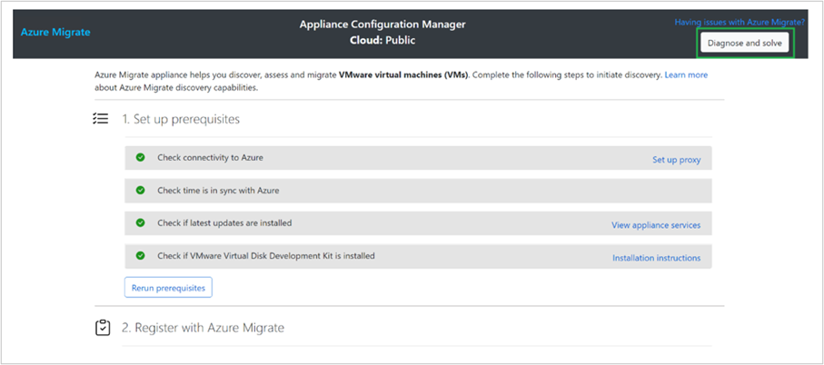
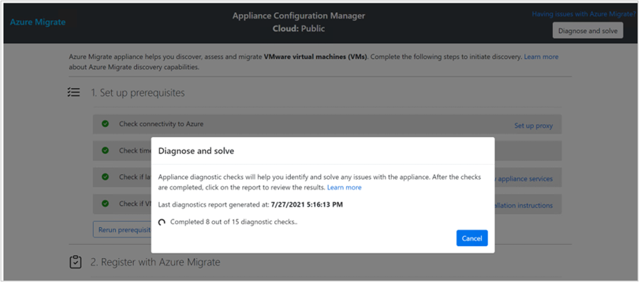

# Diagnose and solve issues with Azure Migrate appliance

The **Diagnose and solve** capability on Azure Migrate appliance helps users identify and self-assess any issues with the appliance configuration that might be blocking the initiation of discovery or issues with an ongoing Migrate operation like discovery, assessment and/or replication (*in case of VMware appliance*) from the appliance. 

You can run **Diagnose and solve** at any time from the appliance configuration manager to generate a diagnostics report. The report provides information about the checks performed, their status, the issues identified and recommendation steps to solve the issues. 

> [!IMPORTANT]
> **Diagnose and solve** capability is currently in preview for Azure Migrate appliance.
> This preview is covered by customer support and can be used for production workloads.
> For more information, see [Supplemental Terms of Use for Microsoft Azure Previews](https://azure.microsoft.com/support/legal/preview-supplemental-terms/).

## Diagnostic checks

*Diagnose and solve* runs some pre-validations to see if the required configuration files are not missing or blocked by an anti-virus software on the appliance and then performs the following checks: 

**Category** | **Diagnostics check** |**Description**
--- | --- | --- |
**Prerequisite checks** | Connectivity checks | Checks if the appliance has connectivity to Azure either directly or via proxy.
|| Time sync check | Checks if the appliance server time is in sync with network time.
|| Auto update check | Checks if auto-update is enabled and if all agents running on the appliance are up to date.
||VDDK check | Checks if the required VDDK files have been downloaded and copied at the required location on the appliance server.
**Service health checks** |Operational status |Checks if the agents on the appliance are in running state.  *If not, appliance will auto-resolve by restarting the agents.* 
||Service endpoint connectivity |Checks if the agents can communicate to their respective services on Azure either directly or via proxy.
**Azure-specific checks** |AAD App availability* | Checks if the AAD App created during the appliance registration is available and is accessible from the appliance.
||Migrate project availability* | Checks if the Migrate project to which the appliance has been registered still exists and is accessible from the appliance.
||Essential resources availability*| Checks if the Migrate resources created during appliance registration still exist and are accessible from the appliance.
**Appliance-specific checks** | Key Vault certificate availability* | Checks if the certificate downloaded from Key Vault during appliance registration is still available on the appliance server.   *If not, appliance will auto-resolve by downloading the certificate again, provided the Key Vault is available and accessible*.
|| Credential store availability | Checks if the Credential store resources on the appliance server have not been moved/deleted/edited.
|| Replication appliance/ASR components | Checks if the same server has also been used to install any ASR/replication appliance components. *It is currently not supported to install both Azure Migrate and replication appliance (for agent-based migration) on the same server.*
|| OS license availability | Checks if the evaluation license on the appliance server created from OVA/VHD is still valid. *The Windows Server 2016 evaluation license is valid for 180 days.*
|| CPU & memory utilization | Checks the CPU and memory utilized by the Migrate agents on the appliance server.  

**checked and reported only if the appliance has already been registered. These checks are run in the context of the current Azure user logged in the appliance*.

## Running diagnostic checks

If you are getting any issues with the appliance during its configuration or seeing issues with the ongoing Migrate operations like discovery, assessment and/or replication (*in case of VMware appliance*) on the portal, you can go to the appliance configuration manager and run diagnostics.

> [!NOTE]
> Currently **Diagnose and solve** can perform checks related to appliance connectivity to Azure, availability of required resources on appliance server and/or Azure. The connectivity or discovery issues with the source environment like vCenter Server/ESXi hosts/Hyper-V hosts/VMs/physical servers are currently not covered under **Diagnose and solve**.
 
1. Select **Diagnose and solve** from the ribbon at the top of the configuration manager.

    
    
    After selecting **Diagnose and solve**, the appliance automatically starts running the diagnostic checks. This may take around 5 minutes to complete.
    *You would see the timestamp of the last diagnostics report, if you ran the checks before.*
     
    

1. Once diagnostic checks have completed, you can either view the report in another tab where you can choose it save it in a PDF format or you can go to this location-**C:\Users\Public\Desktop\DiagnosticsReport** on the appliance server where the report gets auto-saved in an HTML format.

    

1. The report provides information about the checks performed, their status, the issues identified, and recommendation steps to solve the issues.

    

1. You can follow the remediation steps on the report to solve an issue. If you are unable to resolve the issue, it is recommended that you attach the diagnostics report while creating a Microsoft support case so that it helps expedite the resolution.

## Next steps
If you are getting issues not covered under **Diagnose and solve**, you can go to [troubleshoot  the Azure Migrate appliance](./troubleshoot-appliance.md) to find the remediation steps.