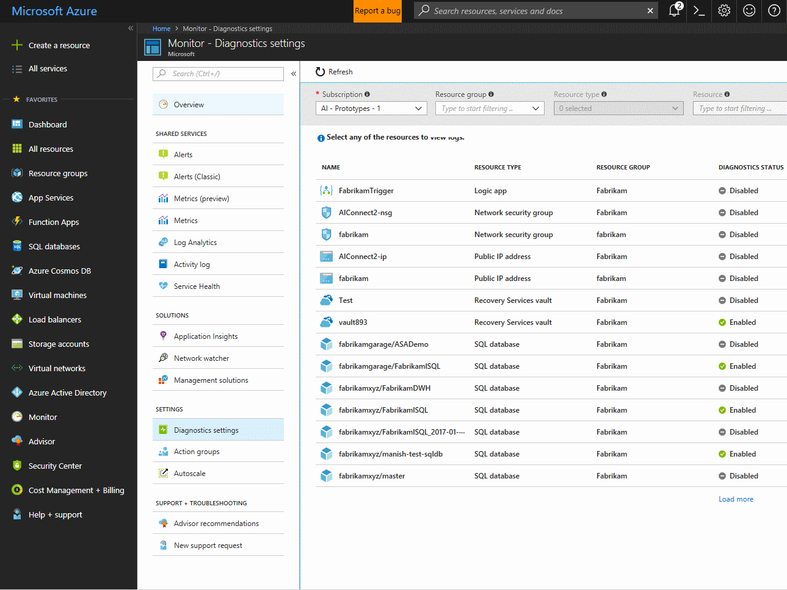
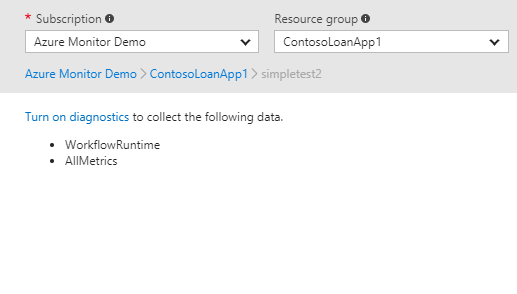
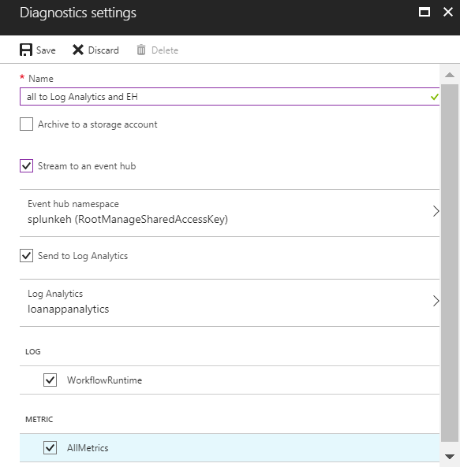

# Stream Azure Diagnostic Logs to Log Analytics

**[Azure diagnostic logs](monitoring-overview-of-diagnostic-logs.md)** can be streamed in near real time to Azure Log Analytics using the portal, PowerShell cmdlets or Azure CLI.

## What you can do with diagnostics logs in Log Analytics

Azure Log Analytics is a flexible log search and analytics tool that enables you to gain insight into the raw log data generated from Azure resources. Some capabilities include:

* **Log search** - Write advanced queries over your log data, correlate logs from various sources, and even generate charts that can be pinned to your Azure dashboard.
* **Alerting** - Detect when one or more events match a particular query and become notified with an email or webhook call.
* **Solutions** - Use pre-built views and dashboards that give you immediate insight into your log data.
* **Advanced analytics** - Apply machine learning and pattern matching algorithms to identify possible issues revealed by your logs.

## Enable streaming of diagnostic logs to Log Analytics

You can enable streaming of diagnostic logs programmatically, via the portal, or using the [Azure Monitor REST APIs](https://docs.microsoft.com/rest/api/monitor/diagnosticsettings). Either way, you create a diagnostic setting in which you specify a Log Analytics workspace and the log categories and metrics you want to send in to that workspace. A diagnostic **log category** is a type of log that a resource may provide.

The Log Analytics workspace does not have to be in the same subscription as the resource emitting logs as long as the user who configures the setting has appropriate RBAC access to both subscriptions.

> [!NOTE]
> Sending multi-dimensional metrics via diagnostic settings is not currently supported. Metrics with dimensions are exported as flattened single dimensional metrics, aggregated across dimension values.
>
> *For example*: The 'Incoming Messages' metric on an Event Hub can be explored and charted on a per queue level. However, when exported via diagnostic settings the metric will be represented as all incoming messages across all queues in the Event Hub.
>
>

## Stream diagnostic logs using the portal
1. In the portal, navigate to Azure Monitor and click on **Diagnostic Settings**

    

2. Optionally filter the list by resource group or resource type, then click on the resource for which you would like to set a diagnostic setting.

3. If no settings exist on the resource you have selected, you are prompted to create a setting. Click "Turn on diagnostics."

   

   If there are existing settings on the resource, you will see a list of settings already configured on this resource. Click "Add diagnostic setting."

   

3. Give your setting a name and check the box for **Send to Log Analytics**, then select a Log Analytics workspace.

   

4. Click **Save**.

After a few moments, the new setting appears in your list of settings for this resource, and diagnostic logs are streamed to that workspace as soon as new event data is generated. Note that there may be up to fifteen minutes between when an event is emitted and when it appears in Log Analytics.

### Via PowerShell Cmdlets
To enable streaming via the [Azure PowerShell Cmdlets](insights-powershell-samples.md), you can use the `Set-AzureRmDiagnosticSetting` cmdlet with these parameters:

```powershell
Set-AzureRmDiagnosticSetting -ResourceId [your resource ID] -WorkspaceID [resource ID of the Log Analytics workspace] -Categories [list of log categories] -Enabled $true
```

Note that the workspaceID property takes the full Azure resource ID of the workspace, not the workspace ID/key shown in the Log Analytics portal.

### Via Azure CLI

To enable streaming via the [Azure CLI](insights-cli-samples.md), you can use the [az monitor diagnostic-settings create](/cli/azure/monitor/diagnostic-settings#az-monitor-diagnostic-settings-create) command.

```azurecli
az monitor diagnostic-settings create --name <diagnostic name> \
    --workspace <log analytics name or object ID> \
    --resource <target resource object ID> \
    --resource-group <log analytics workspace resource group> \
    --logs '[
    {
        "category": <category name>,
        "enabled": true
    }
    ]'
```

You can add additional categories to the diagnostic log by adding dictionaries to the JSON array passed as the `--logs` parameter.

The `--resource-group` argument is only required if `--workspace` is not an object ID.

## How do I query the data in Log Analytics?

In the Log Search blade in the portal or Advanced Analytics experience as part of Log Analytics, you can query diagnostic logs as part of the Log Management solution under the AzureDiagnostics table. There are also [several solutions for Azure resources](../azure-monitor/insights/solutions.md) you can install to get immediate insight into the log data you are sending into Log Analytics.

## Next steps

* [Read more about Azure Diagnostic Logs](monitoring-overview-of-diagnostic-logs.md)
