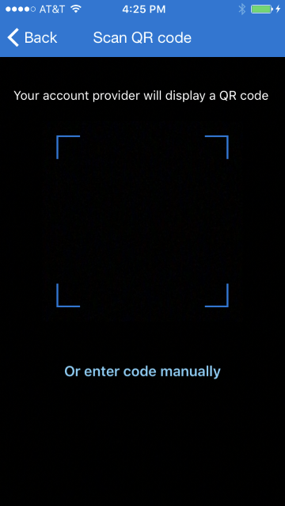
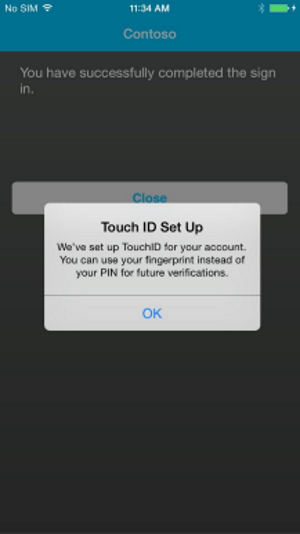
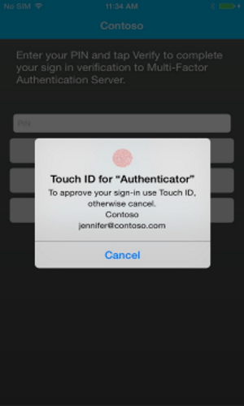

# Get started with the Microsoft Authenticator app
The Microsoft Authenticator app provides an additional level of security in your work or school account (for example, bsimon@contoso.com) or your Microsoft account (for example, bsimon@outlook.com).

The app works in one of two ways:

* **Notification**. The app can help prevent unauthorized access to accounts and stop fraudulent transactions by pushing a notification to your smartphone or tablet. Simply view the notification, and if it's legitimate, select **Verify**. Otherwise, you can select **Deny**. 
* **Verification code**. The app can be used as a software token to generate an OAuth verification code. After you enter your username and password, you enter the code provided by the app into the sign-in screen. The verification code provides a second form of authentication.

The Microsoft Authenticator app replaces the Azure Authenticator app. The Azure Authenticator app still works, but if you decide to move to the new Microsoft Authenticator app, this article can assist you.  

## Opt in for two-step verification

The Microsoft Authenticator app doesn't work by itself. Configure each of your accounts to prompt you for a second verification method after you sign in with your username and password. 

For a work or school account, you don't usually get to choose this feature for yourself. Instead, a security administrator opts in on your behalf and then notifies you to register verification methods for your account. If this scenario applies to you, learn more in [What does Azure Multi-Factor Authentication mean for me](multi-factor-authentication-end-user.md).

For a personal account, you need to set up two-step verification for yourself. If you have a Microsoft account, those steps are available in [About two-step verification](https://support.microsoft.com/help/12408/microsoft-account-about-two-step-verification). 

You can also use the Microsoft Authenticator with non-Microsoft accounts. They may call the feature something other than two-step verification, but you should be able to find it under security or sign-in settings. 

## Install the app
The Microsoft Authenticator app is available for [Windows Phone](http://go.microsoft.com/fwlink/?Linkid=825071), [Android](http://go.microsoft.com/fwlink/?Linkid=825072), and [iOS](http://go.microsoft.com/fwlink/?Linkid=825073).

## Add accounts to the app
For each account that you want to add to the Microsoft Authenticator app, use one of the following procedures:

### Add a personal Microsoft account to the app

For a personal Microsoft account (one that you use to sign in to Outlook.com, Xbox, Skype, etc.), all you have to do is sign in to your account in the Microsoft Authenticator app.

### Add a work or school account to the app using the QR code scanner
1. Go to the security verification settings screen.  For information on how to get to this screen, see [Changing your security settings](multi-factor-authentication-end-user-manage-settings.md#where-to-find-the-settings-page).
2. Check the box next to **Authenticator app** then select **Configure**.

    

    This brings up a screen with a QR code on it.

    
3. Open the Microsoft Authenticator app. On the **accounts** screen, select **+**, and then specify that you want to add a work or school account.
4. Use the camera to scan the QR code, and then select **Done** to close the QR code screen.

    If your camera is not working properly, you can [enter the QR code and URL manually](#add-an-account-to-the-app-manually).

5. When the app shows your account name with a six-digit code underneath it, you're done. 

    

### Add an account to the app manually
1. Go to the security verification settings screen.  For information on how to get to this screen, see [Changing your security settings](multi-factor-authentication-end-user-manage-settings.md).
2. Select **Configure**.

    

    This brings up a screen with a QR code on it.  Note the code and URL.

    
3. Open the Microsoft Authenticator app. On the **accounts** screen, select **+**, and then specify that you want to add a work or school account.

4. In the scanner, select **enter code manually**.

    
5. Enter the code and the URL in the appropriate boxes in the app, then select **Finish**.

    

6. When the app shows your account name with a six-digit code underneath it, you're done.

    

### Add an account to the app using Touch ID
The Microsoft Authenticator app on iOS supports Touch ID.  Azure Multi-Factor Authentication allows organizations to require a PIN for devices. With Touch ID, iOS users don’t need to enter a PIN. Instead, they can scan their fingerprint and select **Approve**.

Setting up Touch ID with Microsoft Authenticator is simple. You complete a normal verification challenge with a PIN. If your device supports Touch ID, Microsoft Authenticator sets it up automatically for that account.

From that point forward, when you're required to verify your sign-in, you select the received push notification and scan your fingerprint instead of entering your PIN.

## Use the app when you sign in

Once your account is added to the app, you may be prompted to do a test verification to make sure everything was configured correctly. After that, you're done! You don't need to do anything else until the next time you sign in.

If you chose to use verification codes in the app, you start to see them on the home page. They change every 30 seconds so that you always have a new code when you need one. But you don't need to do anything with them until you sign in and are prompted to enter a verification code.  