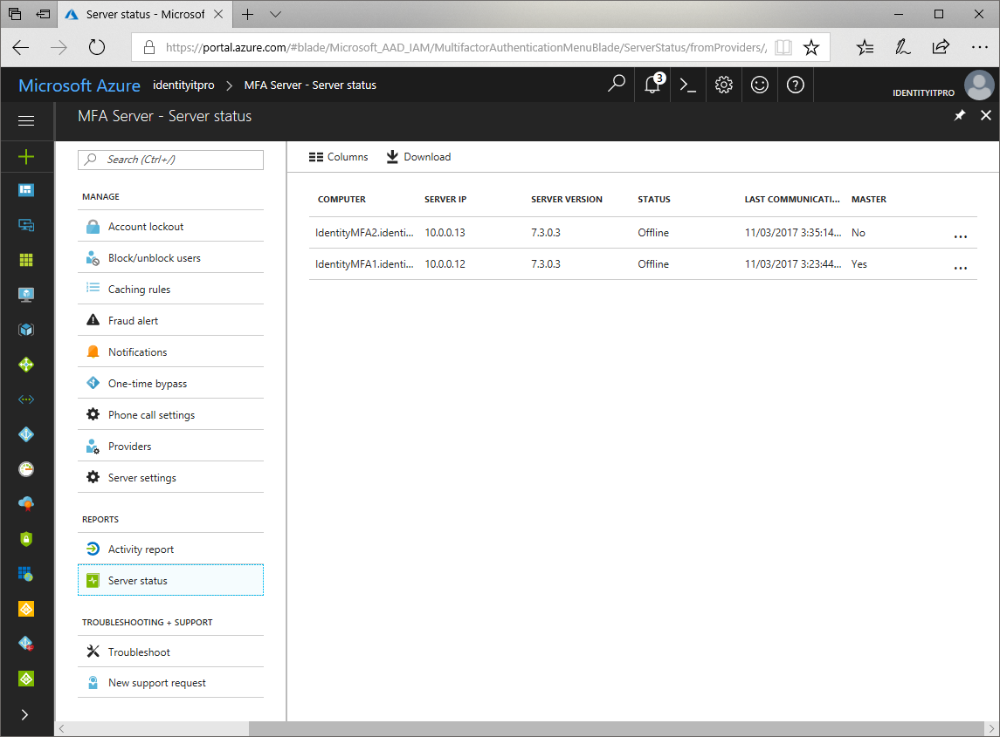

# Reports in Azure Multi-Factor Authentication
Azure Multi-Factor Authentication provides several reports that can be used by you and your organization. These reports can be accessed through the Multi-Factor Authentication Management Portal. The following is a list of the available reports:

| Report | Description |
|:--- |:--- |
| Usage |The usage reports display information on overall usage, user summary, and user details. |
| Server Status |This report displays the status of Multi-Factor Authentication Servers associated with your account. |
| Blocked User History |These reports show the history of requests to block or unblock users. |
| Bypassed User History |Shows the history of requests to bypass Multi-Factor Authentication for a user's phone number. |
| Fraud Alert |Shows a history of fraud alerts submitted during the date range you specified. |
| Queued |Lists reports queued for processing and their status. A link to download or view the report is provided when the report is complete. |

## View reports
1. Sign in to the [Azure classic portal](https://manage.windowsazure.com).
2. On the left, select Active Directory.
3. Follow one of these two options, depending on whether you use Auth Providers:
   * **Option 1**: Click the Multi-Factor Auth Providers tab. Select your MFA provider and click the **Manage** button at the bottom.
   * **Option 2**: Select your directory and go to the **Configure** tab. Under the multi-factor authentication section, select **Manage service settings**. At the bottom of the MFA Service Settings page, click the Go to the portal link.
4. In the Azure Multi-Factor Authentication Management Portal, select the type of report you want from the **View a Report** section in the left navigation.

**Additional Resources**

* [For Users](end-user/multi-factor-authentication-end-user.md)
* [Azure Multi-Factor Authentication on MSDN](https://msdn.microsoft.com/library/azure/dn249471.aspx)
