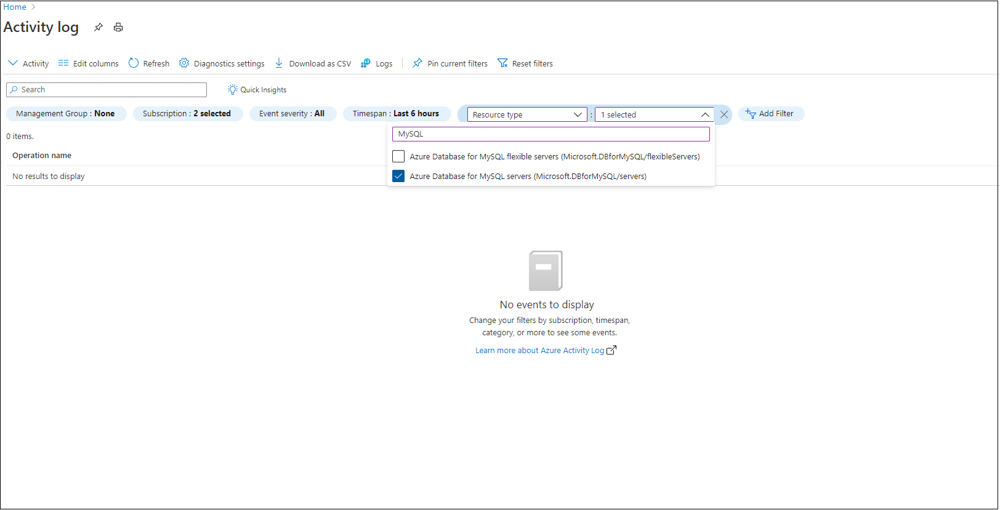
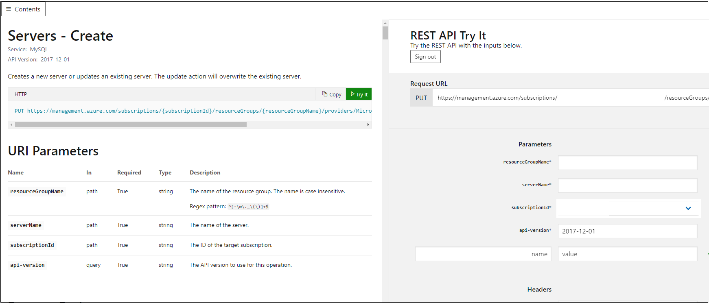

# Restore a deleted Azure Database for MySQL server

[!INCLUDE[applies-to-mysql-single-server](includes/applies-to-mysql-single-server.md)]

When a server is deleted, the database server backup can be retained up to five days in the service. The database backup can be accessed and restored only from the Azure subscription where the server originally resided. The following recommended steps can be followed to recover a deleted MySQL server resource within 5 days from the time of server deletion. The recommended steps will work only if the backup for the server is still available and not deleted from the system. 

## Pre-requisites
To restore a deleted Azure Database for MySQL server, you need following:
- Azure Subscription name hosting the original server
- Location where the server was created

## Steps to restore

1. Go to the [Activity Log](https://portal.azure.com/#blade/Microsoft_Azure_ActivityLog/ActivityLogBlade) from Monitor blade in Azure portal. 

2. In Activity Log, click on **Add filter** as shown and set following filters for the 

    - **Subscription** = Your Subscription hosting the deleted server
    - **Resource Type** = Azure Database for MySQL servers (Microsoft.DBforMySQL/servers) 
    - **Operation** = Delete MySQL Server (Microsoft.DBforMySQL/servers/delete) 
 
     [](./media/howto-restore-dropped-server/activity-log.png#lightbox)
   
 3. Double Click on the Delete MySQL Server event and click on the JSON tab and note the "resourceId" and "submissionTimestamp" attributes in JSON output. The resourceId is in the following format: /subscriptions/ffffffff-ffff-ffff-ffff-ffffffffffff/resourceGroups/TargetResourceGroup/providers/Microsoft.DBforMySQL/servers/deletedserver.
 
 4. Go to [Create Server REST API Page](/rest/api/mysql/singleserver/servers(2017-12-01)/create) and click on "Try It" tab highlighted in green and login in with your Azure account.
 
 5. Provide the resourceGroupName, serverName (deleted server name), subscriptionId, derived from resourceId attribute captured in Step 3, while api-version is pre-populated as shown in image.
 
     [](./media/howto-restore-dropped-server/create-server-from-rest-api.png#lightbox)
  
 6. Scroll below on Request Body section and paste the following:
 
    ```json
    {
        "location": "Dropped Server Location",  
        "properties": 
            {
                "restorePointInTime": "submissionTimestamp - 15 minutes",
                "createMode": "PointInTimeRestore",
                "sourceServerId": "resourceId"
            }
    }
    ```
7. Replace the following values in the above request body:
   * "Dropped server Location" with the Azure region where the deleted server was originally created
   * "submissionTimestamp", and "resourceId" with the values captured in Step 3. 
   * For "restorePointInTime", specify a value of "submissionTimestamp" minus **15 minutes** to ensure the command does not error out.
   
8. If you see Response Code 201 or 202, the restore request is successfully submitted. 

9. The server creation can take time depending on the database size and compute resources provisioned on the original server. The restore status can be monitored from Activity log by filtering for 
   - **Subscription** = Your Subscription
   - **Resource Type** = Azure Database for MySQL servers (Microsoft.DBforMySQL/servers) 
   - **Operation** =  Update MySQL Server Create

## Next steps
- If you are trying to restore a server within five days, and still receive an error after accurately following the steps discussed earlier, open a support incident for assistance. If you are trying to restore a deleted server after five days, an error is expected since the backup file cannot be found. Do not open a support ticket in this scenario. The support team cannot provide any assistance if the backup is deleted from the system. 
- To prevent accidental deletion of servers, we highly recommend using [Resource Locks](https://techcommunity.microsoft.com/t5/azure-database-for-mysql/preventing-the-disaster-of-accidental-deletion-for-your-mysql/ba-p/825222).
