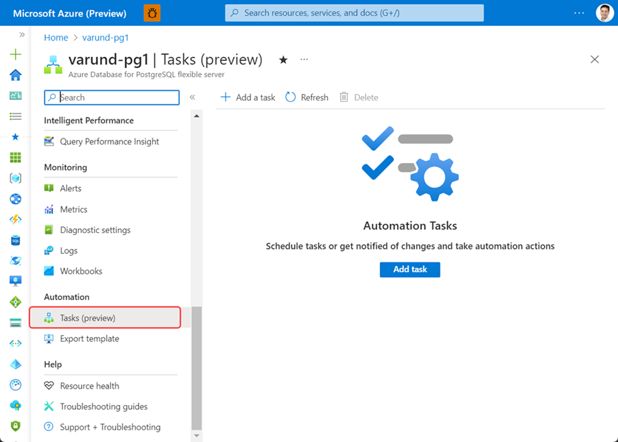
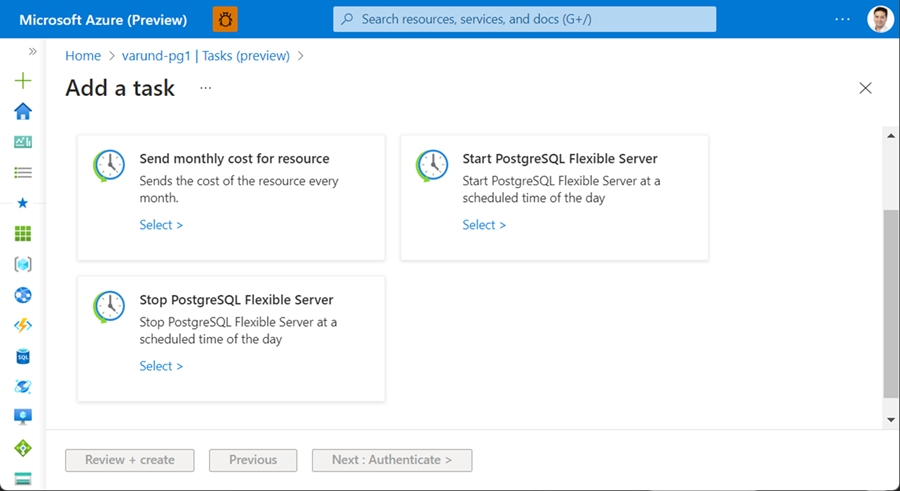
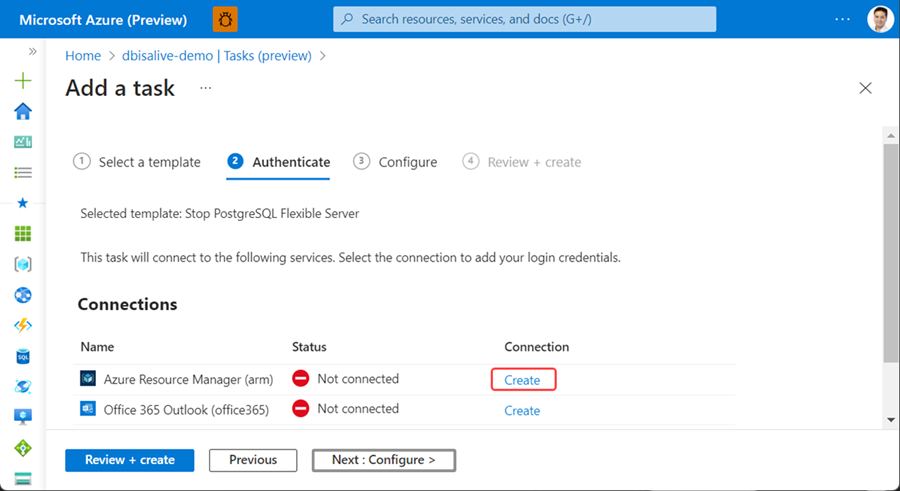
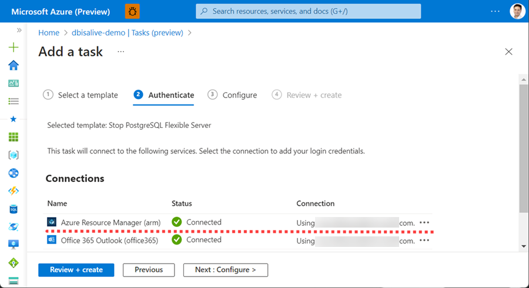
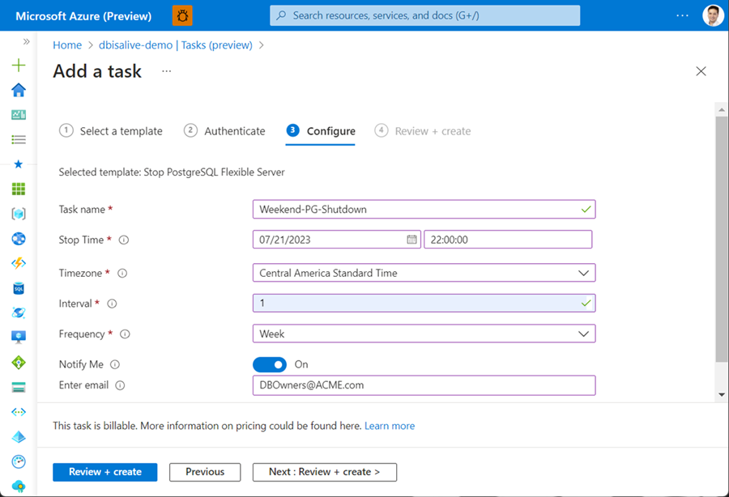

# Manage Azure Database for PostgreSQL - Flexible Server using automation tasks (preview)

[!INCLUDE [applies-to-postgresql-flexible-server](../includes/applies-to-postgresql-flexible-server.md)]

> [!IMPORTANT]
> This capability is in preview and is subject to the 
> [Supplemental Terms of Use for Microsoft Azure Previews](https://azure.microsoft.com/support/legal/preview-supplemental-terms/).

To help you manage [Azure Database for PostgreSQL flexible server](./overview.md) resources more efficiently, you can create automation tasks for your Azure Database for PostgreSQL flexible server instance. One example of such tasks can be starting or stopping the Azure Database for PostgreSQL flexible server instance on a predefined schedule. You can set this task to automatically start or stop the server a specific number of times every day, week, or month by setting the Interval and Frequency values on the task's Configure tab. The automation task continues to work until you delete or disable the task.

In addition, you can also set up automation tasks for other routine tasks such as 'Send monthly cost for resource' and 'Scale Azure Database for PostgreSQL flexible server'.

## How do automation tasks differ from Azure Automation?

Automation tasks are more basic and lightweight than [Azure Automation](../../automation/overview.md). Currently, you can create an automation task only at the Azure resource level. An automation task is actually a logic app resource that runs a workflow, powered by the [multi-tenant Azure Logic Apps service](../../logic-apps/logic-apps-overview.md). You can view and edit the underlying workflow by opening the task in the workflow designer after it has completed at least one run.

In contrast, Azure Automation is a comprehensive cloud-based automation and configuration service that provides consistent management across your Azure and non-Azure environments. 

## Pricing

Creating an automation task doesn't immediately incur charges. Underneath, an automation task is powered by a workflow in a logic app resource hosted in multi-tenant Azure Logic Apps, thus the [Consumption pricing model](../../logic-apps/logic-apps-pricing.md) applies to automation tasks. Metering and billing are based on the trigger and action executions in the underlying logic app workflow. 

## Prerequisites
* An Azure account and subscription.
* An Azure Database for PostgreSQL flexible server instance that you want to manage.

## Create an automation task to stop server

1. In the [Azure portal](https://portal.azure.com), find the Azure Database for PostgreSQL flexible server resource that you want to manage.
1. On the resource navigation menu, in the **Automation** section, select **Tasks (preview)**.

1. On the **Tasks** pane, select **Add a task** to select a task template.

1. Under **Select a template**, select the task for starting or stopping your Azure Database for PostgreSQL flexible server instance.

1. Under **Authenticate**, in the **Connections** section, select **Create** for every connection that appears in the task so that you can provide authentication credentials for all the connections.  The types of connections in each task vary based on the task.

1. When you're prompted, **sign in with your Azure account** credentials.

1. Each successfully authenticated connection looks similar to this example:

1. After you authenticate all the connections, select Next: **Configure**.

1. Under **Configure**, provide a name for the task and any other information required for the task. When you're done, select **Review + create**.

1. Tasks that send email notifications require an email address.

> [!NOTE]
> You can't change the task name after creation, so consider a name that still applies if you edit the underlying workflow. Changes that you make to the underlying workflow apply only to the task that you created, not the task template.
>
> For example, if you name your task `Stop-Instance-Weekly`, but you later edit the underlying workflow to run daily, you can't change your task's name to `Stop-Instance-Daily`.

The task you've created, which is automatically live and running, will appear on the **Tasks** list.

## Create an automation task to start server

You can apply the same steps outlined above to create a seperate automation tasks for starting of the Azure Database for PostgreSQL flexible server instance at a specific time. Here's how:

1. Follow the same steps as outlined in the "Create an automation task" section until you reach the "Select a template" stage.
1. Here, instead of selecting the task for "Stop PostgreSQL Flexible Server," select the template for "Start PostgreSQL Flexible Server."
1. Proceed to fill in the rest of the required details as described in the subsequent steps, defining the specific schedule at which you want the server to start in the 'Configure' section.

## Review task history

To view a task's history of runs along with their status:

1. In the [Azure portal](https://portal.azure.com), find the Azure Database for PostgreSQL flexible server resource that you want to manage.
2. On the resource navigation menu, in the **Automation** section, select **Tasks (preview)**.
3. In the tasks list, find the task that you want to review. In that task's **Runs** column, select **View**.

Here the possible statuses for a run:

   | Status | Description |
   |--------|-------------|
   | **Canceled** | The task was canceled while running. |
   | **Failed** | The task has at least one failed action, but no subsequent actions existed to handle the failure. |
   | **Running** | The task is currently running. |
   | **Succeeded** | All actions succeeded. A task can still finish successfully if an action failed, but a subsequent action existed to handle the failure. |
   | **Waiting** | The run hasn't started yet and is paused because an earlier instance of the task is still running. |
   |||

   For more information, see [Review runs history in monitoring view](../../logic-apps/monitor-logic-apps.md#review-runs-history).

## Edit the task

To change a task, you have these options:

* Edit the task "inline" so that you can change the task's properties, such as connection information or configuration information, for example, your email address.
* Edit the task's underlying workflow in the workflow designer.

### Edit the task inline

1. In the [Azure portal](https://portal.azure.com), find the Azure Database for PostgreSQL flexible server resource that you want to manage.
1. On the resource navigation menu, in the **Automation** section, select **Tasks (preview)**.
1. In the tasks list, find the task that you want to update. Open the task's ellipses (**...**) menu, and select **Edit in-line**.
1. By default, the **Authenticate** tab appears and shows the existing connections.
1. To add new authentication credentials or select different existing authentication credentials for a connection, open the connection's ellipses (**...**) menu, and select either **Add new connection** or if available, different authentication credentials.
1. To update other task properties, select **Next: Configure**.
1. When you're done, select **Save**

### Edit the task's underlying workflow

* For details on editing the underlying workflow, please refer [Edit the task's underlying workflow](../../logic-apps/create-automation-tasks-azure-resources.md#edit-the-tasks-underlying-workflow)

## Next steps

* [Manage logic apps in the Azure portal](../../logic-apps/manage-logic-apps-with-azure-portal.md)

