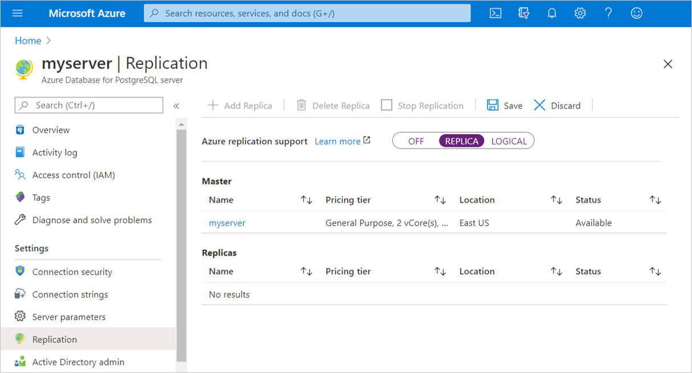
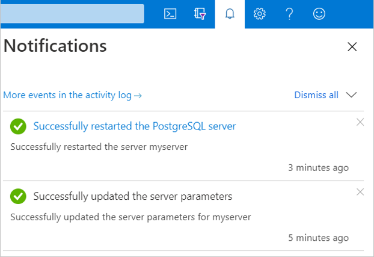
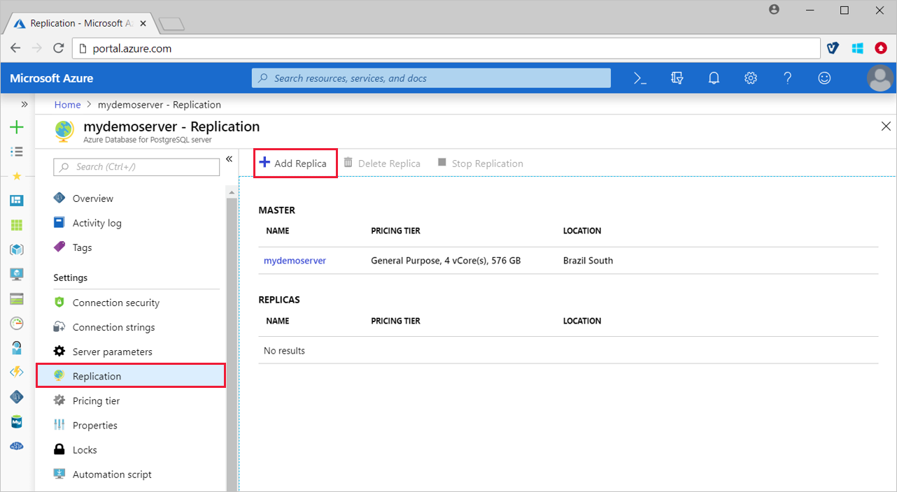
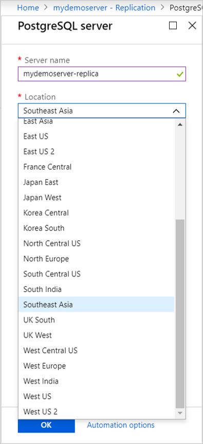
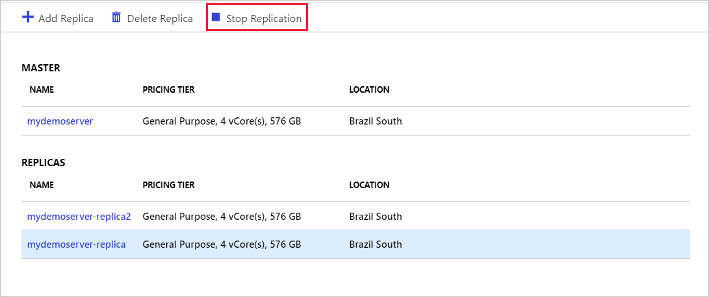
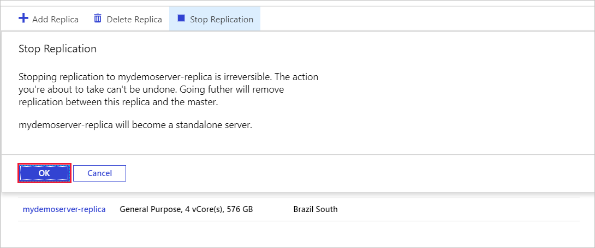
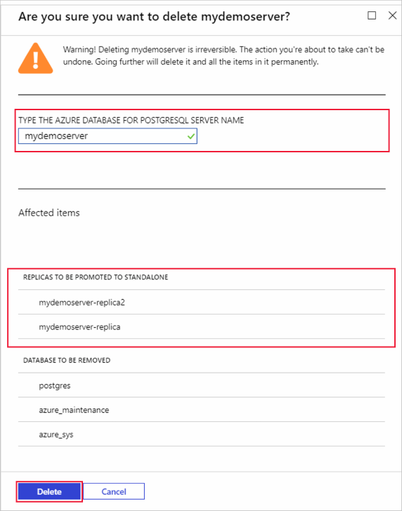
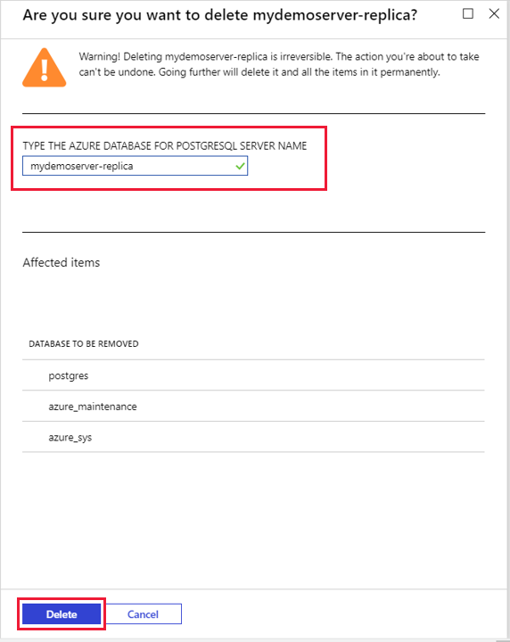
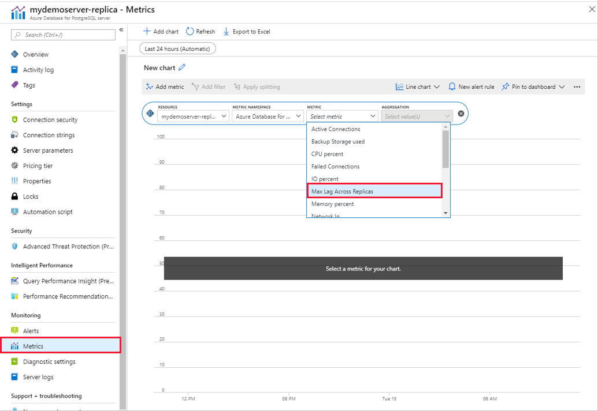
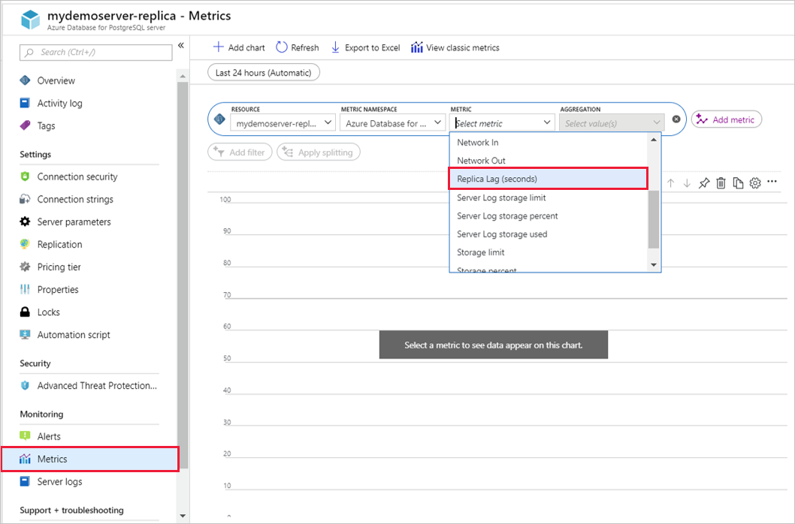

# Create and manage read replicas in Azure Database for PostgreSQL - Single Server from the Azure portal

In this article, you learn how to create and manage read replicas in Azure Database for PostgreSQL from the Azure portal. To learn more about read replicas, see the [overview](concepts-read-replicas.md).

## Prerequisites
An [Azure Database for PostgreSQL server](quickstart-create-server-database-portal.md) to be the master server.

## Azure replication support

[Read replicas](concepts-read-replicas.md) and [logical decoding](concepts-logical.md) both depend on the Postgres write ahead log (WAL) for information. These two features need different levels of logging from Postgres. Logical decoding needs a higher level of logging than read replicas.

To configure the right level of logging, use the Azure replication support parameter. Azure replication support has three setting options:

* **Off** - Puts the least information in the WAL. This setting is not available on most Azure Database for PostgreSQL servers.  
* **Replica** - More verbose than **Off**. This is the minimum level of logging needed for [read replicas](concepts-read-replicas.md) to work. This setting is the default on most servers.
* **Logical** - More verbose than **Replica**. This is the minimum level of logging for logical decoding to work. Read replicas also work at this setting.

The server needs to be restarted after a change of this parameter. Internally, this parameter sets the Postgres parameters `wal_level`, `max_replication_slots`, and `max_wal_senders`.

## Prepare the master server

1. In the Azure portal, select an existing Azure Database for PostgreSQL server to use as a master.

2. From the server's menu, select **Replication**. If Azure replication support is set to at least **Replica**, you can create read replicas. 

3. If Azure replication support is not set to at least **Replica**, set it. Select **Save**.

   

4. Restart the server to apply the change by selecting **Yes**.

   

5. You will receive two Azure portal notifications once the operation is complete. There is one notification for updating the server parameter. There is another notification for the server restart that follows immediately.

   

6. Refresh the Azure portal page to update the Replication toolbar. You can now create read replicas for this server.
   

## Create a read replica
To create a read replica, follow these steps:

1. Select an existing Azure Database for PostgreSQL server to use as the master server. 

2. On the server sidebar, under **SETTINGS**, select **Replication**.

3. Select **Add Replica**.

   

4. Enter a name for the read replica. 

    

5. Select a location for the replica. The default location is the same as the master server's.

    

   > [!NOTE]
   > To learn more about which regions you can create a replica in, visit the [read replica concepts article](concepts-read-replicas.md). 

6. Select **OK** to confirm the creation of the replica.

A replica is created by using the same compute and storage settings as the master. After a replica is created, several settings can be changed independently from the master server: compute generation, vCores, storage, and back-up retention period. The pricing tier can also be changed independently, except to or from the Basic tier.

> [!IMPORTANT]
> Before a master server setting is updated to a new value, update the replica setting to an equal or greater value. This action helps the replica keep up with any changes made to the master.

After the read replica is created, it can be viewed from the **Replication** window:

 

## Stop replication
You can stop replication between a master server and a read replica.

> [!IMPORTANT]
> After you stop replication to a master server and a read replica, it can't be undone. The read replica becomes a standalone server that supports both reads and writes. The standalone server can't be made into a replica again.

To stop replication between a master server and a read replica from the Azure portal, follow these steps:

1. In the Azure portal, select your master Azure Database for PostgreSQL server.

2. On the server menu, under **SETTINGS**, select **Replication**.

3. Select the replica server for which to stop replication.

   
 
4. Select **Stop replication**.

   
 
5. Select **OK** to stop replication.

   
 

## Delete a master server
To delete a master server, you use the same steps as to delete a standalone Azure Database for PostgreSQL server. 

> [!IMPORTANT]
> When you delete a master server, replication to all read replicas is stopped. The read replicas become standalone servers that now support both reads and writes.

To delete a server from the Azure portal, follow these steps:

1. In the Azure portal, select your master Azure Database for PostgreSQL server.

2. Open the **Overview** page for the server. Select **Delete**.

   
 
3. Enter the name of the master server to delete. Select **Delete** to confirm deletion of the master server.

   
 

## Delete a replica
You can delete a read replica similar to how you delete a master server.

- In the Azure portal, open the **Overview** page for the read replica. Select **Delete**.

   
 
You can also delete the read replica from the **Replication** window by following these steps:

1. In the Azure portal, select your master Azure Database for PostgreSQL server.

2. On the server menu, under **SETTINGS**, select **Replication**.

3. Select the read replica to delete.

   
 
4. Select **Delete replica**.

   
 
5. Enter the name of the replica to delete. Select **Delete** to confirm deletion of the replica.

   
 

## Monitor a replica
Two metrics are available to monitor read replicas.

### Max Lag Across Replicas metric
The **Max Lag Across Replicas** metric shows the lag in bytes between the master server and the most-lagging replica. 

1.	In the Azure portal, select the master Azure Database for PostgreSQL server.

2.	Select **Metrics**. In the **Metrics** window, select **Max Lag Across Replicas**.

    
 
3.	For your **Aggregation**, select **Max**.

### Replica Lag metric
The **Replica Lag** metric shows the time since the last replayed transaction on a replica. If there are no transactions occurring on your master, the metric reflects this time lag.

1. In the Azure portal, select the Azure Database for PostgreSQL read replica.

2. Select **Metrics**. In the **Metrics** window, select **Replica Lag**.

   
 
3. For your **Aggregation**, select **Max**. 
 
## Next steps
* Learn more about [read replicas in Azure Database for PostgreSQL](concepts-read-replicas.md).
* Learn how to [create and manage read replicas in the Azure CLI and REST API](howto-read-replicas-cli.md).