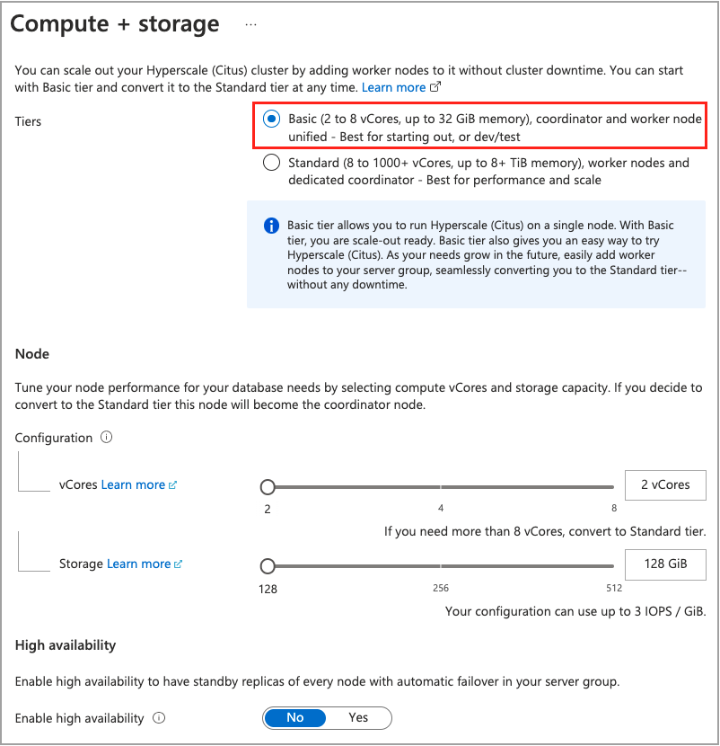

# Create a Hyperscale (Citus) server group in the Azure portal

Azure Database for PostgreSQL - Hyperscale (Citus) is a managed service that
you to run horizontally scalable PostgreSQL databases in the cloud. This
Quickstart shows you how to create a Hyperscale (Citus) server group using the
Azure portal. You'll explore distributed data: sharding tables across nodes,
generating sample data, and running queries that execute on multiple nodes.

## Prerequisites

To follow this quickstart, you'll first need to:

* Create a [free account](https://azure.microsoft.com/free/) (If you don't have
  an Azure subscription).
* Sign in to the [Azure portal](https://portal.azure.com).

## Create server group

1. Select **Create a resource** (+) in the upper-left corner of the portal.
2. Select **Databases** > **Azure Database for PostgreSQL**.
   
3. Select the **Hyperscale (Citus) server group** deployment option.
   
4. Fill out the **Basics** form with the following information:
   

   | Setting           | Description       |
   |-------------------|-------------------|
   | Subscription      | The Azure subscription that you want to use for your server. If you have multiple subscriptions, choose the subscription in which you'd like to be billed for the resource. |
   | Resource group    | A new resource group name or an existing one from your subscription. |
   | Server group name | A unique name that identifies your Hyperscale server group. The domain name postgres.database.azure.com is appended to the server group name you provide. The server can contain only lowercase letters, numbers, and the hyphen (-) character. It must contain fewer than 40 characters. |
   | Location          | The location that is closest to you.        |
   | Admin username    | Currently required to be the value `citus`, and can't be changed. |
   | Password          | A new password for the server admin account. It must contain between 8 and 128 characters. Your password must contain characters from three of the following categories: English uppercase letters, English lowercase letters, numbers (0 through 9), and non-alphanumeric characters (!, $, #, %, etc.). |
   | Version           | The latest PostgreSQL major version, unless you have specific requirements. |

5. Select **Configure server group**.

   

   For this quickstart, you can accept the default value of **Basic** for
   **Tiers**. The other option, standard tier, creates worker nodes for
   greater total data capacity and query parallelism. See
   [tiers](concepts-server-group.md#tiers) for a more in-depth comparison.

6. Select **Save**.

7. Select **Next : Networking >** at the bottom of the screen.
8. In the **Networking** tab, select **Allow public access from Azure services
   and resources within Azure to this server group**.

   

9. Select **Review + create** and then **Create** to create the server.
   Provisioning takes a few minutes.
10. The page will redirect to monitor deployment. When the live status changes
   from **Deployment is in progress** to **Your deployment is complete**.
   After this transition, select **Go to resource**.

## Next steps

With your server group created, it's time to connect with a SQL client.

> [!div class="nextstepaction"]
> [Connect to your server group](quickstart-connect-psql.md)
