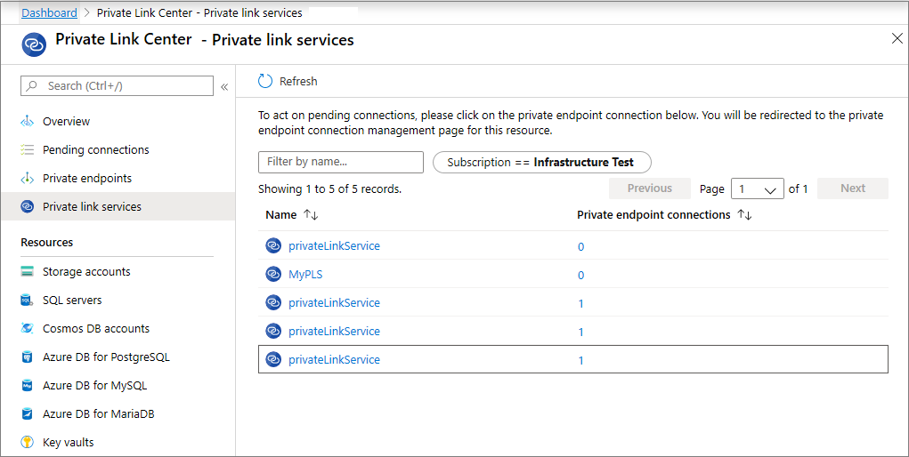
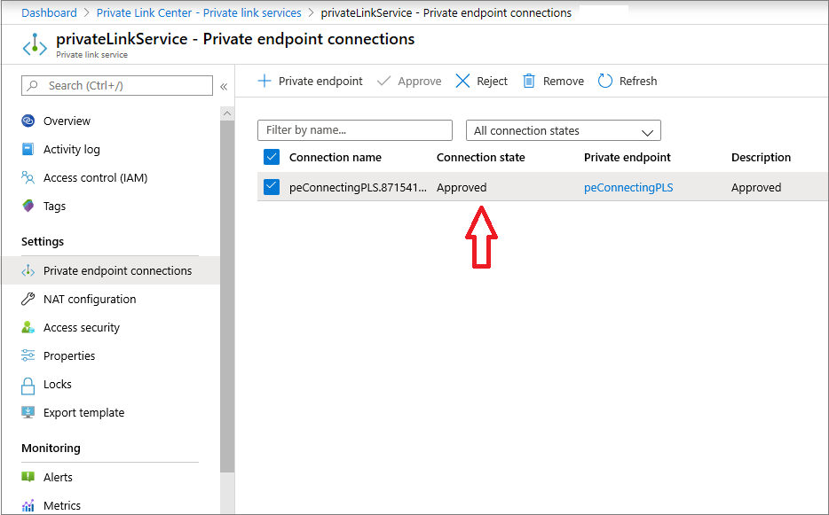
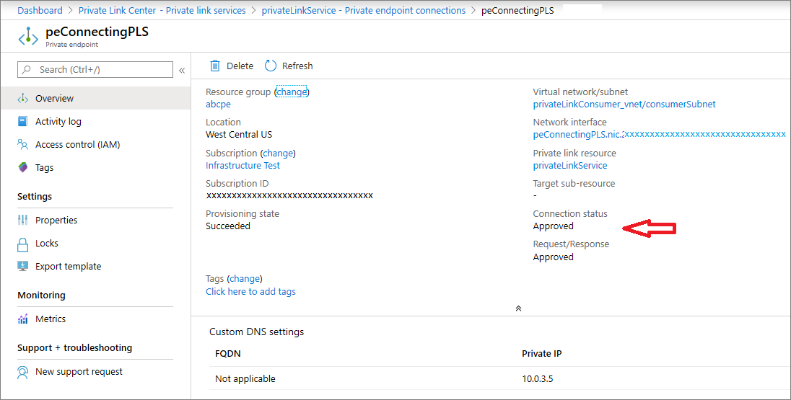
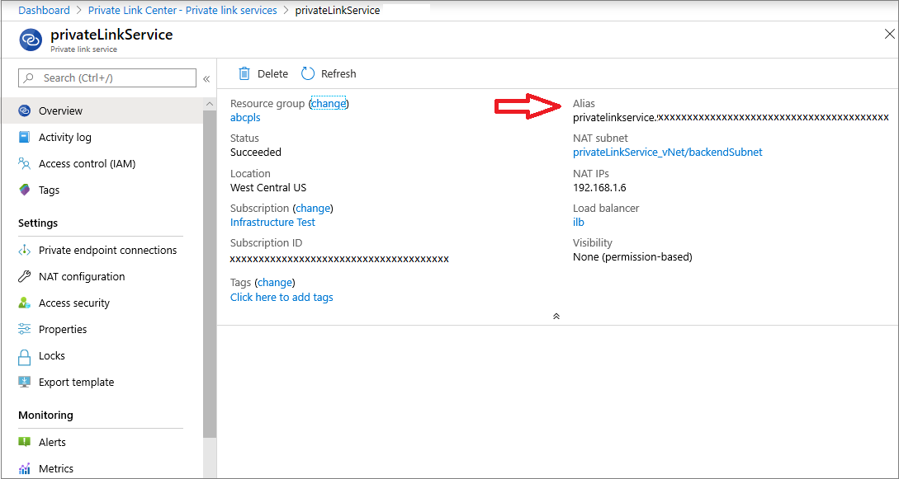
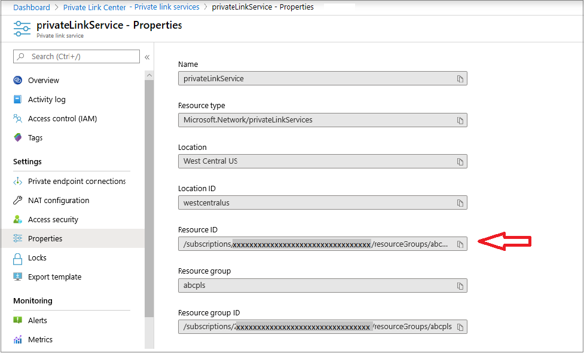
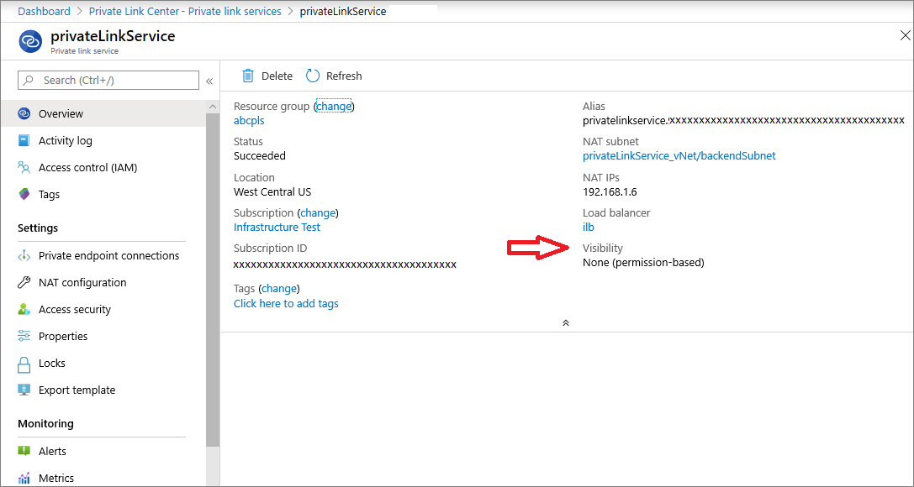
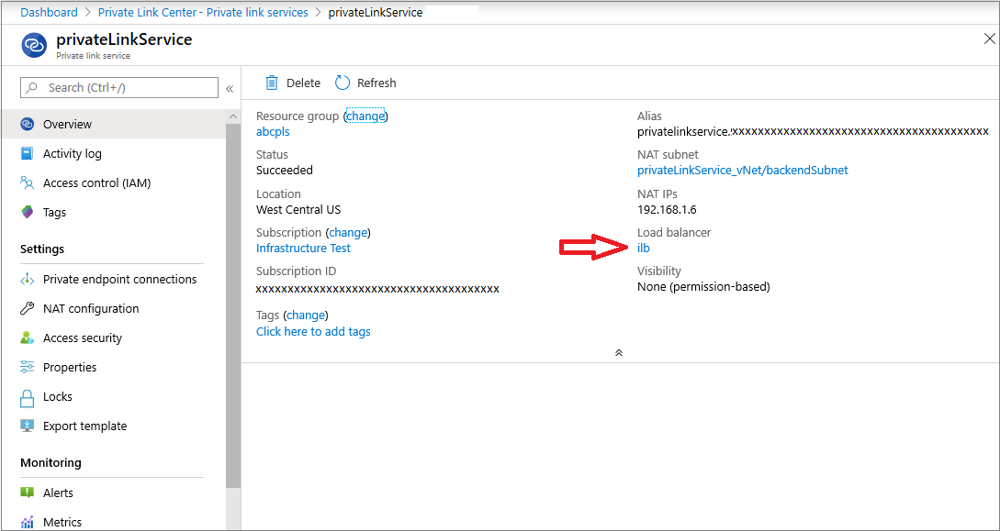
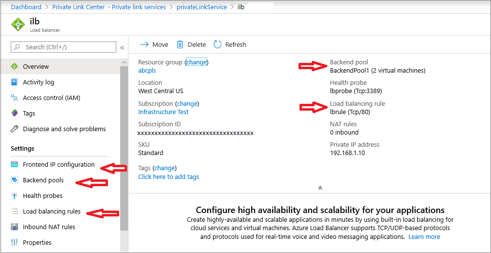
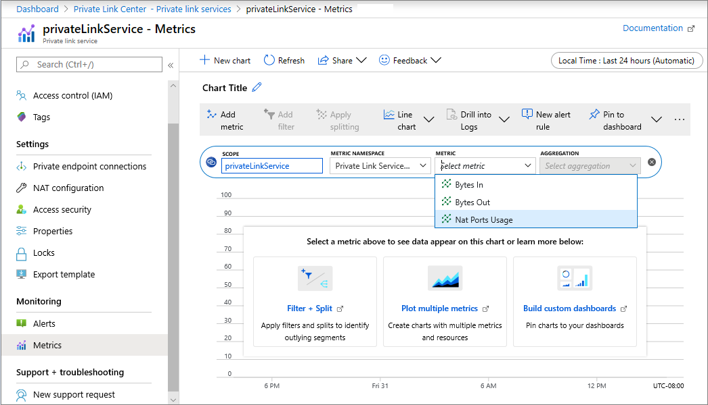

# Troubleshoot Azure Private Link Service connectivity problems

This article provides step-by-step guidance to validate and diagnose connectivity for your Azure Private Link setup.

With Azure Private Link, you can access Azure platform as a service (PaaS) services, such as Azure Storage, Azure Cosmos DB, and Azure SQL Database, and Azure hosted customer or partner services over a private endpoint in your virtual network. Traffic between your virtual network and the service traverses over the Microsoft backbone network, which eliminates exposure from the public internet. You can also create your own private link service in your virtual network and deliver it privately to your customers.

You can enable your service that runs behind the Standard tier of Azure Load Balancer for Private Link access. Consumers of your service can create a private endpoint inside their virtual network and map it to this service to access it privately.

Here are the connectivity scenarios that are available with Private Link:

- Virtual network from the same region
- Regionally peered virtual networks
- Globally peered virtual networks
- Customer on-premises over VPN or Azure ExpressRoute circuits

## Deployment troubleshooting

Review the information on [Disabling network policies on the private link service](./disable-private-link-service-network-policy.md) for troubleshooting cases where you're unable to select the source IP address from the subnet of your choice for your private link service.

Make sure that the setting **privateLinkServiceNetworkPolicies** is disabled for the subnet you're selecting the source IP address from.

## Diagnose connectivity problems

If you experience connectivity problems with your private link setup, review these steps to make sure all the usual configurations are as expected.

1. Review Private Link configuration by browsing the resource.

    a. Go to [Private Link Center](https://portal.azure.com/#blade/Microsoft_Azure_Network/PrivateLinkCenterBlade/overview).

      

    b. On the left pane, select **Private link services**.

      

    c. Filter and select the private link service that you want to diagnose.

    d. Review the private endpoint connections.
     - Make sure that the private endpoint that you're seeking connectivity from is listed with an **Approved** connection state.
     - If the state is **Pending**, select it and approve it.

       

     - Go to the private endpoint that you're connecting from by selecting the name. Make sure the connection status shows as **Approved**.

       

     - After both sides are approved, try the connectivity again.

    e. Review **Alias** on the **Overview** tab and **Resource ID** on the **Properties** tab.
     - Make sure the **Alias** and **Resource ID** information matches the **Alias** and **Resource ID** you're using to create a private endpoint to this service.

       

       

    f. Review **Visibility** information on the **Overview** tab.
     - Make sure that your subscription falls under the **Visibility** scope.

       

    g. Review **Load balancer** information on the **Overview** tab.
     - You can go to the load balancer by selecting the load balancer link.

       

     - Make sure that the load balancer settings are configured as per your expectations.
       - Review **Frontend IP configuration**.
       - Review **Backend pools**.
       - Review **Load balancing rules**.

       

     - Make sure the load balancer is working as per the previous settings.
       - Select a VM in any subnet other than the subnet where the load balancer back-end pool is available.
       - Try accessing the load balancer front end from the previous VM.
       - If the connection makes it to the back-end pool as per load-balancing rules, your load balancer is operational.
       - You can also review the load balancer metric through Azure Monitor to see if data is flowing through the load balancer.

1. Use [Azure Monitor](../azure-monitor/overview.md) to see if data is flowing.

    a. On the private link service resource, select **Metrics**.
     - Select **Bytes In** or **Bytes Out**.
     - See if data is flowing when you attempt to connect to the private link service. Expect a delay of approximately 10 minutes.

       

1. Use [Azure Monitor - Networks](../network-watcher/network-insights-overview.md#resource-view) for insights and to see a resource view of the resources by going to:
     - Azure Monitor
     - Networks
     - Private Link services
     - Resource view 

4. Contact the [Azure Support](https://portal.azure.com/#blade/Microsoft_Azure_Support/HelpAndSupportBlade/overview) team if your problem is still unresolved and a connectivity problem still exists.

## Next steps

 * [Create a private link service (CLI)](./create-private-link-service-cli.md)
 * [Azure Private Endpoint troubleshooting guide](troubleshoot-private-endpoint-connectivity.md)
