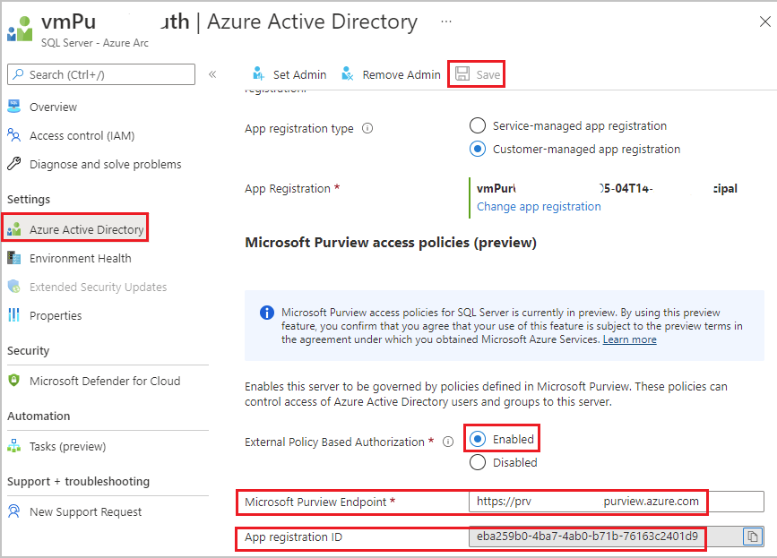
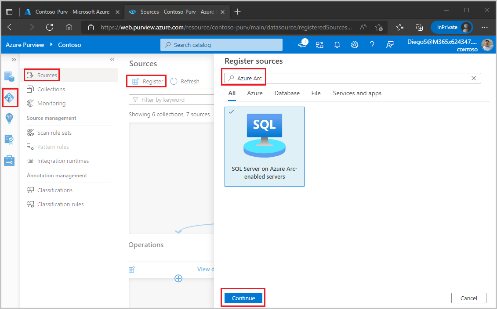
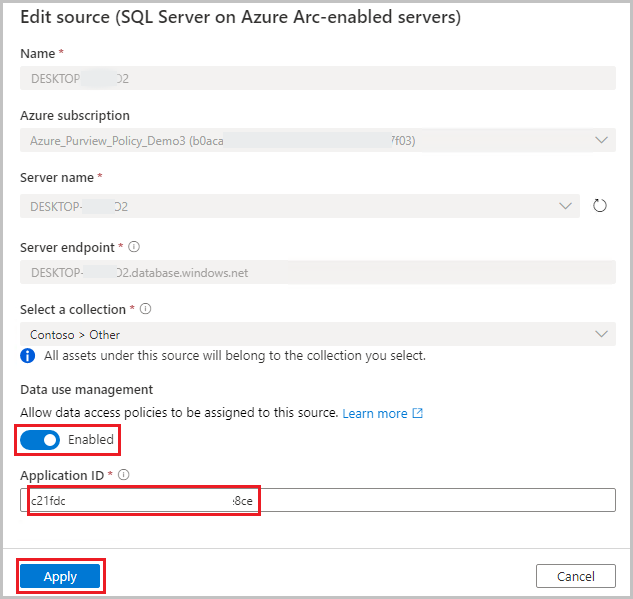
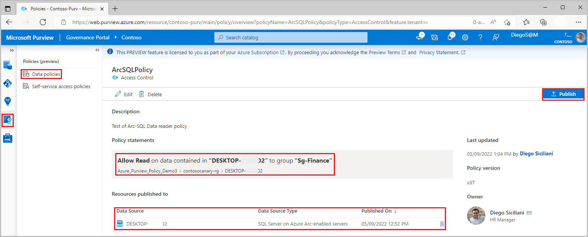

# Provision access by data owner for SQL Server on Azure Arc-enabled servers (preview)

[!INCLUDE [feature-in-preview](includes/feature-in-preview.md)]

[Access policies](concept-data-owner-policies.md) allow you to manage access from Microsoft Purview to data sources that have been registered for *Data Use Management*.

This how-to guide describes how a data owner can delegate authoring policies in Microsoft Purview to enable access to SQL Server on Azure Arc-enabled servers. The following actions are currently enabled: *SQL Performance Monitoring*, *SQL Security Auditing* and *Read*. *Read* is only supported for policies at server level. *Modify* is not supported at this point. 

## Prerequisites
[!INCLUDE [Access policies generic pre-requisites](./includes/access-policies-prerequisites-generic.md)]
- SQL server version 2022 CTP 2.0 or later
- Complete process to onboard that SQL server with Azure Arc and enable Azure AD Authentication. [Follow this guide to learn how](https://aka.ms/sql-on-arc-AADauth).

**Enforcement of policies is available only in the following regions for Microsoft Purview**
- East US
- UK South

## Security considerations
- The Server admin can turn off the Microsoft Purview policy enforcement.
- Arc Admin/Server admin permissions empower the Arc admin or Server admin with the ability to change the ARM path of the given server. Given that mappings in Microsoft Purview use ARM paths, this can lead to wrong policy enforcements. 
- SQL Admin (DBA) can gain the power of Server admin and can tamper with the cached policies from Microsoft Purview.
- The recommended configuration is to create a separate App Registration per SQL server instance. This prevents SQL server2 from reading the policies meant for SQL server1, in case a rogue admin in SQL server2 tampers with the ARM path.

## Configuration
[!INCLUDE [Access policies generic configuration](./includes/access-policies-configuration-generic.md)]

> [!Warning]
> "Access control (IAM)" for the "SQL Server - Azure Arc" resource is  visible in Azure portal only through a special link, described in the next section. You can assign the *IAM Owner* permission by entering Azure portal through that special link. You can alternatively configure this permission at the parent resource group level so that it gets inherited by this data source.

### SQL Server on Azure Arc-enabled server configuration
This section describes the steps to configure the SQL Server on Azure Arc to use Microsoft Purview.

1. Sign in to Azure portal with a [special link](https://portal.azure.com/?feature.canmodifystamps=true&Microsoft_Azure_HybridData_Platform=sqlrbacmain#blade/Microsoft_Azure_HybridCompute/AzureArcCenterBlade/sqlServers) that contains feature flags to list SQL Servers on Azure Arc

1. Navigate to a SQL Server you want to configure

1. Navigate to **Azure Active Directory** feature on the left pane

1. Verify that Azure Active Directory Authentication is configured and scroll down.


1. Set **External Policy Based Authorization** to enabled

1. Enter **Microsoft Purview Endpoint** in the format *https://\<purview-account-name\>.purview.azure.com*. Note: you can get the endpoint by selecting your Microsoft Purview account through [this link](https://portal.azure.com/#blade/HubsExtension/BrowseResource/resourceType/Microsoft.Purview%2FAccounts) and then navigating to the Properties section on the left menu. Scroll down until you see "Scan endpoint". Copy the listed endpoint but remove "/Scan" at the end.

1. Make a note of the **App registration ID**, as you will need it when you register this data source for *Data use Management* in Microsoft Purview.
   
1. Select the **Save** button to save the configuration.

### Register data sources in Microsoft Purview
Register each data source with Microsoft Purview to later define access policies. 

1. Sign in to Microsoft Purview Studio.

1. Navigate to the **Data map** feature on the left pane, select **Sources**, then select **Register**. Type "Azure Arc" in the search box and select **SQL Server on Azure Arc**. Then select **Continue**


1. Enter a **Name** for this registration. It is best practice to make the name of the registration the same as the server name in the next step.

1. select an **Azure subscription**, **Server name** and **Server endpoint**.

1. **Select a collection** to put this registration in. 

1. Turn the switch **Data Use Management** to **Enabled**. This switch enables the access-policies to be used with the given Arc-enabled SQL server. Note: Data Use Management can affect the security of your data, as it delegates to certain Microsoft Purview roles managing access to the data sources. Secure practices related to Data Use Management are described in this guide: [registering a data resource for Data Use Management](./how-to-enable-data-use-management.md)

1. Enter the **Application ID** from the App Registration related to this Arc-enabled SQL server.

1. Select **Register** or **Apply** at the bottom

Once your data source has the **Data Use Management** toggle *Enabled*, it will look like this picture. 


> [!Note]
> - If you want to create a policy on a resource group or subscription and have it enforced in Arc-enabled SQL servers, you will need to also register those servers independently for *Data use management* to provide their App ID. See this document on how to create policies at resource group or subscription level: [Enable Microsoft Purview data owner policies on all data sources in a subscription or a resource group](./how-to-data-owner-policies-resource-group.md).

## Create and publish a data owner policy

Execute the steps in the **Create a new policy** and **Publish a policy** sections of the [data-owner policy authoring tutorial](./how-to-data-owner-policy-authoring-generic.md#create-a-new-policy). The result will be a data owner policy similar to one of the examples shown in the images.

**Example #1: SQL Performance Monitor policy**. This policy assigns the Azure AD principal 'Christie Cline' to the *SQL Performance monitoring* role, in the scope of Arc-enabled SQL server *DESKTOP-xxx*. This policy has also been published to that server.


**Example #2: SQL Security Auditor policy**. Similar to example 1, but choose the *SQL Security auditing* action (instead of *SQL Performance monitoring*), when authoring the policy.

**Example #3: Read policy**. This policy assigns the Azure AD principal 'sg-Finance' to the *SQL Data reader* role, in the scope of SQL server *DESKTOP-xxx*. This policy has also been published to that server.



> [!Note]
> - Given that scan is not currently available for this data source, data reader policies can only be created at server level. Use the **Data sources** box instead of the Asset box when authoring the **data resources** part of the policy.
> - There is a know issue with SQL Server Management Studio that prevents right-clicking on a table and choosing option “Select Top 1000 rows”.


>[!Important]
> - Publish is a background operation. It can take up to **4 minutes** for the changes to be reflected in this data source.
> - Changing a policy does not require a new publish operation. The changes will be picked up with the next pull.

### Test the policy

The Azure AD Accounts referenced in the access policies should now be able to connect to any database in the server to which the policies are published.

#### Force policy download
It is possible to force an immediate download of the latest published policies to the current SQL database by running the following command. The minimal permission required to run it is membership in ##MS_ServerStateManager##-server role.

```sql
-- Force immediate download of latest published policies
exec sp_external_policy_refresh reload
```  

#### Analyze downloaded policy state from SQL
The following DMVs can be used to analyze which policies have been downloaded and are currently assigned to Azure AD accounts. The minimal permission required to run them is VIEW DATABASE SECURITY STATE - or assigned Action Group *SQL Security Auditor*.

```sql

-- Lists generally supported actions
SELECT * FROM sys.dm_server_external_policy_actions

-- Lists the roles that are part of a policy published to this server
SELECT * FROM sys.dm_server_external_policy_roles

-- Lists Azure AD principals assigned to a given role on a given resource scope
SELECT * FROM sys.dm_server_external_policy_role_members
```

## Additional information

### Policy action mapping

This section contains a reference of how actions in Microsoft Purview data policies map to specific actions in SQL Server on Azure Arc-enabled servers.

| **Microsoft Purview policy action** | **Data source specific actions**     |
|-------------------------------------|--------------------------------------|
|                                     |                                      |
| *Read* |Microsoft.Sql/sqlservers/Connect |
||Microsoft.Sql/sqlservers/databases/Connect |
||Microsoft.Sql/Sqlservers/Databases/Schemas/Tables/Rows|
||Microsoft.Sql/Sqlservers/Databases/Schemas/Views/Rows |
|||
| *SQL Performance Monitor* |Microsoft.Sql/sqlservers/Connect |
||Microsoft.Sql/sqlservers/databases/Connect |
||Microsoft.Sql/sqlservers/SystemViewsAndFunctions/ServerMetadata/rows/select |
||Microsoft.Sql/sqlservers/databases/SystemViewsAndFunctions/DatabaseMetadata/rows/select |
||Microsoft.Sql/sqlservers/SystemViewsAndFunctions/ServerState/rows/select |
||Microsoft.Sql/sqlservers/databases/SystemViewsAndFunctions/DatabaseState/rows/select |
|||               
| *SQL Security Auditor* |Microsoft.Sql/sqlservers/Connect |
||Microsoft.Sql/sqlservers/databases/Connect |
||Microsoft.Sql/sqlservers/SystemViewsAndFunctions/ServerSecurityState/rows/select |
||Microsoft.Sql/sqlservers/databases/SystemViewsAndFunctions/DatabaseSecurityState/rows/select |
||Microsoft.Sql/sqlservers/SystemViewsAndFunctions/ServerSecurityMetadata/rows/select |
||Microsoft.Sql/sqlservers/databases/SystemViewsAndFunctions/DatabaseSecurityMetadata/rows/select |
|||

## Next steps
Check blog, demo and related how-to guides
* [Demo of access policy for Azure Storage](/video/media/8ce7c554-0d48-430f-8f63-edf94946947c/purview-policy-storage-dataowner-scenario_mid.mp4)
* [Concepts for Microsoft Purview data owner policies](./concept-data-owner-policies.md)
* Blog: [Private preview: controlling access to Azure SQL at scale with policies in Purview](https://techcommunity.microsoft.com/t5/azure-sql-blog/private-preview-controlling-access-to-azure-sql-at-scale-with/ba-p/2945491)
* [Enable Microsoft Purview data owner policies on all data sources in a subscription or a resource group](./how-to-data-owner-policies-resource-group.md)
* [Enable Microsoft Purview data owner policies on an Azure SQL DB](./how-to-data-owner-policies-azure-sql-db.md)
