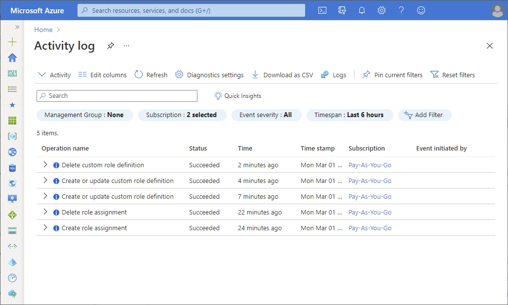
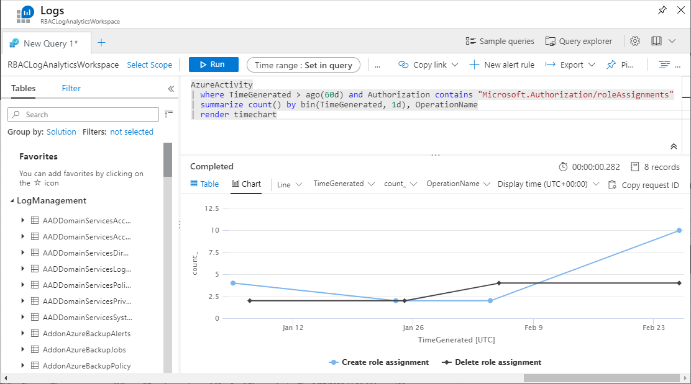

# View activity logs for RBAC changes

Sometimes you need information about role-based access control (RBAC) changes, such as for auditing or troubleshooting purposes. Any time someone makes changes to role assignments or role definitions within your subscriptions, the changes get logged in [Azure Activity Log](../azure-monitor/platform/activity-logs-overview.md). You can view the activity logs to see all the RBAC changes for the past 90 days.

## Operations that are logged

Here are the RBAC-related operations that are logged in Activity Log:

- Create role assignment
- Delete role assignment
- Create or update custom role definition
- Delete custom role definition

## Azure portal

The easiest way to get started is to view the activity logs with the Azure portal. The following screenshot shows an example of an activity log that has been filtered to display role assignment and role definition operations. It also includes a link to download the logs as a CSV file.



The activity log in the portal has several filters. Here are the RBAC-related filters:

|Filter  |Value  |
|---------|---------|
|Event category     | <ul><li>Administrative</li></ul>         |
|Operation     | <ul><li>Create role assignment</li> <li>Delete role assignment</li> <li>Create or update custom role definition</li> <li>Delete custom role definition</li></ul>      |


For more information about activity logs, see [View events in activity log](/azure/azure-resource-manager/resource-group-audit?toc=%2fazure%2fmonitoring-and-diagnostics%2ftoc.json).

## Azure PowerShell

[!INCLUDE [az-powershell-update](../../includes/updated-for-az.md)]

To view activity logs with Azure PowerShell, use the [Get-AzLog](/powershell/module/Az.Monitor/Get-AzLog) command.

This command lists all role assignment changes in a subscription for the past seven days:

```azurepowershell
Get-AzLog -StartTime (Get-Date).AddDays(-7) | Where-Object {$_.Authorization.Action -like 'Microsoft.Authorization/roleAssignments/*'}
```

This command lists all role definition changes in a resource group for the past seven days:

```azurepowershell
Get-AzLog -ResourceGroupName pharma-sales-projectforecast -StartTime (Get-Date).AddDays(-7) | Where-Object {$_.Authorization.Action -like 'Microsoft.Authorization/roleDefinitions/*'}
```

This command lists all role assignment and role definition changes in a subscription for the past seven days and displays the results in a list:

```azurepowershell
Get-AzLog -StartTime (Get-Date).AddDays(-7) | Where-Object {$_.Authorization.Action -like 'Microsoft.Authorization/role*'} | Format-List Caller,EventTimestamp,{$_.Authorization.Action},Properties
```

```Example
Caller                  : alain@example.com
EventTimestamp          : 4/20/2018 9:18:07 PM
$_.Authorization.Action : Microsoft.Authorization/roleAssignments/write
Properties              :
                          statusCode     : Created
                          serviceRequestId: 11111111-1111-1111-1111-111111111111

Caller                  : alain@example.com
EventTimestamp          : 4/20/2018 9:18:05 PM
$_.Authorization.Action : Microsoft.Authorization/roleAssignments/write
Properties              :
                          requestbody    : {"Id":"22222222-2222-2222-2222-222222222222","Properties":{"PrincipalId":"33333333-3333-3333-3333-333333333333","RoleDefinitionId":"/subscriptions/00000000-0000-0000-0000-000000000000/providers
                          /Microsoft.Authorization/roleDefinitions/b24988ac-6180-42a0-ab88-20f7382dd24c","Scope":"/subscriptions/00000000-0000-0000-0000-000000000000/resourceGroups/pharma-sales-projectforecast"}}

```

## Azure CLI

To view activity logs with the Azure CLI, use the [az monitor activity-log list](/cli/azure/monitor/activity-log#az-monitor-activity-log-list) command.

This command lists the activity logs in a resource group since the start time:

```azurecli
az monitor activity-log list --resource-group pharma-sales-projectforecast --start-time 2018-04-20T00:00:00Z
```

This command lists the activity logs for the Authorization resource provider since the start time:

```azurecli
az monitor activity-log list --resource-provider "Microsoft.Authorization" --start-time 2018-04-20T00:00:00Z
```

## Azure Log Analytics

[Azure Log Analytics](../log-analytics/log-analytics-overview.md) is another tool you can use to collect and analyze RBAC changes for all your Azure resources. Log Analytics has the following benefits:

- Write complex queries and logic
- Integrate with alerts, Power BI, and other tools
- Save data for longer retention periods
- Cross-reference with other logs such as security, virtual machine, and custom

Here are the basic steps to get started:

1. [Create a Log Analytics workspace](../azure-monitor/learn/quick-create-workspace.md).

1. [Configure the Activity Log Analytics solution](../azure-monitor/platform/collect-activity-logs.md#configuration) for your workspace.

1. [View the activity logs](../azure-monitor/platform/collect-activity-logs.md#using-the-solution). A quick way to navigate to the Activity Log Analytics Overview page is to click the **Log Analytics** option.

   

1. Optionally use the [Log Search](../log-analytics/log-analytics-log-search.md) page or the [Advanced Analytics portal](../azure-monitor/log-query/get-started-portal.md) to query and view the logs. For more information about these two options, see [Log Search page or the Advanced Analytics portal](../azure-monitor/log-query/portals.md).

Here's a query that returns new role assignments organized by target resource provider:

```
AzureActivity
| where TimeGenerated > ago(60d) and OperationName startswith "Microsoft.Authorization/roleAssignments/write" and ActivityStatus == "Succeeded"
| parse ResourceId with * "/providers/" TargetResourceAuthProvider "/" *
| summarize count(), makeset(Caller) by TargetResourceAuthProvider
```

Here's a query that returns role assignment changes displayed in a chart:

```
AzureActivity
| where TimeGenerated > ago(60d) and OperationName startswith "Microsoft.Authorization/roleAssignments"
| summarize count() by bin(TimeGenerated, 1d), OperationName
| render timechart
```



## Next steps
* [View events in activity log](/azure/azure-resource-manager/resource-group-audit?toc=%2fazure%2fmonitoring-and-diagnostics%2ftoc.json)
* [Monitor Subscription Activity with the Azure Activity Log](/azure/monitoring-and-diagnostics/monitoring-overview-activity-logs)
