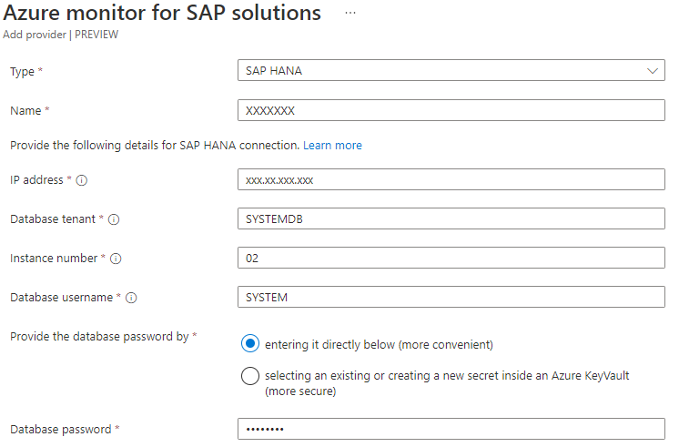

# Configure SAP HANA provider for Azure Monitor for SAP solutions (preview)

[!INCLUDE [Azure Monitor for SAP solutions public preview notice](./includes/preview-azure-monitor.md)]

In this how-to guide, you'll learn to configure an SAP HANA provider for Azure Monitor for SAP solutions through the Azure portal. There are instructions to set up the [current version](#configure-azure-monitor-for-sap-solutions) and the [classic version](#configure-azure-monitor-for-sap-solutions-classic) of Azure Monitor for SAP solutions.

## Prerequisite to enable secure communication

To [enable TLS 1.2 higher](enable-tls-azure-monitor-sap-solutions.md) for SAP HANA provider, follow steps mentioned in this [SAP document](https://www.sap.com/documents/2018/11/b865eb91-287d-0010-87a3-c30de2ffd8ff.html)

## Prerequisites

- An Azure subscription. 
- An existing Azure Monitor for SAP solutions resource. To create an Azure Monitor for SAP solutions resource, see the [quickstart for the Azure portal](quickstart-portal.md) or the [quickstart for PowerShell](quickstart-powershell.md).

## Configure Azure Monitor for SAP solutions

1. Sign in to the [Azure portal](https://portal.azure.com).
1. Search for and select **Azure Monitors for SAP solutions** in the search bar.
1. On the Azure Monitor for SAP solutions service page, select **Create**.
1. On the Azure Monitor for SAP solutions creation page, enter your basic resource information on the **Basics** tab.
1. On the **Providers** tab:
    1. Select **Add provider**.
    1. On the creation pane, for **Type**, select **SAP HANA**.
       
    1. Optionally, select **Enable secure communication**, choose the certificate type from the drop-down menu.
    1. For **IP address**, enter the IP address or hostname of the server that runs the SAP HANA instance that you want to monitor. If you're using a hostname, make sure there is connectivity within the virtual network.
    1. For **Database tenant**, enter the HANA database that you want to connect to. It's recommended to use **SYSTEMDB**, because tenant databases don't have all monitoring views. For legacy single-container HANA 1.0 instances, leave this field blank.
    1. For **Instance number**, enter the instance number of the database (0-99). The SQL port is automatically determined based on the instance number.
    1. For **Database username**, enter the dedicated SAP HANA database user. This user needs the **MONITORING** or **BACKUP CATALOG READ** role assignment. For non-production SAP HANA instances, use **SYSTEM** instead.
    1. For **Database password**, enter the password for the database username.  You can either enter the password directly or use a secret inside Azure Key Vault.
1. Save your changes to the Azure Monitor for SAP solutions resource.

## Configure Azure Monitor for SAP solutions (classic)

To configure the SAP HANA provider for Azure Monitor for SAP solutions (classic):

1. Sign in to the [Azure portal](https://portal.azure.com).
1. Search for and select the **Azure Monitors for SAP Solutions (classic)** service in the search bar.
1. On the Azure Monitor for SAP solutions (classic) service page, select **Create**.
1. On the creation page's **Basics** tab, enter the basic information for your Azure Monitor for SAP solutions instance.
1. On the **Providers** tab, add the providers that you want to configure. You can add multiple providers during creation. You can also add more providers after you deploy the Azure Monitor for SAP solutions resource. For each provider:
    1. Select **Add provider**.
    1. For **Type**, select **SAP HANA**. Make sure that you configure an SAP HANA provider for the main node.
    1. For **IP address**, enter the private IP address for the HANA server.
    1. For **Database tenant**, enter the name of the tenant that you want to use. You can choose any tenant. However, it's recommended to use **SYSTEMDB**, because this tenant has more monitoring areas.
    1. For **SQL port**, enter the port number for your HANA database. The format begins with 3, includes the instance number, and ends in 13. For example, 30013 is the SQL port for the instance 001.
    1. For **Database username**, enter the username that you want to use. Make sure the database user has **monitoring** and **catalog read** role assignments.
    1. Select **Add provider** to finish adding the provider.
1. Select **Review + create** to review and validate your configuration.
1. Select **Create** to finish creating the Azure Monitor for SAP solutions resource.

## Next steps

> [!div class="nextstepaction"]
> [Learn about Azure Monitor for SAP solutions provider types](providers.md)
