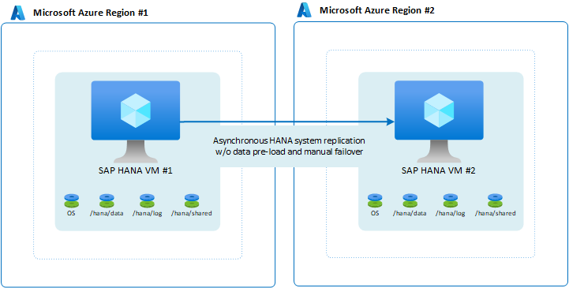
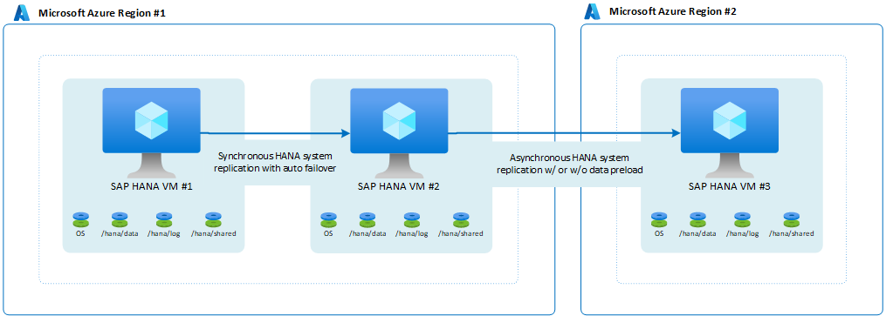

# SAP HANA availability across Azure regions

This article describes scenarios related to SAP HANA availability across different Azure regions. Because of the distance between Azure regions, setting up SAP HANA availability in multiple Azure regions involves special considerations.

## Why deploy across multiple Azure regions

Azure regions often are separated by large distances. Depending on the geopolitical region, the distance between Azure regions might be hundreds of miles, or even several thousand miles, like in the United States. Because of the distance, network traffic between assets that are deployed in two different Azure regions experience significant network roundtrip latency. The latency is significant enough to exclude synchronous data exchange between two SAP HANA instances under typical SAP workloads. 

On the other hand, organizations often have a distance requirement between the location of the primary datacenter and a secondary datacenter. A distance requirement helps provide availability if a natural disaster occurs in a wider geographic location. Examples include the hurricanes that hit the Caribbean and Florida in September and October 2017. Your organization might have at least a minimum distance requirement. For most Azure customers, a minimum distance definition requires you to design for availability across [Azure regions](https://azure.microsoft.com/regions/). Because the distance between two Azure regions is too large to use the HANA synchronous replication mode, RTO and RPO requirements might force you to deploy availability configurations in one region, and then supplement with additional deployments in a second region.

Another aspect to consider in this scenario is failover and client redirect. The assumption is that a failover between SAP HANA instances in two different Azure regions always is a manual failover. Because the replication mode of SAP HANA system replication is set to asynchronous, there's a potential that data committed in the primary HANA instance hasn't yet made it to the secondary HANA instance. Therefore, automatic failover isn't an option for configurations where the replication is asynchronous. Even with manually controlled failover, as in a failover exercise, you need to take measures to ensure that all the committed data on the primary side made it to the secondary instance before you manually move over to the other Azure region.
 
Azure Virtual Network uses a different IP address range. The IP addresses are deployed in the second Azure region. So, you either need to change the SAP HANA client configuration, or preferably, you need to create steps to change the name resolution. This way, the clients are redirected to the new secondary site's server IP address. For more information, see the SAP article [Client connection recovery after takeover](https://help.sap.com/doc/6b94445c94ae495c83a19646e7c3fd56/2.0.02/en-US/c93a723ceedc45da9a66ff47672513d3.html).   

## Simple availability between two Azure regions

You might choose not to put any availability configuration in place within a single region, but still have the demand to have the workload served if a disaster occurs. Typical cases for such scenarios are nonproduction systems. Although having the system down for half a day or even a day is sustainable, you can't allow the system to be unavailable for 48 hours or more. To make the setup less costly, run another system that is even less important in the VM. The other system functions as a destination. You can also size the VM in the secondary region to be smaller, and choose not to preload the data. Because the failover is manual and entails many more steps to fail over the complete application stack, the additional time to shut down the VM, resize it, and then restart the VM is acceptable.

If you are using the scenario of sharing the DR target with a QA system in one VM, you need to take these considerations into account:

- There are two [operation modes](https://help.sap.com/viewer/6b94445c94ae495c83a19646e7c3fd56/2.0.02/en-US/627bd11e86c84ec2b9fcdf585d24011c.html) with delta_datashipping and logreplay, which are available for such a scenario
- Both operation modes have different memory requirements without preloading data
- Delta_datashipping might require drastically less memory without the preload option than logreplay could require. See chapter 4.3 of the SAP document [How To Perform System Replication for SAP HANA](https://www.sap.com/documents/2017/07/606a676e-c97c-0010-82c7-eda71af511fa.html)
- The memory requirement of logreplay operation mode without preload is not deterministic and depends on the columnstore structures loaded. In extreme cases, you might require 50% of the memory of the primary instance. The memory for logreplay operation mode is independent on whether you chose to have the data preloaded set or not.

> [!NOTE]
> In this configuration, you can't provide an RPO=0 because your HANA system replication mode is asynchronous. If you need to provide an RPO=0, this configuration isn't the configuration of choice.

A small change that you can make in the configuration might be to configure data as preloading. However, given the manual nature of failover and the fact that application layers also need to move to the second region, it might not make sense to preload data. 

## Combine availability within one region and across regions 

A combination of availability within and across regions might be driven by these factors:

- A requirement of RPO=0 within an Azure region.
- The organization isn't willing or able to have global operations affected by a major natural catastrophe that affects a larger region. This was the case for some hurricanes that hit the Caribbean over the past few years.
- Regulations that demand distances between primary and secondary sites that are clearly beyond what Azure availability zones can provide.

In these cases, you can set up what SAP calls an [SAP HANA multitier system replication configuration](https://help.sap.com/viewer/6b94445c94ae495c83a19646e7c3fd56/2.0.02/en-US/ca6f4c62c45b4c85a109c7faf62881fc.html) by using HANA system replication. The architecture would look like:

SAP introduced [multi-target system replication](https://help.sap.com/viewer/42668af650f84f9384a3337bcd373692/2.0.03/en-US/0b2c70836865414a8c65463180d18fec.html) with HANA 2.0 SPS3. Multi-target system replication brings some advantages in update scenarios. For example, the DR site (Region 2) is not impacted when the secondary HA site is down for maintenance or updates. 
You can find out more about HANA multi-target system replication at the [SAP Help Portal](https://help.sap.com/viewer/6b94445c94ae495c83a19646e7c3fd56/2.0.03/en-US/ba457510958241889a459e606bbcf3d3.html).
Possible architecture with multi-target replication would look like:

If the organization has requirements for high availability readiness in the second(DR) Azure region, then the architecture would look like:

Using logreplay as operation mode, this configuration provides an RPO=0, with low RTO, within the primary region. The configuration also provides decent RPO if a move to the second region is involved. The RTO times in the second region are dependent on whether data is preloaded. Many customers use the VM in the secondary region to run a test system. In that use case, the data can't be preloaded.

> [!IMPORTANT]
> The operation modes between the different tiers need to be homogeneous. You **can't** use logreply as operation mode between tier 1 and tier 2 and delta_datashipping to supply tier 3. You can only choose the one or the other operation mode that needs to be consistent for all tiers. Since delta_datashipping is not suitable to give you an RPO=0, the only reasonable operation mode for such a multi-tier configuration remains logreplay. For details about operation modes and some restrictions, see the SAP article [Operation modes for SAP HANA system replication](https://help.sap.com/viewer/6b94445c94ae495c83a19646e7c3fd56/2.0.02/en-US/627bd11e86c84ec2b9fcdf585d24011c.html). 

## Next steps

For step-by-step guidance on setting up these configurations in Azure, see:

- [Set up SAP HANA system replication in Azure VMs](sap-hana-high-availability.md)
- [High availability for SAP HANA by using system replication](https://blogs.sap.com/2018/01/08/your-sap-on-azure-part-4-high-availability-for-sap-hana-using-system-replication/)
