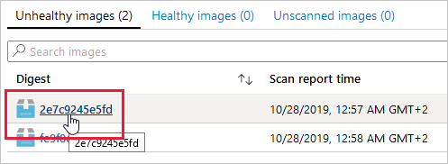

# Use Microsoft Defender for container registries to scan your images for vulnerabilities

[!INCLUDE [Banner for top of topics](./includes/banner.md)]

This page explains how to use the built-in vulnerability scanner to scan the container images stored in your Azure Resource Manager-based Azure Container Registry.

When **Microsoft Defender for container registries** is enabled, any image you push to your registry will be scanned immediately. In addition, any image pulled within the last 30 days is also scanned. 

When the scanner reports vulnerabilities to Defender for Cloud, Defender for Cloud presents the findings and related information as recommendations. In addition, the findings include related information such as remediation steps, relevant CVEs, CVSS scores, and more. You can view the identified vulnerabilities for one or more subscriptions, or for a specific registry.

> [!TIP]
> You can also scan container images for vulnerabilities as the images are built in your CI/CD GitHub workflows. Learn more in [Identify vulnerable container images in your CI/CD workflows](defender-for-container-registries-cicd.md).

## Identify vulnerabilities in images in Azure container registries 

To enable vulnerability scans of images stored in your Azure Resource Manager-based Azure Container Registry:

1. Enable **Microsoft Defender for container registries** for your subscription. Defender for Cloud is now ready to scan images in your registries.

    >[!NOTE]
    > This feature is charged per image.

1. Image scans are triggered on every push or import, and if the image has been pulled within the last 30 days. 

    When the scan completes (typically after approximately 2 minutes, but can be up to 15 minutes), findings are available as Defender for Cloud recommendations.

1. [View and remediate findings as explained below](#view-and-remediate-findings).

## Identify vulnerabilities in images in other container registries 

1. Use the ACR tools to bring images to your registry from Docker Hub or Microsoft Container Registry.	When the import completes, the imported images are scanned by the built-in vulnerability assessment solution.

    Learn more in [Import container images to a container registry](../container-registry/container-registry-import-images.md)

    When the scan completes (typically after approximately 2 minutes, but can be up to 15 minutes), findings are available as Defender for Cloud recommendations.

1. [View and remediate findings as explained below](#view-and-remediate-findings).

## View and remediate findings

1. To view the findings, go to the **Recommendations** page. If issues were found, you'll see the recommendation **Vulnerabilities in Azure Container Registry images should be remediated**

    

1. Select the recommendation. 

    The recommendation details page opens with additional information. This information includes the list of registries with vulnerable images ("Affected resources") and the remediation steps. 

1. Select a specific registry to see the repositories within it that have vulnerable repositories.

    

    The registry details page opens with the list of affected repositories.

1. Select a specific repository to see the repositories within it that have vulnerable images.

    

    The repository details page opens. It lists the vulnerable images together with an assessment of the severity of the findings.

1. Select a specific image to see the vulnerabilities.

    

    The list of findings for the selected image opens.

    

1. To learn more about a finding, select the finding. 

    The findings details pane opens.

    

    This pane includes a detailed description of the issue and links to external resources to help mitigate the threats.

1. Follow the steps in the remediation section of this pane.

1. When you have taken the steps required to remediate the security issue, replace the image in your registry:

    1. Push the updated image. This will trigger a scan. 
    
    1. Check the recommendations page for the recommendation "Vulnerabilities in Azure Container Registry images should be remediated". 
    
        If the recommendation still appears and the image you've handled still appears in the list of vulnerable images, check the remediation steps again.

    1. When you are sure the updated image has been pushed, scanned, and is no longer appearing in the recommendation, delete the “old” vulnerable image from your registry.

## Disable specific findings (preview)

> [!NOTE]
> [!INCLUDE [Legalese](../../includes/security-center-preview-legal-text.md)]

If you have an organizational need to ignore a finding, rather than remediate it, you can optionally disable it. Disabled findings don't impact your secure score or generate unwanted noise.

When a finding matches the criteria you've defined in your disable rules, it won't appear in the list of findings. Typical scenarios include:

- Disable findings with severity below medium
- Disable findings that are non-patchable
- Disable findings with CVSS score below 6.5
- Disable findings with specific text in the security check or category (for example, “RedHat”, “CentOS Security Update for sudo”)

> [!IMPORTANT]
> To create a rule, you need permissions to edit a policy in Azure Policy.
>
> Learn more in [Azure RBAC permissions in Azure Policy](../governance/policy/overview.md#azure-rbac-permissions-in-azure-policy).

You can use any of the following criteria: 

- Finding ID 
- Category
- Security check 
- CVSS v3 scores
- Severity 
- Patchable status 

To create a rule:

1. From the recommendations detail page for **Vulnerabilities in Azure Container Registry images should be remediated**, select **Disable rule**.
1. Select the relevant scope.
1. Define your criteria.
1. Select **Apply rule**.

    :::image type="content" source="./media/defender-for-container-registries-usage/new-disable-rule-for-registry-finding.png" alt-text="Create a disable rule for VA findings on registry.":::

1. To view, override, or delete a rule: 
    1. Select **Disable rule**.
    1. From the scope list, subscriptions with active rules show as **Rule applied**.
        :::image type="content" source="./media/remediate-vulnerability-findings-vm/modify-rule.png" alt-text="Modify or delete an existing rule.":::
    1. To view or delete the rule, select the ellipsis menu ("...").

## Next steps

Learn more about [the advanced protection plans of Microsoft Defender](defender-for-cloud-introduction.md).