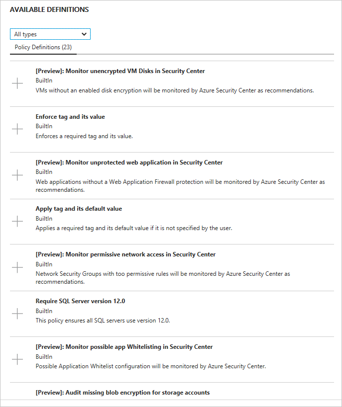
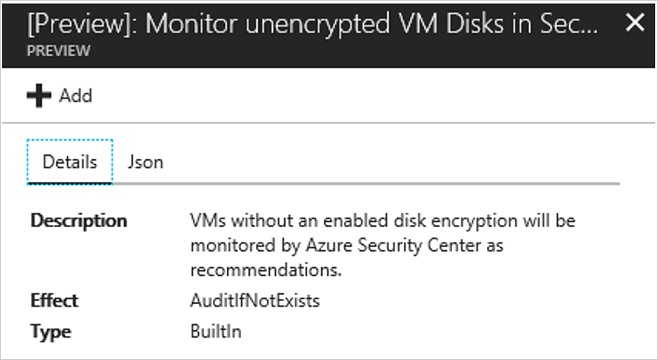

# Set security policies in Security Center, powered by Azure Policy
This document helps you to configure security policies in Security Center, which are powered by Azure Policy, by guiding you through the necessary steps to perform this task. 

## How security policies work?
Security Center automatically creates a default security policy for each of your Azure subscriptions. You can edit the policy in Security Center or use [Azure Policy](http://docs.microsoft.com/azure/azure-policy/azure-policy-introduction) to create new policy definitions, assign policies across Management Groups (which can represent the entire organization, a business unit in it, etc.), and monitor policy compliance.

> [!NOTE]
> Azure Policy is in limited preview. Click [here](https://aka.ms/getpolicy) to join. For more information about Azure Policies read [Create and manage policies to enforce compliance](http://docs.microsoft.com/en-us/azure/azure-policy/create-manage-policy).

## Edit security policies
You can edit the default security policy for each of your Azure subscriptions in Security Center. To modify a security policy, you must be an owner, contributor or Security Admin of that subscription or the containing Management Group. Sign in to the Azure portal and follow the succeeding steps to view your security polices in Security Center:

1. In the **Security Center** dashboard, under **General**, click **Security Policy**.
2. Select the subscription on which you want to enable the security policy.

	

3. In the **POLICY COMPONENTS** section, click **Security policy**.

	

4. This is the default policy assigned to Security Center via Azure Policy. You can delete items that are under **POLICIES AND PARAMETERS**, or you can add other policy definitions that are under **AVAILABLE OPTIONS**. To do that, just click in the plus sign besides the definition’s name.

	

5. If you want more detailed explanation about the policy, click on it and another page will open with the details, and the JSON code that has the [policy definition](https://docs.microsoft.com/azure/azure-resource-manager/resource-manager-policy/#policy-definition-structure) structure:

	

6. When you finish editing, click **Save**.

## Available security policy definitions

Use the following table as a reference to understand the policy definitions available in the default security policy: 

| Policy | When state is on |
| --- | --- |
| System updates |Retrieves a daily list of available security and critical updates from Windows Update or Windows Server Update Services. The retrieved list depends on the service that's configured for that virtual machine and recommends that the missing updates be applied. For Linux systems, the policy uses the distro-provided package management system to determine packages that have available updates. It also checks for security and critical updates from [Azure Cloud Services](../cloud-services/cloud-services-how-to-configure.md) virtual machines. |
| OS vulnerabilities |Analyzes operating system configurations daily to determine issues that could make the virtual machine vulnerable to attack. The policy also recommends configuration changes to address these vulnerabilities. See the [list of recommended baselines](https://gallery.technet.microsoft.com/Azure-Security-Center-a789e335) for more information about the specific configurations that are being monitored. (At this time, Windows Server 2016 is not fully supported.) |
| Endpoint protection |Recommends endpoint protection to be provisioned for all Windows virtual machines to help identify and remove viruses, spyware, and other malicious software. |
| Disk encryption |Recommends enabling disk encryption in all virtual machines to enhance data protection at rest. |
| Network security groups |Recommends that [network security groups](../virtual-network/virtual-networks-nsg.md) be configured to control inbound and outbound traffic to VMs that have public endpoints. Network security groups that are configured for a subnet is inherited by all virtual machine network interfaces unless otherwise specified. In addition to checking that a network security group has been configured, this policy assesses inbound security rules to identify rules that allow incoming traffic. |
| Web application firewall |Recommends that a web application firewall be provisioned on virtual machines when either of the following is true:   [Instance-level public IP](../virtual-network/virtual-networks-instance-level-public-ip.md) (ILPIP) is used and the inbound security rules for the associated network security group are configured to allow access to port 80/443.  Load-balanced IP is used and the associated load balancing and inbound network address translation (NAT) rules are configured to allow access to port 80/443. (For more information, see [Azure Resource Manager support for Load Balancer](../load-balancer/load-balancer-arm.md). |
| Next generation firewall |Extends network protections beyond network security groups, which are built into Azure. Security Center will discover deployments for which a next generation firewall is recommended and enable you to provision a virtual appliance. |
| SQL auditing & Threat detection |Recommends that auditing of access to Azure Database be enabled for compliance and also advanced threat detection, for investigation purposes. |
| SQL Encryption |Recommends that encryption at rest be enabled for your Azure SQL Database, associated backups, and transaction log files. Even if your data is breached, it will not be readable. |
| Vulnerability assessment |Recommends that you install a vulnerability assessment solution on your VM. |
| Storage Encryption |Currently, this feature is available for Azure Blobs and Files. After enabling Storage Service Encryption, only new data will be encrypted, and any existing files in this storage account will remain unencrypted. |
| JIT Network Access |When just in time is enabled, Security Center locks down inbound traffic to your Azure VMs by creating an NSG rule. You select the ports on the VM to which inbound traffic should be locked down. For more information, see [Manage virtual machine access using just in time](https://docs.microsoft.com/azure/security-center/security-center-just-in-time). |

## Next step
In this document, you learned how to configure security policies in Security Center. To learn more about Security Center, see the following:

* [Azure Security Center planning and operations guide](security-center-planning-and-operations-guide.md). Learn how to plan and understand the design considerations to adopt Azure Security Center.
* [Security health monitoring in Azure Security Center](security-center-monitoring.md). Learn how to monitor the health of your Azure resources.
* [Managing and responding to security alerts in Azure Security Center](security-center-managing-and-responding-alerts.md). Learn how to manage and respond to security alerts.
* [Monitoring partner solutions with Azure Security Center](security-center-partner-solutions.md). Learn how to monitor the health status of your partner solutions.
* [Azure Security Center FAQ](security-center-faq.md). Find frequently asked questions about using the service.
* [Azure Security Blog](http://blogs.msdn.com/b/azuresecurity/). Find blog posts about Azure security and compliance.
