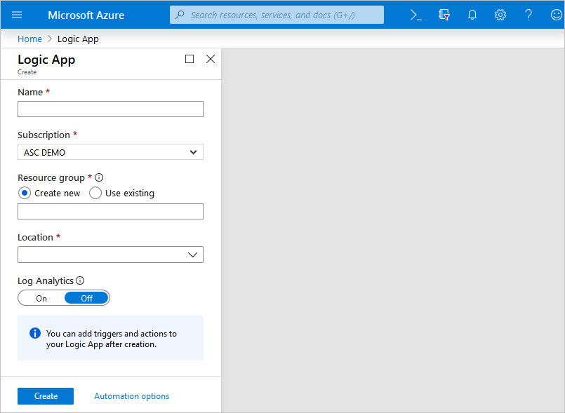
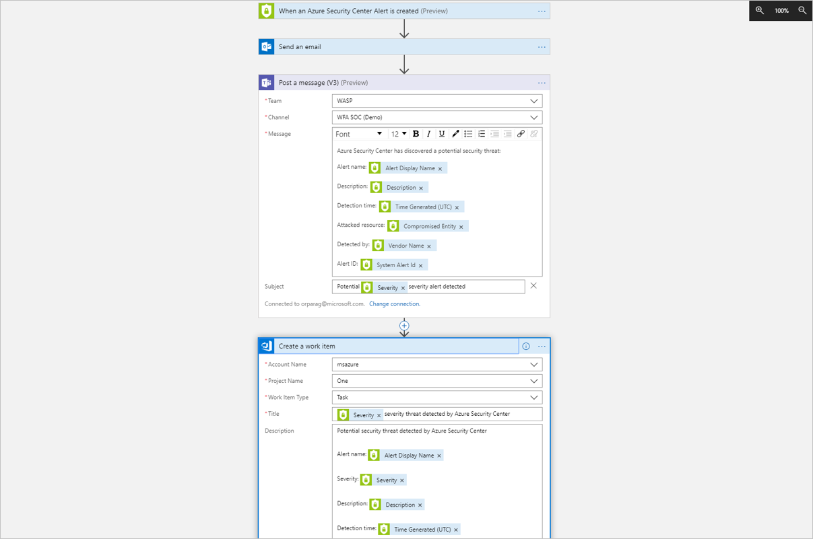
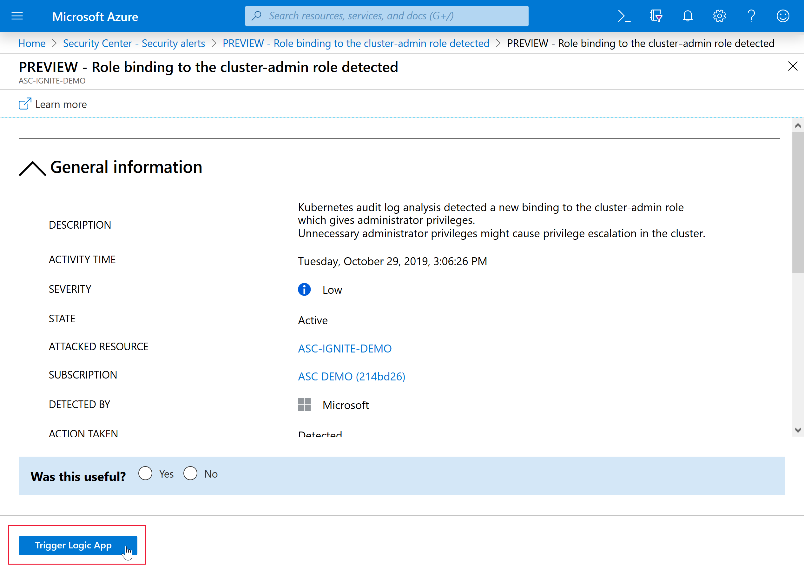

# Automate responses to Security Center triggers

Every security program includes multiple workflows for incident response. These processes might include notifying relevant stakeholders, launching a change management process, and applying specific remediation steps. Security experts recommend that you automate as many steps of those procedures as you can. Automation reduces overhead. It can also improve your security by ensuring the process steps are done quickly, consistently, and according to your predefined requirements.

This article describes the workflow automation feature of Azure Security Center. This feature can trigger Logic Apps on security alerts and recommendations. For example, you might want Security Center to email a specific user when an alert occurs. You'll also learn how to create Logic Apps using [Azure Logic Apps](../logic-apps/logic-apps-overview.md).

## Availability

|Aspect|Details|
|----|:----|
|Release state:|General Availability (GA)|
|Pricing:|Free|
|Required roles and permissions:|**Security admin role** or **Owner** on the resource group Must also have write permissions for the target resource  To work with Azure Logic Apps workflows, you must also have the following Logic Apps roles/permissions:  - [Logic App Operator](../role-based-access-control/built-in-roles.md#logic-app-operator) permissions are required or Logic App read/trigger access (this role can't create or edit logic apps; only *run* existing ones)  - [Logic App Contributor](../role-based-access-control/built-in-roles.md#logic-app-contributor) permissions are required for Logic App creation and modification If you want to use Logic App connectors, you may need additional credentials to sign in to their respective services (for example, your Outlook/Teams/Slack instances)|
|Clouds:| Commercial clouds  National/Sovereign (US Gov, China Gov, Other Gov)|
|||

## Create a logic app and define when it should automatically run 

1. From Security Center's sidebar, select **Workflow automation**.

    :::image type="content" source="./media/workflow-automation/list-of-workflow-automations.png" alt-text="List of workflow automations":::

    From this page you can create new automation rules, as well as enable, disable, or delete existing ones.

1. To define a new workflow, click **Add workflow automation**. 

    A pane appears with the options for your new automation. Here you can enter:
    1. A name and description for the automation.
    1. The triggers that will initiate this automatic workflow. For example, you might want your Logic App to run when a security alert that contains "SQL" is generated.

        > [!NOTE]
        > If your trigger is a recommendation that has "sub-recommendations", for example **Vulnerability assessment findings on your SQL databases should be remediated**, the logic app will not trigger for every new security finding; only when the status of the parent recommendation changes.

    1. The Logic App that will run when your trigger conditions are met. 

        :::image type="content" source="./media/workflow-automation/add-workflow.png" alt-text="Add workflow automations pane":::

1. From the Actions section, click **Create a new one** to begin the Logic App creation process.

    You'll be taken to Azure Logic Apps.

    

1. Enter a name, resource group, and location, and click **Create**.

1. In your new logic app, you can choose from built-in, predefined templates from the security category. Or you can define a custom flow of events to occur when this process is triggered.

    > [!TIP]
    > Sometimes in a logic app, parameters are included in the connector as part of a string and not in their own field. For an example of how to extract parameters, see step #14 of [Working with logic app parameters while building Azure Security Center workflow automations](https://techcommunity.microsoft.com/t5/azure-security-center/working-with-logic-app-parameters-while-building-azure-security/ba-p/1342121).

    The logic app designer supports these Security Center triggers:

    * **When an Azure Security Center Recommendation is created or triggered** - If your logic app relies on a recommendation that gets deprecated or replaced, your automation will stop working and you'll need to update the trigger. To track changes to recommendations, see [Azure Security Center release notes](release-notes.md).

    * **When an Azure Security Center Alert is created or triggered** - You can customize the trigger so that it relates only to alerts with the severity levels that interest you.
    
    > [!NOTE]
    > If you are using the legacy trigger "When a response to an Azure Security Center alert is triggered", your logic apps will not be launched by the Workflow Automation feature. Instead, use either of the triggers mentioned above. 

    

1. After you've defined your logic app, return to the workflow automation definition pane ("Add workflow automation"). Click **Refresh** to ensure your new Logic App is available for selection.

    

1. Select your logic app and save the automation. Note that the Logic App dropdown only shows Logic Apps with supporting Security Center connectors mentioned above.

## Manually trigger a Logic App

You can also run Logic Apps manually when viewing any security alert or recommendation.

To manually run a Logic App, open an alert or a recommendation and click **Trigger Logic App**:

## Configure workflow automation at scale using the supplied policies

Automating your organization's monitoring and incident response processes can greatly improve the time it takes to investigate and mitigate security incidents.

To deploy your automation configurations across your organization, use the supplied Azure Policy 'DeployIfNotExist' policies described below to create and configure workflow automation procedures.

Get started with [workflow automation templates](https://github.com/Azure/Azure-Security-Center/tree/master/Workflow%20automation).

To implement these policies:

1. From the table below, select the policy you want to apply:

    |Goal  |Policy  |Policy ID  |
    |---------|---------|---------|
    |Workflow automation for security alerts|[Deploy Workflow Automation for Azure Security Center alerts](https://portal.azure.com/#blade/Microsoft_Azure_Policy/PolicyDetailBlade/definitionId/%2fproviders%2fMicrosoft.Authorization%2fpolicyDefinitions%2ff1525828-9a90-4fcf-be48-268cdd02361e)|f1525828-9a90-4fcf-be48-268cdd02361e|
    |Workflow automation for security recommendations|[Deploy Workflow Automation for Azure Security Center recommendations](https://portal.azure.com/#blade/Microsoft_Azure_Policy/PolicyDetailBlade/definitionId/%2fproviders%2fMicrosoft.Authorization%2fpolicyDefinitions%2f73d6ab6c-2475-4850-afd6-43795f3492ef)|73d6ab6c-2475-4850-afd6-43795f3492ef|
    ||||

    > [!TIP]
    > You can also find these by searching Azure Policy:
    > 1. Open Azure Policy.
    > :::image type="content" source="./media/continuous-export/opening-azure-policy.png" alt-text="Accessing Azure Policy":::
    > 2. From the Azure Policy menu, select **Definitions** and search for them by name. 

1. From the relevant Azure Policy page, select **Assign**.
    :::image type="content" source="./media/workflow-automation/export-policy-assign.png" alt-text="Assigning the Azure Policy":::

1. Open each tab and set the parameters as desired:
    1. In the **Basics** tab, set the scope for the policy. To use centralized management, assign the policy to the Management Group containing the subscriptions that will use the workflow automation configuration. 
    1. In the **Parameters** tab, set the resource group and data type details. 
        > [!TIP]
        > Each parameter has a tooltip explaining the options available to you.
        >
        > Azure Policy's parameters tab (1) provides access to similar configuration options as Security Center's workflow automation page (2).
        > :::image type="content" source="./media/workflow-automation/azure-policy-next-to-workflow-automation.png" alt-text="Comparing the parameters in workflow automation with Azure Policy" lightbox="./media/workflow-automation/azure-policy-next-to-workflow-automation.png":::

    1. Optionally, to apply this assignment to existing subscriptions, open the **Remediation** tab and select the option to create a remediation task.

1. Review the summary page and select **Create**.

## Data types schemas

To view the raw event schemas of the security alerts or recommendations events passed to the Logic App instance, visit the [Workflow automation data types schemas](https://aka.ms/ASCAutomationSchemas). This can be useful in cases where you are not using Security Center's built-in Logic App connectors mentioned above, but instead are using Logic App's generic HTTP connector - you could use the event JSON schema to manually parse it as you see fit.

## FAQ for workflow automation

### Does workflow automation support any business continuity or disaster recovery (BCDR) scenarios?

When preparing your environment for BCDR scenarios, where the target resource is experiencing an outage or other disaster, it's the organization's responsibility to prevent data loss by establishing backups according to the guidelines from Azure Event Hubs, Log Analytics workspace, and Logic App.

For every active automation, we recommend you create an identical (disabled) automation and store it in a different location. When there's an outage, you can enable these backup automations and maintain normal operations.

Learn more about [Business continuity and disaster recovery for Azure Logic Apps](../logic-apps/business-continuity-disaster-recovery-guidance.md).

## Next steps

In this article, you learned about creating Logic Apps, automating their execution in Security Center, and running them manually. 

For related material, see: 

- [The Microsoft Learn module on how to use workflow automation to automate a security response](/learn/modules/resolve-threats-with-azure-security-center/)
- [Security recommendations in Azure Security Center](security-center-recommendations.md)
- [Security alerts in Azure Security Center](security-center-alerts-overview.md)
- [About Azure Logic Apps](../logic-apps/logic-apps-overview.md)
- [Connectors for Azure Logic Apps](../connectors/apis-list.md)
- [Workflow automation data types schemas](https://aka.ms/ASCAutomationSchemas)