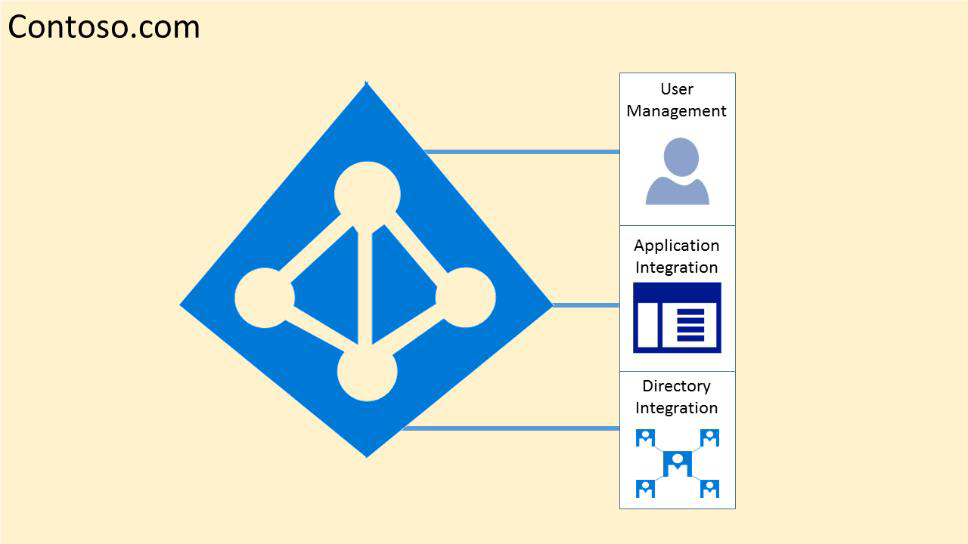
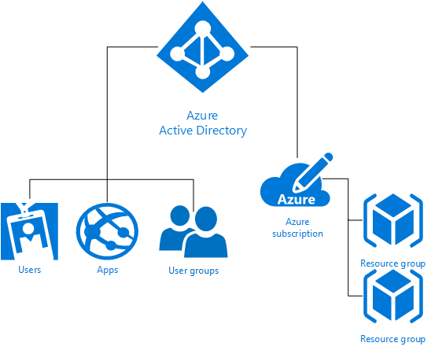
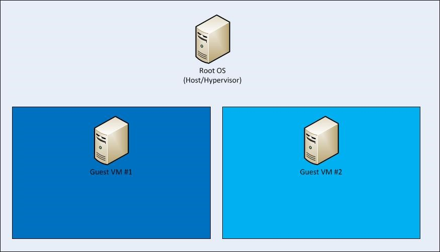
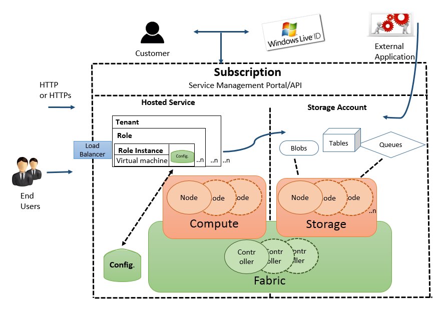
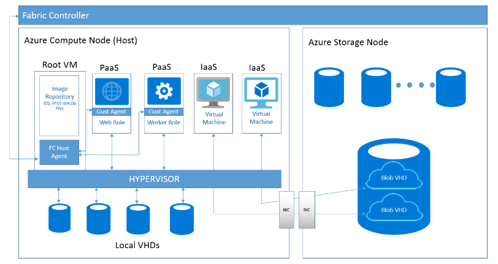
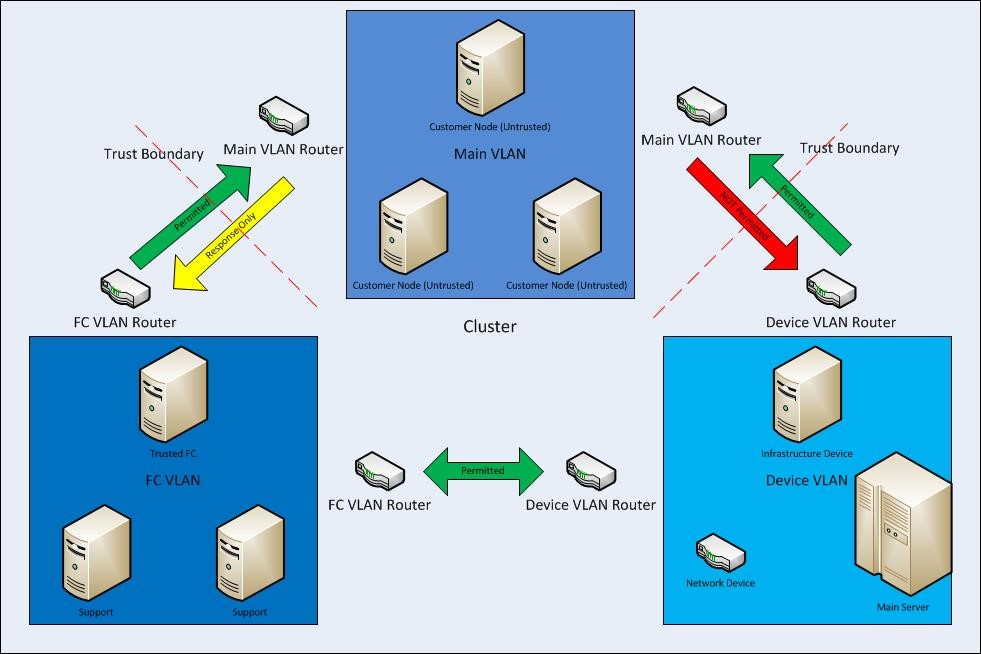
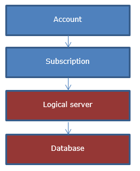
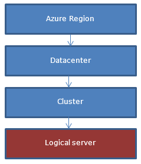
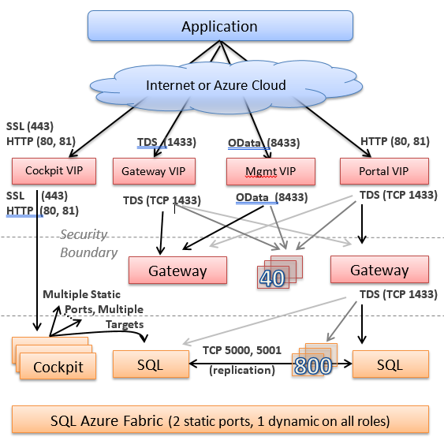
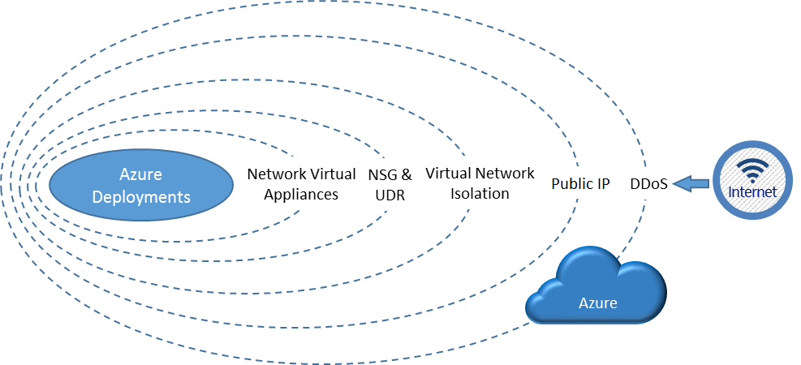

---

title: Isolation in the Azure Public Cloud | Microsoft Docs
description: Learn how Azure provides isolation against both malicious and non-malicious users and offers various isolation choices to architects.
services: security
documentationcenter: na
author: UnifyCloud
manager: rkarlin
editor: TomSh

ms.assetid:
ms.service: security
ms.subservice: security-fundamentals
ms.devlang: na
ms.topic: article
ms.tgt_pltfrm: na
ms.workload: na
ms.date: 10/28/2019
ms.author: TomSh

---

# Isolation in the Azure Public Cloud
Azure allows you to run applications and virtual machines (VMs) on shared physical infrastructure. One of the prime economic motivations to running applications in a cloud environment is the ability to distribute the cost of shared resources among multiple customers. This practice of multi-tenancy improves efficiency by multiplexing resources among disparate customers at low costs. Unfortunately, it also introduces the risk of sharing physical servers and other infrastructure resources to run your sensitive applications and VMs that may belong to an arbitrary and potentially malicious user.

This article outlines how Azure provides isolation against both malicious and non-malicious users and serves as a guide for architecting cloud solutions by offering various isolation choices to architects.

## Tenant Level Isolation
One of the primary benefits of cloud computing is concept of a shared, common infrastructure across numerous customers simultaneously, leading to economies of scale. This concept is called multi-tenancy. Microsoft works continuously to ensure that the multi-tenant architecture of Microsoft Cloud Azure supports security, confidentiality, privacy, integrity, and availability standards.

In the cloud-enabled workplace, a tenant can be defined as a client or organization that owns and manages a specific instance of that cloud service. With the identity platform provided by Microsoft Azure, a tenant is simply a dedicated instance of Azure Active Directory (Azure AD) that your organization receives and owns when it signs up for a Microsoft cloud service.

Each Azure AD directory is distinct and separate from other Azure AD directories. Just like a corporate office building is a secure asset specific to only your organization, an Azure AD directory was also designed to be a secure asset for use by only your organization. The Azure AD architecture isolates customer data and identity information from co-mingling. This means that users and administrators of one Azure AD directory cannot accidentally or maliciously access data in another directory.

### Azure Tenancy
Azure tenancy (Azure Subscription) refers to a “customer/billing” relationship and a unique [tenant](../../active-directory/develop/quickstart-create-new-tenant.md) in [Azure Active Directory](../../active-directory/fundamentals/active-directory-whatis.md). Tenant level isolation in Microsoft Azure is achieved using Azure Active Directory and [role-based controls](../../role-based-access-control/overview.md) offered by it. Each Azure subscription is associated with one Azure Active Directory (AD) directory.

Users, groups, and applications from that directory can manage resources in the Azure subscription. You can assign these access rights using the Azure portal, Azure command-line tools, and Azure Management APIs. An Azure AD tenant is logically isolated using security boundaries so that no customer can access or compromise co-tenants, either maliciously or accidentally. Azure AD runs on “bare metal” servers isolated on a segregated network segment, where host-level packet filtering and Windows Firewall block unwanted connections and traffic.

- Access to data in Azure AD requires user authentication via a security token service (STS). Information on the user’s existence, enabled state, and role is used by the authorization system to determine whether the requested access to the target tenant is authorized for this user in this session.

- Tenants are discrete containers and there is no relationship between these.

- No access across tenants unless tenant admin grants it through federation or provisioning user accounts from other tenants.

- Physical access to servers that comprise the Azure AD service, and direct access to Azure AD’s back-end systems, is restricted.

- Azure AD users have no access to physical assets or locations, and therefore it is not possible for them to bypass the logical RBAC policy checks stated following.

For diagnostics and maintenance needs, an operational model that employs a just-in-time privilege elevation system is required and used. Azure AD Privileged Identity Management (PIM) introduces the concept of an eligible admin. [Eligible admins](../../active-directory/privileged-identity-management/pim-configure.md) should be users that need privileged access now and then, but not every day. The role is inactive until the user needs access, then they complete an activation process and become an active admin for a predetermined amount of time.

Azure Active Directory hosts each tenant in its own protected container, with policies and permissions to and within the container solely owned and managed by the tenant.

The concept of tenant containers is deeply ingrained in the directory service at all layers, from portals all the way to persistent storage.

Even when metadata from multiple Azure Active Directory tenants is stored on the same physical disk, there is no relationship between the containers other than what is defined by the directory service, which in turn is dictated by the tenant administrator.

### Azure Role-Based Access Control (RBAC)
[Azure Role-Based Access Control (RBAC)](../../role-based-access-control/overview.md) helps you to share various components available within an Azure subscription by providing fine-grained access management for Azure. Azure RBAC enables you to segregate duties within your organization and grant access based on what users need to perform their jobs. Instead of giving everybody unrestricted permissions in Azure subscription or resources, you can allow only certain actions.

Azure RBAC has three basic roles that apply to all resource types:

- **Owner** has full access to all resources including the right to delegate access to others.

- **Contributor** can create and manage all types of Azure resources but can’t grant access to others.

- **Reader** can view existing Azure resources.

The rest of the RBAC roles in Azure allow management of specific Azure resources. For example, the Virtual Machine Contributor role allows the user to create and manage virtual machines. It does not give them access to the Azure Virtual Network or the subnet that the virtual machine connects to.

[RBAC built-in roles](../../role-based-access-control/built-in-roles.md) list the roles available in Azure. It specifies the operations and scope that each built-in role grants to users. If you're looking to define your own roles for even more control, see how to build [Custom roles in Azure RBAC](../../role-based-access-control/custom-roles.md).

Some other capabilities for Azure Active Directory include:
- Azure AD enables SSO to SaaS applications, regardless of where they are hosted. Some applications are federated with Azure AD, and others use password SSO. Federated applications can also support user provisioning and [password vaulting](https://www.techopedia.com/definition/31415/password-vault).

- Access to data in [Azure Storage](https://azure.microsoft.com/services/storage/) is controlled via authentication. Each storage account has a primary key ([storage account key](../../storage/common/storage-create-storage-account.md), or SAK) and a secondary secret key (the shared access signature, or SAS).

- Azure AD provides Identity as a Service through federation by using [Active Directory Federation Services](../../active-directory/hybrid/how-to-connect-fed-azure-adfs.md), synchronization, and replication with on-premises directories.

- [Azure Multi-Factor Authentication](../../active-directory/authentication/multi-factor-authentication.md) is the multi-factor authentication service that requires users to verify sign-ins by using a mobile app, phone call, or text message. It can be used with Azure AD to help secure on-premises resources with the Azure Multi-Factor Authentication server, and also with custom applications and directories using the SDK.

- [Azure AD Domain Services](https://azure.microsoft.com/services/active-directory-ds/) lets you join Azure virtual machines to an Active Directory domain without deploying domain controllers. You can sign in to these virtual machines with your corporate Active Directory credentials and administer domain-joined virtual machines by using Group Policy to enforce security baselines on all your Azure virtual machines.

- [Azure Active Directory B2C](https://azure.microsoft.com/services/active-directory-b2c/) provides a highly available global-identity management service for consumer-facing applications that scales to hundreds of millions of identities. It can be integrated across mobile and web platforms. Your consumers can sign in to all your applications through customizable experiences by using their existing social accounts or by creating credentials.

### Isolation from Microsoft Administrators & Data Deletion
Microsoft takes strong measures to protect your data from inappropriate access or use by unauthorized persons. These operational processes and controls are backed by the [Online Services Terms](https://aka.ms/Online-Services-Terms), which offer contractual commitments that govern access to your data.

-	Microsoft engineers do not have default access to your data in the cloud. Instead, they are granted access, under management oversight, only when necessary. That access is carefully controlled and logged, and revoked when it is no longer needed.

-	Microsoft may hire other companies to provide limited services on its behalf. Subcontractors may access customer data only to deliver the services for which, we have hired them to provide, and they are prohibited from using it for any other purpose. Further, they are contractually bound to maintain the confidentiality of our customers’ information.

Business services with audited certifications such as ISO/IEC 27001 are regularly verified by Microsoft and accredited audit firms, which perform sample audits to attest that access, only for legitimate business purposes. You can always access your own customer data at any time and for any reason.

If you delete any data, Microsoft Azure deletes the data, including any cached or backup copies. For in-scope services, that deletion will occur within 90 days after the end of the retention period. (In-scope services are defined in the Data Processing Terms section of our [Online Services Terms](https://aka.ms/Online-Services-Terms).)

If a disk drive used for storage suffers a hardware failure, it is securely [erased or destroyed](https://microsoft.com/trustcenter/privacy/you-own-your-data) before Microsoft returns it to the manufacturer for replacement or repair. The data on the drive is overwritten to ensure that the data cannot be recovered by any means.

## Compute Isolation
Microsoft Azure provides various cloud-based computing services that include a wide selection of compute instances & services that can scale up and down automatically to meet the needs of your application or enterprise. These compute instance and service offer isolation at multiple levels to secure data without sacrificing the flexibility in configuration that customers demand.

### Isolated Virtual Machine Sizes

[!INCLUDE [virtual-machines-common-isolation](../../../includes/virtual-machines-common-isolation.md)]

### Hyper-V & Root OS Isolation Between Root VM & Guest VMs
Azure’s compute platform is based on machine virtualization—meaning that all customer code executes in a Hyper-V virtual machine. On each Azure node (or network endpoint), there is a Hypervisor that runs directly over the hardware and divides a node into a variable number of Guest Virtual Machines (VMs).

Each node also has one special Root VM, which runs the Host OS. A critical boundary is the isolation of the root VM from the guest VMs and the guest VMs from one another, managed by the hypervisor and the root OS. The hypervisor/root OS pairing leverages Microsoft's decades of operating system security experience, and more recent learning from Microsoft's Hyper-V, to provide strong isolation of guest VMs.

The Azure platform uses a virtualized environment. User instances operate as standalone virtual machines that do not have access to a physical host server.

The Azure hypervisor acts like a micro-kernel and passes all hardware access requests from guest virtual machines to the host for processing by using a shared-memory interface called VMBus. This prevents users from obtaining raw read/write/execute access to the system and mitigates the risk of sharing system resources.

### Advanced VM placement algorithm & protection from side channel attacks
Any cross-VM attack involves two steps: placing an adversary-controlled VM on the same host as one of the victim VMs, and then breaching the isolation boundary to either steal sensitive victim information or affect its performance for greed or vandalism. Microsoft Azure provides protection at both steps by using an advanced VM placement algorithm and protection from all known side channel attacks including noisy neighbor VMs.

### The Azure Fabric Controller
The Azure Fabric Controller is responsible for allocating infrastructure resources to tenant workloads, and it manages unidirectional communications from the host to virtual machines. The VM placing algorithm of the Azure fabric controller is highly sophisticated and nearly impossible to predict as physical host level.

The Azure hypervisor enforces memory and process separation between virtual machines, and it securely routes network traffic to guest OS tenants. This eliminates possibility of and side channel attack at VM level.

In Azure, the root VM is special: it runs a hardened operating system called the root OS that hosts a fabric agent (FA). FAs are used in turn to manage guest agents (GA) within guest OSes on customer VMs. FAs also manage storage nodes.

The collection of Azure hypervisor, root OS/FA, and customer VMs/GAs comprises a compute node. FAs are managed by a fabric controller (FC), which exists outside of compute and storage nodes (compute and storage clusters are managed by separate FCs). If a customer updates their application’s configuration file while it’s running, the FC communicates with the FA, which then contacts GAs, which notify the application of the configuration change. In the event of a hardware failure, the FC will automatically find available hardware and restart the VM there.

Communication from a Fabric Controller to an agent is unidirectional. The agent implements an SSL-protected service that only responds to requests from the controller. It cannot initiate connections to the controller or other privileged internal nodes. The FC treats all responses as if they were untrusted.

Isolation extends from the Root VM from Guest VMs, and the Guest VMs from one another. Compute nodes are also isolated from storage nodes for increased protection.

The hypervisor and the host OS provide network packet - filters to help assure that untrusted virtual machines cannot generate spoofed traffic or receive traffic not addressed to them, direct traffic to protected infrastructure endpoints, or send/receive inappropriate broadcast traffic.

### Additional Rules Configured by Fabric Controller Agent to Isolate VM
By default, all traffic is blocked when a virtual machine is created, and then the fabric controller agent configures the packet filter to add rules and exceptions to allow authorized traffic.

There are two categories of rules that are programmed:

-	**Machine configuration or infrastructure rules:** By default, all communication is blocked. There are exceptions to allow a virtual machine to send and receive DHCP and DNS traffic. Virtual machines can also send traffic to the “public” internet and send traffic to other virtual machines within the same Azure Virtual Network and the OS activation server. The virtual machines’ list of allowed outgoing destinations does not include Azure router subnets, Azure management, and other Microsoft properties.

-	**Role configuration file:** This defines the inbound Access Control Lists (ACLs) based on the tenant's service model.

### VLAN Isolation
There are three VLANs in each cluster:

-	The main VLAN – interconnects untrusted customer nodes

-	The FC VLAN – contains trusted FCs and supporting systems

-	The device VLAN – contains trusted network and other infrastructure devices

Communication is permitted from the FC VLAN to the main VLAN, but cannot be initiated from the main VLAN to the FC VLAN. Communication is also blocked from the main VLAN to the device VLAN. This assures that even if a node running customer code is compromised, it cannot attack nodes on either the FC or device VLANs.

## Storage Isolation
### Logical Isolation Between Compute and Storage
As part of its fundamental design, Microsoft Azure separates VM-based computation from storage. This separation enables computation and storage to scale independently, making it easier to provide multi-tenancy and isolation.

Therefore, Azure Storage runs on separate hardware with no network connectivity to Azure Compute except logically. [This](https://msenterprise.global.ssl.fastly.net/vnext/PDFs/A01_AzureSecurityWhitepaper20160415c.pdf) means that when a virtual disk is created, disk space is not allocated for its entire capacity. Instead, a table is created that maps addresses on the virtual disk to areas on the physical disk and that table is initially empty. **The first time a customer writes data on the virtual disk, space on the physical disk is allocated, and a pointer to it is placed in the table.**
### Isolation Using Storage Access control
**Access Control in Azure Storage** has a simple access control model. Each Azure subscription can create one or more Storage Accounts. Each Storage Account has a single secret key that is used to control access to all data in that Storage Account.

**Access to Azure Storage data (including Tables)** can be controlled through a [SAS (Shared Access Signature)](../../storage/common/storage-dotnet-shared-access-signature-part-1.md) token, which grants scoped access. The SAS is created through a query template (URL), signed with the [SAK (Storage Account Key)](https://msdn.microsoft.com/library/azure/ee460785.aspx). That [signed URL](../../storage/common/storage-dotnet-shared-access-signature-part-1.md) can be given to another process (that is, delegated), which can then fill in the details of the query and make the request of the storage service. A SAS enables you to grant time-based access to clients without revealing the storage account’s secret key.

The SAS means that we can grant a client limited permissions, to objects in our storage account for a specified period of time and with a specified set of permissions. We can grant these limited permissions without having to share your account access keys.

### IP Level Storage Isolation
You can establish firewalls and define an IP address range for your trusted clients. With an IP address range, only clients that have an IP address within the defined range can connect to [Azure Storage](../../storage/blobs/security-recommendations.md).

IP storage data can be protected from unauthorized users via a networking mechanism that is used to allocate a dedicated or dedicated tunnel of traffic to IP storage.

### Encryption
Azure offers the following types of Encryption to protect data:
-	Encryption in transit

-	Encryption at rest

#### Encryption in Transit
Encryption in transit is a mechanism of protecting data when it is transmitted across networks. With Azure Storage, you can secure data using:

-	[Transport-level encryption](../../storage/blobs/security-recommendations.md), such as HTTPS when you transfer data into or out of Azure Storage.

-	[Wire encryption](../../storage/blobs/security-recommendations.md), such as SMB 3.0 encryption for Azure File shares.

-	[Client-side encryption](../../storage/blobs/security-recommendations.md), to encrypt the data before it is transferred into storage and to decrypt the data after it is transferred out of storage.

#### Encryption at Rest
For many organizations, [data encryption at rest](isolation-choices.md) is a mandatory step towards data privacy, compliance, and data sovereignty. There are three Azure features that provide encryption of data that is “at rest”:

-	[Storage Service Encryption](../../storage/blobs/security-recommendations.md) allows you to request that the storage service automatically encrypt data when writing it to Azure Storage.

-	[Client-side Encryption](../../storage/blobs/security-recommendations.md) also provides the feature of encryption at rest.

-	[Azure Disk Encryption](../azure-security-disk-encryption-overview.md) allows you to encrypt the OS disks and data disks used by an IaaS virtual machine.

#### Azure Disk Encryption
[Azure Disk Encryption](../azure-security-disk-encryption-overview.md) for virtual machines (VMs) helps you address organizational security and compliance requirements by encrypting your VM disks (including boot and data disks) with keys and policies you control in [Azure Key Vault](https://azure.microsoft.com/services/key-vault/).

The Disk Encryption solution for Windows is based on [Microsoft BitLocker Drive Encryption](https://technet.microsoft.com/library/cc732774.aspx), and the Linux solution is based on [dm-crypt](https://en.wikipedia.org/wiki/Dm-crypt).

The solution supports the following scenarios for IaaS VMs when they are enabled in Microsoft Azure:
-	Integration with Azure Key Vault

-	Standard tier VMs: A, D, DS, G, GS, and so forth, series IaaS VMs

-	Enabling encryption on Windows and Linux IaaS VMs

-	Disabling encryption on OS and data drives for Windows IaaS VMs

-	Disabling encryption on data drives for Linux IaaS VMs

-	Enabling encryption on IaaS VMs that are running Windows client OS

-	Enabling encryption on volumes with mount paths

-	Enabling encryption on Linux VMs that are configured with disk striping (RAID) by using [mdadm](https://en.wikipedia.org/wiki/Mdadm)

-	Enabling encryption on Linux VMs by using [LVM(Logical Volume Manager)](https://msdn.microsoft.com/library/windows/desktop/bb540532) for data disks

-	Enabling encryption on Windows VMs that are configured by using storage spaces

-	All Azure public regions are supported

The solution does not support the following scenarios, features, and technology in the release:

-	Basic tier IaaS VMs

-	Disabling encryption on an OS drive for Linux IaaS VMs

-	IaaS VMs that are created by using the classic VM creation method

-	Integration with your on-premises Key Management Service

-	Azure Files (shared file system), Network File System (NFS), dynamic volumes, and Windows VMs that are configured with software-based RAID systems

## SQL Azure Database Isolation
SQL Database is a relational database service in the Microsoft cloud based on the market-leading Microsoft SQL Server engine and capable of handling mission-critical workloads. SQL Database offers predictable data isolation at account level, geography / region based and based on networking— all with near-zero administration.

### SQL Azure Application Model

[Microsoft SQL Azure](../../sql-database/sql-database-single-database-get-started.md) Database is a cloud-based relational database service built on SQL Server technologies. It provides a highly available, scalable, multi-tenant database service hosted by Microsoft in cloud.

From an application perspective SQL Azure provides the following hierarchy:
Each level has one-to-many containment of levels below.

The account and subscription are Microsoft Azure platform concepts to associate billing and management.

Logical servers and databases are SQL Azure-specific concepts and are managed by using SQL Azure, provided OData and TSQL interfaces or via SQL Azure portal that integrated into Azure portal.

SQL Azure servers are not physical or VM instances, instead they are collections of databases, sharing management and security policies, which are stored in so called “logical master” database.

Logical master databases include:

-	SQL logins used to connect to the server

-	Firewall rules

Billing and usage-related information for SQL Azure databases from the same logical server are not guaranteed to be on the same physical instance in SQL Azure cluster, instead applications must provide the target database name when connecting.

From a customer perspective, a logical server is created in a geo-graphical region while the actual creation of the server happens in one of the clusters in the region.

### Isolation through Network Topology

When a logical server is created and its DNS name is registered, the DNS name points to the so called “Gateway VIP” address in the specific data center where the server was placed.

Behind the VIP (virtual IP address), we have a collection of stateless gateway services. In general, gateways get involved when there is coordination needed between multiple data sources (master database, user database, etc.). Gateway services implement the following:
-	**TDS connection proxying.** This includes locating user database in the backend cluster, implementing the login sequence and then forwarding the TDS packets to the backend and back.

-	**Database management.** This includes implementing a collection of workflows to do CREATE/ALTER/DROP database operations. The database operations can be invoked by either sniffing TDS packets or explicit OData APIs.

-	CREATE/ALTER/DROP login/user operations

-	Logical server management operations via OData API

The tier behind the gateways is called “back-end”. This is where all the data is stored in a highly available fashion. Each piece of data is said to belong to a “partition” or “failover unit”, each of them having at least three replicas. Replicas are stored and replicated by SQL Server engine and managed by a failover system often referred to as “fabric”.

Generally, the back-end system does not communicate outbound to other systems as a security precaution. This is reserved to the systems in the front-end (gateway) tier. The gateway tier machines have limited privileges on the back-end machines to minimize the attack surface as a defense-in-depth mechanism.

### Isolation by Machine Function and Access
SQL Azure (is composed of services running on different machine functions. SQL Azure is divided into “backend” Cloud Database and “front-end” (Gateway/Management) environments, with the general principle of traffic only going into back-end and not out. The front-end environment can communicate to the outside world of other services and in general, has only limited permissions in the back-end (enough to call the entry points it needs to invoke).

## Networking Isolation
Azure deployment has multiple layers of network isolation. The following diagram shows various layers of network isolation Azure provides to customers. These layers are both native in the Azure platform itself and customer-defined features. Inbound from the Internet, Azure DDoS provides isolation against large-scale attacks against Azure. The next layer of isolation is customer-defined public IP addresses (endpoints), which are used to determine which traffic can pass through the cloud service to the virtual network. Native Azure virtual network isolation ensures complete isolation from all other networks, and that traffic only flows through user configured paths and methods. These paths and methods are the next layer, where NSGs, UDR, and network virtual appliances can be used to create isolation boundaries to protect the application deployments in the protected network.

**Traffic isolation:** A [virtual network](../../virtual-network/virtual-networks-overview.md) is the traffic isolation boundary on the Azure platform. Virtual machines (VMs) in one virtual network cannot communicate directly to VMs in a different virtual network, even if both virtual networks are created by the same customer. Isolation is a critical property that ensures customer VMs and communication remains private within a virtual network.

[Subnet](../../virtual-network/virtual-networks-overview.md) offers an additional layer of isolation with in virtual network based on IP range. IP addresses in the virtual network, you can divide a virtual network into multiple subnets for organization and security. VMs and PaaS role instances deployed to subnets (same or different) within a VNet can communicate with each other without any extra configuration. You can also configure [network security group (NSGs)](../../virtual-network/virtual-networks-overview.md) to allow or deny network traffic to a VM instance based on rules configured in access control list (ACL) of NSG. NSGs can be associated with either subnets or individual VM instances within that subnet. When an NSG is associated with a subnet, the ACL rules apply to all the VM instances in that subnet.

## Next Steps

- [Network Isolation Options for Machines in Windows Azure Virtual Networks](https://azure.microsoft.com/blog/network-isolation-options-for-machines-in-windows-azure-virtual-networks/)

This includes the classic front-end and back-end scenario where machines in a particular back-end network or subnetwork may only allow certain clients or other computers to connect to a particular endpoint based on an allow list of IP addresses.

- [Compute Isolation](https://msenterprise.global.ssl.fastly.net/vnext/PDFs/A01_AzureSecurityWhitepaper20160415c.pdf)

Microsoft Azure provides a various cloud-based computing services that include a wide selection of compute instances & services that can scale up and down automatically to meet the needs of your application or enterprise.

- [Storage Isolation](https://msenterprise.global.ssl.fastly.net/vnext/PDFs/A01_AzureSecurityWhitepaper20160415c.pdf)

Microsoft Azure separates customer VM-based computation from storage. This
separation enables computation and storage to scale independently, making it easier to provide multi-tenancy and
isolation. Therefore, Azure Storage runs on separate hardware with no network connectivity to Azure Compute
except logically. All requests run over HTTP or HTTPS based on customer’s choice.
