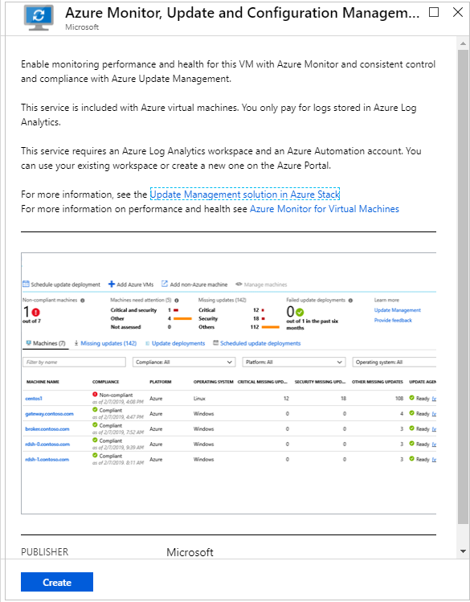

# Connect Azure Stack Hub virtual machines to Azure Sentinel

With Azure Sentinel, you can monitor your VMs running on Azure and Azure Stack Hub in one place. To on-board your Azure Stack machines to Azure Sentinel, you first need to add the virtual machine extension to your existing Azure Stack Hub virtual machines. 

After you connect Azure Stack Hub machines, choose from a gallery of dashboards that surface insights based on your data. These dashboards can be easily customized to your needs.

## Add the virtual machine extension 

Add the **Azure Monitor, Update, and Configuration Management** virtual machine extension to the virtual machines running on your Azure Stack Hub. 

1. In a new browser tab, log into your [Azure Stack Hub portal](https://docs.microsoft.com/azure-stack/user/azure-stack-use-portal#access-the-portal).
2. Go to the **Virtual machines** page, select the virtual machine that you want to protect with Azure Sentinel. For information on how to create a virtual machine on Azure Stack Hub, see [Create a Windows server VM with the Azure Stack Hub portal](https://docs.microsoft.com/azure/azure-stack/user/azure-stack-quick-windows-portal) or [Create a Linux server VM by using the Azure Stack Hub portal](https://docs.microsoft.com/azure/azure-stack/user/azure-stack-quick-linux-portal).
3. Select **Extensions**. The list of virtual machine extensions installed on this virtual machine is shown.
4. Click the **Add** tab. The **New Resource** menu blade opens and shows the list of available virtual machine extensions. 
5. Select the **Azure Monitor, Update, and Configuration Management** extension and click **Create**. The **Install extension** configuration window opens.

     

   >[!NOTE]
   > If you do not see the **Azure Monitor, Update and Configuration Management** extension listed in your marketplace, reach out to your Azure Stack Hub operator to make it available.

6. On the Azure Sentinel menu, select **Workspace settings** followed by **Advanced**, and copy  the **Workspace ID** and **Workspace Key (Primary Key)**. 
1. In the Azure Stack Hub **Install extension** window, paste them in the indicated fields and click **OK**.
1. After the extension installation completes, its status shows as **Provisioning Succeeded**. It might take up to one hour for the virtual machine to appear in the Azure Sentinel portal.

For more information on installing and configuring the agent for Windows, see [Connect Windows computers](../azure-monitor/platform/agent-windows.md#install-agent-using-setup-wizard).

For Linux troubleshooting of agent issues, see [Troubleshoot Azure Log Analytics Linux Agent](../azure-monitor/platform/agent-linux-troubleshoot.md).

In the Azure Sentinel portal on Azure, under **Virtual Machines**, you have an overview of all VMs and computers along with their status. 

## Clean up resources
When no longer needed, you can remove the extension from the virtual machine via the Azure Stack Hub portal.

To remove the extension:

1. Open the **Azure Stack Hub Portal**.
2. Go to **Virtual machines** page, select the virtual machine from which you want to remove the extension.
3. Select **Extensions**, select the extension **Microsoft.EnterpriseCloud.Monitoring**.
4. Click on **Uninstall**, and confirm your selection.

## Next steps

To learn more about Azure Sentinel, see the following articles:
- Learn how to [get visibility into your data, and potential threats](quickstart-get-visibility.md).
- Get started [detecting threats with Azure Sentinel](tutorial-detect-threats-built-in.md).
- Stream data from [Common Error Format appliances](connect-common-event-format.md) into Azure Sentinel.
