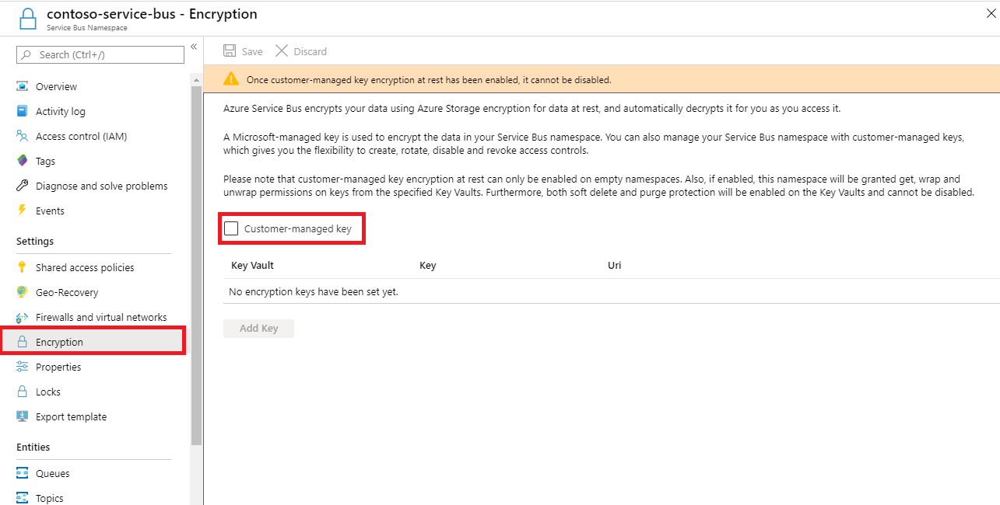
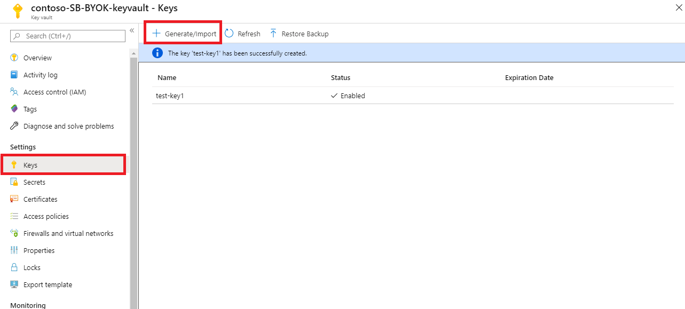
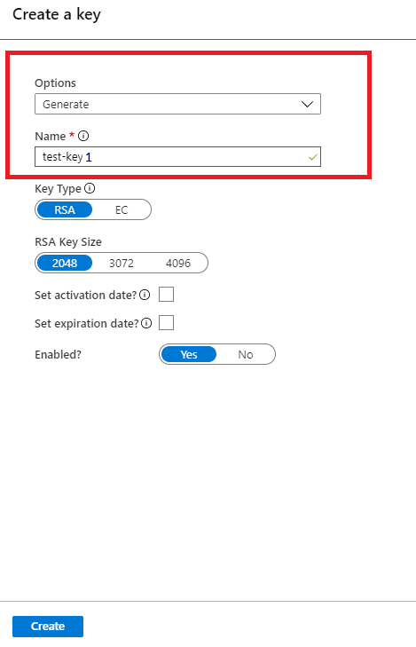
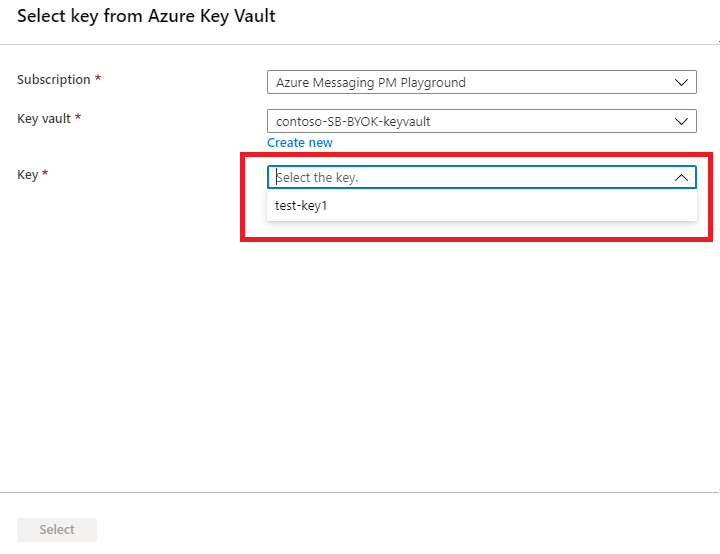

# Configure customer-managed keys for encrypting Azure Service Bus data at rest by using the Azure portal
Azure Service Bus Premium provides encryption of data at rest with Azure Storage Service Encryption (Azure SSE). Service Bus Premium uses Azure Storage to store the data. All the data that's stored with Azure Storage is encrypted using Microsoft-managed keys. If you use your own key (also referred to as Bring Your Own Key (BYOK) or customer-managed key), the data is still encrypted using the Microsoft-managed key, but in addition the Microsoft-managed key will be encrypted using the customer-managed key. This feature enables you to create, rotate, disable, and revoke access to customer-managed keys that are used for encrypting Microsoft-managed keys. Enabling the BYOK feature is a one time setup process on your namespace.

There are some caveats to the customer managed key for service side encryption. 
- This feature is supported by [Azure Service Bus Premium](service-bus-premium-messaging.md) tier. It cannot be enabled for standard tier Service Bus namespaces.
- The encryption can only be enabled for new or empty namespaces. If the namespace contains any queues or topics, then the encryption operation will fail.

You can use Azure Key Vault to manage your keys and audit your key usage. You can either create your own keys and store them in a key vault, or you can use the Azure Key Vault APIs to generate keys. For more information about Azure Key Vault, see [What is Azure Key Vault?](../key-vault/general/overview.md)

This article shows how to configure a key vault with customer-managed keys by using the Azure portal. To learn how to create a key vault using the Azure portal, see [Quickstart: Create an Azure Key Vault using the Azure portal](../key-vault/general/quick-create-portal.md).

> [!IMPORTANT]
> Using customer-managed keys with Azure Service Bus requires that the key vault have two required properties configured. They are:  **Soft Delete** and **Do Not Purge**. These properties are enabled by default when you create a new key vault in the Azure portal. However, if you need to enable these properties on an existing key vault, you must use either PowerShell or Azure CLI.

## Enable customer-managed keys
To enable customer-managed keys in the Azure portal, follow these steps:

1. Navigate to your Service Bus Premium namespace.
2. On the **Settings** page of your Service Bus namespace, select **Encryption**.
3. Select the **Customer-managed key encryption at rest** as shown in the following image.

    


## Set up a key vault with keys

After you enable customer-managed keys, you need to associate the customer managed key with your Azure Service Bus namespace. Service Bus supports only Azure Key Vault. If you enable the **Encryption with customer-managed key** option in the previous section, you need to have the key imported into Azure Key Vault. Also, the keys must have **Soft Delete** and **Do Not Purge** configured for the key. These settings can be configured using [PowerShell](../key-vault/general/key-vault-recovery.md) or [CLI](../key-vault/general/key-vault-recovery.md).

1. To create a new key vault, follow the Azure Key Vault [Quickstart](../key-vault/general/overview.md). For more information about importing existing keys, see [About keys, secrets, and certificates](../key-vault/general/about-keys-secrets-certificates.md).
1. To turn on both soft delete and purge protection when creating a vault, use the [az keyvault create](/cli/azure/keyvault#az-keyvault-create) command.

    ```azurecli-interactive
    az keyvault create --name contoso-SB-BYOK-keyvault --resource-group ContosoRG --location westus --enable-soft-delete true --enable-purge-protection true
    ```    
1. To add purge protection to an existing vault (that already has soft delete enabled), use the [az keyvault update](/cli/azure/keyvault#az-keyvault-update) command.

    ```azurecli-interactive
    az keyvault update --name contoso-SB-BYOK-keyvault --resource-group ContosoRG --enable-purge-protection true
    ```
1. Create keys by following these steps:
    1. To create a new key, select **Generate/Import** from the **Keys** menu under **Settings**.
        
        

    1. Set **Options** to **Generate** and give the key a name.

         

    1. You can now select this key to associate with the Service Bus namespace for encrypting from the drop-down list. 

        
        > [!NOTE]
        > For redundancy, you can add up to 3 keys. In the event that one of the keys has expired, or is not accessible, the other keys will be used for encryption.
        
    1. Fill in the details for the key and click **Select**. This will enable the encryption of the Microsoft-managed key with your key (customer-managed key). 


    > [!IMPORTANT]
    > If you are looking to use Customer managed key along with Geo disaster recovery, please review this section. 
    >
    > To enable encryption of Microsoft-managed key with a customer managed key, an [access policy](../key-vault/general/security-overview.md) is set up for the Service Bus' managed identity on the specified Azure KeyVault. This ensures controlled access to the Azure KeyVault from the Azure Service Bus namespace.
    >
    > Due to this:
    > 
    >   * If [Geo disaster recovery](service-bus-geo-dr.md) is already enabled for the Service Bus namespace and you are looking to enable customer managed key, then 
    >     * Break the pairing
    >     * [Set up the access policy](../key-vault/general/assign-access-policy-portal.md) for the managed identity for both the primary and secondary namespaces to the key vault.
    >     * Set up encryption on the primary namespace.
    >     * Re-pair the primary and secondary namespaces.
    > 
    >   * If you are looking to enable Geo-DR on a Service Bus namespace where customer managed key is already set up, then -
    >     * [Set up the access policy](../key-vault/general/assign-access-policy-portal.md) for the managed identity for the secondary namespace to the key vault.
    >     * Pair the primary and secondary namespaces.


## Rotate your encryption keys

You can rotate your key in the key vault by using the Azure Key Vaults rotation mechanism. Activation and expiration dates can also be set to automate key rotation. The Service Bus service will detect new key versions and start using them automatically.

## Revoke access to keys

Revoking access to the encryption keys won't purge the data from Service Bus. However, the data can't be accessed from the Service Bus namespace. You can revoke the encryption key through access policy or by deleting the key. Learn more about access policies and securing your key vault from [Secure access to a key vault](../key-vault/general/security-overview.md).

Once the encryption key is revoked, the Service Bus service on the encrypted namespace will become inoperable. If the access to the key is enabled or the deleted key is restored, Service Bus service will pick the key so you can access the data from the encrypted Service Bus namespace.

## Caching of keys
The Service Bus instance polls its listed encryption keys every 5 minutes. It caches and uses them until the next poll, which is after 5 minutes. As long as at least one key is available, queues and topics are accessible. If all listed keys are inaccessible when it polls, all queues and topics will become unavailable. 

Here are more details: 

- Every 5 minutes, the Service Bus service polls all customer-managed keys listed in the namespace’s record:
    - If a key has been rotated, the record is updated with the new key.
    - If a key has been revoked, the key is removed from the record.
    - If all keys have been revoked, the namespace’s encryption status is set to **Revoked**. The data can't be accessed from the Service Bus namespace.. 
    

## Use Resource Manager template to enable encryption
This section shows how to do the following tasks using **Azure Resource Manager templates**. 

1. Create a **premium** Service Bus namespace with a **managed service identity**.
2. Create a **key vault** and grant the service identity access to the key vault. 
3. Update the Service Bus namespace with the key vault information  (key/value). 


### Create a premium Service Bus namespace with managed service identity
This section shows you how to create an Azure Service Bus namespace with managed service identity by using an Azure Resource Manager template and PowerShell. 

1. Create an Azure Resource Manager template to create a Service Bus premium tier namespace with a managed service identity. Name the file: **CreateServiceBusPremiumNamespace.json**: 

    ```json
    {
       "$schema":"https://schema.management.azure.com/schemas/2015-01-01/deploymentTemplate.json#",
       "contentVersion":"1.0.0.0",
       "parameters":{
          "namespaceName":{
             "type":"string",
             "metadata":{
                "description":"Name for the Namespace."
             }
          },
          "location":{
             "type":"string",
             "defaultValue":"[resourceGroup().location]",
             "metadata":{
                "description":"Specifies the Azure location for all resources."
             }
          }
       },
       "resources":[
          {
             "type":"Microsoft.ServiceBus/namespaces",
             "apiVersion":"2018-01-01-preview",
             "name":"[parameters('namespaceName')]",
             "location":"[parameters('location')]",
             "identity":{
                "type":"SystemAssigned"
             },
             "sku":{
                "name":"Premium",
                "tier":"Premium",
                "capacity":1
             },
             "properties":{
    
             }
          }
       ],
       "outputs":{
          "ServiceBusNamespaceId":{
             "type":"string",
             "value":"[resourceId('Microsoft.ServiceBus/namespaces',parameters('namespaceName'))]"
          }
       }
    }
    ```
2. Create a template parameter file named: **CreateServiceBusPremiumNamespaceParams.json**. 

    > [!NOTE]
    > Replace the following values: 
    > - `<ServiceBusNamespaceName>` - Name of your Service Bus namespace
    > - `<Location>` - Location of your Service Bus namespace

    ```json
    {
       "$schema":"https://schema.management.azure.com/schemas/2015-01-01/deploymentParameters.json#",
       "contentVersion":"1.0.0.0",
       "parameters":{
          "namespaceName":{
             "value":"<ServiceBusNamespaceName>"
          },
          "location":{
             "value":"<Location>"
          }
       }
    }
    ```
3. Run the following PowerShell command to deploy the template to create a premium Service Bus namespace. Then, retrieve the ID of the Service Bus namespace to use it later. Replace `{MyRG}` with the name of the resource group before running the command.  

    ```powershell
    $outputs = New-AzResourceGroupDeployment -Name CreateServiceBusPremiumNamespace -ResourceGroupName {MyRG} -TemplateFile ./CreateServiceBusPremiumNamespace.json -TemplateParameterFile ./CreateServiceBusPremiumNamespaceParams.json
    
    $ServiceBusNamespaceId = $outputs.Outputs["serviceBusNamespaceId"].value
    ```
 
### Grant Service Bus namespace identity access to key vault

1. Run the following command to create a key vault with **purge protection** and **soft-delete** enabled. 

    ```powershell
    New-AzureRmKeyVault -Name "{keyVaultName}" -ResourceGroupName {RGName}  -Location "{location}" -EnableSoftDelete -EnablePurgeProtection    
    ```
    
    (OR)
    
    Run the following command to update an **existing key vault**. Specify values for resource group and key vault names before running the command. 
    
    ```powershell
    ($updatedKeyVault = Get-AzureRmResource -ResourceId (Get-AzureRmKeyVault -ResourceGroupName {RGName} -VaultName {keyVaultName}).ResourceId).Properties| Add-Member -MemberType "NoteProperty" -Name "enableSoftDelete" -Value "true"-Force | Add-Member -MemberType "NoteProperty" -Name "enablePurgeProtection" -Value "true" -Force
    ``` 
2. Set the key vault access policy so that the managed identity of the Service Bus namespace can access key value in the key vault. Use the ID of the Service Bus namespace from the previous section. 

    ```powershell
    $identity = (Get-AzureRmResource -ResourceId $ServiceBusNamespaceId -ExpandProperties).Identity
    
    Set-AzureRmKeyVaultAccessPolicy -VaultName {keyVaultName} -ResourceGroupName {RGName} -ObjectId $identity.PrincipalId -PermissionsToKeys get,wrapKey,unwrapKey,list
    ```

### Encrypt data in Service Bus namespace with customer-managed key from key vault
You have done the following steps so far: 

1. Created a premium namespace with a managed identity.
2. Create a key vault and granted the managed identity access to the key vault. 

In this step, you will update the Service Bus namespace with key vault information. 

1. Create a JSON file named **UpdateServiceBusNamespaceWithEncryption.json** with the following content: 

    ```json
    {
       "$schema":"https://schema.management.azure.com/schemas/2015-01-01/deploymentTemplate.json#",
       "contentVersion":"1.0.0.0",
       "parameters":{
          "namespaceName":{
             "type":"string",
             "metadata":{
                "description":"Name for the Namespace to be created in cluster."
             }
          },
          "location":{
             "type":"string",
             "defaultValue":"[resourceGroup().location]",
             "metadata":{
                "description":"Specifies the Azure location for all resources."
             }
          },
          "keyVaultUri":{
             "type":"string",
             "metadata":{
                "description":"URI of the KeyVault."
             }
          },
          "keyName":{
             "type":"string",
             "metadata":{
                "description":"KeyName."
             }
          }
       },
       "resources":[
          {
             "type":"Microsoft.ServiceBus/namespaces",
             "apiVersion":"2018-01-01-preview",
             "name":"[parameters('namespaceName')]",
             "location":"[parameters('location')]",
             "identity":{
                "type":"SystemAssigned"
             },
             "sku":{
                "name":"Premium",
                "tier":"Premium",
                "capacity":1
             },
             "properties":{
                "encryption":{
                   "keySource":"Microsoft.KeyVault",
                   "keyVaultProperties":[
                      {
                         "keyName":"[parameters('keyName')]",
                         "keyVaultUri":"[parameters('keyVaultUri')]"
                      }
                   ]
                }
             }
          }
       ]
    }
    ``` 

2. Create a template parameter file: **UpdateServiceBusNamespaceWithEncryptionParams.json**.

    > [!NOTE]
    > Replace the following values: 
    > - `<ServiceBusNamespaceName>` - Name of your Service Bus namespace
    > - `<Location>` - Location of your Service Bus namespace
    > - `<KeyVaultName>` - Name of your key vault
    > - `<KeyName>` - Name of the key in the key vault  

    ```json
    {
       "$schema":"https://schema.management.azure.com/schemas/2015-01-01/deploymentParameters.json#",
       "contentVersion":"1.0.0.0",
       "parameters":{
          "namespaceName":{
             "value":"<ServiceBusNamespaceName>"
          },
          "location":{
             "value":"<Location>"
          },
          "keyName":{
             "value":"<KeyName>"
          },
          "keyVaultUri":{
             "value":"https://<KeyVaultName>.vault.azure.net"
          }
       }
    }
    ```             
3. Run the following PowerShell command to deploy the Resource Manager template. Replace `{MyRG}` with the name of your resource group before running the command. 

    ```powershell
    New-AzResourceGroupDeployment -Name UpdateServiceBusNamespaceWithEncryption -ResourceGroupName {MyRG} -TemplateFile ./UpdateServiceBusNamespaceWithEncryption.json -TemplateParameterFile ./UpdateServiceBusNamespaceWithEncryptionParams.json
    ```
    

## Next steps
See the following articles:
- [Service Bus overview](service-bus-messaging-overview.md)
- [Key Vault overview](../key-vault/general/overview.md)