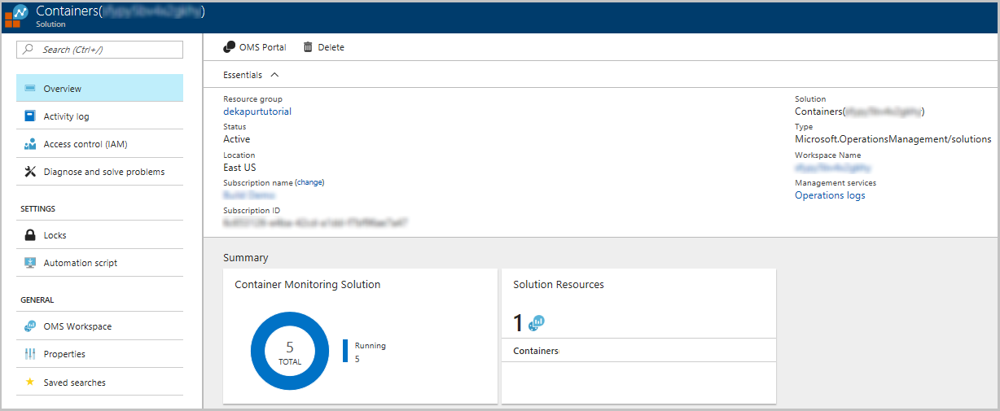
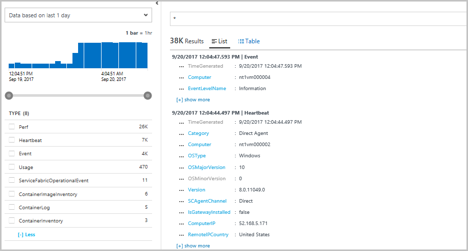
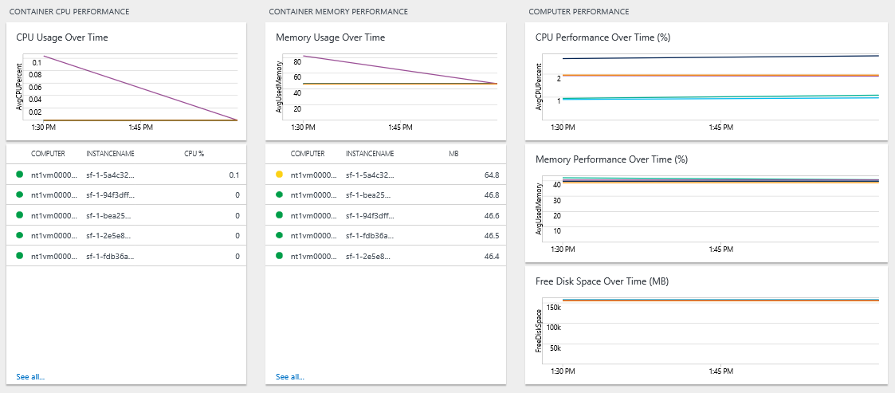

# Tutorial: monitor Windows containers on Service Fabric using Log Analytics

This is part two of a tutorial, and walks you through setting up Log Analytics to monitor your Windows containers orchestrated on Service Fabric.

In this tutorial, you learn how to:

> [!div class="checklist"]
> * Configure Log Analytics for your Service Fabric cluster
> * Use a Log Analytics workspace to view and query logs from your containers and nodes
> * Configure the OMS agent to pick up container and node metrics

## Prerequisites
Before you begin this tutorial, you should:
- Have a cluster on Azure, or [create one with this tutorial](service-fabric-tutorial-create-vnet-and-windows-cluster.md)
- [Deploy a containerized application to it](service-fabric-host-app-in-a-container.md)

## Setting up Log Analytics with your cluster in the Resource Manager template

In the case that you used the [template provided](https://github.com/ChackDan/Service-Fabric/tree/master/ARM%20Templates/Tutorial) in the first part of this tutorial, it should include the following additions to a generic Service Fabric Azure Resource Manager template. In case the case that you have a cluster of your own that you are looking to set up for monitoring containers with Log Analytics:
* Make the following changes to your Resource Manager template.
* Deploy it using PowerShell to upgrade your cluster by [deploying the template](https://docs.microsoft.com/azure/service-fabric/service-fabric-cluster-creation-via-arm). Azure Resource Manager realizes that the resource exists, so will roll it out as an upgrade.

### Adding Log Analytics to your cluster template

Make the following changes in your *template.json*:

1. Add the Log Analytics workspace location and name to your *parameters* section:
    
    ```json
    "omsWorkspacename": {
      "type": "string",
      "defaultValue": "[toLower(concat('sf',uniqueString(resourceGroup().id)))]",
      "metadata": {
        "description": "Name of your Log Analytics Workspace"
      }
    },
    "omsRegion": {
      "type": "string",
      "defaultValue": "East US",
      "allowedValues": [
        "West Europe",
        "East US",
        "Southeast Asia"
      ],
      "metadata": {
        "description": "Specify the Azure Region for your Log Analytics workspace"
      }
    }
    ```

    To change the value used for either add the same parameters to your *template.parameters.json* and change the values used there.

2. Add the solution name and the solution to your *variables*: 
    
    ```json
    "omsSolutionName": "[Concat('ServiceFabric', '(', parameters('omsWorkspacename'), ')')]",
    "omsSolution": "ServiceFabric"
    ```

3. Add the OMS Microsoft Monitoring Agent as a virtual machine extension. Find virtual machine scale sets resource: *resources* > *"apiVersion": "[variables('vmssApiVersion')]"*. Under the *properties* > *virtualMachineProfile* > *extensionProfile* > *extensions*, add the following extension description under the *ServiceFabricNode* extension: 
    
    ```json
    {
        "name": "[concat(variables('vmNodeType0Name'),'OMS')]",
        "properties": {
            "publisher": "Microsoft.EnterpriseCloud.Monitoring",
            "type": "MicrosoftMonitoringAgent",
            "typeHandlerVersion": "1.0",
            "autoUpgradeMinorVersion": true,
            "settings": {
                "workspaceId": "[reference(resourceId('Microsoft.OperationalInsights/workspaces/', parameters('omsWorkspacename')), '2015-11-01-preview').customerId]"
            },
            "protectedSettings": {
                "workspaceKey": "[listKeys(resourceId('Microsoft.OperationalInsights/workspaces/', parameters('omsWorkspacename')),'2015-11-01-preview').primarySharedKey]"
            }
        }
    },
    ```

4. Add the Log Analytics workspace as an individual resource. In *resources*, after the virtual machine scale sets resource, add the following:
    
    ```json
    {
        "apiVersion": "2015-11-01-preview",
        "location": "[parameters('omsRegion')]",
        "name": "[parameters('omsWorkspacename')]",
        "type": "Microsoft.OperationalInsights/workspaces",
        "properties": {
            "sku": {
                "name": "Free"
            }
        },
        "resources": [
            {
                "apiVersion": "2015-11-01-preview",
                "name": "[concat(variables('applicationDiagnosticsStorageAccountName'),parameters('omsWorkspacename'))]",
                "type": "storageinsightconfigs",
                "dependsOn": [
                    "[concat('Microsoft.OperationalInsights/workspaces/', parameters('omsWorkspacename'))]",
                    "[concat('Microsoft.Storage/storageAccounts/', variables('applicationDiagnosticsStorageAccountName'))]"
                ],
                "properties": {
                    "containers": [ ],
                    "tables": [
                        "WADServiceFabric*EventTable",
                        "WADWindowsEventLogsTable",
                        "WADETWEventTable"
                    ],
                    "storageAccount": {
                        "id": "[resourceId('Microsoft.Storage/storageaccounts/', variables('applicationDiagnosticsStorageAccountName'))]",
                        "key": "[listKeys(resourceId('Microsoft.Storage/storageAccounts', variables('applicationDiagnosticsStorageAccountName')),'2015-06-15').key1]"
                    }
                }
            },
            {
                "apiVersion": "2015-11-01-preview",
                "name": "System",
                "type": "datasources",
                "dependsOn": [
                    "[concat('Microsoft.OperationalInsights/workspaces/', parameters('omsWorkspacename'))]"
                ],
                "kind": "WindowsEvent",
                "properties": {
                    "eventLogName": "System",
                    "eventTypes": [
                        {
                            "eventType": "Error"
                        },
                        {
                            "eventType": "Warning"
                        },
                        {
                            "eventType": "Information"
                        }
                    ]
                }
            }
        ]
    },
    {
        "apiVersion": "2015-11-01-preview",
        "location": "[parameters('omsRegion')]",
        "name": "[variables('omsSolutionName')]",
        "type": "Microsoft.OperationsManagement/solutions",
        "dependsOn": [
            "[concat('Microsoft.OperationalInsights/workspaces/', parameters('OMSWorkspacename'))]"
        ],
        "properties": {
            "workspaceResourceId": "[resourceId('Microsoft.OperationalInsights/workspaces/', parameters('omsWorkspacename'))]"
        },
        "plan": {
            "name": "[variables('omsSolutionName')]",
            "publisher": "Microsoft",
            "product": "[Concat('OMSGallery/', variables('omsSolution'))]",
            "promotionCode": ""
        }
    },
    ```

[Here](https://github.com/ChackDan/Service-Fabric/blob/master/ARM%20Templates/Tutorial/azuredeploy.json) is a sample template (used in part one of this tutorial) that has all of these changes that you can reference as needed. These changes will add an Log Analytics workspace to your resource group. The workspace will be configured to pick up Service Fabric platform events from the storage tables configured with the [Windows Azure Diagnostics](service-fabric-diagnostics-event-aggregation-wad.md) agent. The OMS agent (Microsoft Monitoring Agent) has also been added to each node in your cluster as a virtual machine extension - this means that as you scale your cluster, the agent is automatically configured on each machine and hooked up to the same workspace.

Deploy the template with your new changes to upgrade your current cluster. You should see the Log Analytics resources in your resource group once this has completed. When the cluster is ready, deploy your containerized application to it. In the next step, we will set up monitoring the containers.

## Add the Container Monitoring Solution to your Log Analytics workspace

To set up the Container solution in your workspace, search for *Container Monitoring Solution* and create a Containers resource (under the Monitoring + Management category).


When prompted for the *Log Analytics Workspace*, select the workspace that was created in your resource group, and click **Create**. This adds a *Container Monitoring Solution* to your workspace, will automatically cause the OMS agent deployed by the template to start collecting docker logs and stats. 

Navigate back to your *resource group*, where you should now see the newly added monitoring solution. If you click into it, the landing page should show you the number of container images you have running. 

*Note that I ran 5 instances of my fabrikam container from [part two](service-fabric-host-app-in-a-container.md) of the tutorial*



Clicking into the **Container Monitor Solution** will take you to a more detailed dashboard, which allows you to scroll through multiple panels as well as run queries in Log Analytics. 

*Note that as of September, 2017, the solution is going through some updates - ignore any errors you may get about Kubernetes events as we work on integrating multiple orchestrators into the same solution.*

Since the agent is picking up docker logs, it defaults to showing *stdout* and *stderr*. If you scroll to the right, you will see container image inventory, status, metrics, and sample queries that you could run to get more helpful data. 


Clicking into any of these panels will take you to the Log Analytics query that is generating the displayed value. Change the query to *\** to see all the different kinds of logs that are being picked up. From here, you can query or filter for container performance, logs, or look at Service Fabric platform events. Your agents are also constantly emitting a heartbeat from each node, that you can look at to make sure data is still being gathered from all your machines if your cluster configuration changes.   



## Configure OMS agent to pick up performance counters

Another benefit of using the OMS agent is the ability to change the performance counters you want to pick up through the OMS UI experience, rather than having to configure the Azure diagnostics agent and do a Resource Manager template based upgrade each time. To do this, click on **OMS Workspace** on the landing page of your Container Monitoring (or Service Fabric) solution.

This will take you to your OMS Workspace, where you can view your solutions, create custom dashboards, as well as configure the OMS agent. 
* Click on **Advanced Settings** to open the Advanced Settings menu.
* Click on **Connected Sources** > **Windows Servers** to verify that you have *5 Windows Computers Connected*.
* Click on **Data** > **Windows Performance Counters** to search for and add new performance counters. Here you will see a list of recommendations from Log Analytics for performance counters you can collect as well as the option to search for other counters. Verify that **Processor(_Total)\% Processor Time** and **Memory(*)\Available MBytes** counters are being collected.

**refresh** your Container Monitoring Solution in a few minutes, and you should start to see *Computer Performance* data coming in. This will help you understand how your resources are being used. You can also use these metrics to make appropriate decisions about scaling your cluster, or to confirm if a cluster is balancing your load as expected.

*Note: Make sure your time filters are set appropriately for you to consume these metrics.* 




## Next steps

In this tutorial, you learned how to:

> [!div class="checklist"]
> * Configure Log Analytics for your Service Fabric cluster
> * Use a Log Analytics workspace to view and query logs from your containers and nodes
> * Configure the Log Analytics agent to pick up container and node metrics

Now that you have set up monitoring for your containerized application, try the following:

* Set up Log Analytics for a Linux cluster, following similar steps as above. Reference [this template](https://github.com/ChackDan/Service-Fabric/tree/master/ARM%20Templates/SF%20OMS%20Samples/Linux) to make changes in your Resource Manager template.
* Configure Log Analytics to set up [automated alerting](../log-analytics/log-analytics-alerts.md) to aid in detecting and diagnostics.
* Explore Service Fabric's list of [recommended performance counters](service-fabric-diagnostics-event-generation-perf.md) to configure for your clusters.
* Get familiarized with the [log search and querying](../log-analytics/log-analytics-log-searches.md) features offered as part of Log Analytics.