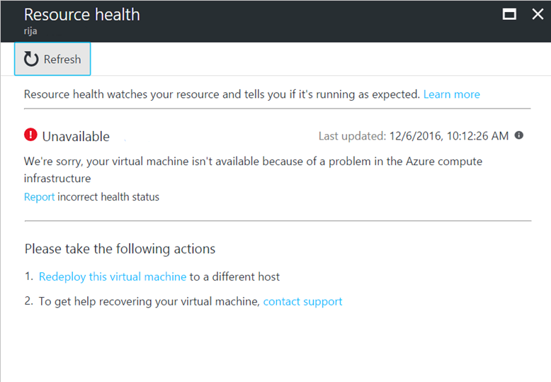
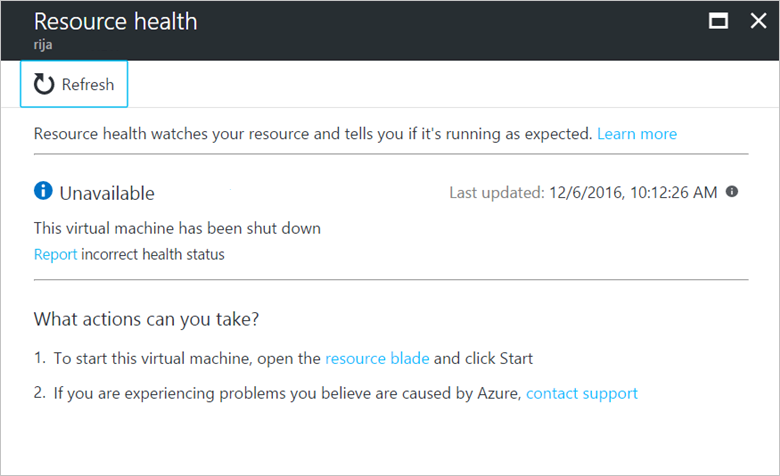
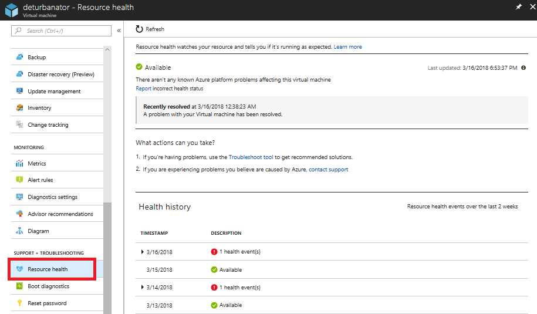

# Azure Resource Health overview
 
Azure Resource Health helps you diagnose and get support when an Azure service problem affects your resources. It informs you about the current and past health of your resources. And it provides technical support to help you mitigate problems.

Whereas [Azure Status](https://status.azure.com) informs you about service problems that affect a broad set of Azure customers, Resource Health gives you a personalized dashboard of the health of your resources. Resource Health shows you all the times your resources were unavailable in the past because of Azure service problems. It's then simple for you to understand if an SLA was violated. 

## Resource definition and health assessment
A resource is a specific instance an Azure service: for example, a virtual machine, a web app, or a SQL database.

Resource Health relies on signals emitted by the different Azure services to assess whether a resource is healthy or not. If a resource is unhealthy, Resource Health analyzes additional information to determine the source of the problem. It also identifies actions that Microsoft is taking to fix the problem or the actions that you can take to address the cause of the problem. 

For additional details on how health is assessed, review the full list of resource types and health checks in [Azure Resource Health](resource-health-checks-resource-types.md).

## Health status
The health of a resource is displayed as one of the following statuses.

### Available
A status of **Available** means that the service hasn't detected any events that affect the health of the resource. In cases where the resource has recovered from unplanned downtime during the last 24 hours, you see the **Recently resolved** notification.

### Unavailable
A status of **Unavailable** means that the service has detected an ongoing platform or non-platform event that affects the health of the resource.

#### Platform events
Platform events are triggered by multiple components of the Azure infrastructure. They include both scheduled actions (for example, planned maintenance) and unexpected incidents (for example, an unplanned host reboot).

Resource Health provides additional details on the event and the recovery process. It also enables you to contact support even if you don't have an active Microsoft support agreement.

#### Non-platform events
Non-platform events are triggered by users' actions. Examples are stopping a virtual machine or reaching the maximum number of connections to a Redis cache.

### Unknown
The health status of **Unknown** indicates that Resource Health hasn't received information about this resource for more than 10 minutes. Although this status isn't a definitive indication of the state of the resource, it is an important data point in the troubleshooting process.

If the resource is running as expected, the status of the resource will change to **Available** after a few minutes.

If you're experiencing problems with the resource, the **Unknown** health status might suggest that an event in the platform is affecting the resource.

### Degraded
The health status of **Degraded** indicates that your resource has detected a loss in performance, although it's still available for usage.
Different resources have their own criteria for when they specify that a resource is degraded.

## Reporting an incorrect status
If you believe that the current health status is incorrect, you can let us know by selecting **Report incorrect health status**. In cases where an Azure problem is affecting you, we encourage you to contact support from Resource Health. 

## Historical information
You can access up to 14 days of health history by selecting **View History** in Resource Health. 

## Getting started
To open Resource Health for one resource:
1.	Sign in to the Azure portal.
2.	Browse to your resource.
3.	On the resource menu in the left pane, select **Resource health**.

You can also access Resource Health by selecting **All services** and typing **resource health** in the filter text box. In the **Help + support** pane, select [Resource health](https://ms.portal.azure.com/#blade/Microsoft_Azure_Monitoring/AzureMonitoringBrowseBlade/resourceHealth).

## Next steps

Check out these resources to learn more about Resource Health:
-  [Resource types and health checks in Azure Resource Health](resource-health-checks-resource-types.md)
-  [Frequently asked questions about Azure Resource Health](resource-health-faq.md)

